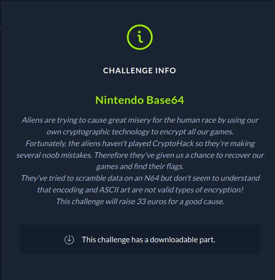
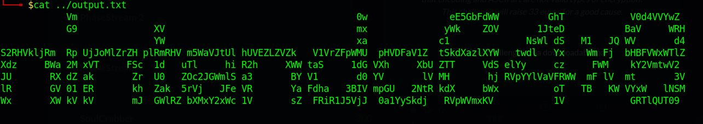

# CTF HackTheBox 2021 Cyber Apocalypse 2021 - Nintendo Base64

Category: Crypto, Points: 300



And attached file [output.txt](output.txt)

# Nintendo Base64 Solution

It is very simpe challenge.

Let's look at [output.txt](output.txt):



So we can see the text nintendo64x8

Let's take the b64 characters to [CyberChef](https://gchq.github.io/CyberChef/#recipe=From_Base64('A-Za-z0-9%2B/%3D',true)From_Base64('A-Za-z0-9%2B/%3D',true)From_Base64('A-Za-z0-9%2B/%3D',true)From_Base64('A-Za-z0-9%2B/%3D',true)From_Base64('A-Za-z0-9%2B/%3D',true)From_Base64('A-Za-z0-9%2B/%3D',true)From_Base64('A-Za-z0-9%2B/%3D',true)From_Base64('A-Za-z0-9%2B/%3D',true)&input=ICAgICAgICAgICAgVm0gICAgICAgICAgICAgICAgICAgICAgICAgICAgICAgICAgICAgICAgICAgICAgICAgICAwdyAgICAgICAgICAgICAgIGVFNUdiRmRXVyAgICAgICAgIEdoVCAgICAgICAgICAgIFYwZDRWVll3WgogICAgICAgICAgICBHOSAgICAgICAgICAgICAgWFYgICAgICAgICAgICAgICAgICAgICAgICAgICAgICAgICAgIG14ICAgICAgICAgICAgICB5V2sgICAgWk9WICAgICAgIDFKdGVEICAgICAgICAgICBCYVYgICAgIFdSSAogICAgICAgICAgICAgICAgICAgICAgICAgICAgWVcgICAgICAgICAgICAgICAgICAgICAgICAgICAgICAgICAgIHhhICAgICAgICAgICAgIGMxICAgICAgICAgICAgICBOc1dsIGRTICAgTTEgICBKUSBXViAgICAgICBkNApTMlJIVmtsalJtICBScCBVakpvTWxaclpIIHBsUm1SSFYgbTVXYVZKdFVsIGhVVkVaTFpWWmsgICBWMVZyWkZwV01VICBwSFZERmFWMVogIHRTa2RYYXpsWFlXICAgdHdkbCAgIFl4ICAgIFdtIEZqICBiSEJGVld4V1RsWgpYZHogICAgIEJXYSAyTSB4VlQgICAgIEZTYyAgMWQgICB1VGwgICAgIGhpIFIyaCAgICAgWFdXIHRhUyAgICAgMWRHIFZYaCAgICAgWGJVIFpUVCAgICAgVmRTIGVsWXkgICAgIGN6ICAgICBGV00gICAga1kyVm10d1YyCkpVICAgICAgIFJYIGRaIGFrICAgICAgIFpyICBVMCAgIFpPYzJKR1dtbFMgYTMgICAgICAgQlkgVjEgICAgICAgZDAgWVYgICAgICAgbFYgTUggICAgICAgaGogUlZwWVlsVmFWRlJXVyAgbUYgbFYgIG10ICAgICAgIDNWCmxSICAgICAgIEdWIDAxIEVSICAgICAgIGtoICBaYWsgIDVyVmogICBKRmUgVlIgICAgICAgWWEgRmRoYSAgIDNCSVYgbXBHVSAgIDJOdFIga2RYICAgICBiV3ggICAgICAgICAgb1QgICBUQiAgIEtXIFZZeFcgICBsTlNNCld4ICAgICAgIFhXIGtWIGtWICAgICAgIG1KICBHV2xSWiBiWE14WTJ4V2MgMVYgICAgICAgc1ogIEZSaVIxSjVWakogIDBhMVl5U2tkaiAgIFJWcFdWbXhLViAgICAgICAgICAgMVYgICAgICAgICAgICBHUlRsUVVUMDkK) by the following link.

We need to make Base64 8 times to get the decrypted flag: ```CHTB{3nc0d1ng_n0t_3qu4l_t0_3ncrypt10n}```.