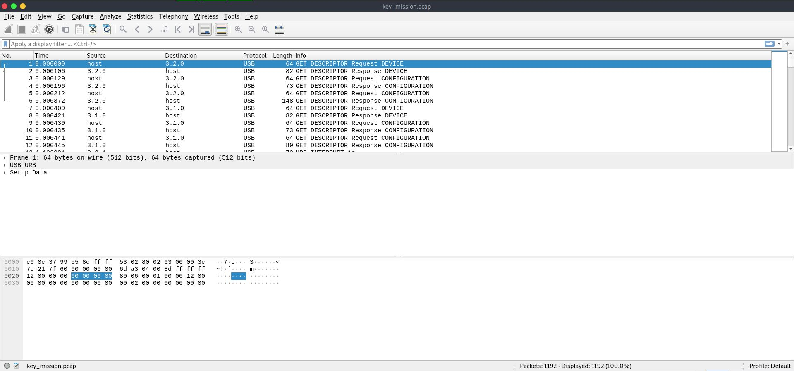
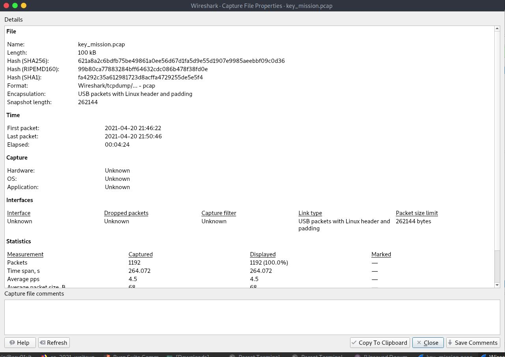
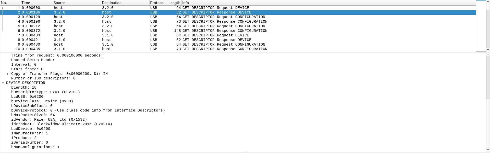
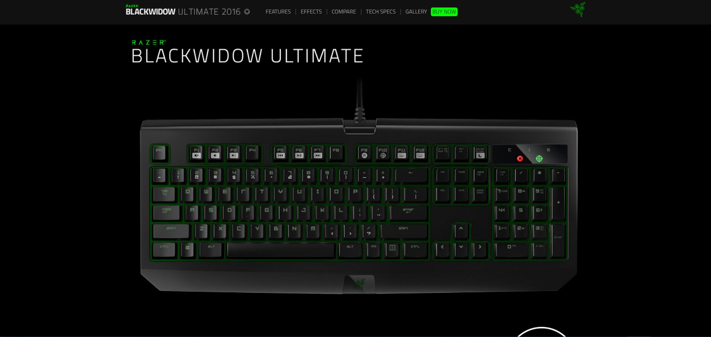

# CTF HackTheBox 2021 Cyber Apocalypse 2021 - Key Mission

Forensics: Pwn, Points: 300


Attached file [forensics_key_mission.zip](forensics_key_mission.zip)

# Key Mission Solution

The attached file contains .pcap file, Let's try to observe it using Wireshark:



So by clicking on Statistics->Capture File Properties we can see the follow:



It's mean we are dealing with capute file was taked from USB device.

By looking for Device Description header for another packets we can see the follow:



By searching for Device name: BlackWidow Ultimate we can found the following link [https://www2.razer.com/ap-en/gaming-keyboards-keypads/razer-blackwidowultimate-2016](https://www2.razer.com/ap-en/gaming-keyboards-keypads/razer-blackwidowultimate-2016):



So now we are know that is keyboard usb device, Great.

By looking at the following [https://www.usb.org/sites/default/files/documents/hut1_12v2.pdf](https://www.usb.org/sites/default/files/documents/hut1_12v2.pdf) we can understand how the keyboard input works.


We can use ```tshark``` filter to take all relevant hid data packetes:
``` console
┌─[evyatar@parrot]─[/ctf_htb/cyber_apocalypse/forensics/key_mission]
└──╼ $ tshark -r key_mission.pcap -T fields -e usb.capdata 'usb.data_len == 8'
0200000000000000
02000c0000000000
0200000000000000
0000000000000000
00002c0000000000
0000000000000000
0000040000000000
0000000000000000
0000100000000000
0000000000000000
00002c0000000000
0000000000000000
0000160000000000
0000000000000000
0000080000000000
0000000000000000
0000110000000000
0000000000000000
0000070000000000
0000000000000000
00000c0000000000
0000000000000000
0000110000000000
0000000000000000
...
```

Now, Let's remove all ```0000000000000000``` using ```grep```:
``` console
┌─[evyatar@parrot]─[/ctf_htb/cyber_apocalypse/forensics/key_mission]
└──╼ $ tshark -r key_mission.pcap -T fields -e usb.capdata 'usb.data_len == 8' | grep -v 0000000000000000
0200000000000000
02000c0000000000
0200000000000000
00002c0000000000
0000040000000000
0000100000000000
00002c0000000000
0000160000000000
0000080000000000
0000110000000000
0000070000000000
00000c0000000000
0000110000000000
00000a0000000000
00002c0000000000
0000160000000000
0000080000000000
0000060000000000
0000150000000000
0000080000000000
0000170000000000
0000040000000000
0000150000000000
00001c0000000000
0000340000000000
0000160000000000
00002c0000000000
00000f0000000000
0000120000000000
0000060000000000
0000040000000000
0000170000000000
00000c0000000000
0000120000000000
0000110000000000
00002c0000000000
0000120000000000
0000190000000000
0000080000000000
0000150000000000
00002c0000000000
0000170000000000
00000b0000000000
00000c0000000000
0000160000000000
00002c0000000000
0000170000000000
0000120000000000
0000170000000000
0000040000000000
00000f0000000000
00000f0000000000
00001c0000000000
00002c0000000000
0000080000000000
0000110000000000
0000060000000000
0000150000000000
00001c0000000000
0000130000000000
0000170000000000
0000080000000000
0000070000000000
00002c0000000000
0000060000000000
00000b0000000000
0000040000000000
0000110000000000
0000110000000000
0000080000000000
00000f0000000000
00002c0000000000
0000170000000000
0000120000000000
00002c0000000000
0000100000000000
0000040000000000
00000e0000000000
0000080000000000
00002c0000000000
0000160000000000
0000180000000000
0000150000000000
0000080000000000
00002c0000000000
0000110000000000
0000120000000000
00002c0000000000
0000120000000000
0000110000000000
0000080000000000
00002c0000000000
0000080000000000
00000f0000000000
0000160000000000
0000080000000000
00002c0000000000
00001a0000000000
00000c0000000000
00000f0000000000
00000f0000000000
00002c0000000000
0000050000000000
0000080000000000
00002c0000000000
0000040000000000
0000050000000000
00000f0000000000
0000080000000000
00002c0000000000
0000170000000000
0000120000000000
00002c0000000000
0000150000000000
0000080000000000
0000040000000000
0000070000000000
00002c0000000000
00000c0000000000
0000170000000000
00002c0000000000
0000080000000000
00001b0000000000
0000060000000000
0000080000000000
0000130000000000
0000170000000000
00002c0000000000
0000120000000000
0000090000000000
00002c0000000000
0000180000000000
0000160000000000
0000370000000000
00002c0000000000
0200000000000000
0200170000000000
0200000000000000
00000b0000000000
00000c0000000000
0000160000000000
00002c0000000000
00000c0000000000
0000110000000000
0000090000000000
0000120000000000
0000150000000000
0000100000000000
0000040000000000
0000170000000000
00000c0000000000
0000120000000000
0000110000000000
00002c0000000000
00000c0000000000
0000160000000000
00002c0000000000
0000060000000000
0000120000000000
0000110000000000
0000090000000000
00000c0000000000
0000070000000000
0000080000000000
0000110000000000
0000170000000000
00000c0000000000
0000040000000000
00000f0000000000
00002c0000000000
0000040000000000
0000110000000000
0000070000000000
00002c0000000000
0000100000000000
0000180000000000
0000160000000000
0000170000000000
00002c0000000000
0000110000000000
0000120000000000
0000170000000000
00002c0000000000
0000050000000000
0000080000000000
00002c0000000000
0000160000000000
00000b0000000000
0000040000000000
0000150000000000
0000080000000000
0000070000000000
00002c0000000000
00001a0000000000
00000c0000000000
0000170000000000
00000b0000000000
00002c0000000000
0000040000000000
0000110000000000
00001c0000000000
0000120000000000
0000110000000000
0000080000000000
00002c0000000000
0000080000000000
00000f0000000000
0000160000000000
0000080000000000
0000370000000000
00002c0000000000
0200000000000000
0200170000000000
0200000000000000
00000b0000000000
0000080000000000
00002c0000000000
0000160000000000
0000080000000000
0000060000000000
0000150000000000
0000080000000000
0000170000000000
0000040000000000
0000150000000000
00001c0000000000
0000340000000000
0000160000000000
00002c0000000000
00000b0000000000
00000c0000000000
0000070000000000
0000070000000000
0000080000000000
0000110000000000
00002c0000000000
00000f0000000000
0000120000000000
0000060000000000
0000040000000000
0000170000000000
00000c0000000000
0000120000000000
0000110000000000
00002c0000000000
00000c0000000000
0000160000000000
00002c0000000000
0200000000000000
0200060000000000
0200000000000000
02000b0000000000
0200000000000000
0200170000000000
0200000000000000
0200050000000000
0200000000000000
0200000000000000
02002f0000000000
0200000000000000
0000040000000000
0200000000000000
02002d0000000000
0200000000000000
0000130000000000
00000f0000000000
0000040000000000
0000060000000000
0000200000000000
0200000000000000
02002d0000000000
0200000000000000
0000090000000000
0200000000000000
0200040000000000
0200000000000000
0000150000000000
0200000000000000
02002d0000000000
0200000000000000
0000090000000000
0200000000000000
0200040000000000
0200000000000000
0000150000000000
0200000000000000
02002d0000000000
0200000000000000
0000040000000000
00001a0000000000
0000040000000000
00001c0000000000
0200000000000000
02002d0000000000
0200000000000000
0000090000000000
0000150000000000
0000270000000000
0000100000000000
0200000000000000
02002d0000000000
0200000000000000
0000080000000000
0000040000000000
0000080000000000
00002a0000000000
0000150000000000
0000170000000000
00000b0000000000
0200000000000000
0200300000000000
0200000000000000
```

Great, Let's just write it to file called ```input_keys``` (using ```tshark -r key_mission.pcap -T fields -e usb.capdata 'usb.data_len == 8' | grep -v 0000000000000000 > input_keys```)

So with the attached linked above we can create python script to translate the bytes to character:
```python
import re

keys = {"02": "SHIFT",
        "04": "aA",
        "05": "bB",
        "06": "cC",
        "07": "dD",
        "08": "eE",
        "09": "fF",
        "0a": "gG",
        "0b": "hH",
        "0c": "iI",
        "0d": "jJ",
        "0e": "kK",
        "0f": "lL",
        "10": "mM",
        "11": "nN",
        "12": "oO",
        "13": "pP",
        "14": "qQ",
        "15": "rR",
        "16": "sS",
        "17": "tT",
        "18": "uU",
        "19": "vV",
        "1a": "wW",
        "1b": "xX",
        "1c": "yY",
        "1d": "zZ",
        "1e": "1!",
        "1f": "2@",
        "20": "3#",
        "21": "4$",
        "22": "5%",
        "23": "6^",
        "24": "7&",
        "25": "8*",
        "26": "9(",
        "27":"0)",
        "2a":"DELETE",
        "2d": "-_",
        "2f": "[{",
        "30": "]}",
        "2c": " "}
flag = ""

filename = 'input_keys' 
with open(filename, "r") as f:
    data = f.readline()
    while data:
        data = f.readline()
        res = re.findall("..", data)
        
        if len(res) > 2:
            if res[2] in keys:
                if res[2] == "2a": #delete - remove the last character
                    flag = flag[:-1]
                else:
                    if res[0] == "02": #shift - take upper case
                        flag +=keys[res[2]][1]
                    else: # take lower case
                        flag += keys[res[2]][0]
    
print(flag)
```

Let's run it:
```console
┌─[evyatar@parrot]─[/ctf_htb/cyber_apocalypse/forensics/key_mission]
└──╼ $ python3 solve.py input_keys 
I am sending secretarys location over this totally encrypted channel to make sure no one else will be able to read it except of us This information is confidential and must not be shared with anyone else The secretarys hidden location is CHTB{a_plac3_fAr_fAr_away_fr0m_earth}
```

And we get the flag ```CHTB{a_plac3_fAr_fAr_away_fr0m_earth}```.