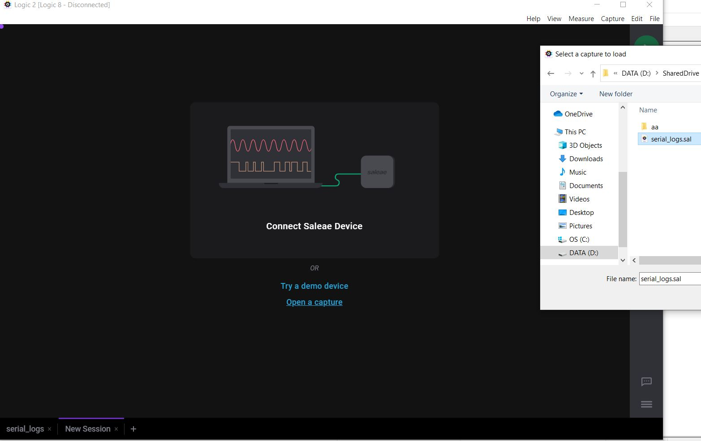
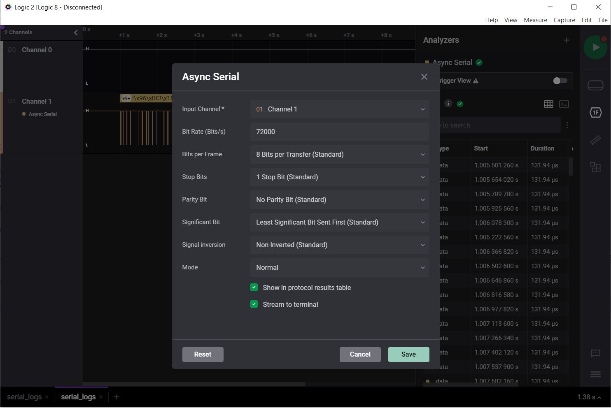
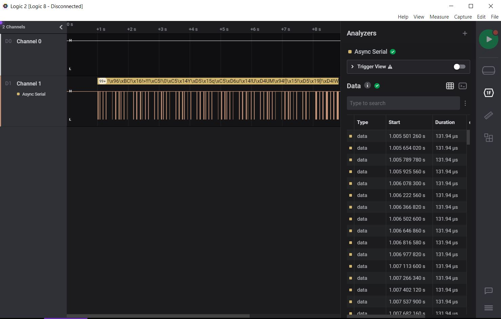
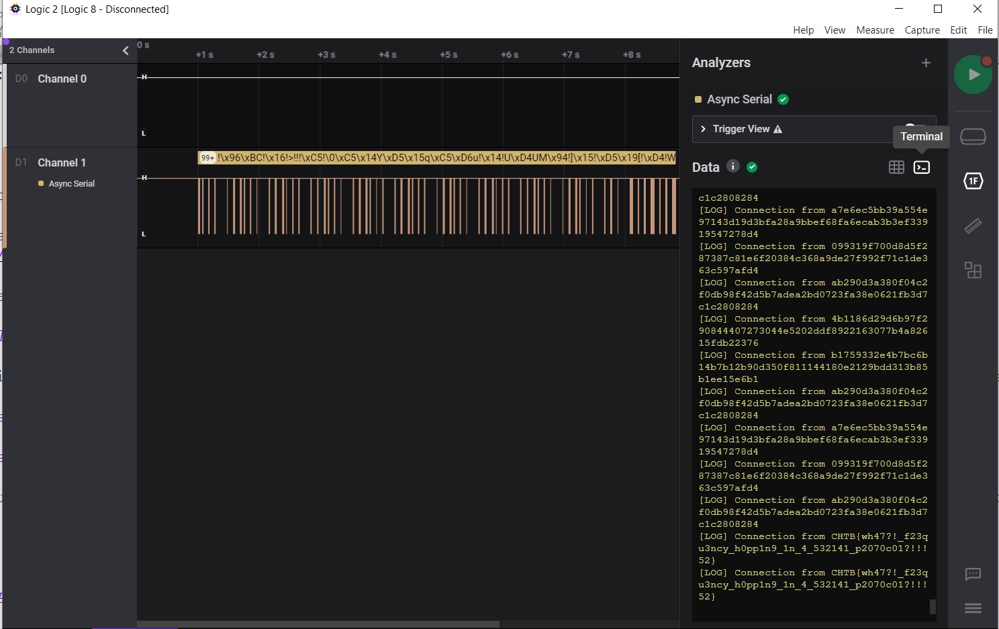

# CTF HackTheBox 2021 Cyber Apocalypse 2021 - Serial Logs

Category: Hardware, Points: 300

Attached file [hw_serial_logs.zip](hw_serial_logs.zip)

# Serial Logs Solution

The attached zip file contains the following file: ```serial_logs.sal```.

By google searching how to dealing with .sal file I found the following: [Logic Analyzer Saleas](https://www.saleae.com/downloads/).

Let's install it and open the .sal file:



By clicking on Analyze -> Async Serial (I choose this one because the challenge name Serial Logs) we get the following:




After brute forcing on Bit Rate (Just take from [Bit Rates](https://en.wikipedia.org/wiki/Serial_port)) I found 72000 Bit rate is match.

After we save it we get the following:



When we click on Terminal we can see the flag:



And we get the flag: ```CHTB{wh47?!_f23qu3ncy_h0pp1n9_1n_4_532141_p2070c01?!!!52}```.