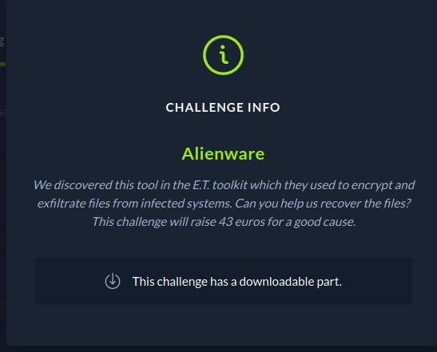
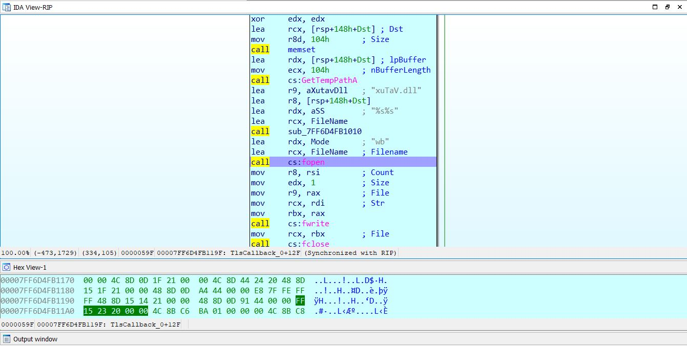
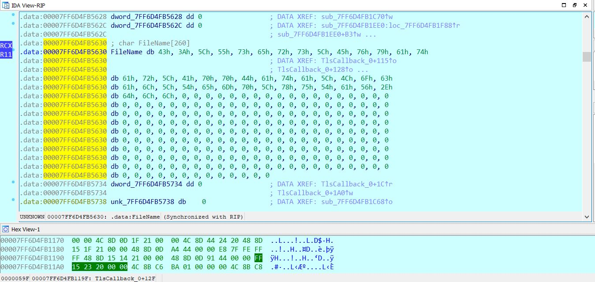
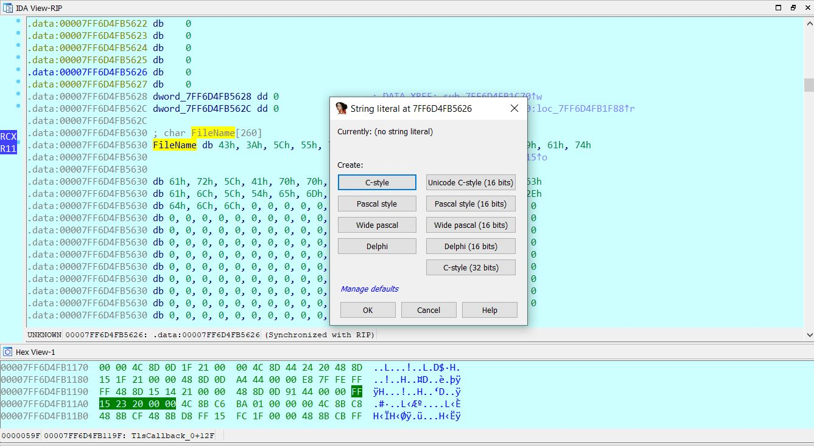
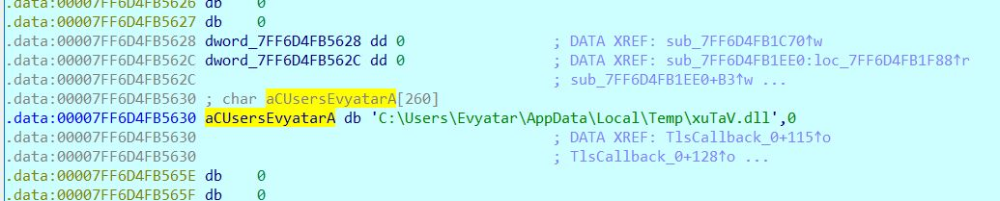
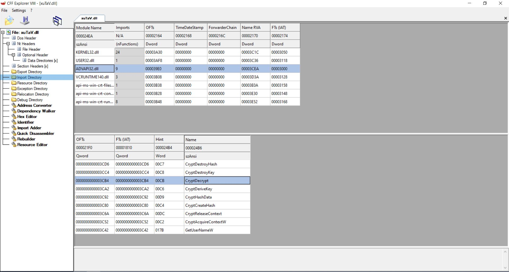
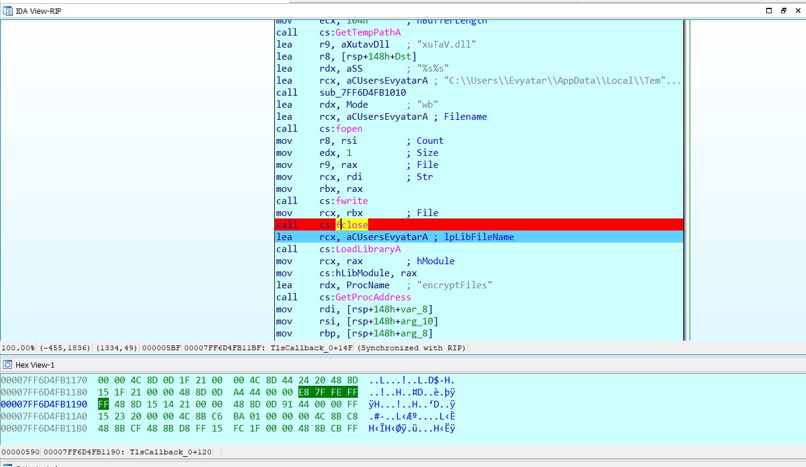
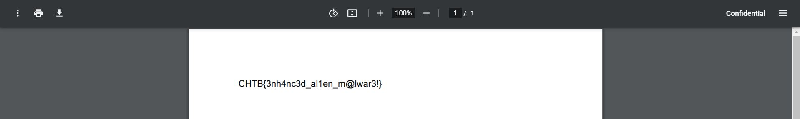

# CTF HackTheBox 2021 Cyber Apocalypse 2021 - Alienware

Category: Reversing, Points: 350




Attached files: 
1. [Alienware.exe](Alienware.exe)
2. [Confidential.pdf.alien](Confidential.pdf.alien)

# Alienware Solution

Let's check the file type:

```console
┌─[evyatar@parrot]─[/ctf_htb/cyber_apocalypse/reversing/alienware]
└──╼ $file Alienware.exe 
Alienware.exe: PE32+ executable (console) x86-64, for MS Windows

```

So it's windows executable file, By decompile it using Ghidra I found the string ```encryptFiles``` on the following function:
```c

/* WARNING: Globals starting with '_' overlap smaller symbols at the same address */

void tls_callback_0(void)

{
  DWORD DVar1;
  HRSRC hResInfo;
  HGLOBAL hResData;
  LPVOID pvVar2;
  byte *_Str;
  FILE *_File;
  byte *pbVar3;
  ulonglong uVar4;
  uint uVar5;
  undefined auStack328 [32];
  CHAR local_128 [272];
  ulonglong local_18;
  
  local_18 = DAT_140005008 ^ (ulonglong)auStack328;
  if (_DAT_140005734 != 1) {
    hResInfo = FindResourceW((HMODULE)0x0,(LPCWSTR)0x66,L"BIN");
    hResData = LoadResource((HMODULE)0x0,hResInfo);
    DVar1 = SizeofResource((HMODULE)0x0,hResInfo);
    pvVar2 = LockResource(hResData);
    _Str = (byte *)VirtualAlloc((LPVOID)0x0,(ulonglong)DVar1,0x1000,4);
    uVar5 = 0;
    if (DVar1 != 0) {
      pbVar3 = _Str;
      do {
        uVar4 = SEXT48((int)uVar5);
        uVar5 = uVar5 + 1;
        *pbVar3 = (&DAT_140003280)[uVar4 % 0xc] ^
                  (pbVar3 + 1)[(longlong)pvVar2 + (-1 - (longlong)_Str)];
        pbVar3 = pbVar3 + 1;
      } while (uVar5 < DVar1);
    }
    memset(local_128,0,0x104);
    GetTempPathA(0x104,local_128);
    FUN_140001010(&DAT_140005630,&DAT_1400032a4,local_128,"xuTaV.dll");
    _File = fopen(&DAT_140005630,"wb");
    fwrite(_Str,1,(ulonglong)DVar1,_File);
    fclose(_File);
    DAT_140005758 = LoadLibraryA(&DAT_140005630);
    _DAT_140005750 = GetProcAddress(DAT_140005758,"encryptFiles");
    _DAT_140005734 = 1;
  }
  FUN_140001490(local_18 ^ (ulonglong)auStack328);
  return;
}
```

So It's look like the executable dynamic load ```xuTaV.dll``` file and call to ```encryptFiles``` function.

We need to find ```xuTaV.dll`` file, Let's run the binary using IDA to look at ```fopen``` file argument.

By searching the string ```xuTaV.dll``` I got the following function in ```TlsCallback_0```:


Let's add breakpoint on ```fopen``` to see what is the file name:



Double click on ```FileName``` above ```fopen```:




By clicking on ```Ctrl + A``` we can convert it to string by clicking on "C Style":



And we can get the dll path:



Ok, So let's get the dll from %TEMP%.

By decompiled the dll using Ghidra we can see the function ```encryptFiles``` which called from executable:
```c
void encryptFiles(char *param_1)

{
  BOOL BVar1;
  HANDLE hFindFile;
  undefined auStack13488 [32];
  DWORD local_3490 [4];
  byte local_3480;
  WCHAR local_3454;
  WCHAR local_3452;
  WCHAR local_3450;
  WCHAR local_3228 [264];
  WCHAR local_3018 [2048];
  WCHAR local_2018 [2048];
  WCHAR local_1018 [2048];
  ulonglong local_18;
  undefined8 local_10;
  
                    /* 0x1010  1  encryptFiles */
  local_10 = 0x18000102d;
  local_18 = DAT_180004008 ^ (ulonglong)auStack13488;
  local_3490[0] = 0x101;
  GetUserNameW(local_3228,local_3490);
  memset(local_2018,0,0x1000);
  wsprintfW(local_2018,L"C:\\Users\\%s\\Docs");
  wsprintfW(local_3018,L"%s\\*.*");
  hFindFile = FindFirstFileW(local_3018,(LPWIN32_FIND_DATAW)&local_3480);
  if (hFindFile != (HANDLE)0xffffffffffffffff) {
    do {
      if (((local_3454 != L'.') || (local_3452 != L'\0')) &&
         ((local_3454 != L'.' || ((local_3452 != L'.' || (local_3450 != L'\0')))))) {
        wsprintfW(local_3018,L"%s\\%s");
        wsprintfW(local_1018,L"%s.alien");
        if ((local_3480 & 0x10) == 0) {
          FUN_1800011c0(local_3018,local_1018,param_1);
          _wremove(local_3018);
        }
      }
      BVar1 = FindNextFileW(hFindFile,(LPWIN32_FIND_DATAW)&local_3480);
    } while (BVar1 != 0);
    FindClose(hFindFile);
  }
  FUN_180001520(local_18 ^ (ulonglong)auStack13488);
  return;
}
```

So we can see the function create few strings ```L"C:\\Users\\%s\\Docs"``` which is Docs folder in user directory and then it's using ```FindFirstFileW``` function to get the first file name in Docs directory, Then It's create another string with ```s.alien```.

So we can understand that the executable scan Docs directory and get all files, get file names and create another string with ```filename.alien``` and call to ```FUN_1800011c0``` function as follow:
```c
FUN_1800011c0(local_3018,local_1018,param_1);
```

Where ```local_3018``` is the file name and ```local_1018``` is the file name with ```.alien```.

Let's observe ```FUN_1800011c0```:
```c

void FUN_1800011c0(LPCWSTR param_1,LPCWSTR param_2,char *param_3)
{
  DWORD DVar1;
  BOOL BVar2;
  DWORD DVar3;
  int iVar4;
  HANDLE hFile;
  HANDLE hFile_00;
  DWORD DVar5;
  DWORD local_138 [2];
  HCRYPTPROV local_130;
  DWORD local_128 [2];
  HCRYPTHASH local_120;
  HCRYPTKEY local_118;
  undefined8 local_110;
  undefined8 local_108;
  undefined8 local_100;
  undefined8 local_f8;
  undefined8 local_f0;
  undefined8 local_e8;
  undefined8 local_e0;
  undefined8 local_d8;
  undefined8 local_d0;
  undefined8 local_c8;
  undefined2 local_c0;
  undefined4 local_b8;
  undefined4 uStack180;
  undefined4 uStack176;
  undefined4 uStack172;
  undefined4 local_a8;
  undefined4 uStack164;
  undefined4 uStack160;
  undefined4 uStack156;
  undefined4 local_98;
  undefined4 uStack148;
  undefined4 uStack144;
  undefined4 uStack140;
  undefined4 local_88;
  undefined4 uStack132;
  undefined4 uStack128;
  undefined4 uStack124;
  undefined4 local_78;
  undefined4 uStack116;
  undefined4 uStack112;
  undefined4 uStack108;
  undefined4 local_68;
  undefined4 uStack100;
  undefined4 uStack96;
  undefined4 uStack92;
  undefined8 local_58;
  undefined4 local_50;
  ulonglong local_48;
  
  local_48 = DAT_180004008 ^ (ulonglong)&stack0xfffffffffffffe88;
  local_e0 = 0;
  local_d8 = 0;
  local_d0 = 0;
  local_c8 = 0;
  local_c0 = 0;
  mbstowcs((wchar_t *)&local_e0,param_3,0x10);
  DVar1 = lstrlenW((LPCWSTR)&local_e0);
  DVar5 = 0;
  hFile = CreateFileW(param_1,0x80000000,1,(LPSECURITY_ATTRIBUTES)0x0,3,0x8000000,(HANDLE)0x0);
  if ((hFile == (HANDLE)0xffffffffffffffff) ||
     (hFile_00 = CreateFileW(param_2,0x40000000,0,(LPSECURITY_ATTRIBUTES)0x0,2,0x80,(HANDLE)0x0),
     hFile_00 == (HANDLE)0xffffffffffffffff)) goto LAB_180001377;
  local_b8 = 0x69004d;
  uStack180 = 0x720063;
  uStack176 = 0x73006f;
  uStack172 = 0x66006f;
  local_98 = 0x640065;
  uStack148 = 0x520020;
  uStack144 = 0x410053;
  uStack140 = 0x610020;
  local_a8 = 0x200074;
  uStack164 = 0x6e0045;
  uStack160 = 0x610068;
  uStack156 = 0x63006e;
  local_78 = 0x790072;
  uStack116 = 0x740070;
  uStack112 = 0x67006f;
  uStack108 = 0x610072;
  local_88 = 0x64006e;
  uStack132 = 0x410020;
  uStack128 = 0x530045;
  uStack124 = 0x430020;
  local_58 = 0x65006400690076;
  local_68 = 0x680070;
  uStack100 = 0x630069;
  uStack96 = 0x500020;
  uStack92 = 0x6f0072;
  local_50 = 0x72;
  BVar2 = CryptAcquireContextW(&local_130,(LPCWSTR)0x0,(LPCWSTR)&local_b8,0x18,0xf0000000);
  if ((BVar2 != 0) && (BVar2 = CryptCreateHash(local_130,0x800c,0,0,&local_120), BVar2 != 0)) {
    BVar2 = CryptHashData(local_120,(BYTE *)&local_e0,DVar1,0);
    if (BVar2 == 0) {
      GetLastError();
      goto LAB_180001377;
    }
    BVar2 = CryptDeriveKey(local_130,0x660e,local_120,0,&local_118);
    if (BVar2 != 0) {
      local_138[0] = 0;
      local_110 = 0;
      local_108 = 0;
      local_100 = 0;
      local_f8 = 0;
      local_f0 = 0;
      local_e8 = 0;
      DVar3 = GetFileSize(hFile,(LPDWORD)0x0);
      iVar4 = ReadFile(hFile,&local_110,0x30,local_138,(LPOVERLAPPED)0x0);
      DVar1 = DVar5;
      while ((iVar4 != 0 && (local_138[0] != 0))) {
        DVar5 = DVar5 + local_138[0];
        if (DVar5 == DVar3) {
          DVar1 = 1;
        }
        BVar2 = CryptEncrypt(local_118,0,DVar1,0,(BYTE *)&local_110,local_138,0x30);
        if (BVar2 == 0) break;
        local_128[0] = 0;
        BVar2 = WriteFile(hFile_00,&local_110,local_138[0],local_128,(LPOVERLAPPED)0x0);
        if (BVar2 == 0) break;
        local_110 = 0;
        local_108 = 0;
        local_100 = 0;
        local_f8 = 0;
        local_f0 = 0;
        local_e8 = 0;
        iVar4 = ReadFile(hFile,&local_110,0x30,local_138,(LPOVERLAPPED)0x0);
      }
      CryptReleaseContext(local_130,0);
      CryptDestroyKey(local_118);
      CryptDestroyHash(local_120);
      CloseHandle(hFile);
      CloseHandle(hFile_00);
      goto LAB_180001377;
    }
  }
  GetLastError();
  CryptReleaseContext(local_130,0);
LAB_180001377:
  FUN_180001520(local_48 ^ (ulonglong)&stack0xfffffffffffffe88);
  return;
}
```

By calling to function ```CryptDeriveKey```, ```CryptEncrypt``` we can see the function take file from Docs directory, encrypt the file and append to the file name .alien extention, like any other ransomware.

So the attached file [Confidential.pdf.alien](Confidential.pdf.alien) encrypted using this Alienware.

According MSDN we can observe the following function: [CryptEncrypt](https://docs.microsoft.com/en-us/windows/win32/api/wincrypt/nf-wincrypt-cryptencrypt) and [CryptDecrypt](https://docs.microsoft.com/en-us/windows/win32/api/wincrypt/nf-wincrypt-cryptdecrypt):

```c
BOOL CryptEncrypt(
  HCRYPTKEY  hKey,
  HCRYPTHASH hHash,
  BOOL       Final,
  DWORD      dwFlags,
  BYTE       *pbData,
  DWORD      *pdwDataLen,
  DWORD      dwBufLen
);
```

```c
BOOL CryptDecrypt(
  HCRYPTKEY  hKey,
  HCRYPTHASH hHash,
  BOOL       Final,
  DWORD      dwFlags,
  BYTE       *pbData,
  DWORD      *pdwDataLen
);
```

So actually if we change the call from ```CryptEncrypt``` to ```CryptDecrypt``` in xuTaV.dll we can decrypt the .alien files.

Let's change it using [CFF Explore](https://ntcore.com/?page_id=388) (Or any another tool to edit dll):


Now, Let's change it to CryptDecrypt:



And save it.

Now, We need to overwrite the modify xuTaV.dll in %TEMP% directory.

Before doing this let's create Docs directory inside our User directory (C:\Users\Evyatar\Docs) and copy  [Confidential.pdf.alien](Confidential.pdf.alien) file to make the executable decrypt this file.

Let's run again the executable using IDA and set breakpoint on ```fclose``` function (because we can't overwrite the file while it's open by the executable):



Now let's overwrite xuTaV.dll on %TEMP% directory with the modify xuTaV.dll.

Continue the ruinning, When it's finished change the file name of Confidential.pdf.alien.alien to Confidential.pdf and open it as PDF to get the flag:



The flag is: ```CHTB{3nh4nc3d_al1en_m@lwar3!}```.
