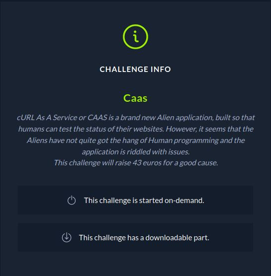
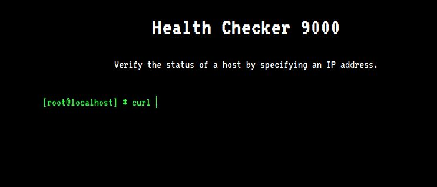
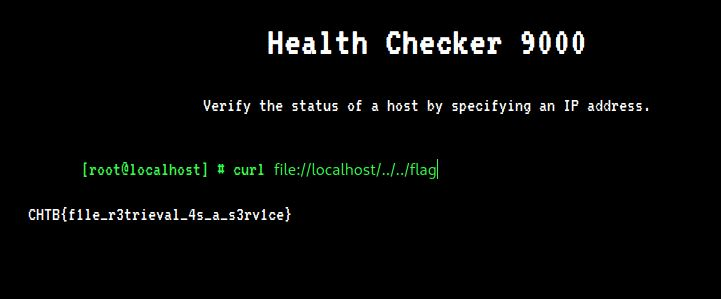

# CTF HackTheBox 2021 Cyber Apocalypse 2021 - CaaS

Category: Web, Points: 300



And attached file: [web_caas.zip](web_caas.zip)

# CaaS Solution

Let's start the docker and browse it:



By browsing the code from [web_caas.zip](web_caas.zip) we can see on ```moodels/CommandModel.php``` the model use ```curl``` command as follow:
```php
<?php
class CommandModel
{
    public function __construct($url)
    {
        $this->command = "curl -sL " . escapeshellcmd($url);
    }

    public function exec()
    {
        exec($this->command, $output);
        return $output;
    }
}
```

So according the attached zip file we know the flag located on ```../../``` from ```moodels/CommandModel.php``` so we can use ```file:///../../flag```  or ```file://localhost/../../flag``` to get this file, Let's try it:



And we get the flag: ```CHTB{f1le_r3trieval_4s_a_s3rv1ce}```.