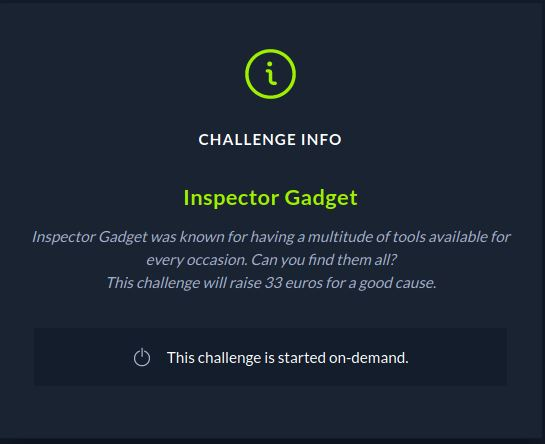
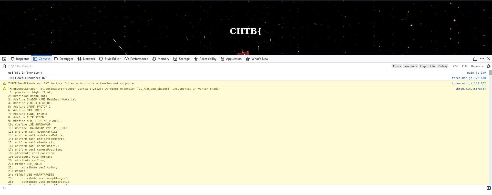
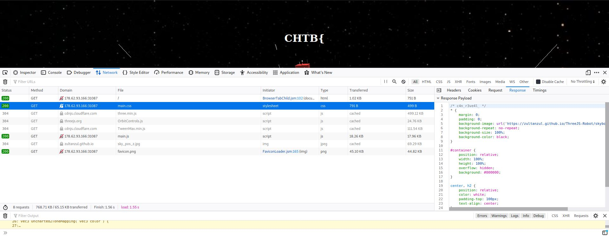

# CTF HackTheBox 2021 Cyber Apocalypse 2021 - Inspector Gadget

Category: Web, Points: 300



# Inspector Gadget Solution

Let's start the docker and browse it:


So we can see the start of the flag.

Let's look at the source code:

```html
HTTP/1.1 200 OK

accept-ranges: bytes

cache-control: public, max-age=0

last-modified: Mon, 19 Apr 2021 04:45:39 GMT

etag: W/"2ef-178e872c538"

content-type: text/html; charset=UTF-8

content-length: 751

Date: Tue, 20 Apr 2021 19:06:35 GMT

Connection: close


<html lang="en">
   <head>
      <meta charset="UTF-8">
      <title>Inspector Gadget</title>
      <meta name="viewport" content="width=device-width, initial-scale=1, user-scalable=no">
      <link rel="icon" href="/static/images/favicon.png">
      <link rel="stylesheet" href="/static/css/main.css">
   </head>
   <body>
      <center><h1>CHTB{</h1></center>
      <div id="container"></div>
   </body>
   <script src='https://cdnjs.cloudflare.com/ajax/libs/three.js/87/three.min.js'></script>
   <script src='https://threejs.org/examples/js/controls/OrbitControls.js'></script>
   <script src='https://cdnjs.cloudflare.com/ajax/libs/gsap/1.20.2/TweenMax.min.js'></script>
   <script src="/static/js/main.js"></script>
   <!--1nsp3ction_-->
</html>
```

We can see ```<!--1nsp3ction_-->``` which it seems like another part of the flag.

Let's look at the console:



We can get the last part of the flag ```us3full_1nf0rm4tion}```, Let's try to look at the css files:



And from main.css comments file we get another part: /* c4n_r3ve4l_ */

So we can combine the flag: ```CHTB{1nsp3ction_c4n_r3ve4l_us3full_1nf0rm4tion}```.