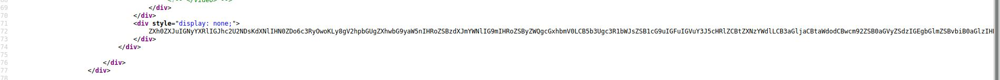

# CyberArk CTF 2021 - Writeups  - The search for a higher being 

Category: Innovation, Points: 178


# The search for a higher being  - Solution

By browsing to the link [https://s3.us-west-2.amazonaws.com/cyber-ctf.be/mars.html](https://s3.us-west-2.amazonaws.com/cyber-ctf.be/mars.html) we can see the following web page:


By observing the HTML source code we can see the following:


By decoding the base64 string from html source:
```
ZXh0ZXJuIGNyYXRlIGJhc2U2NDsKdXNlIHN0ZDo6c3RyOwoKLy8gV2hpbGUgZXhwbG9yaW5nIHRoZSBzdXJmYWNlIG9mIHRoZSByZWQgcGxhbmV0LCB5b3Ugc3R1bWJsZSB1cG9uIGFuIGVuY3J5cHRlZCBtZXNzYWdlLCB3aGljaCBtaWdodCBwcm92ZSB0aGVyZSdzIGEgbGlmZSBvbiB0aGlzIHBsYW5ldCEKLy8gQWZ0ZXIgc29tZSBzYW5kIGRpZ2dpbmcsIHlvdSBmb3VuZCBhIHJ1bmUsIGluZGljYXRpbmcgdGhlIGZvbGxvd2luZzoKLy8gQ01PYnc1akRsTU9kdzZKS0s4T1h3NVREb2NPVVNnPT0gfCBhbGllbnM/IGhlcmU/Ci8vIFlvdSBhcmUgdHJ5aW5nIHRvIGJ1aWxkIGEgY3lwaGVyIHJlYWRlciwgYnV0IHNvbWV0aGluZyBpcyBub3QgcXVpdGUgcmlnaHQuCi8vIFdoYXQgY291bGQgdGhpcyBhbGwgbWVhbj8KLy8KCnRyYWl0IElBYnN0cmFjdERlY3J5cHRvciB7CiAgICBmbiBhKCZzZWxmLCBtc2c6IFN0cmluZykgLT4gVmVjPHU4PjsKICAgIGZuIGIoJnNlbGYsIGI6IFZlYzx1OD4pIC0+IFN0cmluZzsKICAgIGZuIGMoJnNlbGYsIGk6IFZlYzx1OD4pIC0+IFZlYzx1OD47CiAgICBmbiBkKCZzZWxmLCBieTogVmVjPHU4PikgLT4gU3RyaW5nOwogICAgZm4gZSgmc2VsZiwgbWVzc2FnZTogU3RyaW5nKSAtPiBTdHJpbmc7Cn0KCnRyYWl0IElCYXNlRGVjcnlwdG9yOiBJQWJzdHJhY3REZWNyeXB0b3IgewogICAgZm4gaG93bF9sb3VkbHkoJnNlbGYpOwp9CgpzdHJ1Y3QgRGVjcnlwdG9yKCk7CgppbXBsIElBYnN0cmFjdERlY3J5cHRvciBmb3IgRGVjcnlwdG9yIHsKICAgIGZuIGEoJnNlbGYsIG1zZzogU3RyaW5nKSAtPiBWZWM8dTg+ewogICAgICAgIHJldHVybiBtc2cuaW50b19ieXRlcygpCgogICAgfQoKICAgIGZuIGMoJnNlbGYsIGk6IFZlYzx1OD4pIC0+IFZlYzx1OD4gewogICAgICAgIHJldHVybiBiYXNlNjQ6OmRlY29kZSgmaSkudW53cmFwKCk7CiAgICB9CgogICAgZm4gZCgmc2VsZiwgYnk6IFZlYzx1OD4pIC0+IFN0cmluZ3sKICAgICAgICBsZXQgYyA9IHNlbGYuYyhieSk7CiAgICAgICAgbGV0IGQgPSBzdHI6OmZyb21fdXRmOCgmYyk7CiAgICAgICAgcmV0dXJuIGQudW53cmFwKCkKICAgIH0KCiAgICBmbiBlKCZzZWxmLCBtZXNzYWdlOiBTdHJpbmcpIC0+IFN0cmluZ3sKICAgICAgICBsZXQgbXV0IHNzID0gU3RyaW5nOjpmcm9tKCIiKTsKICAgICAgICBmb3IgYyBpbiBtZXNzYWdlLmNoYXJzKCkgewogICAgICAgICAgICBsZXQgbXV0IGEgPSBjIGFzIHUzMjsKICAgICAgICAgICAgbGV0IG11dCBiID0gMTsKICAgICAgICAgICAgbGV0IG11dCBjID0gMDsKICAgICAgICAgICAgCiAgICAgICAgICAgIHdoaWxlIGEgPiAwIHsKICAgICAgICAgICAgICAgIGxldCBtdXQgZCA9IGEgJSAxMDsKICAgICAgICAgICAgICAgIGEgLz0gMTA7CiAgICAgICAgICAgICAgICBpZiBkID09IDAgewogICAgICAgICAgICAgICAgICAgIGQgPSAxMDsKICAgICAgICAgICAgICAgIH0KICAgICAgICAgICAgICAgIGMgPSBjICsgKGQrMSkgKiBiOwogICAgICAgICAgICAgICAgYiAqPSAxMDsKICAgICAgICAgICAgfQogICAgICAgICAgICBpZiBjIDwgMTAgewogICAgICAgICAgICAgICAgYyArPSAyOTAKICAgICAgICAgICAgfQoKICAgICAgICAgICAgc3MucHVzaChzdGQ6OmNoYXI6OmZyb21fdTMyKGMpLnVud3JhcCgpKQogICAgICAgIH0KICAgICAgICByZXR1cm4gc3M7CiAgICB9CgogICAgZm4gYigmc2VsZiwgYjogVmVjPHU4PikgLT4gU3RyaW5newogICAgICAgIGxldCBjID0gc2VsZi5kKGIpOwogICAgICAgIHJldHVybiBzZWxmLmUoYyk7CiAgICB9Cn0KCmltcGwgSUJhc2VEZWNyeXB0b3IgZm9yIERlY3J5cHRvciB7CiAgICBmbiBob3dsX2xvdWRseSgmc2VsZikgewogICAgICAgIHByaW50bG4hKCJvbiB2YSBsZSBjaGVyY2hlciB0b3V0ZSBsYSBqb3VybsOpZSEhISEhISEhIik7CiAgICB9Cn0KCmZuIG1haW4oKSB7CiAgICBsZXQgX21zZzpTdHJpbmcgPSBTdHJpbmc6OmZyb20oIllzT1hDTU9qS3dncnc1dkRuc09sdzVURG04T29LOE9UQ01PbyIpOwogICAgbGV0IGRlY3J5cHRvciA9IERlY3J5cHRvcigpOwogICAgbGV0IGEgPSBkZWNyeXB0b3IuYShfbXNnKTsKICAgIGxldCBleHRyYXRlcnJlc3RyaWFsX21zZyA9IGRlY3J5cHRvci5iKGEuY2xvbmUoKSk7Cn0=
```

We get the following ```rust``` code:
```rust
extern crate base64;
use std::str;

// While exploring the surface of the red planet, you stumble upon an encrypted message, which might prove there's a life on this planet!
// After some sand digging, you found a rune, indicating the following:
// CMObw5jDlMOdw6JKK8OXw5TDocOUSg== | aliens? here?
// You are trying to build a cypher reader, but something is not quite right.
// What could this all mean?
//

trait IAbstractDecryptor {
    fn a(&self, msg: String) -> Vec<u8>;
    fn b(&self, b: Vec<u8>) -> String;
    fn c(&self, i: Vec<u8>) -> Vec<u8>;
    fn d(&self, by: Vec<u8>) -> String;
    fn e(&self, message: String) -> String;
}

trait IBaseDecryptor: IAbstractDecryptor {
    fn howl_loudly(&self);
}

struct Decryptor();

impl IAbstractDecryptor for Decryptor {
    fn a(&self, msg: String) -> Vec<u8>{
        return msg.into_bytes()

    }

    fn c(&self, i: Vec<u8>) -> Vec<u8> {
        return base64::decode(&i).unwrap();
    }

    fn d(&self, by: Vec<u8>) -> String{
        let c = self.c(by); 
        let d = str::from_utf8(&c);
        return d.unwrap()
    }

    fn e(&self, message: String) -> String{
        let mut ss = String::from("");
        for c in message.chars() {
            let mut a = c as u32;
            let mut b = 1;
            let mut c = 0;
            
            while a > 0 {
                let mut d = a % 10;
                a /= 10;
                if d == 0 {
                    d = 10;
                }
                c = c + (d+1) * b;
                b *= 10;
            }
            if c < 10 {
                c += 290
            }

            ss.push(std::char::from_u32(c).unwrap())
        }
        return ss;
    }

    fn b(&self, b: Vec<u8>) -> String{
        let c = self.d(b);
        return self.e(c);
    }
}

impl IBaseDecryptor for Decryptor {
    fn howl_loudly(&self) {
        println!("on va le chercher toute la journée!!!!!!!!");
    }
}

fn main() {
    let _msg:String = String::from("YsOXCMOjKwgrw5vDnsOlw5TDm8OoK8OTCMOo");
    let decryptor = Decryptor();
    let a = decryptor.a(_msg);
    let extraterrestrial_msg = decryptor.b(a.clone());
}
```

By running the code using [https://play.rust-lang.org/](https://play.rust-lang.org/) we get the following error:
```rust
   Compiling playground v0.0.1 (/playground)
error[E0308]: mismatched types
  --> src/main.rs:38:16
   |
35 |     fn d(&self, by: Vec<u8>) -> String{
   |                                 ------ expected `String` because of return type
...
38 |         return d.unwrap()
   |                ^^^^^^^^^^
   |                |
   |                expected struct `String`, found `&str`
   |                help: try using a conversion method: `d.unwrap().to_string()`

error: aborting due to previous error

For more information about this error, try `rustc --explain E0308`.
error: could not compile `playground`

To learn more, run the command again with --verbose.
```

Let's change the code from ```return d.unwrap()``` to ```return d.unwrap().to_string()``` ([./code.rust#L38](./code.rust#L38)), Also we can add print of decrypted message on ```main``` function ([./code.rust#L82](./code.rust#L82)):
```rust
fn main() {
    let _msg:String = String::from("YsOXCMOjKwgrw5vDnsOlw5TDm8OoK8OTCMOo");
    let decryptor = Decryptor();
    let a = decryptor.a(_msg);
    let extraterrestrial_msg = decryptor.b(a.clone());
	println!("{}",extraterrestrial_msg);
}
```

By running that we get the following output:
```
mņīŒ6ī6ŊōŔŃŊŗ6łīŗ
```

Let's observe the function ```e```:
```rust
fn e(&self, message: String) -> String{
        let mut ss = String::from("");
        for c in message.chars() {
            let mut a = c as u32;
            let mut b = 1;
            let mut c = 0;
            
            while a > 0 {
                let mut d = a % 10;
                a /= 10;
                if d == 0 {
                    d = 10;
                }
                c = c + (d+1) * b;
                b *= 10;
            }
            if c < 10 {
                c += 290
            }

            ss.push(std::char::from_u32(c).unwrap())
        }
        return ss;
    }
```

Let's assume it's make encrypt so if we change the following line from ```c = c + (d+1) * b;``` to ```c = c + (d-1) * b;``` we will get the following output:
```
Whĩt ĩ lovely dĩy
```

Make sense, If we add print of ```c``` variable as follow: ```println!("{}",c);``` we can see the following output:
```
87
104
297
116
32
297
32
108
111
118
101
108
121
32
100
297
121
Whĩt ĩ lovely dĩy
```

Let's assume the first word should be ```What```, So we need to get at ```97``` asci instead of ```297```, It's mean we need to substract 200.

We can see also the following on function ```e```:
```rust
if c < 10 {
  c += 290
}
```

So if we add ```90``` instead ```290``` we can get ```97``` which is ```a```.

So if we changed it we get the following output:
```
What a lovely day
```

Which is the flag.

The final code [rust.c](rust.c):
```rust
extern crate base64;
use std::str;

// While exploring the surface of the red planet, you stumble upon an encrypted message, which might prove there's a life on this planet!
// After some sand digging, you found a rune, indicating the following:
// CMObw5jDlMOdw6JKK8OXw5TDocOUSg== | aliens? here?
// You are trying to build a cypher reader, but something is not quite right.
// What could this all mean?
//

trait IAbstractDecryptor {
    fn a(&self, msg: String) -> Vec<u8>;
    fn b(&self, b: Vec<u8>) -> String;
    fn c(&self, i: Vec<u8>) -> Vec<u8>;
    fn d(&self, by: Vec<u8>) -> String;
    fn e(&self, message: String) -> String;
}

trait IBaseDecryptor: IAbstractDecryptor {
    fn howl_loudly(&self);
}

struct Decryptor();

impl IAbstractDecryptor for Decryptor {
    fn a(&self, msg: String) -> Vec<u8>{
        return msg.into_bytes()

    }

    fn c(&self, i: Vec<u8>) -> Vec<u8> {
        return base64::decode(&i).unwrap();
    }

    fn d(&self, by: Vec<u8>) -> String{
        let c = self.c(by); 
        let d = str::from_utf8(&c);
        return d.unwrap().to_string()
    }

    fn e(&self, message: String) -> String{
        let mut ss = String::from("");
        for c in message.chars() {
            let mut a = c as u32;
            let mut b = 1;
            let mut c = 0;
            
            while a > 0 {
                let mut d = a % 10;
                a /= 10;
                if d == 0 {
                    d = 10;
                }
                c = c + (d-1) * b;
                b *= 10;
            }
            if c < 10 {
                c += 90
            }
            ss.push(std::char::from_u32(c).unwrap())
        }
        return ss;
    }

    fn b(&self, b: Vec<u8>) -> String{
        let c = self.d(b);
        return self.e(c);
    }
}

impl IBaseDecryptor for Decryptor {
    fn howl_loudly(&self) {
        println!("on va le chercher toute la journée!!!!!!!!");
    }
}

fn main() {
    let _msg:String = String::from("YsOXCMOjKwgrw5vDnsOlw5TDm8OoK8OTCMOo");
    let decryptor = Decryptor();
    let a = decryptor.a(_msg);
    let extraterrestrial_msg = decryptor.b(a.clone());
    println!("{}",extraterrestrial_msg);
}
```