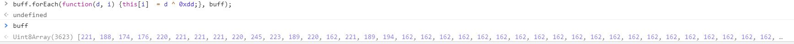

# CyberArk CTF 2021 - Writeups  - Finally - home!

Category: Innovation, Points: 448


# Finally - home! - Solution

Let's browse the website [https://s3.us-west-2.amazonaws.com/cyber-ctf.be/chl5/9f2d4057-618a-4016-a854-e6ed23d30b21.html](https://s3.us-west-2.amazonaws.com/cyber-ctf.be/chl5/9f2d4057-618a-4016-a854-e6ed23d30b21.html):


If we are trying to insert bad input we get the following:


By observing the source we can see the following Javascript:
```js
     const memory = new WebAssembly.Memory({ initial: 256, maximum: 256 });
            const importObj = {
                env: {
                    abortStackOverflow: () => { throw new Error('overflow'); },
                    table: new WebAssembly.Table({ initial: 0, maximum: 0, element: 'anyfunc' }),
                    __table_base: 0,
                    memory: memory,
                    __memory_base: 1024,
                    STACKTOP: 0,
                    STACK_MAX: memory.buffer.byteLength,
                }
            };

            document.getElementById('form').addEventListener('submit', function(e) {
                e.preventDefault();
                (async () => {
                const buff = new Uint8Array([
                    221, 188, 174, 176, 220, 221, 221, 221, 220, 245, 223, 189, 220, 162, 221, 189, 194, 162, 162, 162, 162, 162, 162, 162, 162, 162, 162, 162, 162, 162, 162, 162, 162, 162, 162, 162, 162, 162, 162, 162, 162, 162, 162, 162, 162, 162, 162, 162, 220, 162, 223, 190, 216, 222, 184, 179, 171, 207, 188, 191, 178, 175, 169, 142, 169, 188, 190, 182, 146, 171, 184, 175, 187, 177, 178, 170, 221, 221, 222, 184, 179, 171, 208, 130, 130, 176, 184, 176, 178, 175, 164, 130, 191, 188, 174, 184, 222, 162, 221, 222, 184, 179, 171, 209, 130, 130, 169, 188, 191, 177, 184, 130, 191, 188, 174, 184, 222, 162, 221, 222, 184, 179, 171, 219, 176, 184, 176, 178, 175, 164, 223, 220, 93, 223, 93, 223, 222, 184, 179, 171, 216, 169, 188, 191, 177, 184, 220, 173, 220, 221, 221, 222, 223, 220, 220, 219, 202, 222, 162, 220, 156, 125, 205, 214, 162, 220, 156, 125, 77, 29, 223, 214, 160, 220, 158, 221, 221, 221, 221, 214, 218, 213, 220, 217, 130, 171, 184, 175, 221, 220, 215, 59, 199, 220, 62, 199, 220, 7, 223, 162, 254, 223, 252, 42, 223, 254, 223, 156, 93, 220, 183, 249, 223, 254, 223, 254, 222, 147, 217, 157, 156, 93, 220, 205, 221, 214, 253, 221, 252, 7, 220, 253, 220, 252, 6, 220, 253, 223, 252, 59, 220, 253, 222, 252, 44, 220, 253, 217, 252, 46, 220, 253, 216, 252, 41, 220, 253, 219, 252, 40, 220, 253, 218, 252, 43, 220, 253, 213, 252, 42, 220, 253, 212, 252, 37, 220, 253, 215, 252, 1, 220, 253, 214, 252, 0, 220, 253, 209, 252, 3, 220, 253, 208, 252, 2, 220, 253, 211, 252, 61, 220, 253, 210, 252, 60, 220, 253, 205, 252, 63, 220, 253, 204, 252, 62, 220, 253, 207, 252, 57, 220, 253, 206, 252, 56, 220, 253, 201, 252, 58, 220, 253, 200, 252, 53, 220, 253, 203, 252, 52, 220, 253, 202, 252, 55, 220, 253, 197, 252, 54, 220, 253, 196, 252, 49, 220, 253, 199, 252, 48, 220, 253, 198, 252, 51, 220, 253, 193, 252, 50, 220, 253, 192, 252, 45, 220, 253, 195, 252, 47, 220, 156, 221, 252, 11, 223, 253, 7, 220, 252, 194, 253, 194, 156, 162, 174, 252, 69, 223, 253, 69, 223, 156, 122, 220, 172, 252, 65, 220, 253, 7, 220, 252, 253, 253, 253, 156, 5, 163, 172, 252, 64, 220, 253, 65, 220, 253, 64, 220, 175, 252, 106, 223, 253, 106, 223, 156, 28, 220, 182, 252, 10, 223, 223, 162, 253, 10, 223, 252, 37, 223, 156, 221, 253, 37, 223, 182, 253, 37, 223, 253, 37, 223, 156, 221, 149, 198, 214, 252, 36, 220, 253, 11, 223, 252, 246, 253, 246, 253, 36, 220, 183, 252, 160, 253, 160, 252, 11, 223, 253, 6, 220, 252, 235, 253, 235, 156, 162, 174, 252, 116, 223, 253, 116, 223, 156, 205, 172, 252, 25, 220, 253, 6, 220, 252, 156, 253, 156, 156, 178, 172, 252, 20, 220, 253, 25, 220, 253, 20, 220, 175, 252, 19, 223, 253, 19, 223, 156, 253, 182, 252, 50, 223, 223, 162, 253, 50, 223, 252, 37, 223, 156, 221, 253, 37, 223, 182, 253, 37, 223, 253, 37, 223, 156, 221, 149, 198, 214, 252, 79, 223, 253, 11, 223, 252, 145, 253, 145, 253, 79, 223, 183, 252, 69, 220, 253, 69, 220, 252, 11, 223, 253, 59, 220, 252, 138, 253, 138, 156, 162, 174, 252, 104, 223, 253, 104, 223, 156, 45, 220, 172, 252, 67, 220, 253, 59, 220, 252, 191, 253, 191, 156, 82, 163, 172, 252, 126, 220, 253, 67, 220, 253, 126, 220, 175, 252, 102, 223, 253, 102, 223, 156, 95, 220, 182, 252, 1, 223, 223, 162, 253, 1, 223, 252, 37, 223, 156, 221, 253, 37, 223, 182, 253, 37, 223, 253, 37, 223, 156, 221, 149, 198, 214, 252, 34, 220, 253, 11, 223, 252, 176, 253, 176, 253, 34, 220, 183, 252, 88, 220, 253, 88, 220, 252, 11, 223, 253, 44, 220, 252, 165, 253, 165, 156, 162, 174, 252, 127, 223, 253, 127, 223, 156, 66, 220, 172, 252, 105, 220, 253, 44, 220, 252, 252, 253, 252, 156, 61, 163, 172, 252, 100, 220, 253, 105, 220, 253, 100, 220, 175, 252, 27, 223, 253, 27, 223, 156, 29, 220, 182, 252, 58, 223, 223, 162, 253, 58, 223, 252, 37, 223, 156, 221, 253, 37, 223, 182, 253, 37, 223, 253, 37, 223, 156, 221, 149, 198, 214, 252, 87, 223, 253, 11, 223, 252, 255, 253, 255, 253, 87, 223, 183, 252, 82, 220, 253, 82, 220, 252, 11, 223, 253, 46, 220, 252, 254, 253, 254, 156, 162, 174, 252, 118, 223, 253, 118, 223, 156, 45, 220, 172, 252, 31, 220, 253, 46, 220, 252, 249, 253, 249, 156, 82, 163, 172, 252, 30, 220, 253, 31, 220, 253, 30, 220, 175, 252, 23, 223, 253, 23, 223, 156, 75, 220, 182, 252, 55, 223, 223, 162, 253, 55, 223, 252, 37, 223, 156, 221, 253, 37, 223, 182, 253, 37, 223, 253, 37, 223, 156, 221, 149, 198, 214, 252, 81, 223, 253, 11, 223, 252, 248, 253, 248, 253, 81, 223, 183, 252, 77, 220, 253, 77, 220, 252, 11, 223, 253, 41, 220, 252, 251, 253, 251, 156, 162, 174, 252, 113, 223, 253, 113, 223, 156, 28, 221, 172, 252, 24, 220, 253, 41, 220, 252, 250, 253, 250, 156, 99, 162, 172, 252, 27, 220, 253, 24, 220, 253, 27, 220, 175, 252, 22, 223, 253, 22, 223, 156, 233, 182, 252, 54, 223, 223, 162, 253, 54, 223, 252, 37, 223, 156, 221, 253, 37, 223, 182, 253, 37, 223, 253, 37, 223, 156, 221, 149, 198, 214, 252, 80, 223, 253, 11, 223, 252, 245, 253, 245, 253, 80, 223, 183, 252, 76, 220, 253, 76, 220, 252, 11, 223, 253, 40, 220, 252, 244, 253, 244, 156, 162, 174, 252, 112, 223, 253, 112, 223, 156, 52, 221, 172, 252, 26, 220, 253, 40, 220, 252, 247, 253, 247, 156, 75, 162, 172, 252, 21, 220, 253, 26, 220, 253, 21, 220, 175, 252, 17, 223, 253, 17, 223, 156, 198, 182, 252, 49, 223, 223, 162, 253, 49, 223, 252, 37, 223, 156, 221, 253, 37, 223, 182, 253, 37, 223, 253, 37, 223, 156, 221, 149, 198, 214, 252, 83, 223, 253, 11, 223, 252, 241, 253, 241, 253, 83, 223, 183, 252, 79, 220, 253, 79, 220, 252, 11, 223, 253, 43, 220, 252, 240, 253, 240, 156, 162, 174, 252, 115, 223, 253, 115, 223, 156, 236, 172, 252, 23, 220, 253, 43, 220, 252, 243, 253, 243, 156, 147, 172, 252, 22, 220, 253, 23, 220, 253, 22, 220, 175, 252, 16, 223, 253, 16, 223, 156, 24, 221, 182, 252, 48, 223, 223, 162, 253, 48, 223, 252, 37, 223, 156, 221, 253, 37, 223, 182, 253, 37, 223, 253, 37, 223, 156, 221, 149, 198, 214, 252, 82, 223, 253, 11, 223, 252, 242, 253, 242, 253, 82, 223, 183, 252, 78, 220, 253, 78, 220, 252, 11, 223, 253, 42, 220, 252, 237, 253, 237, 156, 162, 174, 252, 114, 223, 253, 114, 223, 156, 42, 221, 172, 252, 17, 220, 253, 42, 220, 252, 236, 253, 236, 156, 85, 162, 172, 252, 16, 220, 253, 17, 220, 253, 16, 220, 175, 252, 18, 223, 253, 18, 223, 156, 194, 182, 252, 51, 223, 223, 162, 253, 51, 223, 252, 37, 223, 156, 221, 253, 37, 223, 182, 253, 37, 223, 253, 37, 223, 156, 221, 149, 198, 214, 252, 77, 223, 253, 11, 223, 252, 239, 253, 239, 253, 77, 223, 183, 252, 73, 220, 253, 73, 220, 252, 11, 223, 253, 37, 220, 252, 238, 253, 238, 156, 162, 174, 252, 109, 223, 253, 109, 223, 156, 209, 172, 252, 19, 220, 253, 37, 220, 252, 233, 253, 233, 156, 174, 172, 252, 18, 220, 253, 19, 220, 253, 18, 220, 175, 252, 13, 223, 253, 13, 223, 156, 226, 182, 252, 45, 223, 223, 162, 253, 45, 223, 252, 37, 223, 156, 221, 253, 37, 223, 182, 253, 37, 223, 253, 37, 223, 156, 221, 149, 198, 214, 252, 76, 223, 253, 11, 223, 252, 232, 253, 232, 253, 76, 223, 183, 252, 72, 220, 253, 72, 220, 252, 11, 223, 253, 1, 220, 252, 234, 253, 234, 156, 162, 174, 252, 108, 223, 253, 108, 223, 156, 15, 220, 172, 252, 13, 220, 253, 1, 220, 252, 229, 253, 229, 156, 112, 163, 172, 252, 12, 220, 253, 13, 220, 253, 12, 220, 175, 252, 12, 223, 253, 12, 223, 156, 125, 220, 182, 252, 44, 223, 223, 162, 253, 44, 223, 252, 37, 223, 156, 221, 253, 37, 223, 182, 253, 37, 223, 253, 37, 223, 156, 221, 149, 198, 214, 252, 78, 223, 253, 11, 223, 252, 228, 253, 228, 253, 78, 223, 183, 252, 75, 220, 253, 75, 220, 252, 11, 223, 253, 0, 220, 252, 231, 253, 231, 156, 162, 174, 252, 111, 223, 253, 111, 223, 156, 49, 221, 172, 252, 15, 220, 253, 0, 220, 252, 230, 253, 230, 156, 78, 162, 172, 252, 14, 220, 253, 15, 220, 253, 14, 220, 175, 252, 15, 223, 253, 15, 223, 156, 238, 182, 252, 47, 223, 223, 162, 253, 47, 223, 252, 37, 223, 156, 221, 253, 37, 223, 182, 253, 37, 223, 253, 37, 223, 156, 221, 149, 198, 214, 252, 73, 223, 253, 11, 223, 252, 225, 253, 225, 253, 73, 223, 183, 252, 74, 220, 253, 74, 220, 252, 11, 223, 253, 3, 220, 252, 224, 253, 224, 156, 162, 174, 252, 110, 223, 253, 110, 223, 156, 101, 220, 172, 252, 9, 220, 253, 3, 220, 252, 227, 253, 227, 156, 26, 163, 172, 252, 8, 220, 253, 9, 220, 253, 8, 220, 175, 252, 14, 223, 253, 14, 223, 156, 84, 220, 182, 252, 46, 223, 223, 162, 253, 46, 223, 252, 37, 223, 156, 221, 253, 37, 223, 182, 253, 37, 223, 253, 37, 223, 156, 221, 149, 198, 214, 252, 72, 223, 253, 11, 223, 252, 226, 253, 226, 253, 72, 223, 183, 252, 68, 220, 253, 68, 220, 252, 11, 223, 253, 2, 220, 252, 157, 253, 157, 156, 162, 174, 252, 105, 223, 253, 105, 223, 156, 54, 220, 172, 252, 11, 220, 253, 2, 220, 252, 159, 253, 159, 156, 73, 163, 172, 252, 10, 220, 253, 11, 220, 253, 10, 220, 175, 252, 9, 223, 253, 9, 223, 156, 88, 220, 182, 252, 41, 223, 223, 162, 253, 41, 223, 252, 37, 223, 156, 221, 253, 37, 223, 182, 253, 37, 223, 253, 37, 223, 156, 221, 149, 198, 214, 252, 75, 223, 253, 11, 223, 252, 158, 253, 158, 253, 75, 223, 183, 252, 71, 220, 253, 71, 220, 252, 11, 223, 253, 61, 220, 252, 153, 253, 153, 156, 162, 174, 252, 107, 223, 253, 107, 223, 156, 43, 221, 172, 252, 5, 220, 253, 61, 220, 252, 152, 253, 152, 156, 84, 162, 172, 252, 4, 220, 253, 5, 220, 253, 4, 220, 175, 252, 8, 223, 253, 8, 223, 156, 205, 182, 252, 40, 223, 223, 162, 253, 40, 223, 252, 37, 223, 156, 221, 253, 37, 223, 182, 253, 37, 223, 253, 37, 223, 156, 221, 149, 198, 214, 252, 74, 223, 253, 11, 223, 252, 155, 253, 155, 253, 74, 223, 183, 252, 70, 220, 253, 70, 220, 252, 11, 223, 253, 60, 220, 252, 154, 253, 154, 156, 162, 174, 252, 68, 223, 253, 68, 223, 156, 233, 172, 252, 66, 220, 253, 60, 220, 252, 149, 253, 149, 156, 150, 172, 252, 125, 220, 253, 66, 220, 253, 125, 220, 175, 252, 101, 223, 253, 101, 223, 156, 217, 182, 252, 5, 223, 223, 162, 253, 5, 223, 252, 37, 223, 156, 221, 253, 37, 223, 182, 253, 37, 223, 253, 37, 223, 156, 221, 149, 198, 214, 252, 39, 220, 253, 11, 223, 252, 148, 253, 148, 253, 39, 220, 183, 252, 163, 253, 163, 252, 11, 223, 253, 63, 220, 252, 151, 253, 151, 156, 162, 174, 252, 71, 223, 253, 71, 223, 156, 8, 220, 172, 252, 124, 220, 253, 63, 220, 252, 150, 253, 150, 156, 119, 163, 172, 252, 127, 220, 253, 124, 220, 253, 127, 220, 175, 252, 100, 223, 253, 100, 223, 156, 87, 220, 182, 252, 4, 223, 223, 162, 253, 4, 223, 252, 37, 223, 156, 221, 253, 37, 223, 182, 253, 37, 223, 253, 37, 223, 156, 221, 149, 198, 214, 252, 38, 220, 253, 11, 223, 252, 144, 253, 144, 253, 38, 220, 183, 252, 162, 253, 162, 252, 11, 223, 253, 62, 220, 252, 147, 253, 147, 156, 162, 174, 252, 70, 223, 253, 70, 223, 156, 216, 172, 252, 121, 220, 253, 62, 220, 252, 146, 253, 146, 156, 167, 172, 252, 120, 220, 253, 121, 220, 253, 120, 220, 175, 252, 103, 223, 253, 103, 223, 156, 59, 221, 182, 252, 7, 223, 223, 162, 253, 7, 223, 252, 37, 223, 156, 221, 253, 37, 223, 182, 253, 37, 223, 253, 37, 223, 156, 221, 149, 198, 214, 252, 33, 220, 253, 11, 223, 252, 141, 253, 141, 253, 33, 220, 183, 252, 93, 220, 253, 93, 220, 252, 11, 223, 253, 57, 220, 252, 140, 253, 140, 156, 162, 174, 252, 65, 223, 253, 65, 223, 156, 54, 221, 172, 252, 123, 220, 253, 57, 220, 252, 143, 253, 143, 156, 73, 162, 172, 252, 122, 220, 253, 123, 220, 253, 122, 220, 175, 252, 97, 223, 253, 97, 223, 156, 2, 221, 182, 252, 6, 223, 223, 162, 253, 6, 223, 252, 37, 223, 156, 221, 253, 37, 223, 182, 253, 37, 223, 253, 37, 223, 156, 221, 149, 198, 214, 252, 32, 220, 253, 11, 223, 252, 142, 253, 142, 253, 32, 220, 183, 252, 92, 220, 253, 92, 220, 252, 11, 223, 253, 56, 220, 252, 137, 253, 137, 156, 162, 174, 252, 64, 223, 253, 64, 223, 156, 55, 221, 172, 252, 117, 220, 253, 56, 220, 252, 136, 253, 136, 156, 72, 162, 172, 252, 116, 220, 253, 117, 220, 253, 116, 220, 175, 252, 96, 223, 253, 96, 223, 156, 6, 221, 182, 252, 0, 223, 223, 162, 253, 0, 223, 252, 37, 223, 156, 221, 253, 37, 223, 182, 253, 37, 223, 253, 37, 223, 156, 221, 149, 198, 214, 252, 35, 220, 253, 11, 223, 252, 139, 253, 139, 253, 35, 220, 183, 252, 95, 220, 253, 95, 220, 252, 11, 223, 253, 58, 220, 252, 133, 253, 133, 156, 162, 174, 252, 67, 223, 253, 67, 223, 156, 120, 220, 172, 252, 119, 220, 253, 58, 220, 252, 132, 253, 132, 156, 7, 163, 172, 252, 118, 220, 253, 119, 220, 253, 118, 220, 175, 252, 99, 223, 253, 99, 223, 156, 73, 220, 182, 252, 3, 223, 223, 162, 253, 3, 223, 252, 37, 223, 156, 221, 253, 37, 223, 182, 253, 37, 223, 253, 37, 223, 156, 221, 149, 198, 214, 252, 93, 223, 253, 11, 223, 252, 135, 253, 135, 253, 93, 223, 183, 252, 94, 220, 253, 94, 220, 252, 11, 223, 253, 53, 220, 252, 134, 253, 134, 156, 162, 174, 252, 66, 223, 253, 66, 223, 156, 209, 172, 252, 113, 220, 253, 53, 220, 252, 129, 253, 129, 156, 174, 172, 252, 112, 220, 253, 113, 220, 253, 112, 220, 175, 252, 98, 223, 253, 98, 223, 156, 14, 221, 182, 252, 2, 223, 223, 162, 253, 2, 223, 252, 37, 223, 156, 221, 253, 37, 223, 182, 253, 37, 223, 253, 37, 223, 156, 221, 149, 198, 214, 252, 92, 223, 253, 11, 223, 252, 128, 253, 128, 253, 92, 223, 183, 252, 89, 220, 253, 89, 220, 252, 11, 223, 253, 52, 220, 252, 131, 253, 131, 156, 162, 174, 252, 125, 223, 253, 125, 223, 156, 107, 220, 172, 252, 115, 220, 253, 52, 220, 252, 130, 253, 130, 156, 20, 163, 172, 252, 114, 220, 253, 115, 220, 253, 114, 220, 175, 252, 29, 223, 253, 29, 223, 156, 91, 220, 182, 252, 61, 223, 223, 162, 253, 61, 223, 252, 37, 223, 156, 221, 253, 37, 223, 182, 253, 37, 223, 253, 37, 223, 156, 221, 149, 198, 214, 252, 95, 223, 253, 11, 223, 252, 189, 253, 189, 253, 95, 223, 183, 252, 91, 220, 253, 91, 220, 252, 11, 223, 253, 55, 220, 252, 188, 253, 188, 156, 162, 174, 252, 124, 223, 253, 124, 223, 156, 1, 220, 172, 252, 109, 220, 253, 55, 220, 252, 190, 253, 190, 156, 126, 163, 172, 252, 108, 220, 253, 109, 220, 253, 108, 220, 175, 252, 28, 223, 253, 28, 223, 156, 50, 220, 182, 252, 60, 223, 223, 162, 253, 60, 223, 252, 37, 223, 156, 221, 253, 37, 223, 182, 253, 37, 223, 253, 37, 223, 156, 221, 149, 198, 214, 252, 94, 223, 253, 11, 223, 252, 185, 253, 185, 253, 94, 223, 183, 252, 90, 220, 253, 90, 220, 252, 11, 223, 253, 54, 220, 252, 184, 253, 184, 156, 162, 174, 252, 126, 223, 253, 126, 223, 156, 81, 220, 172, 252, 111, 220, 253, 54, 220, 252, 187, 253, 187, 156, 46, 163, 172, 252, 110, 220, 253, 111, 220, 253, 110, 220, 175, 252, 31, 223, 253, 31, 223, 156, 98, 220, 182, 252, 63, 223, 223, 162, 253, 63, 223, 252, 37, 223, 156, 221, 253, 37, 223, 182, 253, 37, 223, 253, 37, 223, 156, 221, 149, 198, 214, 252, 89, 223, 253, 11, 223, 252, 186, 253, 186, 253, 89, 223, 183, 252, 85, 220, 253, 85, 220, 252, 11, 223, 253, 49, 220, 252, 181, 253, 181, 156, 162, 174, 252, 121, 223, 253, 121, 223, 156, 72, 220, 172, 252, 104, 220, 253, 49, 220, 252, 180, 253, 180, 156, 55, 163, 172, 252, 107, 220, 253, 104, 220, 253, 107, 220, 175, 252, 30, 223, 253, 30, 223, 156, 127, 220, 182, 252, 62, 223, 223, 162, 253, 62, 223, 252, 37, 223, 156, 221, 253, 37, 223, 182, 253, 37, 223, 253, 37, 223, 156, 221, 149, 198, 214, 252, 88, 223, 253, 11, 223, 252, 183, 253, 183, 253, 88, 223, 183, 252, 84, 220, 253, 84, 220, 252, 11, 223, 253, 48, 220, 252, 182, 253, 182, 156, 162, 174, 252, 120, 223, 253, 120, 223, 156, 207, 172, 252, 106, 220, 253, 48, 220, 252, 177, 253, 177, 156, 176, 172, 252, 101, 220, 253, 106, 220, 253, 101, 220, 175, 252, 25, 223, 253, 25, 223, 156, 253, 182, 252, 57, 223, 223, 162, 253, 57, 223, 252, 37, 223, 156, 221, 253, 37, 223, 182, 253, 37, 223, 253, 37, 223, 156, 221, 149, 198, 214, 252, 91, 223, 253, 11, 223, 252, 179, 253, 179, 253, 91, 223, 183, 252, 87, 220, 253, 87, 220, 252, 11, 223, 253, 51, 220, 252, 178, 253, 178, 156, 162, 174, 252, 123, 223, 253, 123, 223, 156, 117, 220, 172, 252, 103, 220, 253, 51, 220, 252, 173, 253, 173, 156, 10, 163, 172, 252, 102, 220, 253, 103, 220, 253, 102, 220, 175, 252, 24, 223, 253, 24, 223, 156, 77, 220, 182, 252, 56, 223, 223, 162, 253, 56, 223, 252, 37, 223, 156, 221, 253, 37, 223, 182, 253, 37, 223, 253, 37, 223, 156, 221, 149, 198, 214, 252, 90, 223, 253, 11, 223, 252, 172, 253, 172, 253, 90, 223, 183, 252, 86, 220, 253, 86, 220, 252, 11, 223, 253, 50, 220, 252, 175, 253, 175, 156, 162, 174, 252, 122, 223, 253, 122, 223, 156, 55, 220, 172, 252, 97, 220, 253, 50, 220, 252, 174, 253, 174, 156, 72, 163, 172, 252, 96, 220, 253, 97, 220, 253, 96, 220, 175, 252, 26, 223, 253, 26, 223, 156, 6, 220, 182, 252, 59, 223, 223, 162, 253, 59, 223, 252, 37, 223, 156, 221, 253, 37, 223, 182, 253, 37, 223, 253, 37, 223, 156, 221, 149, 198, 214, 252, 85, 223, 253, 11, 223, 252, 169, 253, 169, 253, 85, 223, 183, 252, 81, 220, 253, 81, 220, 252, 11, 223, 253, 45, 220, 252, 168, 253, 168, 156, 162, 174, 252, 117, 223, 253, 117, 223, 156, 112, 220, 172, 252, 99, 220, 253, 45, 220, 252, 171, 253, 171, 156, 15, 163, 172, 252, 98, 220, 253, 99, 220, 253, 98, 220, 175, 252, 21, 223, 253, 21, 223, 156, 72, 220, 182, 252, 53, 223, 223, 162, 253, 53, 223, 252, 37, 223, 156, 221, 253, 37, 223, 182, 253, 37, 223, 253, 37, 223, 156, 221, 149, 198, 214, 252, 84, 223, 253, 11, 223, 252, 170, 253, 170, 253, 84, 223, 183, 252, 80, 220, 253, 80, 220, 252, 11, 223, 253, 47, 220, 252, 164, 253, 164, 156, 162, 174, 252, 119, 223, 253, 119, 223, 156, 250, 172, 252, 29, 220, 253, 47, 220, 252, 167, 253, 167, 156, 133, 172, 252, 28, 220, 253, 29, 220, 253, 28, 220, 175, 252, 20, 223, 253, 20, 223, 156, 207, 182, 252, 52, 223, 223, 162, 253, 52, 223, 252, 37, 223, 156, 221, 253, 37, 223, 182, 253, 37, 223, 253, 37, 223, 156, 221, 149, 198, 214, 252, 86, 223, 253, 11, 223, 252, 166, 253, 166, 253, 86, 223, 183, 252, 83, 220, 253, 83, 220, 252, 11, 223, 253, 11, 223, 252, 161, 253, 42, 223, 249, 223, 253, 161, 210, 214]);debugger

                buff.forEach(function(d, i) {this[i]  = d ^ 0xdd}, buff);debugger

                const { instance } = await WebAssembly.instantiate(buff, importObj);debugger;const encoder = new TextEncoder();
                const answer = document.getElementById('answer').value;debugger;window['console']['log'] = instance.exports._ver;
                const a = encoder.encode(answer);debugger;var result = console.log(...a);

                if (result == 0) {
                        result = "😸";
                } else {
                        result = "😾";
                }  
                document.querySelector('main').textContent = ` ${ result }`;
                })();
            });
```
We can see it's take some buffer, xor it with ```0xdd``` and then call to ```WebAssembly.instantiate``` with this buffer and call to function ```_ver``` from this web assembly with our input.

Let's try to run the command ```buff.forEach(function(d, i) {this[i]  = d ^ 0xdd}, buff);``` on console to see what we get:



Let's convert this byte array to base64 using the following function:
```js
function _arrayBufferToBase64( buffer ) {
    var binary = '';
    var bytes = new Uint8Array( buffer );
    var len = bytes.byteLength;
    for (var i = 0; i < len; i++) {
        binary += String.fromCharCode( bytes[ i ] );
    }
    return window.btoa( binary );
}
```

By running that (```_arrayBufferToBase64(buff)```) we get the following base64:
```js
AGFzbQEAAAABKAJgAX8AYB9/f39/f39/f39/f39/f39/f39/f39/f39/f39/f39/AX8CYwUDZW52EmFib3J0U3RhY2tPdmVyZmxvdwAAA2Vudg1fX21lbW9yeV9iYXNlA38AA2VudgxfX3RhYmxlX2Jhc2UDfwADZW52Bm1lbW9yeQIBgAKAAgNlbnYFdGFibGUBcAEAAAMCAQEGFwN/AUGgEAt/AUGgkMACC30BQwAAAAALBwgBBF92ZXIAAQrmGgHjGgHaAn8jAiH3AiMCQYABaiQCIwIjA04EQEGAARAACyAAIdoBIAEh2wEgAiHmASADIfEBIAQh8wEgBSH0ASAGIfUBIAch9gEgCCH3ASAJIfgBIAoh3AEgCyHdASAMId4BIA0h3wEgDiHgASAPIeEBIBAh4gEgESHjASASIeQBIBMh5QEgFCHnASAVIegBIBYh6QEgFyHqASAYIesBIBkh7AEgGiHtASAbIe4BIBwh7wEgHSHwASAeIfIBQQAh1gIg2gEhHyAfQX9zIZgCIJgCQacBcSGcASDaASEgICBB2H5xIZ0BIJwBIJ0BciG3AiC3AkHBAWsh1wICfyDXAiH4AkEAIPgCayD4AiD4AkEASBsLIfkBINYCISsgKyD5AWohfSB9IdYCINsBITYgNkF/cyGpAiCpAkEQcSHEASDbASFBIEFBb3EhyQEgxAEgyQFyIc4CIM4CQSBrIe8CAn8g7wIh+AJBACD4Amsg+AIg+AJBAEgbCyGSAiDWAiFMIEwgkgJqIZgBIJgBIdYCIOYBIVcgV0F/cyG1AiC1AkHwAXEhngEg5gEhYiBiQY9+cSGjASCeASCjAXIhuwIguwJBggFrIdwCAn8g3AIh+AJBACD4Amsg+AIg+AJBAEgbCyH/ASDWAiFtIG0g/wFqIYUBIIUBIdYCIPEBIXggeEF/cyGiAiCiAkGfAXEhtAEg8QEhISAhQeB+cSG5ASC0ASC5AXIhxgIgxgJBwAFrIecCAn8g5wIh+AJBACD4Amsg+AIg+AJBAEgbCyGKAiDWAiEiICIgigJqIY8BII8BIdYCIPMBISMgI0F/cyGrAiCrAkHwAXEhwgEg8wEhJCAkQY9+cSHDASDCASDDAXIhygIgygJBlgFrIeoCAn8g6gIh+AJBACD4Amsg+AIg+AJBAEgbCyGMAiDWAiElICUgjAJqIZABIJABIdYCIPQBISYgJkF/cyGsAiCsAkHBAHEhxQEg9AEhJyAnQb5/cSHGASDFASDGAXIhywIgywJBNGsh6wICfyDrAiH4AkEAIPgCayD4AiD4AkEASBsLIY0CINYCISggKCCNAmohkQEgkQEh1gIg9QEhKSApQX9zIa0CIK0CQekAcSHHASD1ASEqICpBln9xIcgBIMcBIMgBciHMAiDMAkEbayHsAgJ/IOwCIfgCQQAg+AJrIPgCIPgCQQBIGwshjgIg1gIhLCAsII4CaiGSASCSASHWAiD2ASEtIC1Bf3MhrgIgrgJBMXEhygEg9gEhLiAuQU5xIcsBIMoBIMsBciHNAiDNAkHFAGsh7QICfyDtAiH4AkEAIPgCayD4AiD4AkEASBsLIY8CINYCIS8gLyCPAmohkwEgkwEh1gIg9wEhMCAwQX9zIa8CIK8CQfcAcSHMASD3ASExIDFBiH9xIc0BIMwBIM0BciHPAiDPAkEfayHuAgJ/IO4CIfgCQQAg+AJrIPgCIPgCQQBIGwshkAIg1gIhMiAyIJACaiGUASCUASHWAiD4ASEzIDNBf3MhsAIgsAJBDHEhzgEg+AEhNCA0QXNxIc8BIM4BIM8BciHQAiDQAkE/ayHwAgJ/IPACIfgCQQAg+AJrIPgCIPgCQQBIGwshkQIg1gIhNSA1IJECaiGVASCVASHWAiDcASE3IDdBf3MhsQIgsQJB0gFxIdABINwBITggOEGtfnEh0QEg0AEg0QFyIdECINECQaABayHxAgJ/IPECIfgCQQAg+AJrIPgCIPgCQQBIGwshkwIg1gIhOSA5IJMCaiGWASCWASHWAiDdASE6IDpBf3MhsgIgsgJB7ABxIdIBIN0BITsgO0GTf3Eh0wEg0gEg0wFyIdICINICQTNrIfICAn8g8gIh+AJBACD4Amsg+AIg+AJBAEgbCyGUAiDWAiE8IDwglAJqIZcBIJcBIdYCIN4BIT0gPUF/cyGzAiCzAkG4AXEh1AEg3gEhPiA+Qcd+cSHVASDUASDVAXIh0wIg0wJBiQFrIfMCAn8g8wIh+AJBACD4Amsg+AIg+AJBAEgbCyGVAiDWAiE/ID8glQJqIZkBIJkBIdYCIN8BIUAgQEF/cyG0AiC0AkHrAXEh1gEg3wEhQiBCQZR+cSHXASDWASDXAXIh1AIg1AJBhQFrIfQCAn8g9AIh+AJBACD4Amsg+AIg+AJBAEgbCyGWAiDWAiFDIEMglgJqIZoBIJoBIdYCIOABIUQgREF/cyG2AiC2AkH2AHEh2AEg4AEhRSBFQYl/cSHZASDYASDZAXIh1QIg1QJBEGsh9QICfyD1AiH4AkEAIPgCayD4AiD4AkEASBsLIZcCINYCIUYgRiCXAmohmwEgmwEh1gIg4QEhRyBHQX9zIZkCIJkCQTRxIZ8BIOEBIUggSEFLcSGgASCfASCgAXIhuAIguAJBBGsh2AICfyDYAiH4AkEAIPgCayD4AiD4AkEASBsLIfoBINYCIUkgSSD6AWohfiB+IdYCIOIBIUogSkF/cyGaAiCaAkHVAXEhoQEg4gEhSyBLQap+cSGiASChASCiAXIhuQIguQJBigFrIdkCAn8g2QIh+AJBACD4Amsg+AIg+AJBAEgbCyH7ASDWAiFNIE0g+wFqIX8gfyHWAiDjASFOIE5Bf3MhmwIgmwJBBXEhpAEg4wEhTyBPQXpxIaUBIKQBIKUBciG6AiC6AkHmAGsh2gICfyDaAiH4AkEAIPgCayD4AiD4AkEASBsLIfwBINYCIVAgUCD8AWohgAEggAEh1gIg5AEhUSBRQX9zIZwCIJwCQesAcSGmASDkASFSIFJBlH9xIacBIKYBIKcBciG8AiC8AkHfAGsh2wICfyDbAiH4AkEAIPgCayD4AiD4AkEASBsLIf0BINYCIVMgUyD9AWohgQEggQEh1gIg5QEhVCBUQX9zIZ0CIJ0CQeoAcSGoASDlASFVIFVBlX9xIakBIKgBIKkBciG9AiC9AkHbAGsh3QICfyDdAiH4AkEAIPgCayD4AiD4AkEASBsLIf4BINYCIVYgViD+AWohggEgggEh1gIg5wEhWCBYQX9zIZ4CIJ4CQaUBcSGqASDnASFZIFlB2n5xIasBIKoBIKsBciG+AiC+AkGUAWsh3gICfyDeAiH4AkEAIPgCayD4AiD4AkEASBsLIYACINYCIVogWiCAAmohgwEggwEh1gIg6AEhWyBbQX9zIZ8CIJ8CQQxxIawBIOgBIVwgXEFzcSGtASCsASCtAXIhvwIgvwJB0wBrId8CAn8g3wIh+AJBACD4Amsg+AIg+AJBAEgbCyGBAiDWAiFdIF0ggQJqIYQBIIQBIdYCIOkBIV4gXkF/cyGgAiCgAkG2AXEhrgEg6QEhXyBfQcl+cSGvASCuASCvAXIhwAIgwAJBhgFrIeACAn8g4AIh+AJBACD4Amsg+AIg+AJBAEgbCyGCAiDWAiFgIGAgggJqIYYBIIYBIdYCIOoBIWEgYUF/cyGhAiChAkHcAXEhsAEg6gEhYyBjQaN+cSGxASCwASCxAXIhwQIgwQJB7wFrIeECAn8g4QIh+AJBACD4Amsg+AIg+AJBAEgbCyGDAiDWAiFkIGQggwJqIYcBIIcBIdYCIOsBIWUgZUF/cyGjAiCjAkGMAXEhsgEg6wEhZiBmQfN+cSGzASCyASCzAXIhwgIgwgJBvwFrIeICAn8g4gIh+AJBACD4Amsg+AIg+AJBAEgbCyGEAiDWAiFnIGcghAJqIYgBIIgBIdYCIOwBIWggaEF/cyGkAiCkAkGVAXEhtQEg7AEhaSBpQep+cSG2ASC1ASC2AXIhwwIgwwJBogFrIeMCAn8g4wIh+AJBACD4Amsg+AIg+AJBAEgbCyGFAiDWAiFqIGoghQJqIYkBIIkBIdYCIO0BIWsga0F/cyGlAiClAkEScSG3ASDtASFsIGxBbXEhuAEgtwEguAFyIcQCIMQCQSBrIeQCAn8g5AIh+AJBACD4Amsg+AIg+AJBAEgbCyGGAiDWAiFuIG4ghgJqIYoBIIoBIdYCIO4BIW8gb0F/cyGmAiCmAkGoAXEhugEg7gEhcCBwQdd+cSG7ASC6ASC7AXIhxQIgxQJBkAFrIeUCAn8g5QIh+AJBACD4Amsg+AIg+AJBAEgbCyGHAiDWAiFxIHEghwJqIYsBIIsBIdYCIO8BIXIgckF/cyGnAiCnAkHqAXEhvAEg7wEhcyBzQZV+cSG9ASC8ASC9AXIhxwIgxwJB2wFrIeYCAn8g5gIh+AJBACD4Amsg+AIg+AJBAEgbCyGIAiDWAiF0IHQgiAJqIYwBIIwBIdYCIPABIXUgdUF/cyGoAiCoAkGtAXEhvgEg8AEhdiB2QdJ+cSG/ASC+ASC/AXIhyAIgyAJBlQFrIegCAn8g6AIh+AJBACD4Amsg+AIg+AJBAEgbCyGJAiDWAiF3IHcgiQJqIY0BII0BIdYCIPIBIXkgeUF/cyGqAiCqAkEncSHAASDyASF6IHpBWHEhwQEgwAEgwQFyIckCIMkCQRJrIekCAn8g6QIh+AJBACD4Amsg+AIg+AJBAEgbCyGLAiDWAiF7IHsgiwJqIY4BII4BIdYCINYCIXwg9wIkAiB8Dws=
```

The result of base64 decode to file is:
```console
┌─[evyatar@parrot]─[/cyberark/innovation/on_our_back_home]
└──╼$ file code_from_b64
code_from_b64: WebAssembly (wasm) binary module version 0x1 (MVP)
```

So as we can see it's a ```wasm``` file, We can "decompile" it to ```wat``` format using [wasm2wat](https://webassembly.github.io/wabt/doc/wasm2wat.1.html).

After decompiled the ```wasm``` file to ```wat``` file we get the following code which contains ```ver``` function:
```wat
export function ver(a:int, b:int, c:int, d:int, e:int, f:int, g:int, h:int, i:int, j:int, k:int, l:int, m:int, n:int, o:int, p:int, q:int, r:int, s:int, t:int, u:int, v:int, w:int, x:int, y:int, z:int, aa:int, ba:int, ca:int, da:int, ea:int):int {
  var mn:int;
  var ln:int = g_c;
  g_c = g_c + 128;
  if (g_c >= g_d) { env_abortStackOverflow(128) }
  var kh:int = a;
  var lh:int = b;
  var wh:int = c;
  var hi:int = d;
  var ji:int = e;
  var ki:int = f;
  var li:int = g;
  var mi:int = h;
  var ni:int = i;
  var oi:int = j;
  var mh:int = k;
  var nh:int = l;
  var oh:int = m;
  var ph:int = n;
  var qh:int = o;
  var rh:int = p;
  var sh:int = q;
  var th:int = r;
  var uh:int = s;
  var vh:int = t;
  var xh:int = u;
  var yh:int = v;
  var zh:int = w;
  var ai:int = x;
  var bi:int = y;
  var ci:int = z;
  var di:int = aa;
  var ei:int = ba;
  var fi:int = ca;
  var gi:int = da;
  var ii:int = ea;
  var em:int = 0;
  var fa:int = kh;
  var uj:int = fa ^ -1;
  var af:int = uj & 167;
  var ga:int = kh;
  var bf:int = ga & -168;
  var zk:int = af | bf;
  var fm:int = zk - 193;
  var pi:int = {
                 mn = fm;
                 select_if(0 - mn, mn, mn < 0);
                 label B_b:
               }
  var ra:int = em;
  var vd:int = ra + pi;
  em = vd;
  var cb:int = lh;
  var lk:int = cb ^ -1;
  var og:int = lk & 16;
  var nb:int = lh;
  var tg:int = nb & -17;
  var wl:int = og | tg;
  var dn:int = wl - 32;
  var oj:int = {
                 mn = dn;
                 select_if(0 - mn, mn, mn < 0);
                 label B_c:
               }
  var yb:int = em;
  var we:int = yb + oj;
  em = we;
  var jc:int = wh;
  var xk:int = jc ^ -1;
  var cf:int = xk & 240;
  var uc:int = wh;
  var hf:int = uc & -241;
  var dl:int = cf | hf;
  var km:int = dl - 130;
  var vi:int = {
                 mn = km;
                 select_if(0 - mn, mn, mn < 0);
                 label B_d:
               }
  var fd:int = em;
  var de:int = fd + vi;
  em = de;
  var qd:int = hi;
  var ek:int = qd ^ -1;
  var yf:int = ek & 159;
  var ha:int = hi;
  var dg:int = ha & -160;
  var ol:int = yf | dg;
  var vm:int = ol - 192;
  var gj:int = {
                 mn = vm;
                 select_if(0 - mn, mn, mn < 0);
                 label B_e:
               }
  var ia:int = em;
  var ne:int = ia + gj;
  em = ne;
  var ja:int = ji;
  var nk:int = ja ^ -1;
  var mg:int = nk & 240;
  var ka:int = ji;
  var ng:int = ka & -241;
  var sl:int = mg | ng;
  var ym:int = sl - 150;
  var ij:int = {
                 mn = ym;
                 select_if(0 - mn, mn, mn < 0);
                 label B_f:
               }
  var la:int = em;
  var oe:int = la + ij;
  em = oe;
  var ma:int = ki;
  var ok:int = ma ^ -1;
  var pg:int = ok & 65;
  var na:int = ki;
  var qg:int = na & -66;
  var tl:int = pg | qg;
  var zm:int = tl - 52;
  var jj:int = {
                 mn = zm;
                 select_if(0 - mn, mn, mn < 0);
                 label B_g:
               }
  var oa:int = em;
  var pe:int = oa + jj;
  em = pe;
  var pa:int = li;
  var pk:int = pa ^ -1;
  var rg:int = pk & 105;
  var qa:int = li;
  var sg:int = qa & -106;
  var ul:int = rg | sg;
  var an:int = ul - 27;
  var kj:int = {
                 mn = an;
                 select_if(0 - mn, mn, mn < 0);
                 label B_h:
               }
  var sa:int = em;
  var qe:int = sa + kj;
  em = qe;
  var ta:int = mi;
  var qk:int = ta ^ -1;
  var ug:int = qk & 49;
  var ua:int = mi;
  var vg:int = ua & -50;
  var vl:int = ug | vg;
  var bn:int = vl - 69;
  var lj:int = {
                 mn = bn;
                 select_if(0 - mn, mn, mn < 0);
                 label B_i:
               }
  var va:int = em;
  var re:int = va + lj;
  em = re;
  var wa:int = ni;
  var rk:int = wa ^ -1;
  var wg:int = rk & 119;
  var xa:int = ni;
  var xg:int = xa & -120;
  var xl:int = wg | xg;
  var cn:int = xl - 31;
  var mj:int = {
                 mn = cn;
                 select_if(0 - mn, mn, mn < 0);
                 label B_j:
               }
  var ya:int = em;
  var se:int = ya + mj;
  em = se;
  var za:int = oi;
  var sk:int = za ^ -1;
  var yg:int = sk & 12;
  var ab:int = oi;
  var zg:int = ab & -13;
  var yl:int = yg | zg;
  var en:int = yl - 63;
  var nj:int = {
                 mn = en;
                 select_if(0 - mn, mn, mn < 0);
                 label B_k:
               }
  var bb:int = em;
  var te:int = bb + nj;
  em = te;
  var db:int = mh;
  var tk:int = db ^ -1;
  var ah:int = tk & 210;
  var eb:int = mh;
  var bh:int = eb & -211;
  var zl:int = ah | bh;
  var fn:int = zl - 160;
  var pj:int = {
                 mn = fn;
                 select_if(0 - mn, mn, mn < 0);
                 label B_l:
               }
  var fb:int = em;
  var ue:int = fb + pj;
  em = ue;
  var gb:int = nh;
  var uk:int = gb ^ -1;
  var ch:int = uk & 108;
  var hb:int = nh;
  var dh:int = hb & -109;
  var am:int = ch | dh;
  var gn:int = am - 51;
  var qj:int = {
                 mn = gn;
                 select_if(0 - mn, mn, mn < 0);
                 label B_m:
               }
  var ib:int = em;
  var ve:int = ib + qj;
  em = ve;
  var jb:int = oh;
  var vk:int = jb ^ -1;
  var eh:int = vk & 184;
  var kb:int = oh;
  var fh:int = kb & -185;
  var bm:int = eh | fh;
  var hn:int = bm - 137;
  var rj:int = {
                 mn = hn;
                 select_if(0 - mn, mn, mn < 0);
                 label B_n:
               }
  var lb:int = em;
  var xe:int = lb + rj;
  em = xe;
  var mb:int = ph;
  var wk:int = mb ^ -1;
  var gh:int = wk & 235;
  var ob:int = ph;
  var hh:int = ob & -236;
  var cm:int = gh | hh;
  var in:int = cm - 133;
  var sj:int = {
                 mn = in;
                 select_if(0 - mn, mn, mn < 0);
                 label B_o:
               }
  var pb:int = em;
  var ye:int = pb + sj;
  em = ye;
  var qb:int = qh;
  var yk:int = qb ^ -1;
  var ih:int = yk & 118;
  var rb:int = qh;
  var jh:int = rb & -119;
  var dm:int = ih | jh;
  var jn:int = dm - 16;
  var tj:int = {
                 mn = jn;
                 select_if(0 - mn, mn, mn < 0);
                 label B_p:
               }
  var sb:int = em;
  var ze:int = sb + tj;
  em = ze;
  var tb:int = rh;
  var vj:int = tb ^ -1;
  var df:int = vj & 52;
  var ub:int = rh;
  var ef:int = ub & -53;
  var al:int = df | ef;
  var gm:int = al - 4;
  var qi:int = {
                 mn = gm;
                 select_if(0 - mn, mn, mn < 0);
                 label B_q:
               }
  var vb:int = em;
  var wd:int = vb + qi;
  em = wd;
  var wb:int = sh;
  var wj:int = wb ^ -1;
  var ff:int = wj & 213;
  var xb:int = sh;
  var gf:int = xb & -214;
  var bl:int = ff | gf;
  var hm:int = bl - 138;
  var ri:int = {
                 mn = hm;
                 select_if(0 - mn, mn, mn < 0);
                 label B_r:
               }
  var zb:int = em;
  var xd:int = zb + ri;
  em = xd;
  var ac:int = th;
  var xj:int = ac ^ -1;
  var if:int = xj & 5;
  var bc:int = th;
  var jf:int = bc & -6;
  var cl:int = if | jf;
  var im:int = cl - 102;
  var si:int = {
                 mn = im;
                 select_if(0 - mn, mn, mn < 0);
                 label B_s:
               }
  var cc:int = em;
  var yd:int = cc + si;
  em = yd;
  var dc:int = uh;
  var yj:int = dc ^ -1;
  var kf:int = yj & 107;
  var ec:int = uh;
  var lf:int = ec & -108;
  var el:int = kf | lf;
  var jm:int = el - 95;
  var ti:int = {
                 mn = jm;
                 select_if(0 - mn, mn, mn < 0);
                 label B_t:
               }
  var fc:int = em;
  var zd:int = fc + ti;
  em = zd;
  var gc:int = vh;
  var zj:int = gc ^ -1;
  var mf:int = zj & 106;
  var hc:int = vh;
  var nf:int = hc & -107;
  var fl:int = mf | nf;
  var lm:int = fl - 91;
  var ui:int = {
                 mn = lm;
                 select_if(0 - mn, mn, mn < 0);
                 label B_u:
               }
  var ic:int = em;
  var ae:int = ic + ui;
  em = ae;
  var kc:int = xh;
  var ak:int = kc ^ -1;
  var of:int = ak & 165;
  var lc:int = xh;
  var pf:int = lc & -166;
  var gl:int = of | pf;
  var mm:int = gl - 148;
  var wi:int = {
                 mn = mm;
                 select_if(0 - mn, mn, mn < 0);
                 label B_v:
               }
  var mc:int = em;
  var be:int = mc + wi;
  em = be;
  var nc:int = yh;
  var bk:int = nc ^ -1;
  var qf:int = bk & 12;
  var oc:int = yh;
  var rf:int = oc & -13;
  var hl:int = qf | rf;
  var nm:int = hl - 83;
  var xi:int = {
                 mn = nm;
                 select_if(0 - mn, mn, mn < 0);
                 label B_w:
               }
  var pc:int = em;
  var ce:int = pc + xi;
  em = ce;
  var qc:int = zh;
  var ck:int = qc ^ -1;
  var sf:int = ck & 182;
  var rc:int = zh;
  var tf:int = rc & -183;
  var il:int = sf | tf;
  var om:int = il - 134;
  var yi:int = {
                 mn = om;
                 select_if(0 - mn, mn, mn < 0);
                 label B_x:
               }
  var sc:int = em;
  var ee:int = sc + yi;
  em = ee;
  var tc:int = ai;
  var dk:int = tc ^ -1;
  var uf:int = dk & 220;
  var vc:int = ai;
  var vf:int = vc & -221;
  var jl:int = uf | vf;
  var pm:int = jl - 239;
  var zi:int = {
                 mn = pm;
                 select_if(0 - mn, mn, mn < 0);
                 label B_y:
               }
  var wc:int = em;
  var fe:int = wc + zi;
  em = fe;
  var xc:int = bi;
  var fk:int = xc ^ -1;
  var wf:int = fk & 140;
  var yc:int = bi;
  var xf:int = yc & -141;
  var kl:int = wf | xf;
  var qm:int = kl - 191;
  var aj:int = {
                 mn = qm;
                 select_if(0 - mn, mn, mn < 0);
                 label B_z:
               }
  var zc:int = em;
  var ge:int = zc + aj;
  em = ge;
  var ad:int = ci;
  var gk:int = ad ^ -1;
  var zf:int = gk & 149;
  var bd:int = ci;
  var ag:int = bd & -150;
  var ll:int = zf | ag;
  var rm:int = ll - 162;
  var bj:int = {
                 mn = rm;
                 select_if(0 - mn, mn, mn < 0);
                 label B_aa:
               }
  var cd:int = em;
  var he:int = cd + bj;
  em = he;
  var dd:int = di;
  var hk:int = dd ^ -1;
  var bg:int = hk & 18;
  var ed:int = di;
  var cg:int = ed & -19;
  var ml:int = bg | cg;
  var sm:int = ml - 32;
  var cj:int = {
                 mn = sm;
                 select_if(0 - mn, mn, mn < 0);
                 label B_ba:
               }
  var gd:int = em;
  var ie:int = gd + cj;
  em = ie;
  var hd:int = ei;
  var ik:int = hd ^ -1;
  var eg:int = ik & 168;
  var id:int = ei;
  var fg:int = id & -169;
  var nl:int = eg | fg;
  var tm:int = nl - 144;
  var dj:int = {
                 mn = tm;
                 select_if(0 - mn, mn, mn < 0);
                 label B_ca:
               }
  var jd:int = em;
  var je:int = jd + dj;
  em = je;
  var kd:int = fi;
  var jk:int = kd ^ -1;
  var gg:int = jk & 234;
  var ld:int = fi;
  var hg:int = ld & -235;
  var pl:int = gg | hg;
  var um:int = pl - 219;
  var ej:int = {
                 mn = um;
                 select_if(0 - mn, mn, mn < 0);
                 label B_da:
               }
  var md:int = em;
  var ke:int = md + ej;
  em = ke;
  var nd:int = gi;
  var kk:int = nd ^ -1;
  var ig:int = kk & 173;
  var od:int = gi;
  var jg:int = od & -174;
  var ql:int = ig | jg;
  var wm:int = ql - 149;
  var fj:int = {
                 mn = wm;
                 select_if(0 - mn, mn, mn < 0);
                 label B_ea:
               }
  var pd:int = em;
  var le:int = pd + fj;
  em = le;
  var rd:int = ii;
  var mk:int = rd ^ -1;
  var kg:int = mk & 39;
  var sd:int = ii;
  var lg:int = sd & -40;
  var rl:int = kg | lg;
  var xm:int = rl - 18;
  var hj:int = {
                 mn = xm;
                 select_if(0 - mn, mn, mn < 0);
                 label B_fa:
               }
  var td:int = em;
  var me:int = td + hj;
  em = me;
  var ud:int = em;
  g_c = ln;
  return ud;
}
```

By observing the code we can see diffrent calculate for each character from our input and we can see the return value ```ud``` which is ```em``` (Important to remember it).

Let's observe the calculate to the first character:
```wat
var em:int = 0;
var fa:int = kh;
var uj:int = fa ^ -1;
var af:int = uj & 167;
var ga:int = kh;
var bf:int = ga & -168;
var zk:int = af | bf;
var fm:int = zk - 193;
var pi:int = {
               mn = fm;
               select_if(0 - mn, mn, mn < 0);
               label B_b:
             }
var ra:int = em;
var vd:int = ra + pi;
em = vd;
```
We can simlpy write it also like that:

```
((kh ^ -1) & 167 | (kh & -168)) - 193
```

Where ```kh``` is the 1st character in our input.

The calculate for the second character on the input is:
```wat
var cb:int = lh;
var lk:int = cb ^ -1;
var og:int = lk & 16;
var nb:int = lh;
var tg:int = nb & -17;
var wl:int = og | tg;
var dn:int = wl - 32;
var oj:int = {
               mn = dn;
               select_if(0 - mn, mn, mn < 0);
               label B_c:
             }
var yb:int = em;
var we:int = yb + oj;
em = we;
```

Which is:
```
((lh ^ -1) & 16 | (lh & -17)) - 32
```

And for the 3rd character is:
```wat
var jc:int = wh;
var xk:int = jc ^ -1;
var cf:int = xk & 240;
var uc:int = wh;
var hf:int = uc & -241;
var dl:int = cf | hf;
var km:int = dl - 130;
var vi:int = {
               mn = km;
               select_if(0 - mn, mn, mn < 0);
               label B_d:
             }
var fd:int = em;
var de:int = fd + vi;
em = de;
```

Which is:
```wat
((wh ^ -1) & 240 | (wh & -241)) - 130
```

So if we take a look at the calculates of the first three characters we can see:
```wat
((kh ^ -1) & 167 | (kh & -168)) - 193
((lh ^ -1) & 16 | (lh & -17)) - 32
((wh ^ -1) & 240 | (wh & -241)) - 130
```

We can see that for each character we make first ```^ -1``` and then, ```&``` with number and ```&``` with the same number but ```(N+1)```.

So actually we can automate it.

First, Let's get all the calculate sections using ```grep```, We can identify them by searching for ```^ -1```:
```console
┌─[evyatar@parrot]─[/cyberark/innovation/finally_home]
└──╼$ cat wasm_to_wat | grep -A5 " ^ -1"
  var uj:int = fa ^ -1;
  var af:int = uj & 167;
  var ga:int = kh;
  var bf:int = ga & -168;
  var zk:int = af | bf;
  var fm:int = zk - 193;
--
  var lk:int = cb ^ -1;
  var og:int = lk & 16;
  var nb:int = lh;
  var tg:int = nb & -17;
  var wl:int = og | tg;
  var dn:int = wl - 32;
--
  var xk:int = jc ^ -1;
  var cf:int = xk & 240;
  var uc:int = wh;
  var hf:int = uc & -241;
  var dl:int = cf | hf;
  var km:int = dl - 130;
--
  var ek:int = qd ^ -1;
  var yf:int = ek & 159;
  var ha:int = hi;
  var dg:int = ha & -160;
  var ol:int = yf | dg;
  var vm:int = ol - 192;
--
  var nk:int = ja ^ -1;
  var mg:int = nk & 240;
  var ka:int = ji;
  var ng:int = ka & -241;
  var sl:int = mg | ng;
  var ym:int = sl - 150;
--
  var ok:int = ma ^ -1;
  var pg:int = ok & 65;
  var na:int = ki;
  var qg:int = na & -66;
  var tl:int = pg | qg;
  var zm:int = tl - 52;
--
  var pk:int = pa ^ -1;
  var rg:int = pk & 105;
  var qa:int = li;
  var sg:int = qa & -106;
  var ul:int = rg | sg;
  var an:int = ul - 27;
--
  var qk:int = ta ^ -1;
  var ug:int = qk & 49;
  var ua:int = mi;
  var vg:int = ua & -50;
  var vl:int = ug | vg;
  var bn:int = vl - 69;
--
  var rk:int = wa ^ -1;
  var wg:int = rk & 119;
  var xa:int = ni;
  var xg:int = xa & -120;
  var xl:int = wg | xg;
  var cn:int = xl - 31;
--
  var sk:int = za ^ -1;
  var yg:int = sk & 12;
  var ab:int = oi;
  var zg:int = ab & -13;
  var yl:int = yg | zg;
  var en:int = yl - 63;
--
  var tk:int = db ^ -1;
  var ah:int = tk & 210;
  var eb:int = mh;
  var bh:int = eb & -211;
  var zl:int = ah | bh;
  var fn:int = zl - 160;
--
  var uk:int = gb ^ -1;
  var ch:int = uk & 108;
  var hb:int = nh;
  var dh:int = hb & -109;
  var am:int = ch | dh;
  var gn:int = am - 51;
--
  var vk:int = jb ^ -1;
  var eh:int = vk & 184;
  var kb:int = oh;
  var fh:int = kb & -185;
  var bm:int = eh | fh;
  var hn:int = bm - 137;
--
  var wk:int = mb ^ -1;
  var gh:int = wk & 235;
  var ob:int = ph;
  var hh:int = ob & -236;
  var cm:int = gh | hh;
  var in:int = cm - 133;
--
  var yk:int = qb ^ -1;
  var ih:int = yk & 118;
  var rb:int = qh;
  var jh:int = rb & -119;
  var dm:int = ih | jh;
  var jn:int = dm - 16;
--
  var vj:int = tb ^ -1;
  var df:int = vj & 52;
  var ub:int = rh;
  var ef:int = ub & -53;
  var al:int = df | ef;
  var gm:int = al - 4;
--
  var wj:int = wb ^ -1;
  var ff:int = wj & 213;
  var xb:int = sh;
  var gf:int = xb & -214;
  var bl:int = ff | gf;
  var hm:int = bl - 138;
--
  var xj:int = ac ^ -1;
  var if:int = xj & 5;
  var bc:int = th;
  var jf:int = bc & -6;
  var cl:int = if | jf;
  var im:int = cl - 102;
--
  var yj:int = dc ^ -1;
  var kf:int = yj & 107;
  var ec:int = uh;
  var lf:int = ec & -108;
  var el:int = kf | lf;
  var jm:int = el - 95;
--
  var zj:int = gc ^ -1;
  var mf:int = zj & 106;
  var hc:int = vh;
  var nf:int = hc & -107;
  var fl:int = mf | nf;
  var lm:int = fl - 91;
--
  var ak:int = kc ^ -1;
  var of:int = ak & 165;
  var lc:int = xh;
  var pf:int = lc & -166;
  var gl:int = of | pf;
  var mm:int = gl - 148;
--
  var bk:int = nc ^ -1;
  var qf:int = bk & 12;
  var oc:int = yh;
  var rf:int = oc & -13;
  var hl:int = qf | rf;
  var nm:int = hl - 83;
--
  var ck:int = qc ^ -1;
  var sf:int = ck & 182;
  var rc:int = zh;
  var tf:int = rc & -183;
  var il:int = sf | tf;
  var om:int = il - 134;
--
  var dk:int = tc ^ -1;
  var uf:int = dk & 220;
  var vc:int = ai;
  var vf:int = vc & -221;
  var jl:int = uf | vf;
  var pm:int = jl - 239;
--
  var fk:int = xc ^ -1;
  var wf:int = fk & 140;
  var yc:int = bi;
  var xf:int = yc & -141;
  var kl:int = wf | xf;
  var qm:int = kl - 191;
--
  var gk:int = ad ^ -1;
  var zf:int = gk & 149;
  var bd:int = ci;
  var ag:int = bd & -150;
  var ll:int = zf | ag;
  var rm:int = ll - 162;
--
  var hk:int = dd ^ -1;
  var bg:int = hk & 18;
  var ed:int = di;
  var cg:int = ed & -19;
  var ml:int = bg | cg;
  var sm:int = ml - 32;
--
  var ik:int = hd ^ -1;
  var eg:int = ik & 168;
  var id:int = ei;
  var fg:int = id & -169;
  var nl:int = eg | fg;
  var tm:int = nl - 144;
--
  var jk:int = kd ^ -1;
  var gg:int = jk & 234;
  var ld:int = fi;
  var hg:int = ld & -235;
  var pl:int = gg | hg;
  var um:int = pl - 219;
--
  var kk:int = nd ^ -1;
  var ig:int = kk & 173;
  var od:int = gi;
  var jg:int = od & -174;
  var ql:int = ig | jg;
  var wm:int = ql - 149;
--
  var mk:int = rd ^ -1;
  var kg:int = mk & 39;
  var sd:int = ii;
  var lg:int = sd & -40;
  var rl:int = kg | lg;
  var xm:int = rl - 18;
```

So we know that we are always first make ```^ -1```  so if we search the first line after ```^ -1``` it will be the second part of the calculation (The number of ```&``` calculate):
```console
┌─[evyatar@parrot]─[/cyberark/innovation/finally_home]
└──╼$  cat wasdd | grep -A1 "\^ -1" | grep -v "\^ -1" | cut -d '&' -f2 | grep [0-9] | sed 's/\;//g' | sed 's/ //g' > first_and_args
```
cat the wat file, Take one line after ```^ -1```, Split by ```&```, Take only numbers and remove the ```;``` and whitespaces.

Now, After we found all the first numbers from the calculate lets find the last part of the calculate:
```console
┌─[evyatar@parrot]─[/cyberark/innovation/finally_home]
└──╼$ cat wasdd | grep -A1 "|"  | grep "-" | cut -d '-' -f2 | grep [0-9] | sed -e 's/\;//g' | sed 's/ //g'> last_minus_calc
```

So far we have two files, ```first_and_args``` and ```last_minus_calc```.

Let's look back at the calculate:
```
((X ^ -1) & 167 | (X & -168)) - 193
```

```first_and_args``` contains the number ```167``` (We don't need to find ```168``` because we know it's always ```(N+1)```).

And ```last_minus_calc``` contains ```193```, So:
```
((X ^ -1) & NUMBER_FROM_FIRST_AND_ARGS | (kh & - (NUMBER_FROM_FIRST_AND_ARGS + 1))) - NUMBER_FROM_LAST_MINUS_CALC
```

So we have all parameters we need.

If we look back at the javascript we see:
```js
...
if (result == 0) {
       result = "😸";
    } else {
       result = "😾";
   }
...   
```

Meaning that we need to get return value ```0``` from ```ver``` function.

Let's observe again the calculate code:
```wat
...
var em:int = 0;
var fa:int = kh;
var uj:int = fa ^ -1;
var af:int = uj & 167;
var ga:int = kh;
var bf:int = ga & -168;
var zk:int = af | bf;
var fm:int = zk - 193;
var pi:int = {
               mn = fm;
               select_if(0 - mn, mn, mn < 0);
               label B_b:
             }
var ra:int = em;
var vd:int = ra + pi;
em = vd;
...
```

We can see the return value ```em``` calculated by ```var vd:int = ra + pi;``` so if ```pi``` is ```0``` then ```em``` will be also ```0``` - We need to make it for each character.


We need to find ```X``` that (For each character in our input):
```
((X ^ -1) & 167 | (X & -168)) - 193 = 0
```

So let's write it [calc.py](calc.py) - We actually make a brute force to find each character:
```python
first_args=open('first_and_args').readlines()
last_minus=open('last_minus_calc').readlines()

answer=""
for i in range(len(first_args)):
    for char in range(255):
        if ((char ^ -1) & int(first_args[i].rstrip()) | (char & - (int(first_args[i].rstrip()) + 1) )) - int(last_minus[i].rstrip()) == 0:
            answer+=chr(char)

print(answer)
```

By running that we get:
```console
┌─[evyatar@parrot]─[/cyberark/innovation/finally_home]
└──╼$ python calc.py
f0r_furth3r_1nf0_c411_033728185
```

By calling to this phone number ```033728185``` we get the following call [call_flag.m4a](call_flag.m4a) which says:
>Countdown for landing. 10 C B A 9 8 7 6 5 4 3 2 1 0. Successful landing. Great job cadet. We understand you've found a message from extraterrestrial life. Please, send that important flag to us.

After a lot of guessings I found that ```10 C B A 9 8 7 6 5 4 3 2 1 0``` It's countdown in Base13 and *"you've found a message from extraterrestrial life"* means the alien message from [2-The_search_for_a_higher_being](../2-The_search_for_a_higher_being) challenge which is ```What a lovely day```.

So actually we need to convert the flag from challenge 2 (Which is ```What a lovely day```) to Base13 by the following code [flag.py](flag.py):
```python
alphabet = "0123456789ABC10"

def convert_to_base_13(x):
    q,r = divmod(x,13)
    if q == 0:
       return alphabet[r]
    return convert_to_base_13(q) + alphabet[r] 

flag=""
for i in "What a lovely day":
        flag+=convert_to_base_13(ord(i))

print(flag)
```

Running that to get the flag:
```console
┌─[evyatar@parrot]─[/cyberark/innovation/finally_home]
└──╼$ python flag.py
6980768C2676268487917A849426797694
```

And the flag is ```6980768C2676268487917A849426797694```.