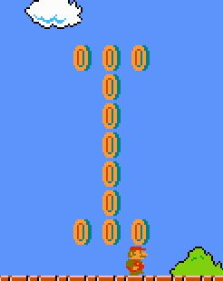
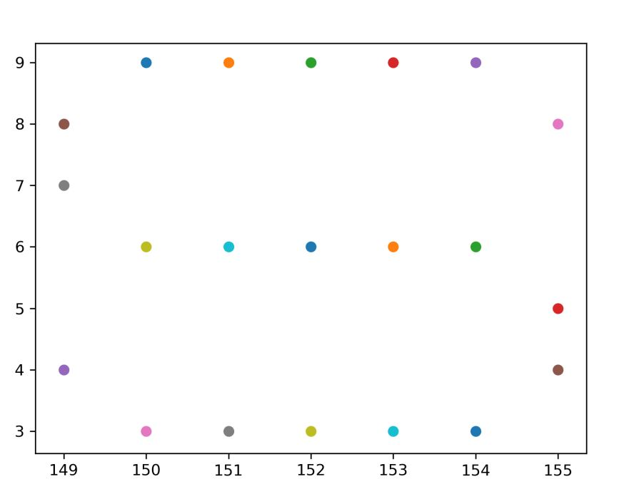

# Super Super Mario - ICHSA CTF 2021 - Hardware and Side-chanel Attacks
Category: Reverse Engineering, 150 Points

## Description


 
And attached file [super_super_mario_linux.zip](super_super_mario_linux.zip)

## Super Super Mario Solution

As we can see from the challenge description It's "Super-Super Mario" game, The letters of the flag are found in the end of each level and are made of coins (one letter in the end of each level).

We get also the following link [https://github.com/jakowskidev/uMario_Jakowski](https://github.com/jakowskidev/uMario_Jakowski) as hint.

We know the letters of the flag are coins, By looking at the source code above we can see the method ```void structCoins(int X, int Y, int iWidth, int iHeight);``` (from [Map.h](https://github.com/jakowskidev/uMario_Jakowski/blob/master/uNext/Map.h)), So It's mean we need to find at the binary ```structCoins``` method calls.

By looking at the binay using Ghidra we can see the following method:
```C

/* Map::loadLVL_1_1() */

void __thiscall Map::loadLVL_1_1(Map *this)

{
  vector<MapLevel*,std::allocator<MapLevel*>> *pvVar1;
  MapLevel **ppMVar2;
  
  clearMap(this);
  *(undefined4 *)(this + 0x60) = 0x104;
  *(undefined4 *)(this + 100) = 0x19;
  *(undefined4 *)(this + 0xcc) = 0;
  *(undefined4 *)(this + 0xe0) = 0x3c;
  createMap(this);
  loadMinionsLVL_1_1(this);
  loadPipeEventsLVL_1_1(this);
  structBush(this,0,2,2);
  structBush(this,0x10,2,1);
  structBush(this,0x30,2,2);
  structBush(this,0x40,2,1);
  structBush(this,0x60,2,2);
  structBush(this,0x70,2,1);
  structBush(this,0x90,2,2);
  structBush(this,0xa0,2,1);
  structBush(this,0xc0,2,2);
  structBush(this,0xd0,2,1);
  structCloud(this,8,10,1);
  structCloud(this,0x13,0xb,1);
  structCloud(this,0x1b,10,3);
  structCloud(this,0x24,0xb,2);
  structCloud(this,0x38,10,1);
  structCloud(this,0x43,0xb,1);
  structCloud(this,0x4b,10,3);
  structCloud(this,0x54,0xb,2);
  structCloud(this,0x68,10,1);
  structCloud(this,0x73,0xb,1);
  structCloud(this,0x7b,10,3);
  structCloud(this,0x84,0xb,2);
  structCloud(this,0x98,10,1);
  structCloud(this,0xa3,0xb,1);
  structCloud(this,0xab,10,3);
  structCloud(this,0xb4,0xb,2);
  structCloud(this,200,10,1);
  structCloud(this,0xd3,0xb,1);
  structCloud(this,0xdb,10,3);
  structGrass(this,0xb,2,3);
  structGrass(this,0x17,2,1);
  structGrass(this,0x29,2,2);
  structGrass(this,0x3b,2,3);
  structGrass(this,0x47,2,1);
  structGrass(this,0x59,2,2);
  structGrass(this,0x6b,2,3);
  structGrass(this,0x77,2,1);
  structGrass(this,0x89,2,2);
  structGrass(this,0x9d,2,1);
  structGrass(this,0xa7,2,1);
  structGrass(this,0xcd,2,1);
  structGrass(this,0xd7,2,1);
  structGND(this,0,0,0x45,2);
  structGND(this,0x47,0,0xf,2);
  structGND(this,0x59,0,0x40,2);
  structGND(this,0x9b,0,0x55,2);
  structGND2(this,0x86,2,4,true);
  structGND2(this,0x8c,2,4,false);
  structGND2(this,0x94,2,4,true);
  structGND2(this,0x98,2,1,4);
  structGND2(this,0x9b,2,4,false);
  structGND2(this,0xb5,2,8,true);
  structGND2(this,0xbd,2,1,8);
  structGND2(this,0xc6,2,1,1);
  struckBlockQ(this,0x10,5,1);
  structBrick(this,0x14,5,1,1);
  struckBlockQ(this,0x15,5,1);
  pvVar1 = (vector<MapLevel*,std::allocator<MapLevel*>> *)
           std::
           vector<std::vector<MapLevel*,std::allocator<MapLevel*>>,std::allocator<std::vector<MapLevel*,std::allocator<MapLevel*>>>>
           ::operator[]((
                         vector<std::vector<MapLevel*,std::allocator<MapLevel*>>,std::allocator<std::vector<MapLevel*,std::allocator<MapLevel*>>>>
                         *)(this + 0x48),0x15);
  ppMVar2 = (MapLevel **)std::vector<MapLevel*,std::allocator<MapLevel*>>::operator[](pvVar1,5);
  MapLevel::setSpawnMushroom(*ppMVar2,true);
  structBrick(this,0x16,5,1,1);
  struckBlockQ(this,0x16,9,1);
  struckBlockQ(this,0x17,5,1);
  structBrick(this,0x18,5,1,1);
  struckBlockQ2(this,0x40,6,1);
  pvVar1 = (vector<MapLevel*,std::allocator<MapLevel*>> *)
           std::
           vector<std::vector<MapLevel*,std::allocator<MapLevel*>>,std::allocator<std::vector<MapLevel*,std::allocator<MapLevel*>>>>
           ::operator[]((
                         vector<std::vector<MapLevel*,std::allocator<MapLevel*>>,std::allocator<std::vector<MapLevel*,std::allocator<MapLevel*>>>>
                         *)(this + 0x48),0x40);
  ppMVar2 = (MapLevel **)std::vector<MapLevel*,std::allocator<MapLevel*>>::operator[](pvVar1,6);
  MapLevel::setSpawnMushroom(*ppMVar2,true);
  pvVar1 = (vector<MapLevel*,std::allocator<MapLevel*>> *)
           std::
           vector<std::vector<MapLevel*,std::allocator<MapLevel*>>,std::allocator<std::vector<MapLevel*,std::allocator<MapLevel*>>>>
           ::operator[]((
                         vector<std::vector<MapLevel*,std::allocator<MapLevel*>>,std::allocator<std::vector<MapLevel*,std::allocator<MapLevel*>>>>
                         *)(this + 0x48),0x40);
  ppMVar2 = (MapLevel **)std::vector<MapLevel*,std::allocator<MapLevel*>>::operator[](pvVar1,6);
  MapLevel::setPowerUP(*ppMVar2,false);
  structBrick(this,0x4d,5,1,1);
  struckBlockQ(this,0x4e,5,1);
  pvVar1 = (vector<MapLevel*,std::allocator<MapLevel*>> *)
           std::
           vector<std::vector<MapLevel*,std::allocator<MapLevel*>>,std::allocator<std::vector<MapLevel*,std::allocator<MapLevel*>>>>
           ::operator[]((
                         vector<std::vector<MapLevel*,std::allocator<MapLevel*>>,std::allocator<std::vector<MapLevel*,std::allocator<MapLevel*>>>>
                         *)(this + 0x48),0x4e);
  ppMVar2 = (MapLevel **)std::vector<MapLevel*,std::allocator<MapLevel*>>::operator[](pvVar1,5);
  MapLevel::setSpawnMushroom(*ppMVar2,true);
  structBrick(this,0x4f,5,1,1);
  structBrick(this,0x50,9,8,1);
  structBrick(this,0x5b,9,3,1);
  struckBlockQ(this,0x5e,9,1);
  structBrick(this,0x5e,5,1,1);
  pvVar1 = (vector<MapLevel*,std::allocator<MapLevel*>> *)
           std::
           vector<std::vector<MapLevel*,std::allocator<MapLevel*>>,std::allocator<std::vector<MapLevel*,std::allocator<MapLevel*>>>>
           ::operator[]((
                         vector<std::vector<MapLevel*,std::allocator<MapLevel*>>,std::allocator<std::vector<MapLevel*,std::allocator<MapLevel*>>>>
                         *)(this + 0x48),0x5e);
  ppMVar2 = (MapLevel **)std::vector<MapLevel*,std::allocator<MapLevel*>>::operator[](pvVar1,5);
  MapLevel::setNumOfUse(*ppMVar2,4);
  structBrick(this,100,5,2,1);
  struckBlockQ(this,0x6a,5,1);
  struckBlockQ(this,0x6d,5,1);
  struckBlockQ(this,0x6d,9,1);
  pvVar1 = (vector<MapLevel*,std::allocator<MapLevel*>> *)
           std::
           vector<std::vector<MapLevel*,std::allocator<MapLevel*>>,std::allocator<std::vector<MapLevel*,std::allocator<MapLevel*>>>>
           ::operator[]((
                         vector<std::vector<MapLevel*,std::allocator<MapLevel*>>,std::allocator<std::vector<MapLevel*,std::allocator<MapLevel*>>>>
                         *)(this + 0x48),0x6d);
  ppMVar2 = (MapLevel **)std::vector<MapLevel*,std::allocator<MapLevel*>>::operator[](pvVar1,9);
  MapLevel::setSpawnMushroom(*ppMVar2,true);
  struckBlockQ(this,0x70,5,1);
  structBrick(this,0x76,5,1,1);
  structBrick(this,0x79,9,3,1);
  structBrick(this,0x80,9,1,1);
  struckBlockQ(this,0x81,9,2);
  structBrick(this,0x83,9,1,1);
  structBrick(this,0x81,5,2,1);
  structBrick(this,0xa8,5,2,1);
  struckBlockQ(this,0xaa,5,1);
  structBrick(this,0xab,5,1,1);
  pvVar1 = (vector<MapLevel*,std::allocator<MapLevel*>> *)
           std::
           vector<std::vector<MapLevel*,std::allocator<MapLevel*>>,std::allocator<std::vector<MapLevel*,std::allocator<MapLevel*>>>>
           ::operator[]((
                         vector<std::vector<MapLevel*,std::allocator<MapLevel*>>,std::allocator<std::vector<MapLevel*,std::allocator<MapLevel*>>>>
                         *)(this + 0x48),0x65);
  ppMVar2 = (MapLevel **)std::vector<MapLevel*,std::allocator<MapLevel*>>::operator[](pvVar1,5);
  MapLevel::setSpawnStar(*ppMVar2,true);
  structPipe(this,0x1c,2,1);
  structPipe(this,0x26,2,2);
  structPipe(this,0x2e,2,3);
  structPipe(this,0x39,2,3);
  structPipe(this,0xa3,2,1);
  structPipe(this,0xb3,2,1);
  structEnd(this,0xc6,3,9);
  *(undefined4 *)(this + 0xcc) = 1;
  structGND(this,0xf0,0,0x11,2);
  structBrick(this,0xf0,2,1,0xb);
  structBrick(this,0xf4,2,7,3);
  structBrick(this,0xf4,0xc,7,1);
  structPipeVertical(this,0xff,2,10);
  structPipeHorizontal(this,0xfd,2,1);
  structCoins(this,0xf4,5,7,1);
  structCoins(this,0xf4,7,7,1);
  structCoins(this,0xf5,9,5,1);
  structCoins(this,0xca,9,1,1);
  structCoins(this,0xcb,9,1,1);
  structCoins(this,0xcc,9,1,1);
  structCoins(this,0xcb,8,1,1);
  structCoins(this,0xcb,7,1,1);
  structCoins(this,0xcb,6,1,1);
  structCoins(this,0xcb,5,1,1);
  structCoins(this,0xcb,4,1,1);
  structCoins(this,0xca,3,1,1);
  structCoins(this,0xcb,3,1,1);
  structCoins(this,0xcc,3,1,1);
  *(undefined4 *)(this + 0xcc) = 0;
  return;
}

```

We can see at the end calls to ```structCoins``` method - which is the flag.

If we just play level 1 we can see the 1'st letter of the flag which made by coins:



By looking at the arguments to ```structCoins``` method we can see the following calls:
```C
...
structCoins(this,0xca,9,1,1);
structCoins(this,0xcb,9,1,1);
structCoins(this,0xcc,9,1,1);
...
```

According the method signature ```void structCoins(int X, int Y, int iWidth, int iHeight);``` we can guess the 3 method calls above is the "top" of letter ```I```.

By looking at the references of ```loadLVL_1_1``` method we can see the following method:
```C

/* Map::loadLVL() */

void __thiscall Map::loadLVL(Map *this)

{
  clearPipeEvents(this);
  switch(*(undefined4 *)(this + 200)) {
  case 0:
    loadLVL_1_1(this);
    break;
  case 1:
    loadLVL_1_2(this);
    break;
  case 2:
    loadLVL_1_3(this);
    break;
  case 3:
    loadLVL_1_4(this);
    break;
  case 4:
    loadLVL_2_1(this);
    break;
  case 5:
    loadLVL_2_2(this);
    break;
  case 6:
    loadLVL_2_3(this);
    break;
  case 7:
    loadLVL_2_4(this);
    break;
  case 8:
    loadLVL_3_1(this);
    break;
  case 9:
    loadLVL_3_2(this);
    break;
  case 10:
    loadLVL_3_3(this);
    break;
  case 0xb:
    loadLVL_3_4(this);
    break;
  case 0xc:
    loadLVL_4_1(this);
    break;
  case 0xd:
    loadLVL_4_2(this);
    break;
  case 0xe:
    loadLVL_4_3(this);
    break;
  case 0xf:
    loadLVL_4_4(this);
    break;
  case 0x10:
    loadLVL_5_1(this);
    break;
  case 0x11:
    loadLVL_5_2(this);
    break;
  case 0x12:
    loadLVL_5_3(this);
    break;
  case 0x13:
    loadLVL_5_4(this);
    break;
  case 0x14:
    loadLVL_6_1(this);
    break;
  case 0x15:
    loadLVL_6_2(this);
    break;
  case 0x16:
    loadLVL_6_3(this);
    break;
  case 0x17:
    loadLVL_6_4(this);
    break;
  case 0x18:
    loadLVL_7_1(this);
    break;
  case 0x19:
    loadLVL_7_2(this);
    break;
  case 0x1a:
    loadLVL_7_3(this);
    break;
  case 0x1b:
    loadLVL_7_4(this);
    break;
  case 0x1c:
    loadLVL_8_1(this);
    break;
  case 0x1d:
    loadLVL_8_2(this);
    break;
  case 0x1e:
    loadLVL_8_3(this);
    break;
  case 0x1f:
    loadLVL_8_4(this);
  }
  return;
}

```

Each metohd contains calls to ```structCoins``` method to draw the flag letters, Let's write a simple bash script to extract all x,y from ```structCoins``` method calls.
```bash
for world in {1..8};
do
	for level in {1..4};
	do
		echo $level
		until=${world}_$((level+1))
		if [[ $level -eq  4 ]]
		then
			until=$((world+1))_1
		fi
		echo "Get x,y for ${world}_${level}"
		objdump -D uMario -M intel | sed -n -e "/loadLVL_${world}_${level}/,/loadLVL_${until}/ p" | grep -B4 structCoins | grep -A2 "ecx,0x1" | grep -v ecx, | grep edx, | cut -d ',' -f2 > y_lvl_${world}_${level}
		objdump -D uMario -M intel | sed -n -e "/loadLVL_${world}_${level}/,/loadLVL_${until}/ p" | grep -B4 structCoins | grep -A2 "ecx,0x1" | grep -v ecx, | grep esi, | cut -d ',' -f2 > x_lvl_${world}_${level}
           		
	done
done
```
For each world and for each level in world we extract and instructions for each loadLVL method, Then we search for ```structCoins``` method calls, ```grep edx,``` will return the y coordinates and ```grep esi,``` will returns x coordinates, We are looking only for ```ecx,0x1``` because the flag letter only draw with ```ecx``` as 1.

Example:

```console
┌─[evyatar@parrot]─[/ichsa2021/reversing/supersupermario] 
└──╼ $ objdump -D uMario -M intel | sed -n -e "/loadLVL_1_1/,/loadLVL_1_2/ p" | grep -B4 structCoins
   85fe5:	b9 01 00 00 00       	mov    ecx,0x1
   85fea:	ba 03 00 00 00       	mov    edx,0x3
   85fef:	be cc 00 00 00       	mov    esi,0xcc
   85ff4:	48 89 c7             	mov    rdi,rax
   85ff7:	e8 e2 81 02 00       	call   ae1de <_ZN3Map11structCoinsEiiii>
--
...
```

So by running the script above we create the following files:
```console
┌─[evyatar@parrot]─[/ichsa2021/reversing/supersupermario] 
└──╼ $ bash get_coins
┌─[evyatar@parrot]─[/ichsa2021/reversing/supersupermario] 
└──╼ $ ls
x_lvl_1_3  x_lvl_2_3  x_lvl_3_3  x_lvl_4_3  x_lvl_5_3  x_lvl_6_3  x_lvl_7_3  x_lvl_8_3  y_lvl_1_3  y_lvl_2_3  y_lvl_3_3  y_lvl_4_3  y_lvl_5_3  y_lvl_6_3  y_lvl_7_3  y_lvl_8_3
x_lvl_1_4  x_lvl_2_4  x_lvl_3_4  x_lvl_4_4  x_lvl_5_4  x_lvl_6_4  x_lvl_7_4  x_lvl_8_4  y_lvl_1_4  y_lvl_2_4  y_lvl_3_4  y_lvl_4_4  y_lvl_5_4  y_lvl_6_4  y_lvl_7_4  y_lvl_8_4
x_lvl_1_1  x_lvl_2_1  x_lvl_3_1  x_lvl_4_1  x_lvl_5_1  x_lvl_6_1  x_lvl_7_1  x_lvl_8_1  y_lvl_1_1  y_lvl_2_1  y_lvl_3_1  y_lvl_4_1  y_lvl_5_1  y_lvl_6_1  y_lvl_7_1  y_lvl_8_1
x_lvl_1_2  x_lvl_2_2  x_lvl_3_2  x_lvl_4_2  x_lvl_5_2  x_lvl_6_2  x_lvl_7_2  x_lvl_8_2  y_lvl_1_2  y_lvl_2_2  y_lvl_3_2  y_lvl_4_2  y_lvl_5_2  y_lvl_6_2  y_lvl_7_2  y_lvl_8_2
```

Now we have all x,y coordinates for each level, We can write the following python just to draw the points to get the flag (Sorry about that code :D):

```python
import matplotlib.pylab as plt

def draw_points_to_file(coordinates,path):
    fig, ax = plt.subplots()
    for coord in coordinates:
        ax.scatter(coord[0],coord[1])
        fig.savefig(path,dpi=300) 
    
    ax.clear()

for world in range(1,9): 
    for level in range(1,5):
        print(f"Working on x_lvl_{world}_{level}")
        coordinates=[]
        with open(f'x_lvl_{world}_{level}','r') as x_coord:
            x_lines=x_coord.readlines()
            for x in x_lines:
                coordinates.append([ int(x.strip(),16) ])

        coord_index=0
        with open(f'y_lvl_{world}_{level}','r') as y_coord:
            y_lines=y_coord.readlines()
            for y in y_lines:
                coordinates[coord_index].append(int(y.strip(),16))
                coord_index+=1

        draw_points_to_file(coordinates,f'x_lvl_{world}_{level}')

```

The code above will create image for each level, By looking one of the created images we can see the letter ```S```:



Like that we can build the flag: ```ICHSA_CTF{R3VERS1NG_IS_NO7_SCA!}```