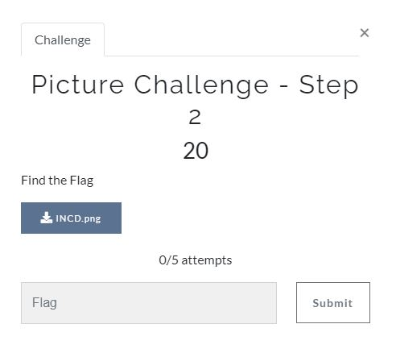
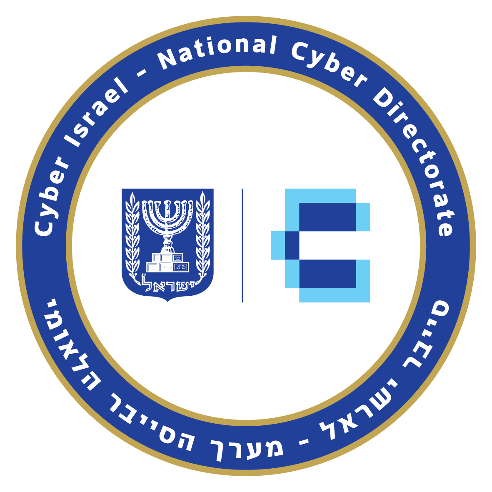
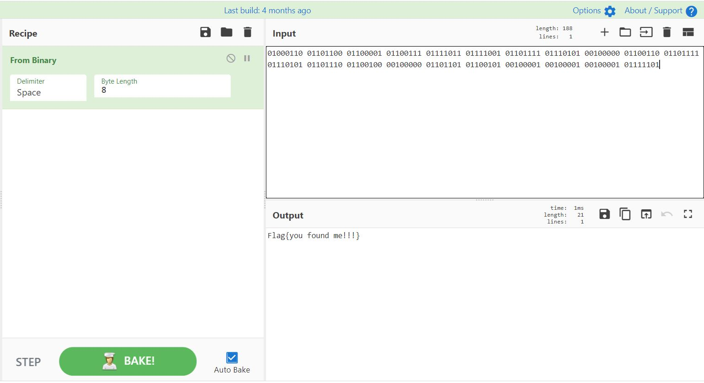

# CyberArk CTF 2021 - Writeups  - Picture Challenge - Step 2

Category: Junior Cyber Analyst, Points: 20



Attached file [INCD.png](INCD.png)

# Picture Challenge - Step 2  - Solution

By opening the attached file we get:



Nothing juicy, By using```strings``` we get the following:
```console
┌─[evyatar@parrot]─[/incd/junior_cyber_analyst/step-2_picture_challenge]
└──╼$ strings INCD.png
...
O8.>'
>.jiz
8Q7!
n~|;\|O
l\6N6.
"ZsHo
&Lh~S
Rq$-W
WJh{1
vmzY#
&o5[
F Zxz&
)._~
y4Yq
H/XV>/
l\:V
XiYx]"
>SoG
R+Ml
t",M
_Tad
lZ2FV.
Q:_b
Zn~mQ
oC^6
Li*!
Rv(:
Rv(:
Rv(:
Rv(:
Rv(:
IEND
01000110 01101100 01100001 01100111 01111011 01111001 01101111 01110101 00100000 01100110 01101111 01110101 01101110 01100100 00100000 01101101 01100101 00100001 00100001 00100001 0111110
```

As we can see the last line contains the following binary: ```01000110 01101100 01100001 01100111 01111011 01111001 01101111 01110101 00100000 01100110 01101111 01110101 01101110 01100100 00100000 01101101 01100101 00100001 00100001 00100001 0111110```.

We can simply convert the binary to ASCII by using [Cyber-Chef From Binary](https://gchq.github.io/CyberChef/#recipe=From_Binary('Space',8)&input=MDEwMDAxMTAgMDExMDExMDAgMDExMDAwMDEgMDExMDAxMTEgMDExMTEwMTEgMDExMTEwMDEgMDExMDExMTEgMDExMTAxMDEgMDAxMDAwMDAgMDExMDAxMTAgMDExMDExMTEgMDExMTAxMDEgMDExMDExMTAgMDExMDAxMDAgMDAxMDAwMDAgMDExMDExMDEgMDExMDAxMDEgMDAxMDAwMDEgMDAxMDAwMDEgMDAxMDAwMDEgMDExMTExMA) to get the flag:



And the flag is ```Flag{you found me!!!}```.