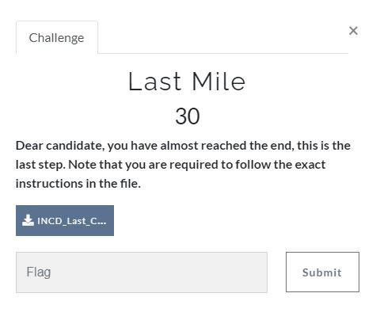

# CyberArk CTF 2021 - Writeups  - Last Mile 

Category: Junior Cyber Analyst, Points: 30



Attached file [INCD_Last_CH.py](INCD_Last_CH.py)

# Last Mile - Solution

Let's run the attached python file:
```python
┌─[evyatar@parrot]─[/incd/junior_cyber_analyst/last_mile]
└──╼$ python3 INCD_Last_CH.py 

 _____       _                 _____                   _ 
/  __ \     | |               |_   _|                 | |
| /  \/_   _| |__   ___ _ __    | | ___ _ __ __ _  ___| |
| |   | | | | '_ \ / _ \ '__|   | |/ __| '__/ _` |/ _ \ |
| \__/\ |_| | |_) |  __/ |     _| |\__ \ | | (_| |  __/ |
 \____/\__, |_.__/ \___|_|     \___/___/_|  \__,_|\___|_|
        __/ |                                            
       |___/       
       
Congratulations on Completing Your Challenge!

Please send your CV, the code '31/21' and your registered email to the challange via our Email address: cyberm@cyber.gov.il

Stay safe ;)
```

And we finish the challenge.