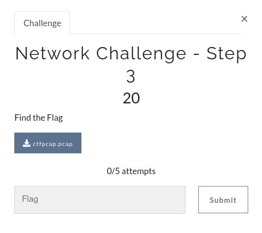
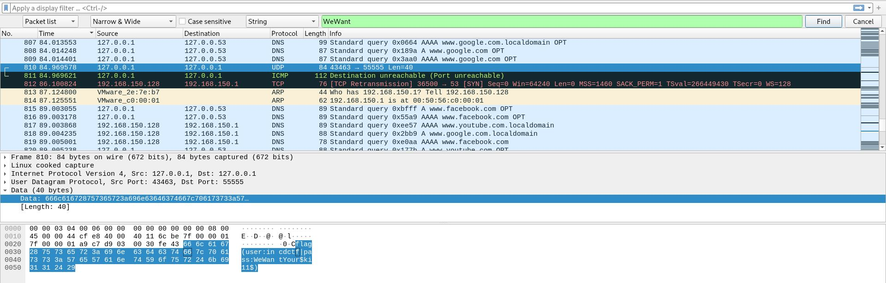

# CyberArk CTF 2021 - Writeups  - Network Challenge - Step 3

Category: Junior Cyber Analyst, Points: 20



Attached file [ctfpcap.pcap](ctfpcap.pcap)

# Network Challenge - Step 3  - Solution

We can solve this challenge in many diffrents ways, Let's look at three ways to do solve it.

1. Using ```strings``` to get the all strings from pcap:
```console
┌─[evyatar@parrot]─[/incd/junior_cyber_analyst/step-3_network_challenge]
└──╼$ strings ctfpcap.pcap
...
GF,@
google
SF-@
google
localdomain
SF.@
google
localdomain
GF/@
google
GF0@
google
Cflag(user:incdctf|pass:WeWantYour$ki11$)@
Cflag(user:incdctf|pass:WeWantYour$ki11$)A
facebook
facebook
youtube
localdomain
google
localdomain
facebook
youtube
...
```
By this way we need to remove some characters, the flag should be ```flag(user:incdctf|pass:WeWantYour$ki11$)``` (That's because we know the flag format).
 
 2. Using ```tshark``` - Extract data from field ```data.text``` and display it as text
```console
┌─[evyatar@parrot]─[/incd/junior_cyber_analyst/step-3_network_challenge]
└──╼$ tshark -T fields -e data.text -o data.show_as_text:TRUE -r ctfpcap.pcap | xargs
flag(user:incdctf|pass:WeWantYour$ki11$) flag(user:incdctf|pass:WeWantYour$ki11$)
```

3. By using ```wireshark```, Analyse the packets and we will find the flag on ```UDP``` packet:



