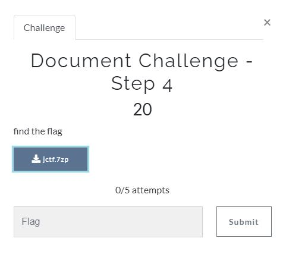
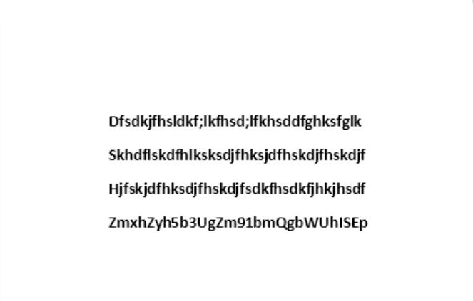

# CyberArk CTF 2021 - Writeups  - Document Challenge - Step 4

Category: Junior Cyber Analyst, Points: 20



Attached file [jctf.7zp ](jctf.7zp )

# Document Challenge - Step 4  - Solution

By analyzing the file type we can see It's Microsoft Word 2007:
```console
┌─[evyatar@parrot]─[/incd/junior_cyber_analyst/step-4_document_challenge]
└──╼$ file jctf.7zp 
jctf.7zp: Microsoft Word 2007+
```

Let's change the file extention from ```7zp``` to ```docx``` and open it online using [https://products.groupdocs.app/](https://products.groupdocs.app/).

By opening the file we can see document which contains the following strings:
```
Dfsdkjfhsldkf;lkfhsd;lfkhsddfghksfglk
Skhdflskdfhlksksdjfhksjdfhskdjfhskdjf
Hjfskjdfhksdjfhskdjfsdkfhsdkfjhkjhsdf
ZmxhZyh5b3UgZm91bmQgbWUhISEp
```



The last line looks like Base64, By decoding the last line we get the flag:
```console
┌─[evyatar@parrot]─[/incd/junior_cyber_analyst/step-4_document_challenge]
└──╼$ echo -n "ZmxhZyh5b3UgZm91bmQgbWUhISEp" | base64 -d
flag(you found me!!!)
```