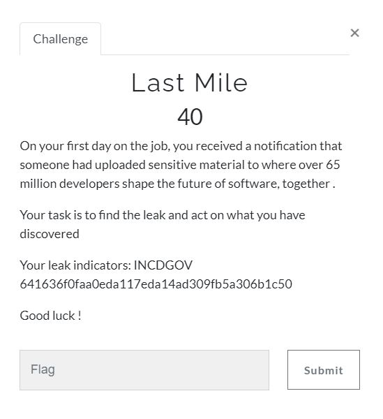
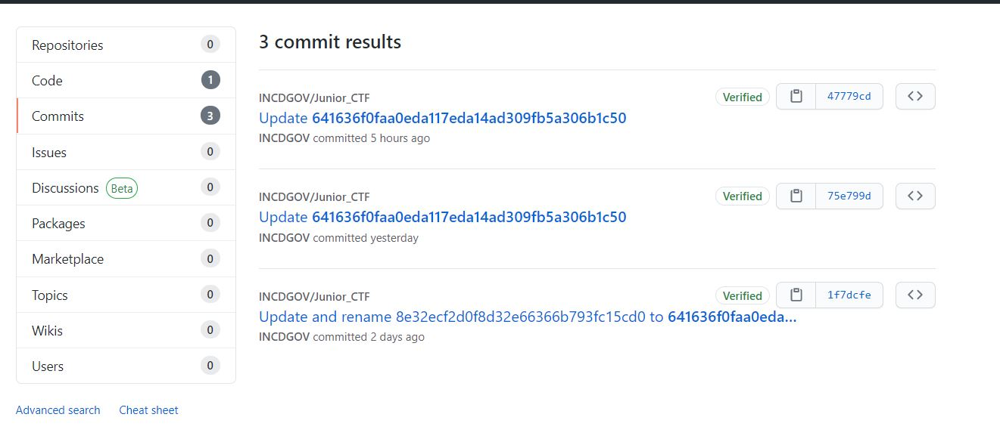
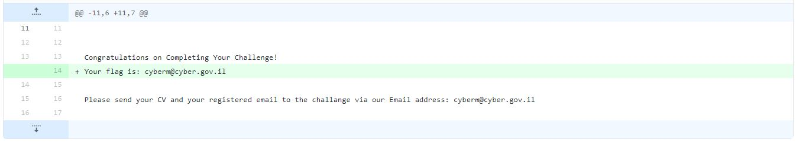

# CyberArk CTF 2021 - Writeups  - Last Mile 

Category: Junior Threat Intelligence Analyst, Points: 40




# Last Mile - Solution

We get hint from the challenge description:
>"... had uploaded sensitive material to where over 65 million developers shape the future of software..."

The place where over 65 milion developers shape the future is [Github](https://github.com/).

By searching the hash ```641636f0faa0eda117eda14ad309fb5a306b1c50``` in all Github we can see the following [commits](https://github.com/search?q=641636f0faa0eda117eda14ad309fb5a306b1c50&type=commits):



If we just click on the first commit we get the [following](https://github.com/INCDGOV/Junior_CTF/commit/47779cdbea3c4fe9b2e2dc0730cb89fb29293df3) which contains the flag:



And the flag is ```cyberm@cyber.gov.il```.