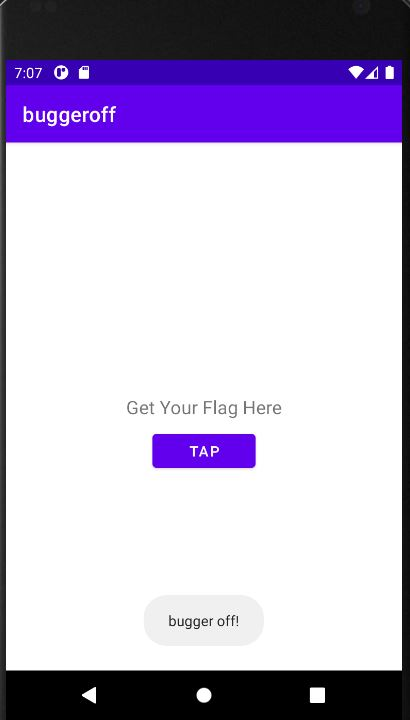

# Oh, Bugger - Matrix Cyber Labs CTF 2021
Mobile, 300 Points

## Description

*Hello agent,*
*Our field operatives managed to get their hands on a mobile device*
*thought to belong to an important asset.*
*The R&D department has narrowed their research down to a specific app,*
*which they believe contains important information.*

*Now it’s up to you to find a way to retrieve it.*
*Good luck!*

And attached file [(buggeroff.apk)](buggeroff.apk)

## Oh, Bugger Solution

First, Let's install the apk on Android emulator (API 30) using adb (Genymotion/Android Studio Emulator/...).

```console
┌─[evyatar@parrot]─[/media/shared/ctf/matrix/ohbugger]
└──╼ $ adb install buggeroff.apk
Performing Streamed Install
Success
```




If we will click on the TAP button we can see the toast "buffer off!".

Let's decompile the apk using jadx 

```console
┌─[evyatar@parrot]─[/media/shared/ctf/matrix/ohbugger]
└──╼ $ jadx --show-bad-code buggeroff.apk
```

First of all, I will search for the string "bugger off" to get the toast message and as you can see I found the string in the ```MainActivity``` class (com.w.buggeroff.MainActivity).

```java
public class MainActivity extends AppCompatActivity {
    String alg = "AES_256/CBC/PKCS7Padding";
    Button b;
    Cipher cipher;
    TextView t;

    public static boolean setOperation(int i) {
        return i == 1;
    }

    /* access modifiers changed from: protected */
    public void onCreate(Bundle bundle) {
        super.onCreate(bundle);
        setContentView((int) R.layout.activity_main);
        TextView textView = (TextView) findViewById(R.id.textView);
        this.t = textView;
        textView.setText(R.string.flagTextView);
        Button button = (Button) findViewById(R.id.button);
        this.b = button;
        button.setText(R.string.flagButton);
        this.b.setOnClickListener(new View.OnClickListener(getApplicationContext()) {
            public final /* synthetic */ Context f$1;

            {
                this.f$1 = r2;
            }

            public final void onClick(View view) {
                MainActivity.this.lambda$onCreate$0$MainActivity(this.f$1, view);
            }
        });
    }

    public /* synthetic */ void lambda$onCreate$0$MainActivity(Context context, View view) {
        if (!setOperation(0)) {
            Toast.makeText(context, "bugger off!", 0).show();
            return;
        }
        try {
            this.cipher = Cipher.getInstance(this.alg);
            byte[] key = GenerateKeys.getKey(context);
            this.cipher.init(2, new SecretKeySpec(Arrays.copyOfRange(key, 0, 32), this.alg), new IvParameterSpec(Arrays.copyOfRange(key, 48, 64)));
            this.cipher.doFinal(Base64.decode("iGWkBaxepj8l7BrKpeIntuEjRqHv3Tt41hRw7w+UwwcXTrlb/l9tELh9RflIpyDT", 0));
        } catch (InvalidAlgorithmParameterException | InvalidKeyException | NoSuchAlgorithmException | BadPaddingException | IllegalBlockSizeException | NoSuchPaddingException e) {
            e.printStackTrace();
        }
    }
}

```

If we observe the method ```lambda$onCreate$0$MainActivity```
This method call to the ```setOperation``` method with value 0.

After ```setOperation``` being called we can see the following code:
```java
try {
            this.cipher = Cipher.getInstance(this.alg);
            byte[] key = GenerateKeys.getKey(context);
            this.cipher.init(2, new SecretKeySpec(Arrays.copyOfRange(key, 0, 32), this.alg), new IvParameterSpec(Arrays.copyOfRange(key, 48, 64)));
            this.cipher.doFinal(Base64.decode("iGWkBaxepj8l7BrKpeIntuEjRqHv3Tt41hRw7w+UwwcXTrlb/l9tELh9RflIpyDT", 0));
        } catch (InvalidAlgorithmParameterException | InvalidKeyException | NoSuchAlgorithmException | BadPaddingException | IllegalBlockSizeException | NoSuchPaddingException e) {
            e.printStackTrace();
        }
```

It's initalize new cipher, call to static function (```GenerateKeys.getKey(context)```) to create the key and then make the decryption.

So we need to hook two functions to get the key:

1. ```setOperation``` - change the return value to True.
2. ```cipher.doFinal``` - to get the decryption flag.

Hooking methods can be done with Frida.

Now, Let's install [(frida-server for android)](https://github.com/frida/frida/releases)

After the installation we will start ```frida-server```:
```console
┌─[evyatar@parrot]─[/media/shared/ctf/matrix/ohbugger]
└──╼ $ adb push frida-server /data/local/tmp
frida-server: 1 file pushed. 102.1 MB/s (42925716 bytes in 0.401s)
┌─[evyatar@parrot]─[/media/shared/ctf/matrix/ohbugger]
└──╼ $ adb shell
generic_x86_arm:/ $ chmod +x /data/local/tmp/frida-server
generic_x86_arm:/ $ /data/local/tmp/frida-server &
[1] 6238
generic_x86_arm:/ #
```

Hook 1:
```setOperation``` method located on the following class: ```com.w.buggeroff.MainActivity```
So we need to create the following code:

```java
var buggeroff = Java.use("com.w.buggeroff.MainActivity");
    
    buggeroff.setOperation.overload("int").implementation = function(i) {
		console.log("setOperation => true");
		return true;
	};
```
We overload ```setOperation``` function to return true.

Hook2:
```doFinal``` method located on ```javax.crypto.Cipher``` so we will write code that overload ```doFinal``` method to get the decrypted string:
```java
    var cipher = Java.use("javax.crypto.Cipher");
    cipher.doFinal.overload('[B').implementation = function(b) {
		console.log("doFinal");
		var retVal = this.doFinal(b);
		var buffer = Java.array('byte', retVal);
		var result = "";
		for(var i = 0; i < buffer.length; ++i){
			result+= (String.fromCharCode(buffer[i]));
		}
		console.log("Flag: " + result);
		return retVal;
	};
```
So let's write everything together:
```javascript
Java.perform(function() {

    var buggeroff = Java.use("com.w.buggeroff.MainActivity");
    var cipher = Java.use("javax.crypto.Cipher");

    buggeroff.setOperation.overload("int").implementation = function(i) {
		console.log("setOperation => true");
		return true;
	};
	
	cipher.doFinal.overload('[B').implementation = function(b) {
		console.log("doFinal");
		var retVal = this.doFinal(b);
		var buffer = Java.array('byte', retVal);
		var result = "";
		for(var i = 0; i < buffer.length; ++i){
			result+= (String.fromCharCode(buffer[i]));
		}
		console.log("Flag: " + result);
		return retVal;
	};

}, 0);
```

We will save the code as buggeroff.js and run it:
```console
┌─[evyatar@parrot]─[/media/shared/ctf/matrix/ohbugger]
└──╼ $ frida -U -f com.w.buggeroff -l buggeroff.js --no-pause
     ____
    / _  |   Frida 14.2.12 - A world-class dynamic instrumentation toolkit
   | (_| |
    > _  |   Commands:
   /_/ |_|       help      -> Displays the help system
   . . . .       object?   -> Display information about 'object'
   . . . .       exit/quit -> Exit
   . . . .
   . . . .   More info at https://www.frida.re/docs/home/
Spawned `com.w.buggeroff`. Resuming main thread!
[Android Emulator 5554::com.w.buggeroff]->  #At this step I just click on TAP button
[Android Emulator 5554::com.w.buggeroff]-> 
setOperation => true
doFinal
Flag: MCL{0Bfu5Ca7in9_4nDro1D_No_5tR1Ng5_A7t4ch3d}
```


NOTE:

You can solve this challange without Frida:

1. Create android emulator and install buggeroff.apk.
2. Create android application and implement the method ```GenerateKeys```:

```java
public static byte[] getKey(Context context) {
        String str = "";
        try {
            for (Signature byteArray : context.getPackageManager().getPackageInfo(BuildConfig.APPLICATION_ID, 134217728).signingInfo.getApkContentsSigners()) {
                MessageDigest instance = MessageDigest.getInstance("SHA-384");
                instance.update(byteArray.toByteArray());
                str = Base64.encodeToString(instance.digest(), 0, instance.getDigestLength(), 2);
            }
        } catch (PackageManager.NameNotFoundException | NoSuchAlgorithmException e) {
            e.printStackTrace();
        }
        return str.getBytes();
    }

```

Modify part of ```lambda$onCreate$0$MainActivity```
```java
public void buggerMainActivity(Context context) {
        
        try {
            this.cipher = Cipher.getInstance("AES_256/CBC/PKCS7Padding");
            byte[] key = GenerateKeys.getKey(context);
            this.cipher.init(2, new SecretKeySpec(Arrays.copyOfRange(key, 0, 32), this.alg), new IvParameterSpec(Arrays.copyOfRange(key, 48, 64)));
            this.cipher.doFinal(Base64.decode("iGWkBaxepj8l7BrKpeIntuEjRqHv3Tt41hRw7w+UwwcXTrlb/l9tELh9RflIpyDT", 0)); 
        } catch (Exception e) {
            e.printStackTrace();
        }
    }
```

And convert the bytes from doFinal to string to get the flag.