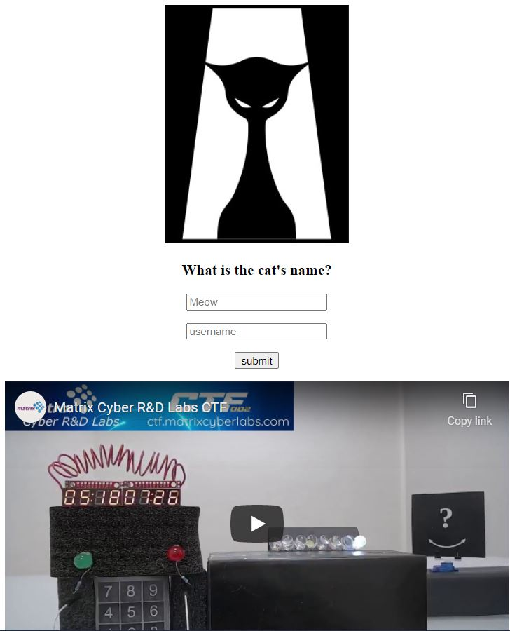
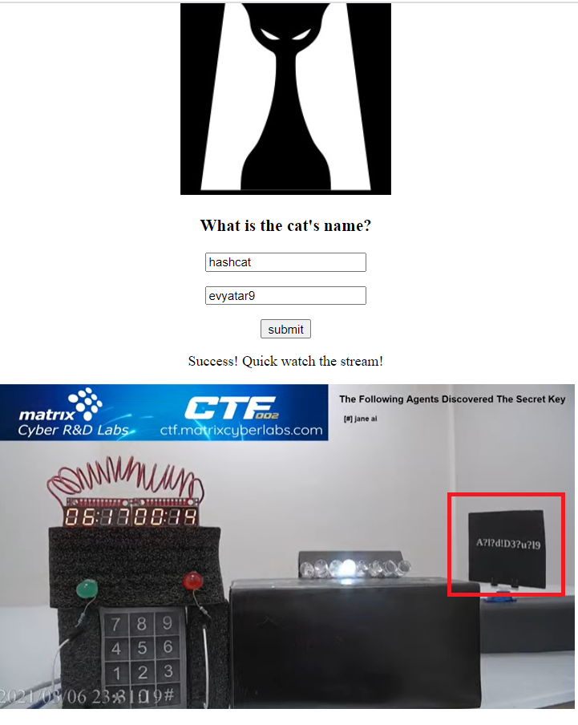
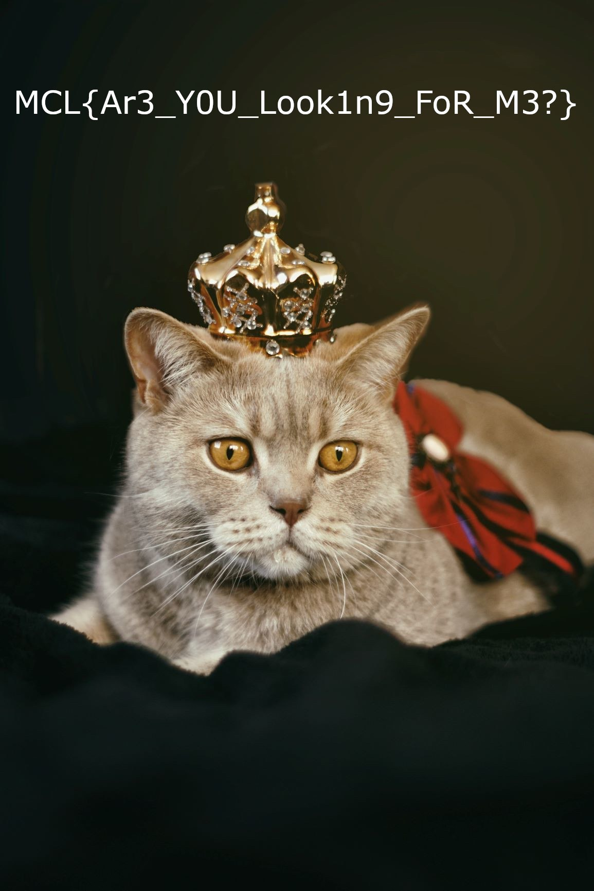

# RoyalCat - Matrix Cyber Labs CTF 2021
Reversing, 400 Points

## Description

*Hello agent!*

*The Queen's royal cat is missing from the grounds.*
*Your mission is to find and bring him home safely.*

*Hint : You should have a look in the ctfroom. [(LINK)](https://ctfroom.matrixcyberlabs.com/servo)*

And attached file [Meow](Meow)
## RoyalCat Solution

First, Let's try to run the attached file 'Meow'.
```console
┌─[evyatar@parrot]─[/media/shared/ctf/matrix/RoyalCat]
└──╼ $ ./Meow
Meow Meow...
Error opening file: No such file or directory
```

Seems like It's looking for another file.

When I'm trying to open the binary using Ghidra It's looks like It's packed.

Using ```string``` I found that its UPX packer.

```console
┌─[evyatar@parrot]─[/media/shared/ctf/matrix/RoyalCat]
└──╼ $ strings Meow
....

 /6''
Vfv''''
p?$I
USQRH
W^YH
PROT_EXEC|PROT_WRITE failed.
$Info: This file is packed with the UPX executable packer http://upx.sf.net $
$Id: UPX 3.96 Copyright (C) 1996-2020 the UPX Team. All Rights Reserved. $
_j<X
RPI)
WQM)
j"AZR^j
Y^_]j

....

```
We can see that It's "packed" with UPX, So let's unpack it.

```console
┌─[evyatar@parrot]─[/media/shared/ctf/matrix/RoyalCat]
└──╼ $ upx -d Meow -o unpMeow
                       Ultimate Packer for eXecutables
                          Copyright (C) 1996 - 2017
UPX 3.94        Markus Oberhumer, Laszlo Molnar & John Reiser   May 12th 2017

        File size         Ratio      Format      Name
   --------------------   ------   -----------   -----------
   2101968 <-    969180   46.11%   linux/amd64   unpMeow

Unpacked 1 file.
```

Now, Let's try again to open "unpMeow" (the file that we extracted) using Ghidra.


NOTE: I choose to analyse the file without "Stack" options on Ghidra analyse because the main function contains a lot of instructions (that I will elaborate more later).

Let's look on main function:
```asm
                             *************************************************************
                             *                           FUNCTION                          
                             *************************************************************
                             undefined  main ()
             undefined         AL:1           <RETURN>
                             main                                            XREF[4]:     Entry Point (*) , 
                                                                                          _start:001010fd (*) , 002ff0f0 , 
                                                                                          002ff1b8 (*)   
        00101296 55              PUSH       RBP
        00101297 48  89  e5       MOV        RBP , RSP
        0010129a 48  81  ec       SUB        RSP , 0xcbb00
        001012a1 b9  00  00       MOV        ECX , 0x0
        001012a6 ba  01  00       MOV        EDX , 0x1
        001012ab be  00  00       MOV        ESI , 0x0
        001012b0 bf  00  00       MOV        EDI , 0x0
        001012b5 b8  00  00       MOV        EAX , 0x0
        001012ba e8  e1  fd       CALL       ptrace                                           ; long ptrace(__ptrace_request _
        001012bf 48  83  f8  ff    CMP        RAX , -0x1
        001012c3 75  16           JNZ        LAB_001012db
        001012c5 48  8d  3d       LEA        RDI , [s_I'm_being_debugged!_002ff008 ]           ; = "I'm being debugged!"
        001012cc e8  5f  fd       CALL       puts                                             ; int puts(char * __s)
        001012d1 b8  01  00       MOV        EAX , 0x1
        001012d6 e9  16  d9       JMP        LAB_002febf1
                             LAB_001012db                                    XREF[1]:     001012c3 (j)   
        001012db 48  8d  3d       LEA        RDI , [s_Meow_Meow..._002ff01c ]                  ; = "Meow Meow..."
        001012e2 e8  49  fd       CALL       puts                                             ; int puts(char * __s)
        001012e7 c7  45  f8       MOV        dword ptr [RBP  + -0x8 ], 0x0
        001012ee 48  8d  35       LEA        RSI , [DAT_002ff029 ]                             ; = 72h    r
        001012f5 48  8d  3d       LEA        RDI , [s_RoyalCat_002ff02b ]                      ; = "RoyalCat"
        001012fc e8  af  fd       CALL       fopen                                            ; FILE * fopen(char * __filename
        00101301 48  89  45  f0    MOV        qword ptr [RBP  + -0x10 ], RAX
        00101305 48  83  7d       CMP        qword ptr [RBP  + -0x10 ], 0x0
        0010130a 75  16           JNZ        LAB_00101322
        0010130c 48  8d  3d       LEA        RDI , [s_Error_opening_file_002ff034 ]            ; = "Error opening file"
        00101313 e8  a8  fd       CALL       perror                                           ; void perror(char * __s)
        00101318 b8  ff  ff       MOV        EAX , 0xffffffff
        0010131d e9  cf  d8       JMP        LAB_002febf1

.....
```
We can see that on 0x001012fc ```fopen``` called as ```fopen("RoyalCat",'r')``` - Means we need RoyalCat file near unpMeow, So let's create this file.

```console
┌─[evyatar@parrot]─[/media/shared/ctf/matrix/RoyalCat]
└──╼ $ echo "meow" > RoyalCat
┌─[evyatar@parrot]─[/media/shared/ctf/matrix/RoyalCat]
└──╼ $ ./unpMeow
Meow Meow...
```

We need to look what happend on RoyalCat file, Let's try to analyze the code:
```asm
                                 *************************************************************
                             *                           FUNCTION                          
                             *************************************************************
                             undefined  main ()
             undefined         AL:1           <RETURN>
                             main                                            XREF[4]:     Entry Point (*) , 
                                                                                          _start:001010fd (*) , 002ff0f0 , 
                                                                                          002ff1b8 (*)   
																										
        00101296 55              PUSH       RBP
        00101297 48  89  e5       MOV        RBP , RSP
        0010129a 48  81  ec       SUB        RSP , 0xcbb00
        001012a1 b9  00  00       MOV        ECX , 0x0
        001012a6 ba  01  00       MOV        EDX , 0x1
        001012ab be  00  00       MOV        ESI , 0x0
        001012b0 bf  00  00       MOV        EDI , 0x0
        001012b5 b8  00  00       MOV        EAX , 0x0
        001012ba e8  e1  fd       CALL       ptrace                                           ; long ptrace(__ptrace_request _
        001012bf 48  83  f8  ff    CMP        RAX , -0x1
        001012c3 75  16           JNZ        LAB_001012db
        001012c5 48  8d  3d       LEA        RDI , [s_I'm_being_debugged!_002ff008 ]           ; = "I'm being debugged!"
        001012cc e8  5f  fd       CALL       puts                                             ; int puts(char * __s)
        001012d1 b8  01  00       MOV        EAX , 0x1
        001012d6 e9  16  d9       JMP        LAB_002febf1
```

The code above check for anti debug using ```PTRACE``` (001012ba).
We can bypass it using the following: [PTRACE Bypass](https://0x00sec.org/t/bypass-linux-basic-anti-debugging/22799) 

NOTE: this tutorial contains broken github link, use the following instead [bypass.py](https://github.com/0x00fy/Linux-Anti-Analysis-Bypass/tree/main/antiptrace)

Let's observe the following code:

```asm
                             LAB_001012db                                    XREF[1]:     001012c3 (j)   
        001012db 48  8d  3d       LEA        RDI , [s_Meow_Meow..._002ff01c ]                  ; = "Meow Meow..."
        001012e2 e8  49  fd       CALL       puts                                             ; int puts(char * __s)
        001012e7 c7  45  f8       MOV        dword ptr [RBP  + -0x8 ], 0x0
        001012ee 48  8d  35       LEA        RSI , [DAT_002ff029 ]                             ; = 72h    r
        001012f5 48  8d  3d       LEA        RDI , [s_RoyalCat_002ff02b ]                      ; = "RoyalCat"
        001012fc e8  af  fd       CALL       fopen                                            ; FILE * fopen(char * __filename
        00101301 48  89  45  f0    MOV        qword ptr [RBP  + -0x10 ], RAX
        00101305 48  83  7d       CMP        qword ptr [RBP  + -0x10 ], 0x0
        0010130a 75  16           JNZ        LAB_00101322
        0010130c 48  8d  3d       LEA        RDI , [s_Error_opening_file_002ff034 ]            ; = "Error opening file"
        00101313 e8  a8  fd       CALL       perror                                           ; void perror(char * __s)
        00101318 b8  ff  ff       MOV        EAX , 0xffffffff
        0010131d e9  cf  d8       JMP        LAB_002febf1
```
It's trying to open RoyalCat file using ```fopen``` (001012fc)

```asm
								LAB_00101322                                    XREF[1]:     0010130a (j)   
        00101322 83  7d  f8  00    CMP        dword ptr [RBP  + -0x8 ], 0x0
        00101326 0f  84  c0       JZ         LAB_002febec
        0010132c 48  8b  45  f0    MOV        RAX , qword ptr [RBP  + -0x10 ]  # RBP-0x10 is the RoyalCat file descriptor
        00101330 ba  02  00       MOV        EDX , 0x2
        00101335 be  00  00       MOV        ESI , 0x0
        0010133a 48  89  c7       MOV        RDI , RAX
        0010133d e8  4e  fd       CALL       fseek                                            ; int fseek(FILE * __stream, lon
        00101342 48  8b  45  f0    MOV        RAX , qword ptr [RBP  + -0x10 ]
        00101346 48  89  c7       MOV        RDI , RAX
        00101349 e8  22  fd       CALL       ftell                                            ; long ftell(FILE * __stream)
        0010134e 89  45  ec       MOV        dword ptr [RBP  + -0x14 ], EAX
```
This part put on ```RBP-0x14``` the size of RoyalCat by calling ```fseek(fp /*RBP-0x10*/,0 /*offset*/ ,2 /*whence*/)``` (0010133d)

```asm
        00101351 48  8b  45  f0    MOV        RAX , qword ptr [RBP  + -0x10 ]
        00101355 ba  00  00       MOV        EDX , 0x0
        0010135a be  00  00       MOV        ESI , 0x0
        0010135f 48  89  c7       MOV        RDI , RAX
        00101362 e8  29  fd       CALL       fseek                                            ; int fseek(FILE * __stream, lon
```
This part seek again to 0 by calling ```fseek(fp /*RBP-0x10*/,0 /*offset*/ ,0 /*whence*/)```

Now the intersting part :)

The following code memset buffer on address ```rbp-0xcbb00``` by calling ```memset($rax /*rbp-0xcbb00, 0, 0xcbae0)``` (90010137b)

```asm
		---This part initialize buffer with 0 by calling memset 0 on RBP-0xcbb00 
        00101367 48  8d  85       LEA        RAX , [RBP  + -0xcbb00 ]
        0010136e ba  e0  ba       MOV        EDX , 0xcbae0
        00101373 be  00  00       MOV        ESI , 0x0
        00101378 48  89  c7       MOV        RDI , RAX
        0010137b e8  d0  fc       CALL       memset                                           ; void * memset(void * __s, int 
```

Now it will copy a lot of bytes to this buffer located on ```rbp-0x0xcbb00```:

```asm		
		----This part copy values to RBP-0xcbb00
        00101380 c7  85  00       MOV        dword ptr [RBP  + -0xcbb00 ], 0x238
        0010138a c7  85  04       MOV        dword ptr [RBP  + -0xcbafc ], 0x1d4
        00101394 c7  85  08       MOV        dword ptr [RBP  + -0xcbaf8 ], 0x2b8
        0010139e c7  85  0c       MOV        dword ptr [RBP  + -0xcbaf4 ], 0x154
        001013a8 c7  85  10       MOV        dword ptr [RBP  + -0xcbaf0 ], 0x118
        001013b2 c7  85  14       MOV        dword ptr [RBP  + -0xcbaec ], 0x80
        001013bc c7  85  18       MOV        dword ptr [RBP  + -0xcbae8 ], 0x17c
        001013c6 c7  85  1c       MOV        dword ptr [RBP  + -0xcbae4 ], 0x96
		......
		002fe26e c7  85  2c       MOV        dword ptr [RBP  + -0x1d4 ], 0xa0
        002fe278 c7  85  30       MOV        dword ptr [RBP  + -0x1d0 ], 0x1f4
        002fe282 c7  85  34       MOV        dword ptr [RBP  + -0x1cc ], 0x1da
        002fe28c c7  85  38       MOV        dword ptr [RBP  + -0x1c8 ], 0x170
        002fe296 c7  85  3c       MOV        dword ptr [RBP  + -0x1c4 ], 0x1ac
        002fe2a0 c7  85  40       MOV        dword ptr [RBP  + -0x1c0 ], 0x4e0
        002fe2aa c7  85  44       MOV        dword ptr [RBP  + -0x1bc ], 0x8e
	    002fe2b4 c7  85  48       MOV        dword ptr [RBP  + -0x1b8 ], 0x2ec
        002fe2be c7  85  4c       MOV        dword ptr [RBP  + -0x1b4 ], 0x1ca
```

After copying the values into the buffer we can see that the code copy values to ```rbp-0x4``` and call ```LAB_002feb94``` (002fe2c8,002fe2cf)

```asm
        002fe2c8 c7  45  fc       MOV        dword ptr [RBP  + -0x4 ], 0x32e54
        002fe2cf e9  c0  08       JMP        LAB_002feb94
                             LAB_002fe2d4                                    XREF[1]:     002feb9a (j)   
        002fe2d4 81  7d  fc       CMP        dword ptr [RBP  + -0x4 ], 0x32e53
        002fe2db 0f  8e  9d       JLE        LAB_002feb7e
        002fe2e1 81  7d  fc       CMP        dword ptr [RBP  + -0x4 ], 0x32e54
        002fe2e8 0f  8e  89       JLE        LAB_002feb77
        002fe2ee 81  7d  fc       CMP        dword ptr [RBP  + -0x4 ], 0x32e55
        002fe2f5 0f  8e  75       JLE        LAB_002feb70
        002fe2fb 81  7d  fc       CMP        dword ptr [RBP  + -0x4 ], 0x32e56
        002fe302 0f  8e  61       JLE        LAB_002feb69
		.....
```
Where ```LAB_002feb94``` compare ```rbp-0x4``` with ```rbp-0x14``` (002feb9a).
We know that ```rbp-0x14``` is the RoyalCat file size.
```asm
								LAB_002feb94                                    XREF[1]:     002fe2cf (j)   
        002feb94 8b  45  fc       MOV        EAX , dword ptr [RBP  + -0x4 ]
        002feb97 3b  45  ec       CMP        EAX , dword ptr [RBP  + -0x14 ]
        002feb9a 0f  8c  34       JL         LAB_002fe2d4

```
the rest of code comparing the file size and append byte by the following:
```asm
        002fe7cc b8  96  00       MOV        EAX , 0x96
        002fe7d1 e9  ad  03       JMP        LAB_002feb83
                             LAB_002fe7d6                                    XREF[1]:     002fe7ca (j)   
        002fe7d6 b8  40  01       MOV        EAX , 0x140
        002fe7db e9  a3  03       JMP        LAB_002feb83
                             LAB_002fe7e0                                    XREF[1]:     002fe7c1 (j)   
        002fe7e0 b8  9c  00       MOV        EAX , 0x9c
        002fe7e5 e9  99  03       JMP        LAB_002feb83
....
```

After that all the buffer being copied in addition to the file size check we can see that:
1. ```rbp-0xcbb00``` - buffer
2. ```rbp-0x14``` - file size
3. ```rbp-0x4``` - Contains the "guess" of the file size
4. ```rbp-0x10``` - FILE DESCRIPTOR

If It's found the right file size (0x32E54) in ```rbp-0x4``` it's called to ```validate(fp /* [rbp-0x10] */, [rbp-0xcbb00]/* Buffer */)```  function.

```asm
        002feba0 48  8d  95       LEA        RDX , [RBP  + -0xcbb00 ]
        002feba7 48  8b  45  f0    MOV        RAX , qword ptr [RBP  + -0x10 ]
        002febab 48  89  d6       MOV        RSI , RDX
        002febae 48  89  c7       MOV        RDI , RAX
        002febb1 e8  0f  26       CALL       validate    
```

After calling to ```validate``` function the code checks the returned value from validate (002febb8):

```asm
        002febb6 85  c0           TEST       EAX , EAX
        002febb8 74  1f           JZ         LAB_002febd9
        002febba 48  8d  3d       LEA        RDI , [s_It_seems_you_have_got_an_interes_002ff  ; = "It seems you have got an in
        002febc1 e8  6a  24       CALL       puts                                             ; int puts(char * __s)
        002febc6 48  8d  3d       LEA        RDI , [s_Maybe_you_should_look_at_the_CTF_002ff  ; = "Maybe you should look at th
        002febcd e8  5e  24       CALL       puts                                             ; int puts(char * __s)
        002febd2 b8  00  00       MOV        EAX , 0x0
        002febd7 eb  18           JMP        LAB_002febf1
                             LAB_002febd9                                    XREF[1]:     002febb8 (j)   
        002febd9 48  8d  3d       LEA        RDI , [s_I_think_you_are_missing_somethin_002ff  ; = "I think you are missing som
        002febe0 e8  4b  24       CALL       puts                                             ; int puts(char * __s)
        002febe5 b8  00  00       MOV        EAX , 0x0
        002febea eb  05           JMP        LAB_002febf1
                             LAB_002febec                                    XREF[1]:     00101326 (j)   
        002febec b8  00  00       MOV        EAX , 0x0
                             LAB_002febf1                                    XREF[4]:     001012d6 (j) , 0010131d (j) , 
                                                                                          002febd7 (j) , 002febea (j)   
        002febf1 c9              LEAVE
        002febf2 c3              RET


```

We can see that we need to get returned value as 1 from validate function (002febb6).

Let's look on the validate function using Ghidra:

```c
undefined8 validate(FILE *param_1,long param_2)

{
  int iVar1;
  int iVar2;
  uint uStack12;
  
  uStack12 = 0;
  while( true ) {
    iVar1 = fgetc(param_1);
    iVar2 = feof(param_1);
    if (iVar2 != 0) {
      fclose(param_1);
      return 1;
    }
    if (((uStack12 & 1) == 0) &&
       (((iVar1 + 0x45) * 4 ^ 100U) != *(uint *)(param_2 + (long)(int)uStack12 * 4))) break;
    if (((uStack12 - ((int)uStack12 >> 0x1f) & 1) + ((int)uStack12 >> 0x1f) == 1) &&
       (((iVar1 + 0x62) * 2 ^ 0x52U) != *(uint *)(param_2 + (long)(int)uStack12 * 4))) {
      return 0;
    }
    uStack12 = uStack12 + 1;
  }
  return 0;
}
```

This function,```validate```, takes two arguments; 
1. ```param_1``` which is fp to RoyalCat file
2. ```param_2```	 which point to the "buffer".

As you can see we need to find the file that contains bytes that matches according to the if statements in ```validate``` function.

we will start by getting all the buffer bytes using ```objdump```, ```grep```, ```cut```.

```console
┌─[evyatar@parrot]─[/media/shared/ctf/matrix/RoyalCat]
└──╼ $ objdump -D unpMeow -M intel |  grep DWORD | grep mov | grep rbp | cut -d '[' -f2 | cut -d '-' -f2 | cut -d ',' -f2 > bytes.cat
```
Let's explain the command.
The first part of the command above get all lines contains DWORD,mov, rbp, example:
```console
┌─[evyatar@parrot]─[/media/shared/ctf/matrix/RoyalCat]
└──╼ $ objdump -D unpMeow -M intel |  grep DWORD | grep mov | grep rbp | less
            1380:       c7 85 00 45 f3 ff 38    mov    DWORD PTR [rbp-0xcbb00],0x238
```
Then we split the text by ```[``` , ```-``` , ```,``` using ```cut``` and finally we got the following file:

```console
┌─[evyatar@parrot]─[/media/shared/ctf/matrix/RoyalCat]
└──╼ $ less dword
rdi+rbp*2+0x73]
rbp+0x0]
0x0
eax
0x4]
0x8]
0x4]
0x4]
0x8]
0x4]
0x0
eax
0x238
0x1d4
0x2b8
0x154
0x118
0x80
0x17c
...
```

We need to remove the first 12 lines (because we know the first byte of the buffer is 0x238 and the last byte is 0x1ca).
```asm
        00101380 c7  85  00       MOV        dword ptr [RBP  + -0xcbb00 ], 0x238
        0010138a c7  85  04       MOV        dword ptr [RBP  + -0xcbafc ], 0x1d4
        00101394 c7  85  08       MOV        dword ptr [RBP  + -0xcbaf8 ], 0x2b8
		...
		002fe2a0 c7  85  40       MOV        dword ptr [RBP  + -0x1c0 ], 0x4e0
        002fe2aa c7  85  44       MOV        dword ptr [RBP  + -0x1bc ], 0x8e
        002fe2b4 c7  85  48       MOV        dword ptr [RBP  + -0x1b8 ], 0x2ec
        002fe2be c7  85  4c       MOV        dword ptr [RBP  + -0x1b4 ], 0x1ca

```

So If we look again on ```bytes.cat``` file:

```console
┌─[evyatar@parrot]─[/media/shared/ctf/matrix/RoyalCat]
└──╼ $ less dword
0x238
0x1d4
0x2b8
0x154
0x118
0x80
0x17c
0x96
0x43c
0x238
0x260
...
0x1f4
0x1da
0x170
0x1ac
0x4e0
0x8e
0x2ec
0x1ca
```

So now when we know how ```validate``` function works, and what is the buffer - we can write simple code that make "brute force" to guess the right bytes:

```c
int main()
{
	int buffer[] = { <OUR HEX BUFFER from dword splited by ,> }; 
	int index = 0;
	int uStack12 = 0;
	ofstream file("RoyalCat", ios::binary);

	while (uStack12 < 208569)
	{
		for (int iVar1 = 0; iVar1 < 256; iVar1++)
		{
			if (((uStack12 & 1) == 0) &&
				(((iVar1 + 0x45) * 4 ^ 100U) == (buffer[uStack12])))
			{
				file.write((char*)&iVar1, sizeof(char));
			}
			if (((uStack12 - (uStack12 >> 0x1f) & 1) + (uStack12 >> 0x1f) == 1) &&
				(((iVar1 + 0x62) * 2 ^ 0x52U) == (buffer[uStack12]))) {
				file.write((char*)&iVar1, sizeof(char));
			}
			
			
		}
		uStack12++;
	}
	
	file.close();
	
	return 0;
}
```

After running the code above we get RoyalCat file:

```console
─[✗]─[evyatar@parrot]─[/media/shared/ctf/matrix/RoyalCat]
└──╼ $file RoyalCat
RoyalCat: RAR archive data, v5
```

Let's try to unrar RoyalCat:
```console
┌─[evyatar@parrot]─[/media/shared/ctf/matrix/RoyalCat]
└──╼ $unrar x RoyalCat

UNRAR 5.61 beta 1 freeware      Copyright (c) 1993-2018 Alexander Roshal


Extracting from RoyalCat

Enter password (will not be echoed) for Meow.jpeg: 

```

So according Ghidra, we know If ```validate``` function returned 1 we got the following output:

"It seems you have got an interesting file..."
"Maybe you should look at the CTFRoom !"

So Let's look on the [CTFRoom](https://ctfroom.matrixcyberlabs.com/servo):




We need to fill cat name and username.

Username is my ctf username which is ```evyatar9```, and cat name? oh.. If we have rar file with password and we need to crack it, which tool we can use? ```hashcat``` :D

So - cat name is hashcat.

Let's try to insert those credenials:




And as we can see in the picture this is ```hashcat``` rule, So let's create dictionary using this rule:
```console
┌─[evyatar@parrot]─[/media/shared/ctf/matrix/RoyalCat]
└──╼ $hashcat --stdout -a 3 'A?l?d!D3?u?l9' > dict.txt
```

Now, we need to use ```rar2john``` to get the hash from rar file:
```console
┌─[evyatar@parrot]─[/media/shared/ctf/matrix/RoyalCat]
└──╼ $rar2john RoyalCat > hash
┌─[evyatar@parrot]─[/media/shared/ctf/matrix/RoyalCat]
└──╼ $cat hash
RoyalCat:$rar5$16$dd0d97236c58b730c8fd7c4d85c653f2$15$6af89efb4eb5dab620c901e4e8f2141b$8$907d86ab9b525ba2
```

And finally we can use ```hashcat``` to get the rar password:

```console
┌─[evyatar@parrot]─[/media/shared/ctf/matrix/RoyalCat]
└──╼ $hashcat -m 13000 -a 0 \$rar5\$16\$dd0d97236c58b730c8fd7c4d85c653f2\$15\$6af89efb4eb5dab620c901e4e8f2141b\$8\$907d86ab9b525ba2 dict.txt
hashcat (v6.1.1) starting...

Minimum password length supported by kernel: 0
Maximum password length supported by kernel: 256

Hashes: 1 digests; 1 unique digests, 1 unique salts
Bitmaps: 16 bits, 65536 entries, 0x0000ffff mask, 262144 bytes, 5/13 rotates
Rules: 1

Applicable optimizers applied:
* Zero-Byte
* Single-Hash
* Single-Salt
* Slow-Hash-SIMD-LOOP

Watchdog: Hardware monitoring interface not found on your system.
Watchdog: Temperature abort trigger disabled.

Host memory required for this attack: 65 MB

Dictionary cache built:
* Filename..: dict.txt
* Passwords.: 175760
* Bytes.....: 1757600
* Keyspace..: 175760
* Runtime...: 0 secs

[s]tatus [p]ause [b]ypass [c]heckpoint [q]uit => s

Session..........: hashcat
Status...........: Running
Hash.Name........: RAR5
Hash.Target......: $rar5$16$dd0d97236c58b730c8fd7c4d85c653f2$15$6af89e...525ba2
Time.Started.....: Sat Mar  6 22:11:42 2021 (7 secs)
Time.Estimated...: Sat Mar  6 22:14:04 2021 (2 mins, 15 secs)
Guess.Base.......: File (dict.txt)
Guess.Queue......: 1/1 (100.00%)
Speed.#1.........:     1230 H/s (5.96ms) @ Accel:128 Loops:512 Thr:1 Vec:8
Recovered........: 0/1 (0.00%) Digests
Progress.........: 9216/175760 (5.24%)
Rejected.........: 0/9216 (0.00%)
Restore.Point....: 9216/175760 (5.24%)
Restore.Sub.#1...: Salt:0 Amplifier:0-1 Iteration:24576-25088
Candidates.#1....: At4!D3Te9 -> Ar4!D3El9

```

After few seconds we can get the password:
```console
┌─[evyatar@parrot]─[/media/shared/ctf/matrix/RoyalCat]
└──╼ $hashcat -m 13000 -a 0 \$rar5\$16\$dd0d97236c58b730c8fd7c4d85c653f2\$15\$6af89efb4eb5dab620c901e4e8f2141b\$8\$907d86ab9b525ba2 dict.txt --show

$rar5$16$dd0d97236c58b730c8fd7c4d85c653f2$15$6af89efb4eb5dab620c901e4e8f2141b$8$907d86ab9b525ba2:An7!D3Bu9
```

And we can get the flag from Meow.jpeg file:

