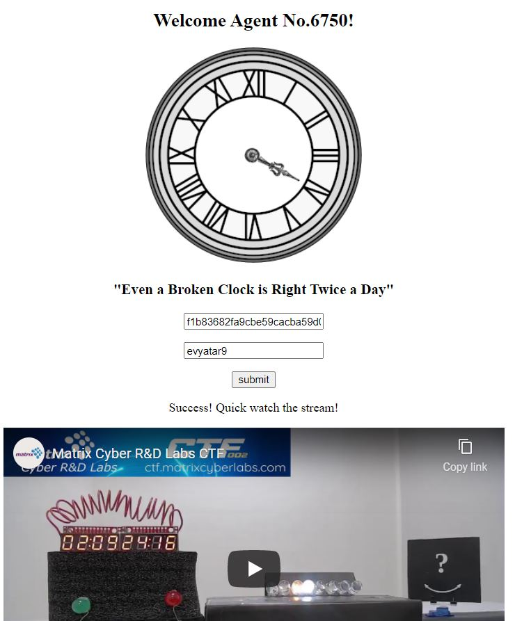

# Secret Key - Matrix Cyber Labs CTF 2021
Crypto, 300 Points

## Description

*Our intelligence intercepted an encrypted message.*

*Put your skills to use, retrieve the secret key and decrypt the message. We know the secret key had been divided* *amongst five entities. The original key can only be recovered, when at least three of the entities get together.*

*Entity_1: 9362e50f3be0a411a75b55086b9b34f796dbeef58c498edcc185e3a3dc0bf905*

*Entity_2: c58c3821a12d58e854922d0b3856ebf01692bbca7b9637cebb4e2cc6934859c*

*Entity_3: 6ae19b589a96947699c96958d7bead57315fecd84cec3c3a4958a316b263575b*

*Entity_4: aefd6c92bd6be0c9e4dc28a0d846f0c026c032487be21914da712482b7986d19*

*Entity_5: d8ac37308292ba88668160a8b51e38f9e189fc0d349afa0c9efe671078d3c6d6*

*Hint : You should have a look in the ctfroom. [LINK](https://ctfroom.matrixcyberlabs.com/leds)*

And attached file [enc.txt](enc.txt)
## Secret Key Solution

So according the challenge description we know It's Shamir's Secret Sharing.

*Shamir's Secret Sharing is an algorithm in cryptography created by Adi Shamir. It is a form of secret sharing, where* *a secret is divided into parts, giving each participant its own unique part.*
[Shamir Shared Secret wikipedia](https://en.wikipedia.org/wiki/Shamir%27s_Secret_Sharing)

Now let's use the following github library [Secret Sharing](https://github.com/shea256/secret-sharing).

If we look at the github description we can see the following example:
```python
>>> from secretsharing import SecretSharer
>>> shares = SecretSharer.split_secret("c4bbcb1fbec99d65bf59d85c8cb62ee2db963f0fe106f483d9afa73bd4e39a8a", 2, 3)
['1-58cbd30524507e7a198bdfeb69c8d87fd7d2c10e8d5408851404f7d258cbcea7', '2-ecdbdaea89d75f8e73bde77a46db821cd40f430d39a11c864e5a4868dcb403ed', '3-80ebe2cfef5e40a2cdefef0923ee2bb9d04bc50be5ee308788af98ff609c380a']
```

Means-It's split the secret ```c4bbcb1fbec99d65bf59d85c8cb62ee2db963f0fe106f483d9afa73bd4e39a8a``` to 3:
```python
['1-58cbd30524507e7a198bdfeb69c8d87fd7d2c10e8d5408851404f7d258cbcea7', '2-ecdbdaea89d75f8e73bde77a46db821cd40f430d39a11c864e5a4868dcb403ed', '3-80ebe2cfef5e40a2cdefef0923ee2bb9d04bc50be5ee308788af98ff609c380a']
```

So we have 5 entities that probably created as follow:
```python
>>> from secretsharing import SecretSharer
>>> shares = SecretSharer.split_secret("<KEY>", 3, 5)
["1-9362e50f3be0a411a75b55086b9b34f796dbeef58c498edcc185e3a3dc0bf905",
"2-c58c3821a12d58e854922d0b3856ebf01692bbca7b9637cebb4e2cc6934859c",
"3-6ae19b589a96947699c96958d7bead57315fecd84cec3c3a4958a316b263575b",
"4-aefd6c92bd6be0c9e4dc28a0d846f0c026c032487be21914da712482b7986d19",
"5-d8ac37308292ba88668160a8b51e38f9e189fc0d349afa0c9efe671078d3c6d6"]
```

And we need to recover the key.

From the challenge description we can see:
*"...The original key can only be recovered, when at least three of the entities get together..."*

So let's recover the key using the following python:

```python
from secretsharing import SecretSharer

shares=[
"1-9362e50f3be0a411a75b55086b9b34f796dbeef58c498edcc185e3a3dc0bf905",
"2-c58c3821a12d58e854922d0b3856ebf01692bbca7b9637cebb4e2cc6934859c",
"3-6ae19b589a96947699c96958d7bead57315fecd84cec3c3a4958a316b263575b",
"4-aefd6c92bd6be0c9e4dc28a0d846f0c026c032487be21914da712482b7986d19",
"5-d8ac37308292ba88668160a8b51e38f9e189fc0d349afa0c9efe671078d3c6d6"]

print(SecretSharer.recover_secret(shares[0:3]))
print(SecretSharer.recover_secret(shares[1:4]))
```

```console
┌─[evyatar@parrot]─[/media/shared/ctf/matrix/SecretKey]
└──╼ $python secret.py 
f1b83682fa9cbe59cacba59d0ae9af44
f1b83682fa9cbe59cacba59d0ae9af44
```

We got the same key ```f1b83682fa9cbe59cacba59d0ae9af44``` from ```shared[0:3]``` , ```shares[1:4]```, Let's try it in the ctfroom:



So after watching the stream we know It's AES encryption and by "translate" the lights to bytes we get the IV (hint from the clock which is "IV").

So far we have:
```python
key = f1b83682fa9cbe59cacba59d0ae9af44
IV =  985246f1480134f60eeeb9e8c2d08910
```
And ciphertext from ```enc.txt```.

Let's write the following python code to decrypt ```enc.txt``` and get the flag:
```python
from binascii import hexlify, unhexlify
from Crypto.Cipher import AES
import Crypto.Cipher.AES

key = unhexlify('f1b83682fa9cbe59cacba59d0ae9af44')
IV =  unhexlify('985246f1480134f60eeeb9e8c2d08910')

with open('enc.txt','rb') as ciphertext:
	decipher = AES.new(key,AES.MODE_CBC,IV)
	plaintext = decipher.decrypt(ciphertext.read())
	print(plaintext)
```

```console
┌─[evyatar@parrot]─[/media/shared/ctf/matrix/SecretKey]
└──╼ $python3 aesdecrypt.py
b"MCL{Sh4m1r's_S3c73t_Sh4r1n9_$$$}"
```

 