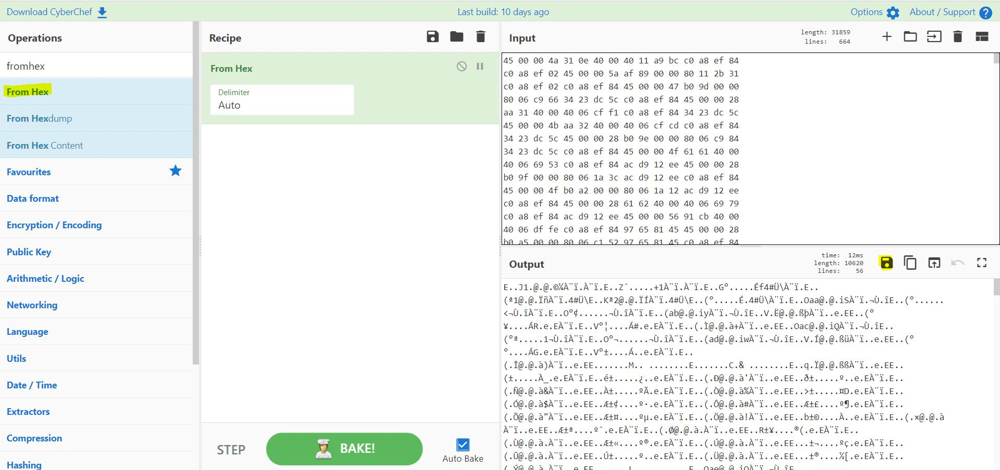

# The Best of Times - Matrix Cyber Labs CTF 2021
Forensic, 150 Points

## Description

*An obscure entity, known only as "K9" has contacted the agency.*
*The message states that they have sniffed out a flag from right under our noses, and it is now up to you to find* *which integral part of our communication has been compromised and revoke its validity!*

And attached file [dump.bin](dump.bin)

## The Best of Times Solution

First, Let's look on the attached file:

```asm
┌─[evyatar@parrot]─[/media/shared/ctf/matrix/TheBestOfTimes]
└──╼ $file dump.bin 
dump.bin: ASCII text
┌─[evyatar@parrot]─[/media/shared/ctf/matrix/TheBestOfTimes]
└──╼ $less dump.bin 
45 00 00 4a 31 0e 40 00 40 11 a9 bc c0 a8 ef 84
c0 a8 ef 02 45 00 00 5a af 89 00 00 80 11 2b 31
c0 a8 ef 02 c0 a8 ef 84 45 00 00 47 b0 9d 00 00
80 06 c9 66 34 23 dc 5c c0 a8 ef 84 45 00 00 28
aa 31 40 00 40 06 cf f1 c0 a8 ef 84 34 23 dc 5c
45 00 00 4b aa 32 40 00 40 06 cf cd c0 a8 ef 84
34 23 dc 5c 45 00 00 28 b0 9e 00 00 80 06 c9 84
34 23 dc 5c c0 a8 ef 84 45 00 00 4f 61 61 40 00
40 06 69 53 c0 a8 ef 84 ac d9 12 ee 45 00 00 28
b0 9f 00 00 80 06 1a 3c ac d9 12 ee c0 a8 ef 84
45 00 00 4f b0 a2 00 00 80 06 1a 12 ac d9 12 ee
c0 a8 ef 84 45 00 00 28 61 62 40 00 40 06 69 79
c0 a8 ef 84 ac d9 12 ee 45 00 00 56 91 cb 40 00
40 06 df fe c0 a8 ef 84 97 65 81 45 45 00 00 28
b0 a5 00 00 80 06 c1 52 97 65 81 45 c0 a8 ef 84
45 00 00 56 b0 a6 00 00 80 06 c1 23 97 65 81 45
c0 a8 ef 84 45 00 00 28 91 cc 40 00 40 06 e0 2b
c0 a8 ef 84 97 65 81 45 45 00 00 4f 61 63 40 00
40 06 69 51 c0 a8 ef 84 ac d9 12 ee 45 00 00 28
b0 aa 00 00 80 06 1a 31 ac d9 12 ee c0 a8 ef 84
...
```

We have text file contains hex bytes, Let's convert it to file.

We can do it using [CyberChef](https://gchq.github.io/CyberChef/) using ```From Hex``` operation:



Or by using python:

```python
dump_bytes=[]
with open("dump.bin","r") as dumpfile:
	for line in dumpfile:
		dump_bytes.extend(line.strip().split(' '))

with open('outdump','wb') as f:
	map(lambda x: f.write(chr(int(x,16))), dump_bytes)
```

Let's try to look at the file type:
```console
┌─[evyatar@parrot]─[/media/shared/ctf/matrix/TheBestOfTimes]
└──╼ $file outdump
outdump: data
```

Nothing intersting.

Let's try to use ```xxd``` to find the pattern in bytes as follow:
```asm
┌─[evyatar@parrot]─[/media/shared/ctf/matrix/TheBestOfTimes]
└──╼ $cat outdump | xxd -g 1 -c 10 | less
00000000: 45 00 00 4a 31 0e 40 00 40 11  E..J1.@.@.
0000000a: a9 bc c0 a8 ef 84 c0 a8 ef 02  ..........
00000014: 45 00 00 5a af 89 00 00 80 11  E..Z......
0000001e: 2b 31 c0 a8 ef 02 c0 a8 ef 84  +1........
00000028: 45 00 00 47 b0 9d 00 00 80 06  E..G......
00000032: c9 66 34 23 dc 5c c0 a8 ef 84  .f4#.\....
0000003c: 45 00 00 28 aa 31 40 00 40 06  E..(.1@.@.
00000046: cf f1 c0 a8 ef 84 34 23 dc 5c  ......4#.\
00000050: 45 00 00 4b aa 32 40 00 40 06  E..K.2@.@.
0000005a: cf cd c0 a8 ef 84 34 23 dc 5c  ......4#.\
00000064: 45 00 00 28 b0 9e 00 00 80 06  E..(......
0000006e: c9 84 34 23 dc 5c c0 a8 ef 84  ..4#.\....
00000078: 45 00 00 4f 61 61 40 00 40 06  E..Oaa@.@.
00000082: 69 53 c0 a8 ef 84 ac d9 12 ee  iS........
0000008c: 45 00 00 28 b0 9f 00 00 80 06  E..(......
00000096: 1a 3c ac d9 12 ee c0 a8 ef 84  .<........
000000a0: 45 00 00 4f b0 a2 00 00 80 06  E..O......
000000aa: 1a 12 ac d9 12 ee c0 a8 ef 84  ..........
000000b4: 45 00 00 28 61 62 40 00 40 06  E..(ab@.@.
000000be: 69 79 c0 a8 ef 84 ac d9 12 ee  iy........
000000c8: 45 00 00 56 91 cb 40 00 40 06  E..V..@.@.
000000d2: df fe c0 a8 ef 84 97 65 81 45  .......e.E
000000dc: 45 00 00 28 b0 a5 00 00 80 06  E..(......
000000e6: c1 52 97 65 81 45 c0 a8 ef 84  .R.e.E....
000000f0: 45 00 00 56 b0 a6 00 00 80 06  E..V......
000000fa: c1 23 97 65 81 45 c0 a8 ef 84  .#.e.E....
00000104: 45 00 00 28 91 cc 40 00 40 06  E..(..@.@.
0000010e: e0 2b c0 a8 ef 84 97 65 81 45  .+.....e.E
00000118: 45 00 00 4f 61 63 40 00 40 06  E..Oac@.@.
00000122: 69 51 c0 a8 ef 84 ac d9 12 ee  iQ........
0000012c: 45 00 00 28 b0 aa 00 00 80 06  E..(......
00000136: 1a 31 ac d9 12 ee c0 a8 ef 84  .1........
00000140: 45 00 00 4f b0 ac 00 00 80 06  E..O......
0000014a: 1a 08 ac d9 12 ee c0 a8 ef 84  ..........
00000154: 45 00 00 28 61 64 40 00 40 06  E..(ad@.@.
0000015e: 69 77 c0 a8 ef 84 ac d9 12 ee  iw........
.........
```

We can see sort of a pattern ```45 00 00``` (20 bytes).

Let's try to align the hex dump so every line will be prefixed with ```45 00 00```:
```asm
┌─[evyatar@parrot]─[/media/shared/ctf/matrix/TheBestOfTimes]
└──╼ $cat outdump | xxd -g 1 -c 20 | less
00000000: 45 00 00 4a 31 0e 40 00 40 11 a9 bc c0 a8 ef 84 c0 a8 ef 02  E..J1.@.@...........
00000014: 45 00 00 5a af 89 00 00 80 11 2b 31 c0 a8 ef 02 c0 a8 ef 84  E..Z......+1........
00000028: 45 00 00 47 b0 9d 00 00 80 06 c9 66 34 23 dc 5c c0 a8 ef 84  E..G.......f4#.\....
0000003c: 45 00 00 28 aa 31 40 00 40 06 cf f1 c0 a8 ef 84 34 23 dc 5c  E..(.1@.@.......4#.\
00000050: 45 00 00 4b aa 32 40 00 40 06 cf cd c0 a8 ef 84 34 23 dc 5c  E..K.2@.@.......4#.\
00000064: 45 00 00 28 b0 9e 00 00 80 06 c9 84 34 23 dc 5c c0 a8 ef 84  E..(........4#.\....
00000078: 45 00 00 4f 61 61 40 00 40 06 69 53 c0 a8 ef 84 ac d9 12 ee  E..Oaa@.@.iS........
0000008c: 45 00 00 28 b0 9f 00 00 80 06 1a 3c ac d9 12 ee c0 a8 ef 84  E..(.......<........
000000a0: 45 00 00 4f b0 a2 00 00 80 06 1a 12 ac d9 12 ee c0 a8 ef 84  E..O................
000000b4: 45 00 00 28 61 62 40 00 40 06 69 79 c0 a8 ef 84 ac d9 12 ee  E..(ab@.@.iy........
000000c8: 45 00 00 56 91 cb 40 00 40 06 df fe c0 a8 ef 84 97 65 81 45  E..V..@.@........e.E
000000dc: 45 00 00 28 b0 a5 00 00 80 06 c1 52 97 65 81 45 c0 a8 ef 84  E..(.......R.e.E....
000000f0: 45 00 00 56 b0 a6 00 00 80 06 c1 23 97 65 81 45 c0 a8 ef 84  E..V.......#.e.E....
00000104: 45 00 00 28 91 cc 40 00 40 06 e0 2b c0 a8 ef 84 97 65 81 45  E..(..@.@..+.....e.E
00000118: 45 00 00 4f 61 63 40 00 40 06 69 51 c0 a8 ef 84 ac d9 12 ee  E..Oac@.@.iQ........
0000012c: 45 00 00 28 b0 aa 00 00 80 06 1a 31 ac d9 12 ee c0 a8 ef 84  E..(.......1........
00000140: 45 00 00 4f b0 ac 00 00 80 06 1a 08 ac d9 12 ee c0 a8 ef 84  E..O................
00000154: 45 00 00 28 61 64 40 00 40 06 69 77 c0 a8 ef 84 ac d9 12 ee  E..(ad@.@.iw........
00000168: 45 00 00 56 91 cd 40 00 40 06 df fc c0 a8 ef 84 97 65 81 45  E..V..@.@........e.E
0000017c: 45 00 00 28 b0 b0 00 00 80 06 c1 47 97 65 81 45 c0 a8 ef 84  E..(.......G.e.E....
00000190: 45 00 00 56 b0 b1 00 00 80 06 c1 18 97 65 81 45 c0 a8 ef 84  E..V.........e.E....
000001a4: 45 00 00 28 91 ce 40 00 40 06 e0 29 c0 a8 ef 84 97 65 81 45  E..(..@.@..).....e.E
000001b8: 45 00 00 1c 00 01 00 00 4d 11 1c a0 1b 04 14 12 0e 07 14 14  E.......M...........
000001cc: 45 00 00 1c 00 01 00 00 43 11 26 a0 1b 04 14 12 0e 07 14 14  E.......C.&.........
000001e0: 45 00 00 71 91 cf 40 00 40 06 df df c0 a8 ef 84 97 65 81 45  E..q..@.@........e.E
000001f4: 45 00 00 28 b1 98 00 00 80 06 c0 5f 97 65 81 45 c0 a8 ef 84  E..(......._.e.E....
00000208: 45 00 00 e9 b1 99 00 00 80 06 bf 9d 97 65 81 45 c0 a8 ef 84  E............e.E....
0000021c: 45 00 00 28 91 d0 40 00 40 06 e0 27 c0 a8 ef 84 97 65 81 45  E..(..@.@..'.....e.E
00000230: 45 00 05 f0 b1 9a 00 00 80 06 ba 95 97 65 81 45 c0 a8 ef 84  E............e.E....
00000244: 45 00 00 28 91 d1 40 00 40 06 e0 26 c0 a8 ef 84 97 65 81 45  E..(..@.@..&.....e.E
00000258: 45 00 05 c0 b1 9c 00 00 80 06 ba c3 97 65 81 45 c0 a8 ef 84  E............e.E....
0000026c: 45 00 00 28 91 d2 40 00 40 06 e0 25 c0 a8 ef 84 97 65 81 45  E..(..@.@..%.....e.E
00000280: 45 00 1c 3e b1 9d 00 00 80 06 a4 44 97 65 81 45 c0 a8 ef 84  E..>.......D.e.E....
00000294: 45 00 00 28 91 d3 40 00 40 06 e0 24 c0 a8 ef 84 97 65 81 45  E..(..@.@..$.....e.E
000002a8: 45 00 05 c6 b1 a2 00 00 80 06 ba b7 97 65 81 45 c0 a8 ef 84  E............e.E....
000002bc: 45 00 00 28 91 d4 40 00 40 06 e0 23 c0 a8 ef 84 97 65 81 45  E..(..@.@..#.....e.E
...
```

Now, We can see the following two lines:
```asm
...
000001b8: 45 00 00 1c 00 01 00 00 4d 11 1c a0 1b 04 14 12 0e 07 14 14  E.......M...........
000001cc: 45 00 00 1c 00 01 00 00 43 11 26 a0 1b 04 14 12 0e 07 14 14  E.......C.&.........
...
```

It's look like a start of flag string, Let's try to look at the pattern ```45 00 00 1c```:
```asm
┌─[evyatar@parrot]─[/media/shared/ctf/matrix/TheBestOfTimes]
└──╼ $cat outdump | xxd -g 1 -c 10 | grep "45 00 00 1c"
000001b8: 45 00 00 1c 00 01 00 00 4d 11 1c a0 1b 04 14 12 0e 07 14 14  E.......M...........
000001cc: 45 00 00 1c 00 01 00 00 43 11 26 a0 1b 04 14 12 0e 07 14 14  E.......C.&.........
00000438: 45 00 00 1c 00 01 00 00 4c 11 1d a0 1b 04 14 12 0e 07 14 14  E.......L...........
00000514: 45 00 00 1c 00 01 00 00 7b 11 ee 9f 1b 04 14 12 0e 07 14 14  E.......{...........
000005a0: 45 00 00 1c 00 01 00 00 53 11 16 a0 1b 04 14 12 0e 07 14 14  E.......S...........
0000116c: 45 00 00 1c 00 01 00 00 34 11 35 a0 1b 04 14 12 0e 07 14 14  E.......4.5.........
00001180: 45 00 00 1c 00 01 00 00 64 11 05 a0 1b 04 14 12 0e 07 14 14  E.......d...........
00001194: 45 00 00 1c 00 01 00 00 31 11 38 a0 1b 04 14 12 0e 07 14 14  E.......1.8.........
000011f8: 45 00 00 1c 00 01 00 00 65 11 04 a0 1b 04 14 12 0e 07 14 14  E.......e...........
0000120c: 45 00 00 1c 00 01 00 00 5f 11 0a a0 1b 04 14 12 0e 07 14 14  E......._...........
000012c0: 45 00 00 1c 00 01 00 00 77 11 f2 9f 1b 04 14 12 0e 07 14 14  E.......w...........
00001374: 45 00 00 1c 00 01 00 00 34 11 35 a0 1b 04 14 12 0e 07 14 14  E.......4.5.........
00001428: 45 00 00 1c 00 01 00 00 35 11 34 a0 1b 04 14 12 0e 07 14 14  E.......5.4.........
0000143c: 45 00 00 1c 00 01 00 00 5f 11 0a a0 1b 04 14 12 0e 07 14 14  E......._...........
00001c70: 45 00 00 1c 00 01 00 00 37 11 32 a0 1b 04 14 12 0e 07 14 14  E.......7.2.........
0000206c: 45 00 00 1c 00 01 00 00 68 11 01 a0 1b 04 14 12 0e 07 14 14  E.......h...........
000021c0: 45 00 00 1c 00 01 00 00 33 11 36 a0 1b 04 14 12 0e 07 14 14  E.......3.6.........
0000229c: 45 00 00 1c 00 01 00 00 5f 11 0a a0 1b 04 14 12 0e 07 14 14  E......._...........
00002300: 45 00 00 1c 00 01 00 00 62 11 07 a0 1b 04 14 12 0e 07 14 14  E.......b...........
0000233c: 45 00 00 1c 00 01 00 00 65 11 04 a0 1b 04 14 12 0e 07 14 14  E.......e...........
00002378: 45 00 00 1c 00 01 00 00 35 11 34 a0 1b 04 14 12 0e 07 14 14  E.......5.4.........
00002454: 45 00 00 1c 00 01 00 00 74 11 f5 9f 1b 04 14 12 0e 07 14 14  E.......t...........
000024e0: 45 00 00 1c 00 01 00 00 5f 11 0a a0 1b 04 14 12 0e 07 14 14  E......._...........
000024f4: 45 00 00 1c 00 01 00 00 30 11 39 a0 1b 04 14 12 0e 07 14 14  E.......0.9.........
00002508: 45 00 00 1c 00 01 00 00 66 11 03 a0 1b 04 14 12 0e 07 14 14  E.......f...........
00002670: 45 00 00 1c 00 01 00 00 5f 11 0a a0 1b 04 14 12 0e 07 14 14  E......._...........
000026ac: 45 00 00 1c 00 01 00 00 54 11 15 a0 1b 04 14 12 0e 07 14 14  E.......T...........
000026c0: 45 00 00 1c 00 01 00 00 31 11 38 a0 1b 04 14 12 0e 07 14 14  E.......1.8.........
00002814: 45 00 00 1c 00 01 00 00 6d 11 fc 9f 1b 04 14 12 0e 07 14 14  E.......m...........
00002828: 45 00 00 1c 00 01 00 00 33 11 36 a0 1b 04 14 12 0e 07 14 14  E.......3.6.........
0000283c: 45 00 00 1c 00 01 00 00 53 11 16 a0 1b 04 14 12 0e 07 14 14  E.......S...........
00002878: 45 00 00 1c 00 01 00 00 5f 11 0a a0 1b 04 14 12 0e 07 14 14  E......._...........
000028dc: 45 00 00 1c 00 01 00 00 3c 11 2d a0 1b 04 14 12 0e 07 14 14  E.......<.-.........
000028f0: 45 00 00 1c 00 01 00 00 2f 11 3a a0 1b 04 14 12 0e 07 14 14  E......./.:.........
00002904: 45 00 00 1c 00 01 00 00 33 11 36 a0 1b 04 14 12 0e 07 14 14  E.......3.6.........
00002968: 45 00 00 1c 00 01 00 00 7d 11 ec 9f 1b 04 14 12 0e 07 14 14  E.......}...........

```

We can see at the 9th byte the flag string, Let's print it using
1. ```awk``` - To get the 9th byte (which is actually 10th because ```' '``` delimiter).
2. ```xxd``` To convert the hex to ascii.
```asm
┌─[evyatar@parrot]─[/media/shared/ctf/matrix/TheBestOfTimes]
└──╼ $cat outdump | xxd -g 1 -c 20 | grep "45 00 00 1c" | awk '{print $10}' | xxd -r -p
MCL{S4d1e_w45_7h3_be5t_0f_T1m3S_</3}
```
