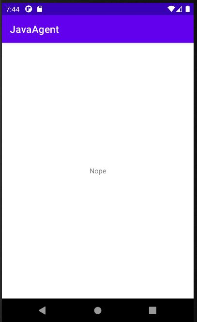

# Agent Man - Matrix Cyber Labs CTF 2021
Mobile, 200 Points

## Description

*--- TRANSMISSION START---*

*Special Agent;*
*...*
*Exciting news!*
*The wire is bustling with chatter about 'little green men' and how*
*they were able to make their presence felt across the globe.*

*Your mission is to locate the group and find a way to uncover their secrets.*

*Attached is a sample gathered by our brave field-agents, best of luck;*

*--- TRANSMISSION END ---*

And attached file [(agentman.apk)](agentman.apk)*

## Oh, Bugger Solution

First, Let's install the apk on Android emulator (API 29+) using adb (Genymotion/Android Studio Emulator/...).

```console
┌─[evyatar@parrot]─[/media/shared/ctf/matrix/agentman]
└──╼ $ adb install agentman.apk
Performing Streamed Install
Success
```

Actually? Nothing :D



Let's decompile the apk using jadx 

```console
┌─[evyatar@parrot]─[/media/shared/ctf/matrix/agentman]
└──╼ $ jadx --show-bad-code agentman.apk
```

We can see the ```MainActivity``` class written with the following code:
```java

public class MainActivity extends AppCompatActivity {
    public native String agentMan(String str);

    static {
        System.loadLibrary("agent");
    }

    /* access modifiers changed from: protected */
    public void onCreate(Bundle bundle) {
        super.onCreate(bundle);
        setContentView((int) R.layout.activity_main);
        TextView textView = (TextView) findViewById(R.id.mainText);
        String str = new DownloadFile().get("https://ctfroom.matrixcyberlabs.com/agent");
        if (str.isEmpty()) {
            textView.setText(agentMan((String) null));
        } else {
            textView.setText(agentMan(str));
        }
    }
}
```

First, ```System.loadLibrary("agent");``` - ```agent``` dynamic library load.
Then we can see  the ```agentMan``` function called with str/null.
I downloaded the image from https://ctfroom.matrixcyberlabs.com/agent .

To understand what is the ```agentMan``` function, we need to unzip the apk to get the ```.so``` agent file.

The file located on ```lib/x86_64/libagent.so``` - Let's open it using Ghidra.
```Java_com_jagent_javaagent_MainActivity_agentMan``` function:

```c

undefined8
Java_com_jagent_javaagent_MainActivity_agentMan
          (_JNIEnv *param_1,undefined8 param_2,_jstring *param_3)

{
  char *__haystack;
  char *pcVar1;
  long in_FS_OFFSET;
  int local_194;
  undefined8 local_160;
  basic_string<char,std::__ndk1::char_traits<char>,std::__ndk1::allocator<char>> local_138 [24];
  int local_120;
  int local_11c;
  basic_string<char,std::__ndk1::char_traits<char>,std::__ndk1::allocator<char>> local_118 [24];
  basic_string<char,std::__ndk1::char_traits<char>,std::__ndk1::allocator<char>> local_100 [24];
  byte local_e8 [48];
  undefined4 local_b8 [42];
  long local_10;
  
  local_10 = *(long *)(in_FS_OFFSET + 0x28);
  __haystack = (char *)_JNIEnv::GetStringUTFChars(param_1,param_3,(uchar *)0x0);
  std::__ndk1::basic_string<char,std::__ndk1::char_traits<char>,std::__ndk1::allocator<char>>::
  basic_string<decltype(nullptr)>(local_100,"NULL");
  if (__haystack != (char *)0x0) {
    pcVar1 = (char *)FUN_0010ec50(local_100);
    pcVar1 = strstr(__haystack,pcVar1);
    if (pcVar1 == (char *)0x0) {
      local_11c = 0x1ce9;
      memcpy(local_b8,&DAT_0012c9a0,0xa8);
      memset(local_e8,0,0x2a);
      local_120 = (int)((long)((long)&local_10 - (long)local_b8) >> 2);
      local_194 = 0;
      while (local_194 < local_120) {
        local_e8[local_194] =
             (byte)local_b8[local_194] ^ __haystack[(uint)((local_194 + 2) * local_11c)];
        local_194 = local_194 + 1;
      }
                    /* try { // try from 0010eaa4 to 0010eab6 has its CatchHandler @ 0010e98e */
      std::__ndk1::basic_string<char,std::__ndk1::char_traits<char>,std::__ndk1::allocator<char>>::
      basic_string<decltype(nullptr)>(local_138,"Secret, Agent Man!");
                    /* try { // try from 0010ead1 to 0010eb06 has its CatchHandler @ 0010eb3c */
      _JNIEnv::ReleaseStringUTFChars(param_1,param_3,__haystack);
      FUN_0010ec50(local_138);
      local_160 = _JNIEnv::NewStringUTF((char *)param_1);
      std::__ndk1::basic_string<char,std::__ndk1::char_traits<char>,std::__ndk1::allocator<char>>::
      ~basic_string(local_138);
      goto LAB_0010eb5a;
    }
  }
                    /* try { // try from 0010e915 to 0010e927 has its CatchHandler @ 0010e98e */
  std::__ndk1::basic_string<char,std::__ndk1::char_traits<char>,std::__ndk1::allocator<char>>::
  basic_string<decltype(nullptr)>(local_118,"Nope");
  FUN_0010ec50(local_118);
                    /* try { // try from 0010e94a to 0010e958 has its CatchHandler @ 0010e9a0 */
  local_160 = _JNIEnv::NewStringUTF((char *)param_1);
  std::__ndk1::basic_string<char,std::__ndk1::char_traits<char>,std::__ndk1::allocator<char>>::
  ~basic_string(local_118);
LAB_0010eb5a:
  std::__ndk1::basic_string<char,std::__ndk1::char_traits<char>,std::__ndk1::allocator<char>>::
  ~basic_string(local_100);
  if (*(long *)(in_FS_OFFSET + 0x28) == local_10) {
    return local_160;
  }
                    /* WARNING: Subroutine does not return */
  __stack_chk_fail();
}
```

We can see the function return "Nope" / "Secret, Agent Man!".

The intersting part of the code:
```c
local_11c = 0x1ce9;
memcpy(local_b8,&DAT_0012c9a0,0xa8); // <-----------
memset(local_e8,0,0x2a);
local_120 = (int)((long)((long)&local_10 - (long)local_b8) >> 2);
local_194 = 0;
while (local_194 < local_120) {
local_e8[local_194] =
	(byte)local_b8[local_194] ^ __haystack[(uint)((local_194 + 2) * local_11c)];
local_194 = local_194 + 1;
}
```

We can see the code that copy ```DAT_0012c9a0``` to ```local_b8``` - let's call to local_b8 ```buffer```.

We can see that ```buffer``` contains the following data:
```asm
                             DAT_0012c9a0                                    XREF[2]:     Java_com_jagent_javaagent_MainAc
                                                                                          Java_com_jagent_javaagent_MainAc
        0012c9a0 a5              ??         A5h
        0012c9a1 00              ??         00h
        0012c9a2 00              ??         00h
        0012c9a3 00              ??         00h
        0012c9a4 bc              ??         BCh
        0012c9a5 00              ??         00h
        0012c9a6 00              ??         00h
        0012c9a7 00              ??         00h
        0012c9a8 bc              ??         BCh
        0012c9a9 00              ??         00h
        0012c9aa 00              ??         00h
        0012c9ab 00              ??         00h
        0012c9ac a1              ??         A1h
        0012c9ad 00              ??         00h
        0012c9ae 00              ??         00h
        0012c9af 00              ??         00h
        0012c9b0 5c              ??         5Ch    \
        0012c9b1 00              ??         00h
        0012c9b2 00              ??         00h
        0012c9b3 00              ??         00h
        0012c9b4 6c              ??         6Ch    l
        0012c9b5 00              ??         00h
        0012c9b6 00              ??         00h
        0012c9b7 00              ??         00h
        0012c9b8 dc              ??         DCh
        0012c9b9 00              ??         00h
        0012c9ba 00              ??         00h
        0012c9bb 00              ??         00h
        0012c9bc 00              ??         00h
        0012c9bd 00              ??         00h
        0012c9be 00              ??         00h
        0012c9bf 00              ??         00h
        0012c9c0 3c              ??         3Ch    <
        0012c9c1 00              ??         00h
        0012c9c2 00              ??         00h
        0012c9c3 00              ??         00h
        0012c9c4 16              ??         16h
        0012c9c5 00              ??         00h
        0012c9c6 00              ??         00h
        0012c9c7 00              ??         00h
        0012c9c8 9c              ??         9Ch
        0012c9c9 00              ??         00h
        0012c9ca 00              ??         00h
        0012c9cb 00              ??         00h
        0012c9cc 42              ??         42h    B
        0012c9cd 00              ??         00h
        0012c9ce 00              ??         00h
        0012c9cf 00              ??         00h
        0012c9d0 2d              ??         2Dh    -
        0012c9d1 00              ??         00h
        0012c9d2 00              ??         00h
        0012c9d3 00              ??         00h
        0012c9d4 28              ??         28h    (
        0012c9d5 00              ??         00h
        0012c9d6 00              ??         00h
        0012c9d7 00              ??         00h
        0012c9d8 db              ??         DBh
        0012c9d9 00              ??         00h
        0012c9da 00              ??         00h
        0012c9db 00              ??         00h
        0012c9dc c8              ??         C8h
        0012c9dd 00              ??         00h
        0012c9de 00              ??         00h
        0012c9df 00              ??         00h
        0012c9e0 c0              ??         C0h
        0012c9e1 00              ??         00h
        0012c9e2 00              ??         00h
        0012c9e3 00              ??         00h
        0012c9e4 27              ??         27h    '
        0012c9e5 00              ??         00h
        0012c9e6 00              ??         00h
        0012c9e7 00              ??         00h
        0012c9e8 21              ??         21h    !
        0012c9e9 00              ??         00h
        0012c9ea 00              ??         00h
        0012c9eb 00              ??         00h
        0012c9ec 29              ??         29h    )
        0012c9ed 00              ??         00h
        0012c9ee 00              ??         00h
        0012c9ef 00              ??         00h
        0012c9f0 41              ??         41h    A
        0012c9f1 00              ??         00h
        0012c9f2 00              ??         00h
        0012c9f3 00              ??         00h
        0012c9f4 08              ??         08h
        0012c9f5 00              ??         00h
        0012c9f6 00              ??         00h
        0012c9f7 00              ??         00h
        0012c9f8 19              ??         19h
        0012c9f9 00              ??         00h
        0012c9fa 00              ??         00h
        0012c9fb 00              ??         00h
        0012c9fc c0              ??         C0h
        0012c9fd 00              ??         00h
        0012c9fe 00              ??         00h
        0012c9ff 00              ??         00h
        0012ca00 44              ??         44h    D
        0012ca01 00              ??         00h
        0012ca02 00              ??         00h
        0012ca03 00              ??         00h
        0012ca04 8b              ??         8Bh
        0012ca05 00              ??         00h
        0012ca06 00              ??         00h
        0012ca07 00              ??         00h
        0012ca08 1c              ??         1Ch
        0012ca09 00              ??         00h
        0012ca0a 00              ??         00h
        0012ca0b 00              ??         00h
        0012ca0c 2f              ??         2Fh    /
        0012ca0d 00              ??         00h
        0012ca0e 00              ??         00h
        0012ca0f 00              ??         00h
        0012ca10 27              ??         27h    '
        0012ca11 00              ??         00h
        0012ca12 00              ??         00h
        0012ca13 00              ??         00h
        0012ca14 1f              ??         1Fh
        0012ca15 00              ??         00h
        0012ca16 00              ??         00h
        0012ca17 00              ??         00h
        0012ca18 03              ??         03h
        0012ca19 00              ??         00h
        0012ca1a 00              ??         00h
        0012ca1b 00              ??         00h
        0012ca1c b2              ??         B2h
        0012ca1d 00              ??         00h
        0012ca1e 00              ??         00h
        0012ca1f 00              ??         00h
        0012ca20 3d              ??         3Dh    =
        0012ca21 00              ??         00h
        0012ca22 00              ??         00h
        0012ca23 00              ??         00h
        0012ca24 f3              ??         F3h
        0012ca25 00              ??         00h
        0012ca26 00              ??         00h
        0012ca27 00              ??         00h
        0012ca28 ed              ??         EDh
        0012ca29 00              ??         00h
        0012ca2a 00              ??         00h
        0012ca2b 00              ??         00h
        0012ca2c 14              ??         14h
        0012ca2d 00              ??         00h
        0012ca2e 00              ??         00h
        0012ca2f 00              ??         00h
        0012ca30 15              ??         15h
        0012ca31 00              ??         00h
        0012ca32 00              ??         00h
        0012ca33 00              ??         00h
        0012ca34 fe              ??         FEh
        0012ca35 00              ??         00h
        0012ca36 00              ??         00h
        0012ca37 00              ??         00h
        0012ca38 2b              ??         2Bh    +
        0012ca39 00              ??         00h
        0012ca3a 00              ??         00h
        0012ca3b 00              ??         00h
        0012ca3c d6              ??         D6h
        0012ca3d 00              ??         00h
        0012ca3e 00              ??         00h
        0012ca3f 00              ??         00h
        0012ca40 e1              ??         E1h
        0012ca41 00              ??         00h
        0012ca42 00              ??         00h
        0012ca43 00              ??         00h
        0012ca44 55              ??         55h    U
        0012ca45 00              ??         00h
        0012ca46 00              ??         00h
        0012ca47 00              ??         00h
``` 

Let's copy the bytes:
```python
[0xa5, 0x00, 0x00, 0x00, 0xbc, 0x00, 0x00, 0x00, 0xbc, 0x00, 0x00, 0x00, 0xa1, 0x00, 0x00, 0x00, 0x5c, 0x00,
           0x00, 0x00, 0x6c, 0x00, 0x00, 0x00, 0xdc, 0x00, 0x00, 0x00, 0x00, 0x00, 0x00, 0x00, 0x3c, 0x00, 0x00, 0x00,
           0x16, 0x00, 0x00, 0x00, 0x9c, 0x00, 0x00, 0x00, 0x42, 0x00, 0x00, 0x00, 0x2d, 0x00, 0x00, 0x00, 0x28, 0x00,
           0x00, 0x00, 0xdb, 0x00, 0x00, 0x00, 0xc8, 0x00, 0x00, 0x00, 0xc0, 0x00, 0x00, 0x00, 0x27, 0x00, 0x00, 0x00,
           0x21, 0x00, 0x00, 0x00, 0x29, 0x00, 0x00, 0x00, 0x41, 0x00, 0x00, 0x00, 0x08, 0x00, 0x00, 0x00, 0x19, 0x00,
           0x00, 0x00, 0xc0, 0x00, 0x00, 0x00, 0x44, 0x00, 0x00, 0x00, 0x8b, 0x00, 0x00, 0x00, 0x1c, 0x00, 0x00, 0x00,
           0x2f, 0x00, 0x00, 0x00, 0x27, 0x00, 0x00, 0x00, 0x1f, 0x00, 0x00, 0x00, 0x03, 0x00, 0x00, 0x00, 0xb2, 0x00,
           0x00, 0x00, 0x3d, 0x00, 0x00, 0x00, 0xf3, 0x00, 0x00, 0x00, 0xed, 0x00, 0x00, 0x00, 0x14, 0x00, 0x00, 0x00,
           0x15, 0x00, 0x00, 0x00, 0xfe, 0x00, 0x00, 0x00, 0x2b, 0x00, 0x00, 0x00, 0xd6, 0x00, 0x00, 0x00, 0xe1, 0x00,
           0x00, 0x00, 0x55, 0x00, 0x00, 0x00]
```
		   

Now Let's observe the ```while``` loop:

```c
local_11c = 0x1ce9;
memcpy(local_b8,&DAT_0012c9a0,0xa8);
memset(local_e8,0,0x2a);
local_120 = (int)((long)((long)&local_10 - (long)local_b8) >> 2);
local_194 = 0;
while (local_194 < local_120) { //<-------------
local_e8[local_194] =
	(byte)local_b8[local_194] ^ __haystack[(uint)((local_194 + 2) * local_11c)];
local_194 = local_194 + 1;
}
```


```local_b8``` is the buffer before, ```local_e8``` decrypted string, ```local_120``` size of buffer, ```__haystack``` user input, ```local_194``` - buffer index.

After investigating the above I found that ```__haystack``` hold the digDipper.jpg bytes that was downloaded on the method ```OnCreate``` in apk ```String str = new DownloadFile().get("https://ctfroom.matrixcyberlabs.com/agent");```

So:
```c
local_11c = 0x1ce9;
memcpy(buffer,&DAT_0012c9a0,0xa8);
memset(decryptedArray,0,0x2a);
sizeOfBuffer = (int)((long)((long)&local_10 - (long)buffer) >> 2);
bufferIndex = 0;
while (bufferIndex < sizeOfBuffer) {
decryptedArray[bufferIndex] =
	(byte)buffer[bufferIndex] ^ digDipper[(uint)((bufferIndex + 2) * local_11c)];
bufferIndex = bufferIndex + 1;
}
```

Now we can write the following python code to get the flag:
```python
buffer = [0xa5, 0x00, 0x00, 0x00, 0xbc, 0x00, 0x00, 0x00, 0xbc, 0x00, 0x00, 0x00, 0xa1, 0x00, 0x00, 0x00, 0x5c, 0x00,
           0x00, 0x00, 0x6c, 0x00, 0x00, 0x00, 0xdc, 0x00, 0x00, 0x00, 0x00, 0x00, 0x00, 0x00, 0x3c, 0x00, 0x00, 0x00,
           0x16, 0x00, 0x00, 0x00, 0x9c, 0x00, 0x00, 0x00, 0x42, 0x00, 0x00, 0x00, 0x2d, 0x00, 0x00, 0x00, 0x28, 0x00,
           0x00, 0x00, 0xdb, 0x00, 0x00, 0x00, 0xc8, 0x00, 0x00, 0x00, 0xc0, 0x00, 0x00, 0x00, 0x27, 0x00, 0x00, 0x00,
           0x21, 0x00, 0x00, 0x00, 0x29, 0x00, 0x00, 0x00, 0x41, 0x00, 0x00, 0x00, 0x08, 0x00, 0x00, 0x00, 0x19, 0x00,
           0x00, 0x00, 0xc0, 0x00, 0x00, 0x00, 0x44, 0x00, 0x00, 0x00, 0x8b, 0x00, 0x00, 0x00, 0x1c, 0x00, 0x00, 0x00,
           0x2f, 0x00, 0x00, 0x00, 0x27, 0x00, 0x00, 0x00, 0x1f, 0x00, 0x00, 0x00, 0x03, 0x00, 0x00, 0x00, 0xb2, 0x00,
           0x00, 0x00, 0x3d, 0x00, 0x00, 0x00, 0xf3, 0x00, 0x00, 0x00, 0xed, 0x00, 0x00, 0x00, 0x14, 0x00, 0x00, 0x00,
           0x15, 0x00, 0x00, 0x00, 0xfe, 0x00, 0x00, 0x00, 0x2b, 0x00, 0x00, 0x00, 0xd6, 0x00, 0x00, 0x00, 0xe1, 0x00,
           0x00, 0x00, 0x55, 0x00, 0x00, 0x00]
with open('digDeeper.jpg', 'rb') as f:
    digDipper = f.read()
digDipper = bytearray(digDipper)
res = []
key_index=0
for i in range(0,len(buffer)):
	 try:
		  temp = buffer[key_index] ^ (digDipper[((i + 2) * 0x1ce9)])
		  res.append(chr(temp))
		  key_index+=4
	 except:
		continue
print("".join(res))
```

Run it:
```console
┌─[evyatar@parrot]─[/media/shared/ctf/matrix/agentman]
└──╼ $python agentman.py 
MCL{li7tl3_5P3c1al_S3crET_Ag3n7_'\'m3n'\'}
```

NOTE: ```key_index``` incremented by 4 to skip on 0x00 bytes.
