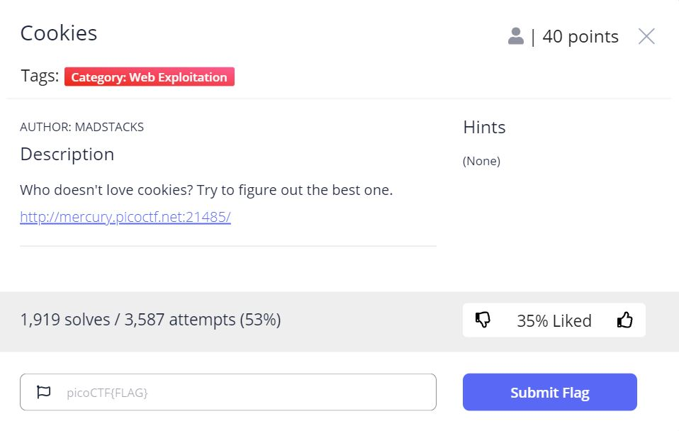
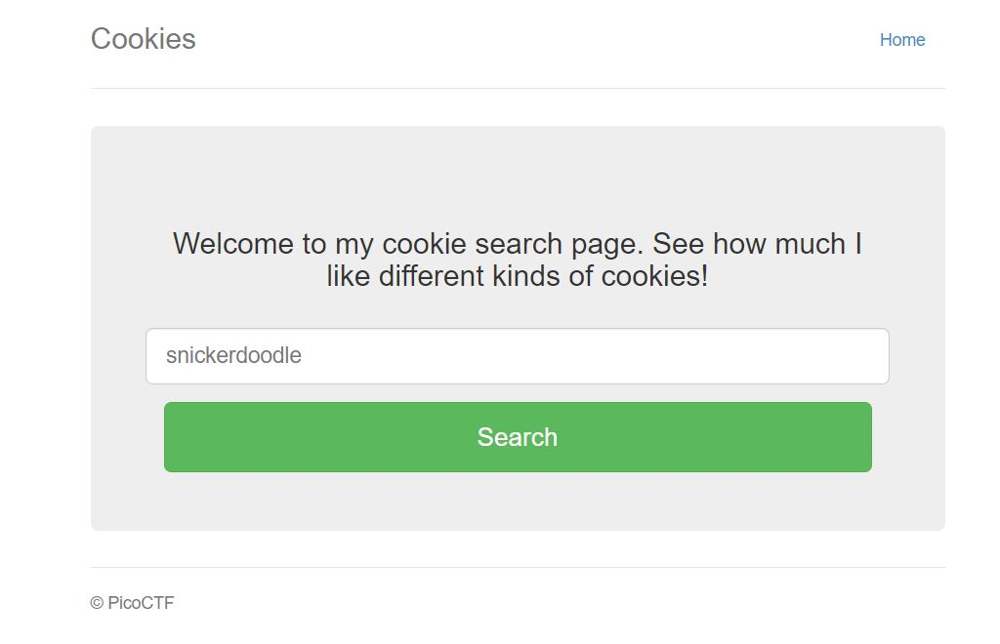
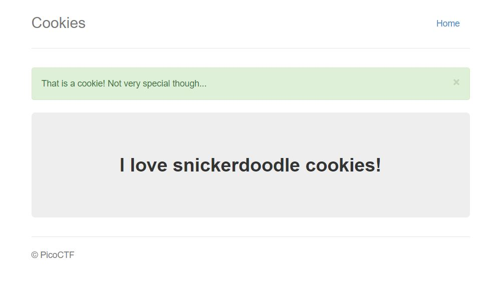
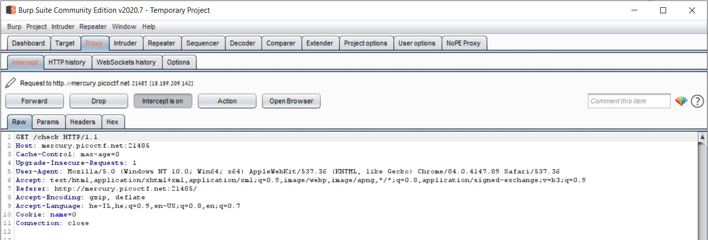
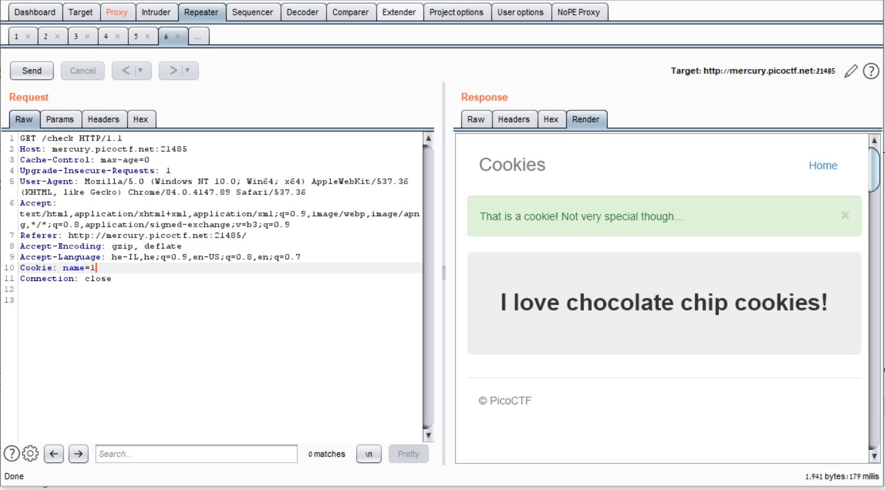
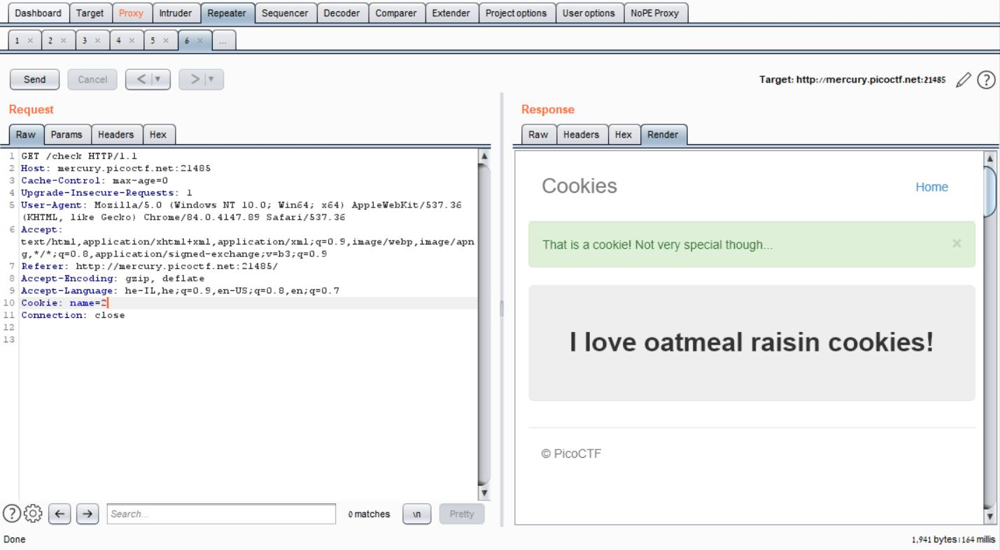
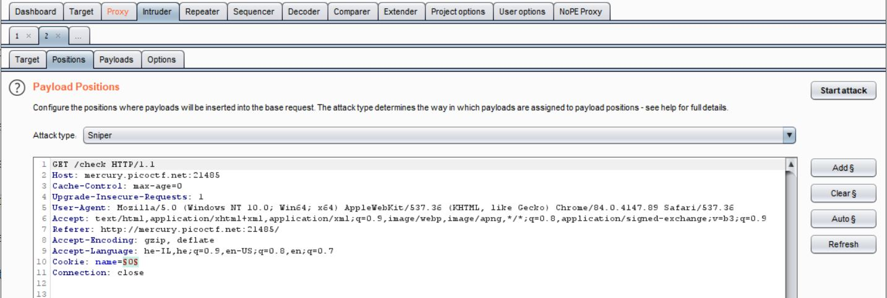
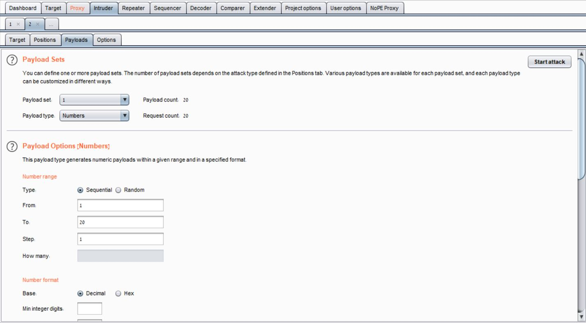
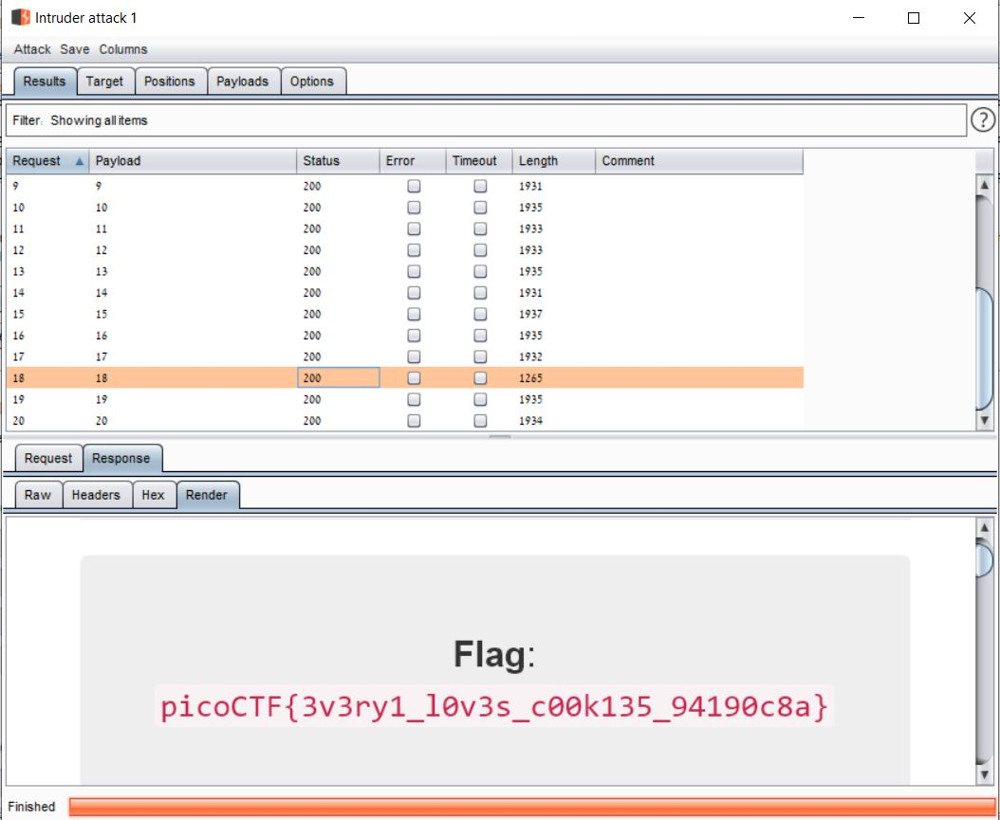

# Cookies - picoCTF 2021 - CMU Cybersecurity Competition
Web Exploitation, 40 Points

## Description


 
## Cookies Solution

Let's access to the website from description [http://mercury.picoctf.net:21485/](http://mercury.picoctf.net:21485/):



Let's try to insert "snickerdoodle" and click "Search":


Which give us the following response:



Let's try to intercept the request using [BurpSuite](https://portswigger.net/burp):



We can use [BurpSuite Repeater](https://portswigger.net/burp/documentation/desktop/tools/repeater/using) to modify this request - We can try to change the ```name``` cookie from ```0``` to ```1```:



Look intresting, Let's try to change it from ```1``` to ```2```:



So It's look like we need to find the current number of ```name``` cookie which give us the flag.

By click on ```Ctrl + I``` we can send the request above to [BurpSuite Intruder](https://portswigger.net/burp/documentation/desktop/tools/intruder/using):



Intruder automatically identify the cookie value as token, 
We can use Intruder to change the value of ```name``` cookies with the following payload:



We can start the Intruder By click on "Start Attack" (Top right).

And finally we can see that ```name=18``` is the current one:



Flag: ```picoCTF{3v3ry1_l0v3s_c00k135_94190c8a}```.