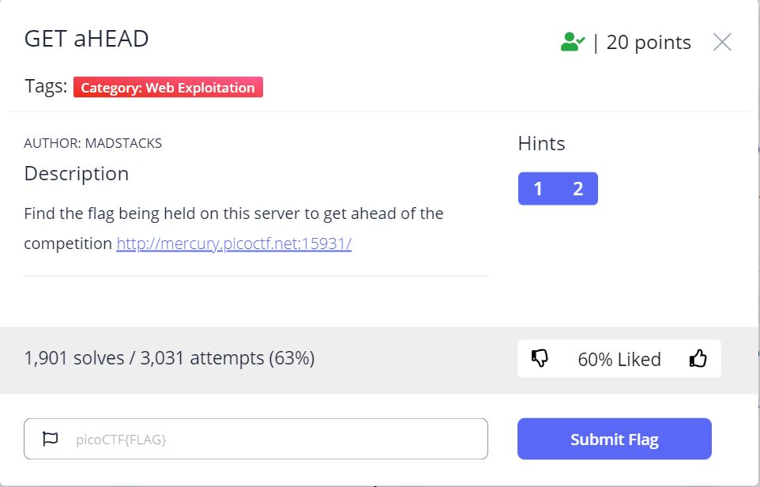
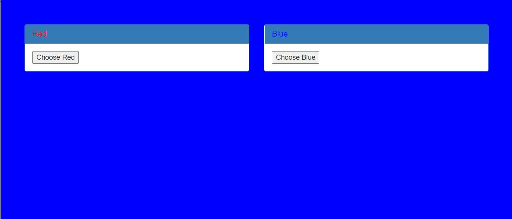
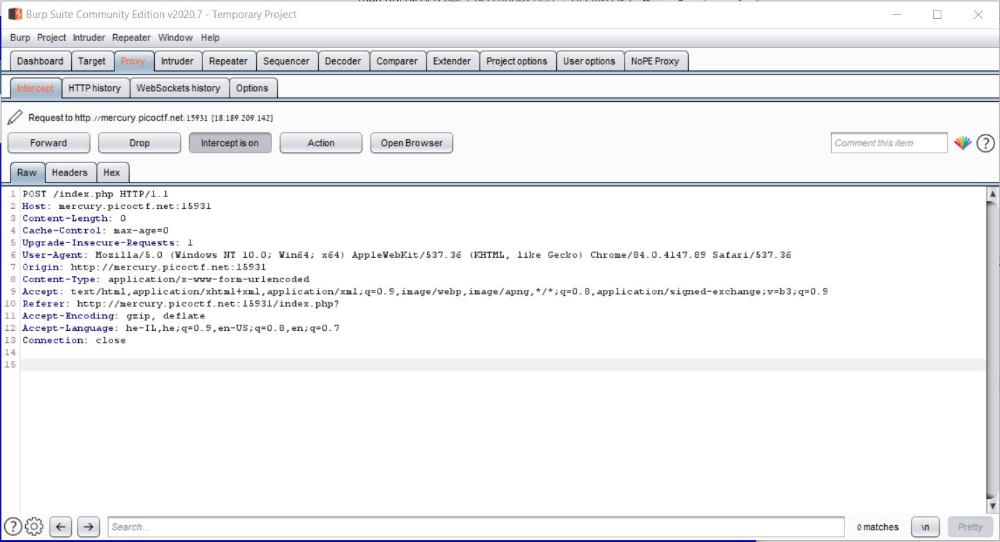
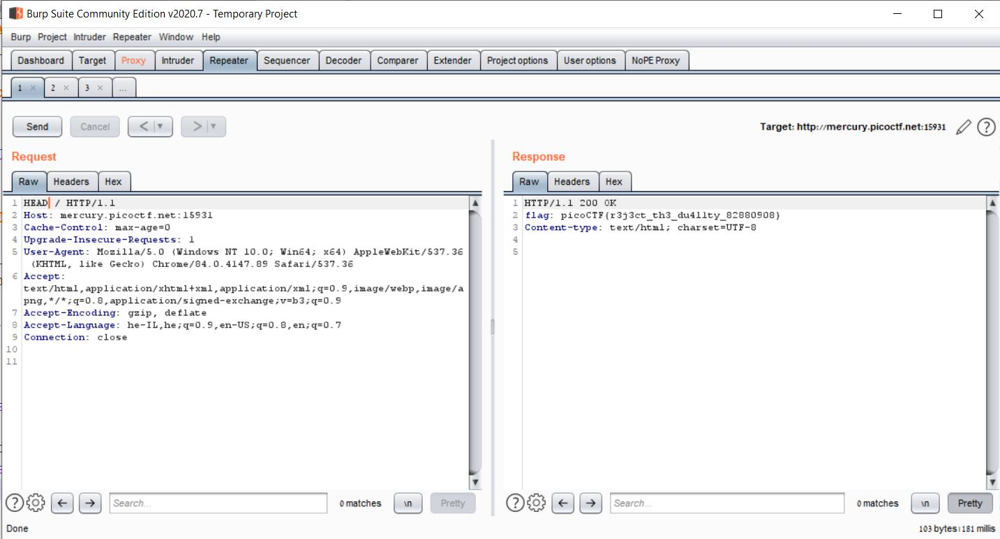

# GET aHEAD - picoCTF 2021 - CMU Cybersecurity Competition
Web Exploitation, 20 Points

## Description



 

## GET aHEAD Solution

By accessing to the web site from description [http://mercury.picoctf.net:15931/](http://mercury.picoctf.net:15931/) we can see the following website:



Let's try to intercept the request using [BurpSuite](https://portswigger.net/burp):



We can get the flag by simply changing the HTTP method from ```GET``` to ```HEAD``` (challenge name hint) using [BurpSuite Repeater](https://portswigger.net/burp/documentation/desktop/tools/repeater/using):



Flag: ```picoCTF{r3j3ct_th3_du4l1ty_82880908}```.