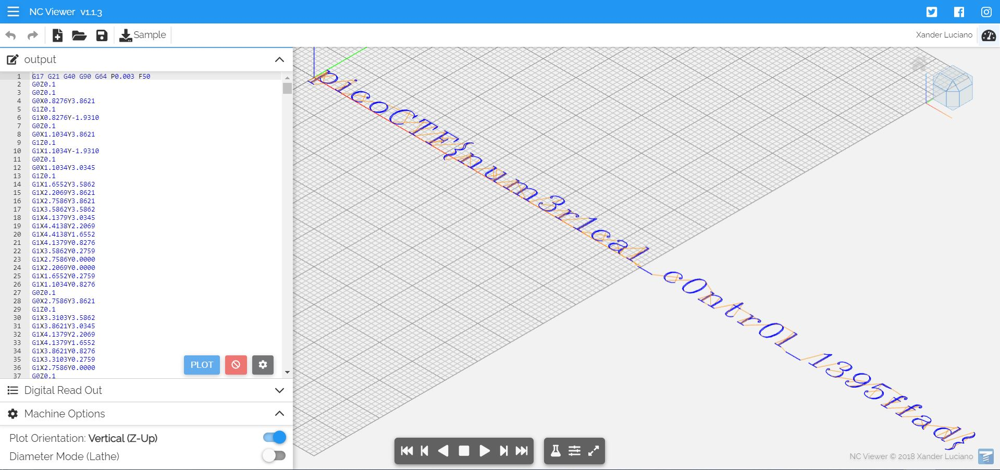

# Speeds And Feeds - picoCTF 2021 - CMU Cybersecurity Competition
Reverse Engineering, 50 Points

## Description


 
## Speeds And Feeds Solution

By connecting to ```nc mercury.picoctf.net 1652``` we get the following:
```console
┌─[evyatar@parrot]─[/pico2021/SpeedsAndFeeds] 
└──╼ $ nc mercury.picoctf.net 1652
G17 G21 G40 G90 G64 P0.003 F50
G0Z0.1
G0Z0.1
G0X0.8276Y3.8621
G1Z0.1
G1X0.8276Y-1.9310
G0Z0.1
G0X1.1034Y3.8621
G1Z0.1
G1X1.1034Y-1.9310
G0Z0.1
G0X1.1034Y3.0345
G1Z0.1
G1X1.6552Y3.5862
G1X2.2069Y3.8621
G1X2.7586Y3.8621
G1X3.5862Y3.5862
G1X4.1379Y3.0345
G1X4.4138Y2.2069
G1X4.4138Y1.6552
G1X4.1379Y0.8276
G1X3.5862Y0.2759
G1X2.7586Y0.0000
G1X2.2069Y0.0000
G1X1.6552Y0.2759
G1X1.1034Y0.8276
G0Z0.1
G0X2.7586Y3.8621
G1Z0.1
G1X3.3103Y3.5862
G1X3.8621Y3.0345
G1X4.1379Y2.2069
G1X4.1379Y1.6552
G1X3.8621Y0.8276
G1X3.3103Y0.2759
G1X2.7586Y0.0000
G0Z0.1
G0X0.0000Y3.8621
G1Z0.1
G1X1.1034Y3.8621
G0Z0.1
G0X0.0000Y-1.9310
G1Z0.1
G1X1.9310Y-1.9310
G0Z0.1
G0X7.2414Y5.7931
G1Z0.1
G1X6.9655Y5.5172
G1X7.2414Y5.2414
G1X7.5172Y5.5172
G1X7.2414Y5.7931
G0Z0.1
G0X7.2414Y3.8621
G1Z0.1
G1X7.2414Y0.0000
G0Z0.1
G0X7.5172Y3.8621
G1Z0.1
G1X7.5172Y0.0000
G0Z0.1
G0X6.4138Y3.8621
G1Z0.1
G1X7.5172Y3.8621
G0Z0.1
G0X6.4138Y0.0000
G1Z0.1
G1X8.3448Y0.0000
G0Z0.1
G0X13.6552Y3.0345
G1Z0.1
G1X13.3793Y2.7586
G1X13.6552Y2.4828
G1X13.9310Y2.7586
G1X13.9310Y3.0345
G1X13.3793Y3.5862
G1X12.8276Y3.8621
G1X12.0000Y3.8621
G1X11.1724Y3.5862
G1X10.6207Y3.0345
G1X10.3448Y2.2069
G1X10.3448Y1.6552
G1X10.6207Y0.8276
G1X11.1724Y0.2759
G1X12.0000Y0.0000
G1X12.5517Y0.0000
G1X13.3793Y0.2759
G1X13.9310Y0.8276
G0Z0.1
G0X12.0000Y3.8621
G1Z0.1
G1X11.4483Y3.5862
G1X10.8966Y3.0345
G1X10.6207Y2.2069
G1X10.6207Y1.6552
G1X10.8966Y0.8276
G1X11.4483Y0.2759
G1X12.0000Y0.0000
G0Z0.1
G0X17.5862Y3.8621
G1Z0.1
G1X16.7586Y3.5862
G1X16.2069Y3.0345
G1X15.9310Y2.2069
G1X15.9310Y1.6552
G1X16.2069Y0.8276
G1X16.7586Y0.2759
G1X17.5862Y0.0000
G1X18.1379Y0.0000
G1X18.9655Y0.2759
G1X19.5172Y0.8276
G1X19.7931Y1.6552
G1X19.7931Y2.2069
G1X19.5172Y3.0345
G1X18.9655Y3.5862
G1X18.1379Y3.8621
G1X17.5862Y3.8621
G1X17.0345Y3.5862
G1X16.4828Y3.0345
G1X16.2069Y2.2069
G1X16.2069Y1.6552
G1X16.4828Y0.8276
G1X17.0345Y0.2759
G1X17.5862Y0.0000
G0Z0.1
G0X18.1379Y0.0000
G1Z0.1
G1X18.6897Y0.2759
G1X19.2414Y0.8276
G1X19.5172Y1.6552
G1X19.5172Y2.2069
G1X19.2414Y3.0345
G1X18.6897Y3.5862
G1X18.1379Y3.8621
G0Z0.1
G0X25.6552Y4.9655
G1Z0.1
G1X25.9310Y4.1379
G1X25.9310Y5.7931
G1X25.6552Y4.9655
G1X25.1034Y5.5172
G1X24.2759Y5.7931
G1X23.7241Y5.7931
G1X22.8966Y5.5172
G1X22.3448Y4.9655
G1X22.0690Y4.4138
G1X21.7931Y3.5862
G1X21.7931Y2.2069
G1X22.0690Y1.3793
G1X22.3448Y0.8276
G1X22.8966Y0.2759
G1X23.7241Y0.0000
G1X24.2759Y0.0000
G1X25.1034Y0.2759
G1X25.6552Y0.8276
G1X25.9310Y1.3793
G0Z0.1
G0X23.7241Y5.7931
G1Z0.1
G1X23.1724Y5.5172
G1X22.6207Y4.9655
G1X22.3448Y4.4138
G1X22.0690Y3.5862
G1X22.0690Y2.2069
G1X22.3448Y1.3793
G1X22.6207Y0.8276
G1X23.1724Y0.2759
G1X23.7241Y0.0000
G0Z0.1
G0X29.8621Y5.7931
G1Z0.1
G1X29.8621Y0.0000
G0Z0.1
G0X30.1379Y5.7931
G1Z0.1
G1X30.1379Y0.0000
G0Z0.1
G0X28.2069Y5.7931
G1Z0.1
G1X27.9310Y4.1379
G1X27.9310Y5.7931
G1X32.0690Y5.7931
G1X32.0690Y4.1379
G1X31.7931Y5.7931
G0Z0.1
G0X29.0345Y0.0000
G1Z0.1
G1X30.9655Y0.0000
G0Z0.1
G0X34.8966Y5.7931
G1Z0.1
G1X34.8966Y0.0000
G0Z0.1
G0X35.1724Y5.7931
G1Z0.1
G1X35.1724Y0.0000
G0Z0.1
G0X36.8276Y4.1379
G1Z0.1
G1X36.8276Y1.9310
G0Z0.1
G0X34.0690Y5.7931
G1Z0.1
G1X38.4828Y5.7931
G1X38.4828Y4.1379
G1X38.2069Y5.7931
G0Z0.1
G0X35.1724Y3.0345
G1Z0.1
G1X36.8276Y3.0345
G0Z0.1
G0X34.0690Y0.0000
G1Z0.1
G1X36.0000Y0.0000
G0Z0.1
G0X41.8621Y6.8966
G1Z0.1
G1X41.3103Y6.6207
G1X41.0345Y6.3448
G1X40.7586Y5.7931
G1X40.7586Y5.2414
G1X41.0345Y4.6897
G1X41.3103Y4.4138
G1X41.5862Y3.8621
G1X41.5862Y3.3103
G1X41.0345Y2.7586
G0Z0.1
G0X41.3103Y6.6207
G1Z0.1
G1X41.0345Y6.0690
G1X41.0345Y5.5172
G1X41.3103Y4.9655
G1X41.5862Y4.6897
G1X41.8621Y4.1379
G1X41.8621Y3.5862
G1X41.5862Y3.0345
G1X40.4828Y2.4828
G1X41.5862Y1.9310
G1X41.8621Y1.3793
G1X41.8621Y0.8276
G1X41.5862Y0.2759
G1X41.3103Y0.0000
G1X41.0345Y-0.5517
G1X41.0345Y-1.1034
G1X41.3103Y-1.6552
G0Z0.1
G0X41.0345Y2.2069
G1Z0.1
G1X41.5862Y1.6552
G1X41.5862Y1.1034
G1X41.3103Y0.5517
G1X41.0345Y0.2759
G1X40.7586Y-0.2759
G1X40.7586Y-0.8276
G1X41.0345Y-1.3793
G1X41.3103Y-1.6552
G1X41.8621Y-1.9310
G0Z0.1
G0X44.6897Y3.8621
G1Z0.1
G1X44.6897Y0.0000
G0Z0.1
G0X44.9655Y3.8621
G1Z0.1
G1X44.9655Y0.0000
G0Z0.1
G0X44.9655Y3.0345
G1Z0.1
G1X45.5172Y3.5862
G1X46.3448Y3.8621
G1X46.8966Y3.8621
G1X47.7241Y3.5862
G1X48.0000Y3.0345
G1X48.0000Y0.0000
G0Z0.1
G0X46.8966Y3.8621
G1Z0.1
G1X47.4483Y3.5862
G1X47.7241Y3.0345
G1X47.7241Y0.0000
G0Z0.1
G0X43.8621Y3.8621
G1Z0.1
G1X44.9655Y3.8621
G0Z0.1
G0X43.8621Y0.0000
G1Z0.1
G1X45.7931Y0.0000
G0Z0.1
G0X46.8966Y0.0000
G1Z0.1
G1X48.8276Y0.0000
G0Z0.1
G0X51.6552Y3.8621
G1Z0.1
G1X51.6552Y0.8276
G1X51.9310Y0.2759
G1X52.7586Y0.0000
G1X53.3103Y0.0000
G1X54.1379Y0.2759
G1X54.6897Y0.8276
G0Z0.1
G0X51.9310Y3.8621
G1Z0.1
G1X51.9310Y0.8276
G1X52.2069Y0.2759
G1X52.7586Y0.0000
G0Z0.1
G0X54.6897Y3.8621
G1Z0.1
G1X54.6897Y0.0000
G0Z0.1
G0X54.9655Y3.8621
G1Z0.1
G1X54.9655Y0.0000
G0Z0.1
G0X50.8276Y3.8621
G1Z0.1
G1X51.9310Y3.8621
G0Z0.1
G0X53.8621Y3.8621
G1Z0.1
G1X54.9655Y3.8621
G0Z0.1
G0X54.6897Y0.0000
G1Z0.1
G1X55.7931Y0.0000
G0Z0.1
G0X58.6207Y3.8621
G1Z0.1
G1X58.6207Y0.0000
G0Z0.1
G0X58.8966Y3.8621
G1Z0.1
G1X58.8966Y0.0000
G0Z0.1
G0X58.8966Y3.0345
G1Z0.1
G1X59.4483Y3.5862
G1X60.2759Y3.8621
G1X60.8276Y3.8621
G1X61.6552Y3.5862
G1X61.9310Y3.0345
G1X61.9310Y0.0000
G0Z0.1
G0X60.8276Y3.8621
G1Z0.1
G1X61.3793Y3.5862
G1X61.6552Y3.0345
G1X61.6552Y0.0000
G0Z0.1
G0X61.9310Y3.0345
G1Z0.1
G1X62.4828Y3.5862
G1X63.3103Y3.8621
G1X63.8621Y3.8621
G1X64.6897Y3.5862
G1X64.9655Y3.0345
G1X64.9655Y0.0000
G0Z0.1
G0X63.8621Y3.8621
G1Z0.1
G1X64.4138Y3.5862
G1X64.6897Y3.0345
G1X64.6897Y0.0000
G0Z0.1
G0X57.7931Y3.8621
G1Z0.1
G1X58.8966Y3.8621
G0Z0.1
G0X57.7931Y0.0000
G1Z0.1
G1X59.7241Y0.0000
G0Z0.1
G0X60.8276Y0.0000
G1Z0.1
G1X62.7586Y0.0000
G0Z0.1
G0X63.8621Y0.0000
G1Z0.1
G1X65.7931Y0.0000
G0Z0.1
G0X68.0690Y4.6897
G1Z0.1
G1X68.3448Y4.4138
G1X68.0690Y4.1379
G1X67.7931Y4.4138
G1X67.7931Y4.6897
G1X68.0690Y5.2414
G1X68.3448Y5.5172
G1X69.1724Y5.7931
G1X70.2759Y5.7931
G1X71.1034Y5.5172
G1X71.3793Y4.9655
G1X71.3793Y4.1379
G1X71.1034Y3.5862
G1X70.2759Y3.3103
G1X69.4483Y3.3103
G0Z0.1
G0X70.2759Y5.7931
G1Z0.1
G1X70.8276Y5.5172
G1X71.1034Y4.9655
G1X71.1034Y4.1379
G1X70.8276Y3.5862
G1X70.2759Y3.3103
G1X70.8276Y3.0345
G1X71.3793Y2.4828
G1X71.6552Y1.9310
G1X71.6552Y1.1034
G1X71.3793Y0.5517
G1X71.1034Y0.2759
G1X70.2759Y0.0000
G1X69.1724Y0.0000
G1X68.3448Y0.2759
G1X68.0690Y0.5517
G1X67.7931Y1.1034
G1X67.7931Y1.3793
G1X68.0690Y1.6552
G1X68.3448Y1.3793
G1X68.0690Y1.1034
G0Z0.1
G0X71.1034Y2.7586
G1Z0.1
G1X71.3793Y1.9310
G1X71.3793Y1.1034
G1X71.1034Y0.5517
G1X70.8276Y0.2759
G1X70.2759Y0.0000
G0Z0.1
G0X74.4828Y3.8621
G1Z0.1
G1X74.4828Y0.0000
G0Z0.1
G0X74.7586Y3.8621
G1Z0.1
G1X74.7586Y0.0000
G0Z0.1
G0X74.7586Y2.2069
G1Z0.1
G1X75.0345Y3.0345
G1X75.5862Y3.5862
G1X76.1379Y3.8621
G1X76.9655Y3.8621
G1X77.2414Y3.5862
G1X77.2414Y3.3103
G1X76.9655Y3.0345
G1X76.6897Y3.3103
G1X76.9655Y3.5862
G0Z0.1
G0X73.6552Y3.8621
G1Z0.1
G1X74.7586Y3.8621
G0Z0.1
G0X73.6552Y0.0000
G1Z0.1
G1X75.5862Y0.0000
G0Z0.1
G0X79.2414Y4.6897
G1Z0.1
G1X79.7931Y4.9655
G1X80.6207Y5.7931
G1X80.6207Y0.0000
G0Z0.1
G0X80.3448Y5.5172
G1Z0.1
G1X80.3448Y0.0000
G0Z0.1
G0X79.2414Y0.0000
G1Z0.1
G1X81.7241Y0.0000
G0Z0.1
G0X87.0345Y3.0345
G1Z0.1
G1X86.7586Y2.7586
G1X87.0345Y2.4828
G1X87.3103Y2.7586
G1X87.3103Y3.0345
G1X86.7586Y3.5862
G1X86.2069Y3.8621
G1X85.3793Y3.8621
G1X84.5517Y3.5862
G1X84.0000Y3.0345
G1X83.7241Y2.2069
G1X83.7241Y1.6552
G1X84.0000Y0.8276
G1X84.5517Y0.2759
G1X85.3793Y0.0000
G1X85.9310Y0.0000
G1X86.7586Y0.2759
G1X87.3103Y0.8276
G0Z0.1
G0X85.3793Y3.8621
G1Z0.1
G1X84.8276Y3.5862
G1X84.2759Y3.0345
G1X84.0000Y2.2069
G1X84.0000Y1.6552
G1X84.2759Y0.8276
G1X84.8276Y0.2759
G1X85.3793Y0.0000
G0Z0.1
G0X89.8621Y3.3103
G1Z0.1
G1X89.8621Y3.0345
G1X89.5862Y3.0345
G1X89.5862Y3.3103
G1X89.8621Y3.5862
G1X90.4138Y3.8621
G1X91.5172Y3.8621
G1X92.0690Y3.5862
G1X92.3448Y3.3103
G1X92.6207Y2.7586
G1X92.6207Y0.8276
G1X92.8966Y0.2759
G1X93.1724Y0.0000
G0Z0.1
G0X92.3448Y3.3103
G1Z0.1
G1X92.3448Y0.8276
G1X92.6207Y0.2759
G1X93.1724Y0.0000
G1X93.4483Y0.0000
G0Z0.1
G0X92.3448Y2.7586
G1Z0.1
G1X92.0690Y2.4828
G1X90.4138Y2.2069
G1X89.5862Y1.9310
G1X89.3103Y1.3793
G1X89.3103Y0.8276
G1X89.5862Y0.2759
G1X90.4138Y0.0000
G1X91.2414Y0.0000
G1X91.7931Y0.2759
G1X92.3448Y0.8276
G0Z0.1
G0X90.4138Y2.2069
G1Z0.1
G1X89.8621Y1.9310
G1X89.5862Y1.3793
G1X89.5862Y0.8276
G1X89.8621Y0.2759
G1X90.4138Y0.0000
G0Z0.1
G0X96.2759Y5.7931
G1Z0.1
G1X96.2759Y0.0000
G0Z0.1
G0X96.5517Y5.7931
G1Z0.1
G1X96.5517Y0.0000
G0Z0.1
G0X95.4483Y5.7931
G1Z0.1
G1X96.5517Y5.7931
G0Z0.1
G0X95.4483Y0.0000
G1Z0.1
G1X97.3793Y0.0000
G0Z0.1
G0X99.3793Y-0.5517
G1Z0.1
G1X103.7931Y-0.5517
G0Z0.1
G0X109.1034Y3.0345
G1Z0.1
G1X108.8276Y2.7586
G1X109.1034Y2.4828
G1X109.3793Y2.7586
G1X109.3793Y3.0345
G1X108.8276Y3.5862
G1X108.2759Y3.8621
G1X107.4483Y3.8621
G1X106.6207Y3.5862
G1X106.0690Y3.0345
G1X105.7931Y2.2069
G1X105.7931Y1.6552
G1X106.0690Y0.8276
G1X106.6207Y0.2759
G1X107.4483Y0.0000
G1X108.0000Y0.0000
G1X108.8276Y0.2759
G1X109.3793Y0.8276
G0Z0.1
G0X107.4483Y3.8621
G1Z0.1
G1X106.8966Y3.5862
G1X106.3448Y3.0345
G1X106.0690Y2.2069
G1X106.0690Y1.6552
G1X106.3448Y0.8276
G1X106.8966Y0.2759
G1X107.4483Y0.0000
G0Z0.1
G0X113.0345Y5.7931
G1Z0.1
G1X112.2069Y5.5172
G1X111.6552Y4.6897
G1X111.3793Y3.3103
G1X111.3793Y2.4828
G1X111.6552Y1.1034
G1X112.2069Y0.2759
G1X113.0345Y0.0000
G1X113.5862Y0.0000
G1X114.4138Y0.2759
G1X114.9655Y1.1034
G1X115.2414Y2.4828
G1X115.2414Y3.3103
G1X114.9655Y4.6897
G1X114.4138Y5.5172
G1X113.5862Y5.7931
G1X113.0345Y5.7931
G1X112.4828Y5.5172
G1X112.2069Y5.2414
G1X111.9310Y4.6897
G1X111.6552Y3.3103
G1X111.6552Y2.4828
G1X111.9310Y1.1034
G1X112.2069Y0.5517
G1X112.4828Y0.2759
G1X113.0345Y0.0000
G0Z0.1
G0X113.5862Y0.0000
G1Z0.1
G1X114.1379Y0.2759
G1X114.4138Y0.5517
G1X114.6897Y1.1034
G1X114.9655Y2.4828
G1X114.9655Y3.3103
G1X114.6897Y4.6897
G1X114.4138Y5.2414
G1X114.1379Y5.5172
G1X113.5862Y5.7931
G0Z0.1
G0X118.0690Y3.8621
G1Z0.1
G1X118.0690Y0.0000
G0Z0.1
G0X118.3448Y3.8621
G1Z0.1
G1X118.3448Y0.0000
G0Z0.1
G0X118.3448Y3.0345
G1Z0.1
G1X118.8966Y3.5862
G1X119.7241Y3.8621
G1X120.2759Y3.8621
G1X121.1034Y3.5862
G1X121.3793Y3.0345
G1X121.3793Y0.0000
G0Z0.1
G0X120.2759Y3.8621
G1Z0.1
G1X120.8276Y3.5862
G1X121.1034Y3.0345
G1X121.1034Y0.0000
G0Z0.1
G0X117.2414Y3.8621
G1Z0.1
G1X118.3448Y3.8621
G0Z0.1
G0X117.2414Y0.0000
G1Z0.1
G1X119.1724Y0.0000
G0Z0.1
G0X120.2759Y0.0000
G1Z0.1
G1X122.2069Y0.0000
G0Z0.1
G0X125.0345Y5.7931
G1Z0.1
G1X125.0345Y1.1034
G1X125.3103Y0.2759
G1X125.8621Y0.0000
G1X126.4138Y0.0000
G1X126.9655Y0.2759
G1X127.2414Y0.8276
G0Z0.1
G0X125.3103Y5.7931
G1Z0.1
G1X125.3103Y1.1034
G1X125.5862Y0.2759
G1X125.8621Y0.0000
G0Z0.1
G0X124.2069Y3.8621
G1Z0.1
G1X126.4138Y3.8621
G0Z0.1
G0X130.0690Y3.8621
G1Z0.1
G1X130.0690Y0.0000
G0Z0.1
G0X130.3448Y3.8621
G1Z0.1
G1X130.3448Y0.0000
G0Z0.1
G0X130.3448Y2.2069
G1Z0.1
G1X130.6207Y3.0345
G1X131.1724Y3.5862
G1X131.7241Y3.8621
G1X132.5517Y3.8621
G1X132.8276Y3.5862
G1X132.8276Y3.3103
G1X132.5517Y3.0345
G1X132.2759Y3.3103
G1X132.5517Y3.5862
G0Z0.1
G0X129.2414Y3.8621
G1Z0.1
G1X130.3448Y3.8621
G0Z0.1
G0X129.2414Y0.0000
G1Z0.1
G1X131.1724Y0.0000
G0Z0.1
G0X136.4828Y5.7931
G1Z0.1
G1X135.6552Y5.5172
G1X135.1034Y4.6897
G1X134.8276Y3.3103
G1X134.8276Y2.4828
G1X135.1034Y1.1034
G1X135.6552Y0.2759
G1X136.4828Y0.0000
G1X137.0345Y0.0000
G1X137.8621Y0.2759
G1X138.4138Y1.1034
G1X138.6897Y2.4828
G1X138.6897Y3.3103
G1X138.4138Y4.6897
G1X137.8621Y5.5172
G1X137.0345Y5.7931
G1X136.4828Y5.7931
G1X135.9310Y5.5172
G1X135.6552Y5.2414
G1X135.3793Y4.6897
G1X135.1034Y3.3103
G1X135.1034Y2.4828
G1X135.3793Y1.1034
G1X135.6552Y0.5517
G1X135.9310Y0.2759
G1X136.4828Y0.0000
G0Z0.1
G0X137.0345Y0.0000
G1Z0.1
G1X137.5862Y0.2759
G1X137.8621Y0.5517
G1X138.1379Y1.1034
G1X138.4138Y2.4828
G1X138.4138Y3.3103
G1X138.1379Y4.6897
G1X137.8621Y5.2414
G1X137.5862Y5.5172
G1X137.0345Y5.7931
G0Z0.1
G0X141.5172Y5.7931
G1Z0.1
G1X141.5172Y0.0000
G0Z0.1
G0X141.7931Y5.7931
G1Z0.1
G1X141.7931Y0.0000
G0Z0.1
G0X140.6897Y5.7931
G1Z0.1
G1X141.7931Y5.7931
G0Z0.1
G0X140.6897Y0.0000
G1Z0.1
G1X142.6207Y0.0000
G0Z0.1
G0X144.6207Y-0.5517
G1Z0.1
G1X149.0345Y-0.5517
G0Z0.1
G0X151.0345Y4.6897
G1Z0.1
G1X151.5862Y4.9655
G1X152.4138Y5.7931
G1X152.4138Y0.0000
G0Z0.1
G0X152.1379Y5.5172
G1Z0.1
G1X152.1379Y0.0000
G0Z0.1
G0X151.0345Y0.0000
G1Z0.1
G1X153.5172Y0.0000
G0Z0.1
G0X155.7931Y4.6897
G1Z0.1
G1X156.0690Y4.4138
G1X155.7931Y4.1379
G1X155.5172Y4.4138
G1X155.5172Y4.6897
G1X155.7931Y5.2414
G1X156.0690Y5.5172
G1X156.8965Y5.7931
G1X158.0000Y5.7931
G1X158.8276Y5.5172
G1X159.1034Y4.9655
G1X159.1034Y4.1379
G1X158.8276Y3.5862
G1X158.0000Y3.3103
G1X157.1724Y3.3103
G0Z0.1
G0X158.0000Y5.7931
G1Z0.1
G1X158.5517Y5.5172
G1X158.8276Y4.9655
G1X158.8276Y4.1379
G1X158.5517Y3.5862
G1X158.0000Y3.3103
G1X158.5517Y3.0345
G1X159.1034Y2.4828
G1X159.3793Y1.9310
G1X159.3793Y1.1034
G1X159.1034Y0.5517
G1X158.8276Y0.2759
G1X158.0000Y0.0000
G1X156.8966Y0.0000
G1X156.0690Y0.2759
G1X155.7931Y0.5517
G1X155.5172Y1.1034
G1X155.5172Y1.3793
G1X155.7931Y1.6552
G1X156.0690Y1.3793
G1X155.7931Y1.1034
G0Z0.1
G0X158.8276Y2.7586
G1Z0.1
G1X159.1034Y1.9310
G1X159.1034Y1.1034
G1X158.8276Y0.5517
G1X158.5517Y0.2759
G1X158.0000Y0.0000
G0Z0.1
G0X164.9655Y3.8621
G1Z0.1
G1X164.6897Y3.0345
G1X164.1379Y2.4828
G1X163.3103Y2.2069
G1X163.0345Y2.2069
G1X162.2069Y2.4828
G1X161.6552Y3.0345
G1X161.3793Y3.8621
G1X161.3793Y4.1379
G1X161.6552Y4.9655
G1X162.2069Y5.5172
G1X163.0345Y5.7931
G1X163.5862Y5.7931
G1X164.4138Y5.5172
G1X164.9655Y4.9655
G1X165.2414Y4.1379
G1X165.2414Y2.4828
G1X164.9655Y1.3793
G1X164.6897Y0.8276
G1X164.1379Y0.2759
G1X163.3103Y0.0000
G1X162.4828Y0.0000
G1X161.9310Y0.2759
G1X161.6552Y0.8276
G1X161.6552Y1.1034
G1X161.9310Y1.3793
G1X162.2069Y1.1034
G1X161.9310Y0.8276
G0Z0.1
G0X163.0345Y2.2069
G1Z0.1
G1X162.4828Y2.4828
G1X161.9310Y3.0345
G1X161.6552Y3.8621
G1X161.6552Y4.1379
G1X161.9310Y4.9655
G1X162.4828Y5.5172
G1X163.0345Y5.7931
G0Z0.1
G0X163.5862Y5.7931
G1Z0.1
G1X164.1379Y5.5172
G1X164.6897Y4.9655
G1X164.9655Y4.1379
G1X164.9655Y2.4828
G1X164.6897Y1.3793
G1X164.4138Y0.8276
G1X163.8621Y0.2759
G1X163.3103Y0.0000
G0Z0.1
G0X167.7931Y5.7931
G1Z0.1
G1X167.2414Y3.0345
G1X167.7931Y3.5862
G1X168.6207Y3.8621
G1X169.4483Y3.8621
G1X170.2759Y3.5862
G1X170.8276Y3.0345
G1X171.1034Y2.2069
G1X171.1034Y1.6552
G1X170.8276Y0.8276
G1X170.2759Y0.2759
G1X169.4483Y0.0000
G1X168.6207Y0.0000
G1X167.7931Y0.2759
G1X167.5172Y0.5517
G1X167.2414Y1.1034
G1X167.2414Y1.3793
G1X167.5172Y1.6552
G1X167.7931Y1.3793
G1X167.5172Y1.1034
G0Z0.1
G0X169.4483Y3.8621
G1Z0.1
G1X170.0000Y3.5862
G1X170.5517Y3.0345
G1X170.8276Y2.2069
G1X170.8276Y1.6552
G1X170.5517Y0.8276
G1X170.0000Y0.2759
G1X169.4483Y0.0000
G0Z0.1
G0X167.7931Y5.7931
G1Z0.1
G1X170.5517Y5.7931
G0Z0.1
G0X167.7931Y5.5172
G1Z0.1
G1X169.1724Y5.5172
G1X170.5517Y5.7931
G0Z0.1
G0X175.3103Y5.5172
G1Z0.1
G1X175.0345Y5.2414
G1X175.3103Y4.9655
G1X175.5862Y5.2414
G1X175.5862Y5.5172
G1X175.3103Y5.7931
G1X174.7586Y5.7931
G1X174.2069Y5.5172
G1X173.9310Y4.9655
G1X173.9310Y0.0000
G0Z0.1
G0X174.7586Y5.7931
G1Z0.1
G1X174.4828Y5.5172
G1X174.2069Y4.9655
G1X174.2069Y0.0000
G0Z0.1
G0X173.1034Y3.8621
G1Z0.1
G1X175.3103Y3.8621
G0Z0.1
G0X173.1034Y0.0000
G1Z0.1
G1X175.0345Y0.0000
G0Z0.1
G0X179.7931Y5.5172
G1Z0.1
G1X179.5172Y5.2414
G1X179.7931Y4.9655
G1X180.0690Y5.2414
G1X180.0690Y5.5172
G1X179.7931Y5.7931
G1X179.2414Y5.7931
G1X178.6897Y5.5172
G1X178.4138Y4.9655
G1X178.4138Y0.0000
G0Z0.1
G0X179.2414Y5.7931
G1Z0.1
G1X178.9655Y5.5172
G1X178.6897Y4.9655
G1X178.6897Y0.0000
G0Z0.1
G0X177.5862Y3.8621
G1Z0.1
G1X179.7931Y3.8621
G0Z0.1
G0X177.5862Y0.0000
G1Z0.1
G1X179.5172Y0.0000
G0Z0.1
G0X182.6207Y3.3103
G1Z0.1
G1X182.6207Y3.0345
G1X182.3448Y3.0345
G1X182.3448Y3.3103
G1X182.6207Y3.5862
G1X183.1724Y3.8621
G1X184.2759Y3.8621
G1X184.8276Y3.5862
G1X185.1034Y3.3103
G1X185.3793Y2.7586
G1X185.3793Y0.8276
G1X185.6552Y0.2759
G1X185.9310Y0.0000
G0Z0.1
G0X185.1034Y3.3103
G1Z0.1
G1X185.1034Y0.8276
G1X185.3793Y0.2759
G1X185.9310Y0.0000
G1X186.2069Y0.0000
G0Z0.1
G0X185.1034Y2.7586
G1Z0.1
G1X184.8276Y2.4828
G1X183.1724Y2.2069
G1X182.3448Y1.9310
G1X182.0690Y1.3793
G1X182.0690Y0.8276
G1X182.3448Y0.2759
G1X183.1724Y0.0000
G1X184.0000Y0.0000
G1X184.5517Y0.2759
G1X185.1034Y0.8276
G0Z0.1
G0X183.1724Y2.2069
G1Z0.1
G1X182.6207Y1.9310
G1X182.3448Y1.3793
G1X182.3448Y0.8276
G1X182.6207Y0.2759
G1X183.1724Y0.0000
G0Z0.1
G0X191.5172Y5.7931
G1Z0.1
G1X191.5172Y0.0000
G0Z0.1
G0X191.7931Y5.7931
G1Z0.1
G1X191.7931Y0.0000
G0Z0.1
G0X191.5172Y3.0345
G1Z0.1
G1X190.9655Y3.5862
G1X190.4138Y3.8621
G1X189.8621Y3.8621
G1X189.0345Y3.5862
G1X188.4828Y3.0345
G1X188.2069Y2.2069
G1X188.2069Y1.6552
G1X188.4828Y0.8276
G1X189.0345Y0.2759
G1X189.8621Y0.0000
G1X190.4138Y0.0000
G1X190.9655Y0.2759
G1X191.5172Y0.8276
G0Z0.1
G0X189.8621Y3.8621
G1Z0.1
G1X189.3103Y3.5862
G1X188.7586Y3.0345
G1X188.4828Y2.2069
G1X188.4828Y1.6552
G1X188.7586Y0.8276
G1X189.3103Y0.2759
G1X189.8621Y0.0000
G0Z0.1
G0X190.6897Y5.7931
G1Z0.1
G1X191.7931Y5.7931
G0Z0.1
G0X191.5172Y0.0000
G1Z0.1
G1X192.6207Y0.0000
G0Z0.1
G0X194.6207Y6.8966
G1Z0.1
G1X195.1724Y6.6207
G1X195.4483Y6.3448
G1X195.7241Y5.7931
G1X195.7241Y5.2414
G1X195.4483Y4.6897
G1X195.1724Y4.4138
G1X194.8966Y3.8621
G1X194.8966Y3.3103
G1X195.4483Y2.7586
G0Z0.1
G0X195.1724Y6.6207
G1Z0.1
G1X195.4483Y6.0690
G1X195.4483Y5.5172
G1X195.1724Y4.9655
G1X194.8966Y4.6897
G1X194.6207Y4.1379
G1X194.6207Y3.5862
G1X194.8966Y3.0345
G1X196.0000Y2.4828
G1X194.8966Y1.9310
G1X194.6207Y1.3793
G1X194.6207Y0.8276
G1X194.8966Y0.2759
G1X195.1724Y0.0000
G1X195.4483Y-0.5517
G1X195.4483Y-1.1034
G1X195.1724Y-1.6552
G0Z0.1
G0X195.4483Y2.2069
G1Z0.1
G1X194.8966Y1.6552
G1X194.8966Y1.1034
G1X195.1724Y0.5517
G1X195.4483Y0.2759
G1X195.7241Y-0.2759
G1X195.7241Y-0.8276
G1X195.4483Y-1.3793
G1X195.1724Y-1.6552
G1X194.6207Y-1.9310
G0Z0.1

```

So by simply google search we can see the output is CNC Gcode [https://www.steckermachine.com/blog/g-code-m-code](https://www.steckermachine.com/blog/g-code-m-code), Let's try to copy the [output](output) to online CNC tool [https://ncviewer.com/](https://ncviewer.com/):



And we get the flag: ```picoCTF{num3r1cal_c0ntr0l_1395ffad}```

