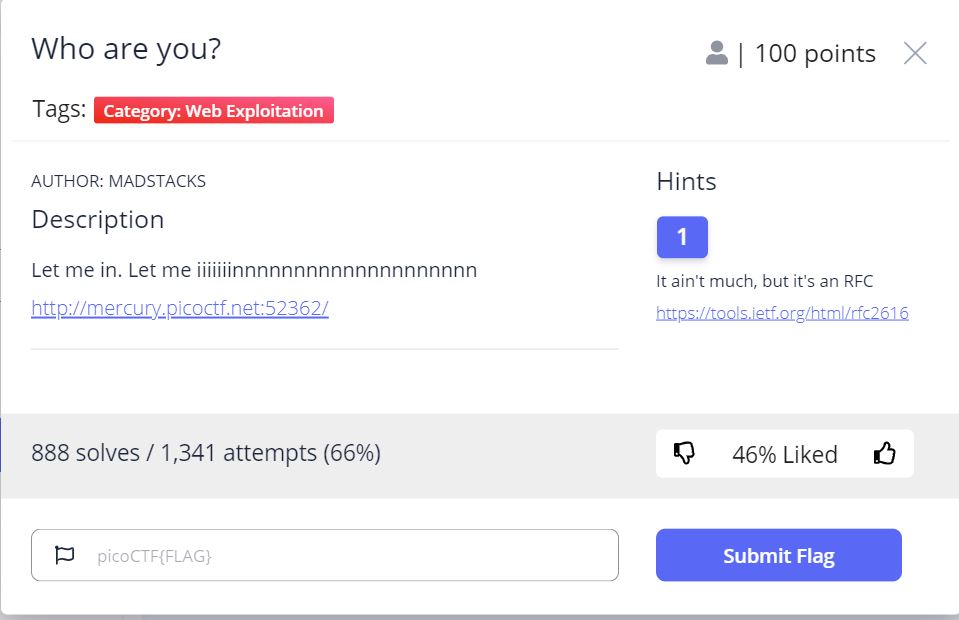
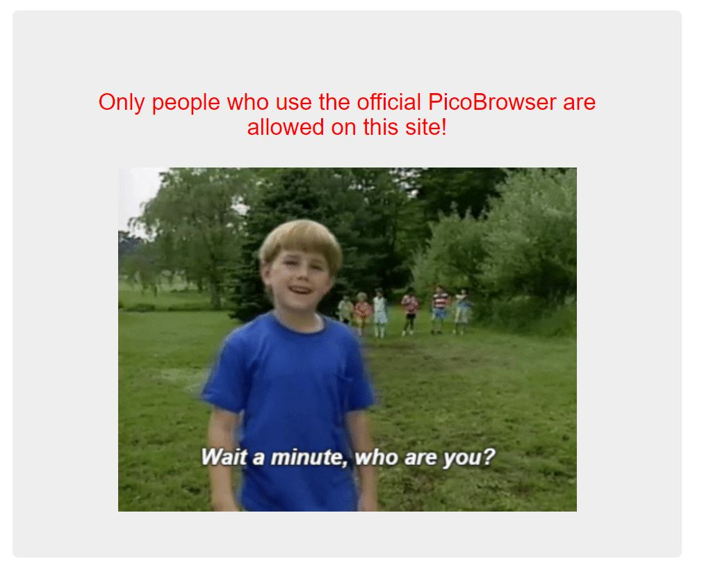
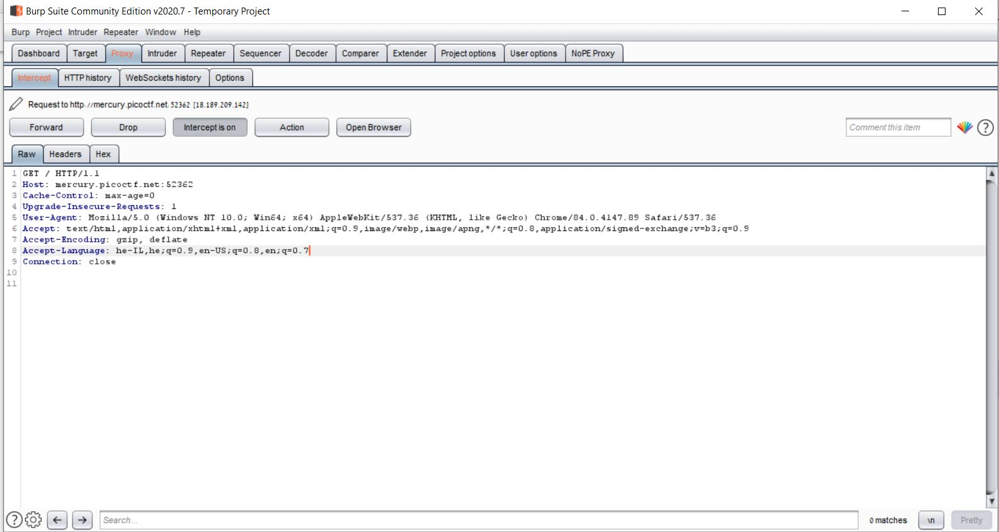
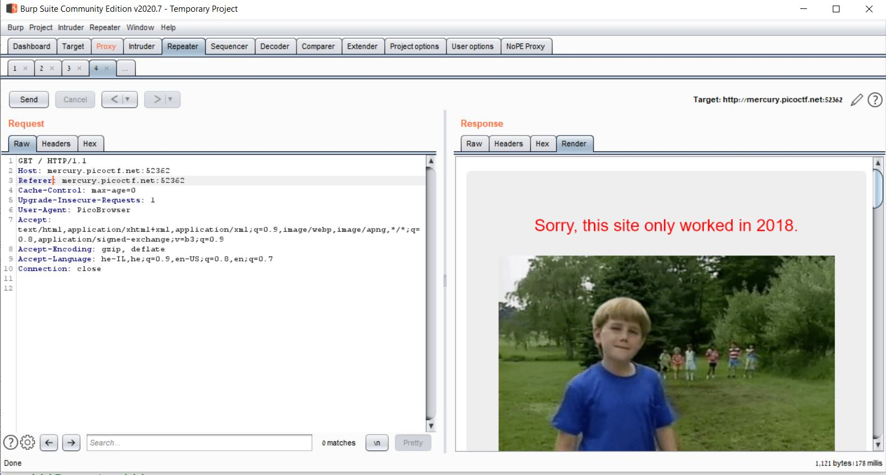
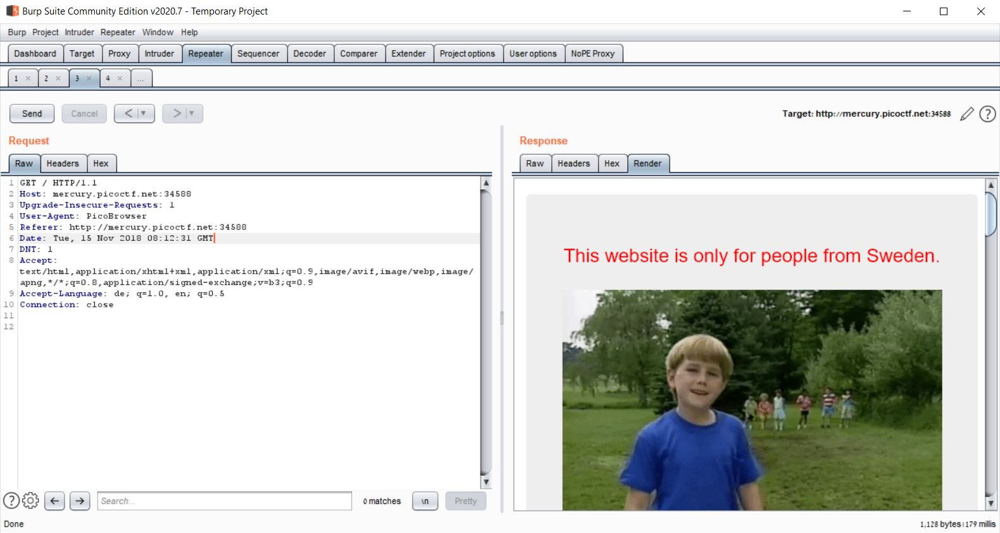
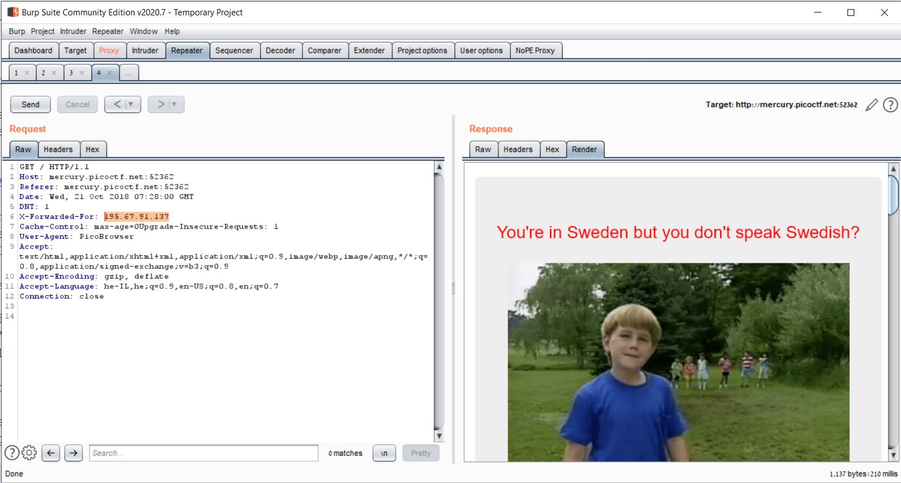
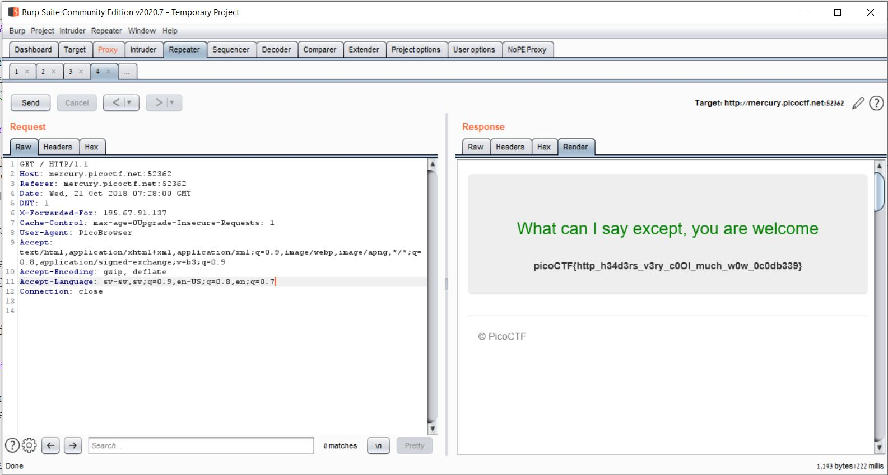

# Who Are You? - picoCTF 2021 - CMU Cybersecurity Competition
Web Exploitation, 100 Points

## Description





## Who Are You? Solution

The challenge description contains the following link [http://mercury.picoctf.net:52362/](http://mercury.picoctf.net:52362/).

Let's observe the link:



So the hint: "Only people who use the official PicoBrowser are allowed on this site!" indicate that we need to change the ```User-Agent```, Let's try to intercept the web request using [Burp Suite](https://portswigger.net/burp):



So we can see the following request:
```http
GET / HTTP/1.1
Host: mercury.picoctf.net:52362
Cache-Control: max-age=0
Upgrade-Insecure-Requests: 1
User-Agent: Mozilla/5.0 (Windows NT 10.0; Win64; x64) AppleWebKit/537.36 (KHTML, like Gecko) Chrome/84.0.4147.89 Safari/537.36
Accept: text/html,application/xhtml+xml,application/xml;q=0.9,image/webp,image/apng,*/*;q=0.8,application/signed-exchange;v=b3;q=0.9
Accept-Encoding: gzip, deflate
Accept-Language: he-IL,he;q=0.9,en-US;q=0.8,en;q=0.7
Connection: close


```

Let's try to use [Repeater](https://portswigger.net/burp/documentation/desktop/tools/repeater/using) to change the ```User-Agent``` to ```PicoBrowser```:


Now, we get the hint: "I don't trust users visiting from another site", We can use ```Referer``` http header which contains an absolute or partial address of the page making the request, Let's try to change it to be same as ```HOST``` hedaer ```Referer: mercury.picoctf.net:52362```: 



Now, the hint is: "Sorry, this site only worked in 2018.", We can use ```Date``` http header which contains the date and time at which the message was originated, Let's try to change it to date in 2018: ```Date: Wed, 21 Oct 2018 07:28:00 GMT```:


 
The hint is: "I don't trust users who can be tracked.", We can use ```DNT (Do Not Track)``` http header which indicates the user's tracking preference. It lets users indicate whether they would prefer privacy rather than personalized content, Let's try to set the header as follow: ```DNT: 1```:



So as we can see now we get the following hint: "This website is only for people from Sweden".

We can use ```X-Forwarded-For``` HTTP header to make the web server identifying the originating IP address of a client connecting to a web server (like an HTTP proxy), We will set this header to IP address from Sweden.

By simple google search we can get the following IP address from Sweden: ```195.67.91.137```, Let's try to add this header ```X-Forwarded-For:195.67.91.137``` using ```Repeater```:



Now we can see the hint: "You're in Sweden but you don't speak Swedish?", We need to change the ```Accept-Language``` http header which advertises which languages the client is able to understand, Let's try to change it from English to 
Swedish.
Using the following [Browser-language-codes](https://www.metamodpro.com/browser-language-codes) we can get the code of Swedish language which is ```sv-sv```, Let's change the ```Accept-Language``` header to: ```Accept-Language: sv-sv,sv;q=0.9,en-US;q=0.8,en;q=0.7```:



And we get the flag: ```picoCTF{http_h34d3rs_v3ry_c0Ol_much_w0w_0c0db339}``` using the following http request:
```http
GET / HTTP/1.1
Host: mercury.picoctf.net:52362
Referer: mercury.picoctf.net:52362
Date: Wed, 21 Oct 2018 07:28:00 GMT
DNT: 1
X-Forwarded-For: 195.67.91.137
Cache-Control: max-age=0
Upgrade-Insecure-Requests: 1
User-Agent: PicoBrowser
Accept: text/html,application/xhtml+xml,application/xml;q=0.9,image/webp,image/apng,*/*;q=0.8,application/signed-exchange;v=b3;q=0.9
Accept-Encoding: gzip, deflate
Accept-Language: sv-sv,sv;q=0.9,en-US;q=0.8,en;q=0.7
Connection: close

```