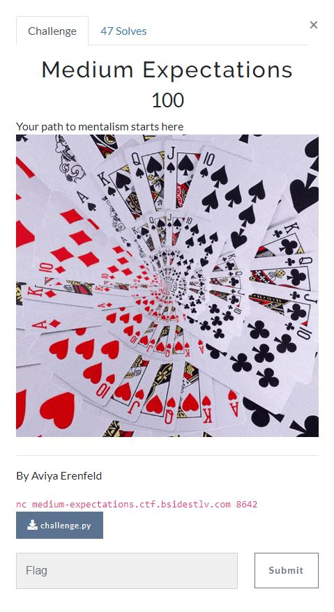

# BSides TLV CTF 2022 - [https://ctf22.bsidestlv.com/](https://ctf22.bsidestlv.com/)
Crypto, 100 Points

## Description



Attached file [challenge.py](challenge.py) 

## Medium_Expectations Solution

By observing the attached file we can see the following code:
```python
import random
import hashlib
import flag

START_NUM_OF_PEOPLE = 60
PERFECT_SHOW = 2000
MAX_NUM_GAMES = 3000
RIGHT_GUESS = 60
WRONG_GUESS = 1
NUM_OF_SUITS = 4
NUM_OF_VALUES = 13

WELCOME_TEXT = """
You are a mentalist and now it's your show!
It's your chance to make the impossible possible!
Currently there are {} people in the show.
Your goal is to have {} people in it!

You can do it!
Magic is real!!
"""

SESSION_TEXT = """
There are {} people in the show
You pick a volunteer

You ask her to think on a card
"""

THINK_OF_A_SUIT_TEXT = """
You ask her to think on the suit of the card
You read her mind and choose:
    1) Spades
    2) Hearts
    3) Clubs
    4) Diamond
"""

THINK_OF_A_VALUE_TEXT = """
You ask her to think on the value of the card
Value between 1 and 13 when:
    1 is Ace
    2-10 are 2-10 :)
    11 is Jack
    12 is Queen
    13 is King
You read her mind and choose:
"""

RIGHT_GUESS_TEXT = """
Bravo! You did the impossible!
The applause you get attracts {} more people to the show!
"""

WRONG_GUESS_TEXT = """
Wrong answer :|
You probably read someone else's mind by mistake...

Someone left the show :(
"""

WIN_TEXT = "You Won! Here is your flag:"

LOSE_TEXT = """No one left in the show :(
Maybe you should practice more before...
"""

def red(text):
    return "\033[91m" + text + "\033[0m"

def green(text):
    return "\033[92m" + text + "\033[0m"

def purple(text):
    return "\033[95m" + text + "\033[0m"

# return a number between 1 and the given range
def rand_range(rng):
    return rng - random.randrange(rng)

def get_int(rng):
    while True:
        num_str = input(">> ")
        if not num_str.isdigit():
            print("Not a number, try again :/")
            continue
        num = int(num_str)
        if num <= 0 or num > rng:
            print(f"Not in range, choose between 1 and {rng}")
            continue
        break
    return num

def run_game():
    random.seed(int(hashlib.md5(b"magic_is_real").hexdigest(), 16))

    people = START_NUM_OF_PEOPLE

    print(WELCOME_TEXT.format(people, PERFECT_SHOW))

    for i in range(MAX_NUM_GAMES):
        if people <= 0:
            print(red(LOSE_TEXT))
            break
        if people >= PERFECT_SHOW:
            print(green(WIN_TEXT))
            print(flag.FLAG)
            break

        print(SESSION_TEXT.format(purple(str(people))))

        print(THINK_OF_A_SUIT_TEXT)
        rand_suit = rand_range(NUM_OF_SUITS)
        suit = get_int(NUM_OF_SUITS)

        print(THINK_OF_A_VALUE_TEXT)
        rand_value = rand_range(NUM_OF_VALUES)
        value = get_int(NUM_OF_VALUES)

        if suit == rand_suit and value == rand_value:
            print(green(RIGHT_GUESS_TEXT.format(RIGHT_GUESS)))
            people += RIGHT_GUESS
        else:
            print(red(WRONG_GUESS_TEXT))
            people -= WRONG_GUESS
    else:
        print("Sorry... the crowd is bored")

if __name__ == "__main__":
    run_game()
```

We can see the ```run_game``` function following ```random.seed(int(hashlib.md5(b"magic_is_real").hexdigest(), 16))```.

Isn't random because we know the seed ```int(hashlib.md5(b"magic_is_real").hexdigest(), 16)``` meaning that the numbers always be the same.

We can solve it using the following code with [pwntools](https://docs.pwntools.com/en/stable/):
```python
from pwn import *
import random
import hashlib

NUM_OF_SUITS = 4
NUM_OF_VALUES = 13

# return a number between 1 and the given range
def rand_range(rng):
    return rng - random.randrange(rng)

p = remote('medium-expectations.ctf.bsidestlv.com', 8642)
random.seed(int(hashlib.md5(b"magic_is_real").hexdigest(), 16))

while True:
    rand_suit = rand_range(NUM_OF_SUITS)
    rand_value = rand_range(NUM_OF_VALUES)
    #print(p.recvuntil('>'))
    print(p.recvline())
    p.sendline(str(rand_suit))
    p.sendline(str(rand_value))
```

We create the same random.

Run it:
```console
┌─[evyatar@parrot]─[/ctf/2022_bsidestlv/crpto/medium_expectations]
└──╼ $ python3 solve.py
[+] Opening connection to medium-expectations.ctf.bsidestlv.com on port 8642: Done
b'\n'
b"You are a mentalist and now it's your show!\n"
b"It's your chance to make the impossible possible!\n"
b'Currently there are 60 people in the show.\n'
b'Your goal is to have 2000 people in it!\n'
b'\n'
b'You can do it!\n'
b'Magic is real!!\n'
b'\n'
b'\n'
b'There are \x1b[95m60\x1b[0m people in the show\n'
b'You pick a volunteer\n'
b'\n'
b'You ask her to think on a card\n'
b'\n'
b'\n'
b'You ask her to think on the suit of the card\n'
b'You read her mind and choose:\n'
b'    1) Spades\n'
b'    2) Hearts\n'
b'    3) Clubs\n'
b'    4) Diamond\n'
b'\n'
b'>> \n'
b'You ask her to think on the value of the card\n'
b'Value between 1 and 13 when:\n'
b'    1 is Ace\n'
b'    2-10 are 2-10 :)\n'
b'    11 is Jack\n'
b'    12 is Queen\n'
b'    13 is King\n'
b'You read her mind and choose:\n'
b'\n'
b'>> \x1b[92m\n'
b'Bravo! You did the impossible!\n'
b'The applause you get attracts 60 more people to the show!\n'
b'\x1b[0m\n'
b'\n'
b'There are \x1b[95m120\x1b[0m people in the show\n'
b'You pick a volunteer\n'
b'\n'
b'You ask her to think on a card\n'
b'\n'
b'\n'
b'You ask her to think on the suit of the card\n'
b'You read her mind and choose:\n'
b'    1) Spades\n'
b'    2) Hearts\n'
b'    3) Clubs\n'
b'    4) Diamond\n'
b'\n'
...
b'\x1b[92mYou Won! Here is your flag:\x1b[0m\n'
b'BSidesTLV2022{r3ad1ing_mind5_is_e4sy}\n'
```

And we get the flag ```BSidesTLV2022{r3ad1ing_mind5_is_e4sy}```.