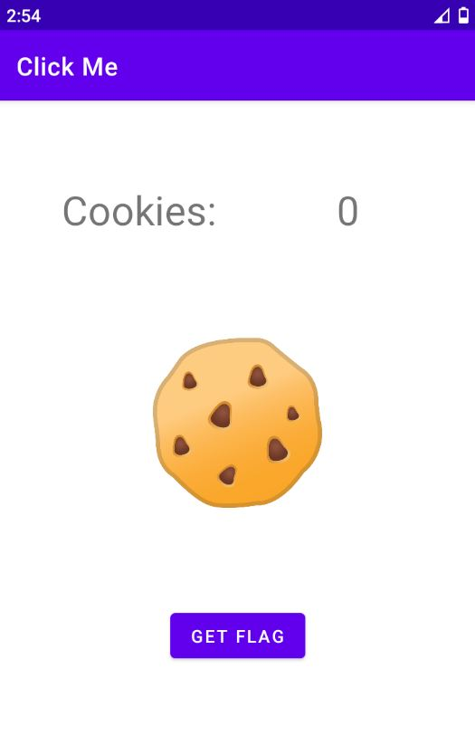

# Click Me - NahamCon CTF 2022 - [https://www.nahamcon.com/](https://www.nahamcon.com/)
Mobile, 485 Points

## Description


 
## Click Me Solution

Let's install the [click_me.apk](./click_me.apk) on [Genymotion Android emulator](https://www.genymotion.com/):



If we are trying to click on ```Get Flag``` we get:


By decompiling the application using [jadx](https://github.com/skylot/jadx))we we can see the following methods on ```MainActivity``` class:
```java
public final void cookieViewClick(View view) {
	int i = this.CLICKS + 1;
	this.CLICKS = i;
	if (i >= 13371337) {
		this.CLICKS = 13371337;
	}
	((TextView) findViewById(R.id.cookieCount)).setText(String.valueOf(this.CLICKS));
}

public final void getFlagButtonClick(View view) {
	Intrinsics.checkNotNullParameter(view, "view");
	if (this.CLICKS == 99999999) {
		Toast.makeText(getApplicationContext(), getFlag(), 0).show();
		return;
	}
	Toast.makeText(getApplicationContext(), "You do not have enough cookies to get the flag", 0).show();
}
```

As we can see, ```this.CLICKS``` value should be ```99999999``` but it isn't possible according to the code on ```cookieViewClick```.

We can change the value of ```this.CLICKS``` in ```getFlagButtonClick``` function using [frida](https://frida.re/).

We can do it using the following code [frida_script.js](./frida_script.js):
```javascript
Java.perform(function() {

	
	let MainActivity = Java.use("com.example.clickme.MainActivity");
	
	MainActivity.getFlagButtonClick.implementation = function(view){
	this.CLICKS.value = 99999999;
    console.log('getFlagButtonClick is called');
    let ret = this.getFlagButtonClick(view);
    console.log('getFlagButtonClick ret value is ' + ret);
    return ret;
};

}, 0);
```

We need before to start [frida-server](https://github.com/frida/frida/releases) (Select your version) on the emulator.

First, Let's copy the ```frida-server``` to the emulator and to give the file execute permission:
```console
┌─[evyatar@parrot]─[/mobile/click_me]
└──╼ $ adb push frida-server /tmp
/mobile/click_mefrida-server: 1 file pushed. 43.0 MB/s (42925716 bytes in 0.952s)
┌─[evyatar@parrot]─[/mobile/click_me]
└──╼ $ adb shell "chmod +x /tmp/frida-server"
```

Run it:
```console
┌─[evyatar@parrot]─[/mobile/click_me]
└──╼ $ adb shell "/tmp/frida-server &"
```

Now we can run our script:
```console
┌─[evyatar@parrot]─[/mobile/click_me]
└──╼ $ frida -U -f com.example.clickme -l frida_script.js --no-pause
     ____
    / _  |   Frida 14.2.12 - A world-class dynamic instrumentation toolkit
   | (_| |
    > _  |   Commands:
   /_/ |_|       help      -> Displays the help system
   . . . .       object?   -> Display information about 'object'
   . . . .       exit/quit -> Exit
   . . . .
   . . . .   More info at https://www.frida.re/docs/home/
Spawned `com.example.clickme`. Resuming main thread!
[Custom Phone 29::com.example.clickme]->
```

Now, by clicking on ```Get Flag``` we get:

