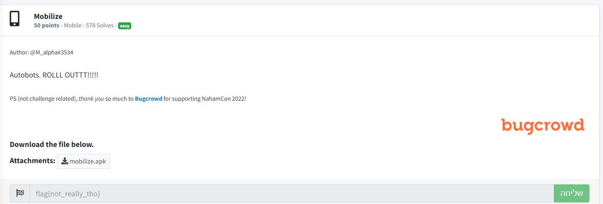

# Mobilize - NahamCon CTF 2022 - [https://www.nahamcon.com/](https://www.nahamcon.com/)
Mobile, 50 Points

## Description


 
## Mobilize Solution

Let's install the [mobilize.apk](./mobilize.apk) on [Genymotion Android emulator](https://www.genymotion.com/):


Nothing interesting on the application.

By searching for the flag pattern (We can decompile it using [jadx](https://github.com/skylot/jadx))we found it on ```strings.xml```:


And we get the flag ```flag{e2e7fd4a43e93ea679d38561fa982682}```.